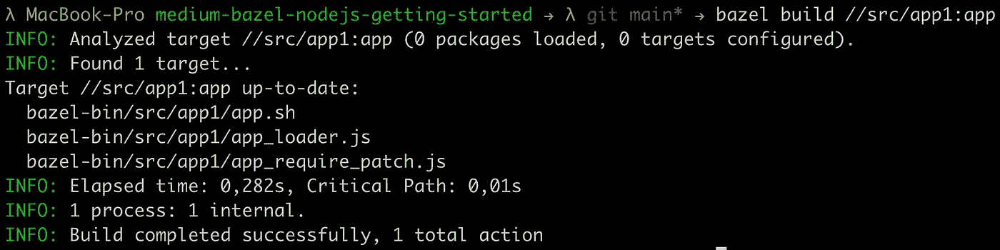
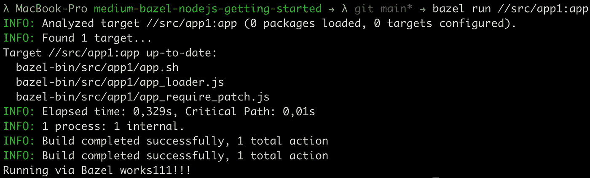
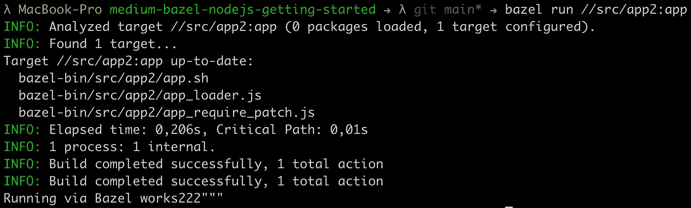

# 用 Bazel 构建并运行您的第一个 Node.js 应用程序

> 原文：<https://levelup.gitconnected.com/build-and-run-your-first-node-js-application-with-bazel-898e1a92fac5>

使用 Bazel 构建和运行第一个 Node.js 应用程序的分步指南。


## 要求

*   [Bazel 已安装](https://docs.bazel.build/versions/main/install.html)(我在这个演示中使用的是 Bazel 4.2.2)
*   [Node.js 和 NPM 安装了](https://nodejs.org/en/)
*   看一看我以前的文章[来掌握某些 Bazel 文件的基础知识](/build-and-run-your-first-go-application-with-bazel-ab83acb747f5)

[](/build-and-run-your-first-go-application-with-bazel-ab83acb747f5) [## 使用 Bazel 构建并运行您的第一个 Go 应用程序

### 使用 Bazel 构建和运行您的第一个 Go 应用程序的分步指南。

levelup.gitconnected.com](/build-and-run-your-first-go-application-with-bazel-ab83acb747f5) 

## 你将学到什么

*   设置 Bazel 使用 Node.js 应用程序
*   创建两个小的 hello-world Node.js 应用程序，并通过 Bazel 运行它们

像往常一样，我准备了一个 [GitHub 库](https://github.com/Abszissex/medium-bazel-nodejs-getting-started)供您查看完成的代码库，并遵循本文中描述的步骤。

[](https://github.com/Abszissex/medium-bazel-nodejs-getting-started) [## GitHub-abszisex/medium-bazel-nodejs-入门

### 此时您不能执行该操作。您已使用另一个标签页或窗口登录。您已在另一个选项卡中注销，或者…

github.com](https://github.com/Abszissex/medium-bazel-nodejs-getting-started) 

## 一般设置

首先，我们将从头开始，然后一步一步地检查各个文件和代码行。作为运行我们的第一个应用程序的最小起始项目结构，我们将有以下内容:

```
/
|- .gitignore
|- WORKSPACE.bazel
|- BUILD.bazel
|- package.json
|- src/
   |- app1/
     |- BUILD.bazel
     |- index.js
   |- app2/
     |- BUILD.bazel
     |- index.js
```

我不会解释一般意义上的`WORKSPACE.bazel`和`BUILD.bazel`文件的确切用途，你可以在我的[上一篇文章](/build-and-run-your-first-go-application-with-bazel-ab83acb747f5)中读到它们，但是当然，我会解释其内容。

**。gitignore**

`.gitignore`正如你所料。它包含所有自动生成的以`bazel-*`开始的 Bazel 文件夹，以及我的想法配置和`node_modules`。

**WORKSPACE.bazel**

所以我们先来看看`WORKSPACE.bazel`的内容。

使用内置的`worksapce(...)`函数，我们告诉 Bazel 我们想要定义一个名为`my_workspace`的工作空间，并且目录`node_modules`是特殊的，一个包管理器将会管理它。此外，我们在其他规则中定义了可以通过`@npm`访问`node_modules`文件夹。

我们将在本文后面看到如何使用`@npm`来引用外部和本地依赖项。

之后，我们通过`http_archive`函数加载版本为`4.6.1`的`rules_nodejs`，这样我们就可以使用在那里定义的函数来构建我们的应用程序。

通过`node_repositories`函数，我们可以告诉 Bazel 应该使用哪个 Node.js 来构建和运行我们的 Node.js 应用程序。在提供的例子中，我们使用当前的 LTS 版本`16.13.2`。

最后但同样重要的是，当`package.json`或`package-lock.json`中的任何包发生变化时，我们使用`npm_install`函数来指示 Bazel 在内部运行`npm install`。值得一提的是，您不应手动删除`node_modules`文件夹，因为如果您这样做，Bazel 不会自行重新安装模块。在这种情况下，您必须自己在根文件夹上运行`npm install`。这是因为 Bazel 会检查 JSON 文件中的更改，以决定是否需要安装任何模块。但是，如果您不更改 JSON 文件，而是删除模块，Bazel 不知道它必须重新运行安装。

**BUILD.bazel**

根文件夹上的`BUILD.bazel`文件没有任何内容。在以后的文章中会有内容，但在这个基本设置中没有。

**package.json**

对于这个演示，`package.json`只是`npm init`命令的默认输出。我没有对实际输出进行任何更改。通常，我会在这里添加这个项目的(开发)依赖项，但是没有什么可添加的，因为现在还没有。

**src/app1/BUILD.bazel**

构建文件很简洁，只包含一个目标，即`nodejs_binary`。您可以将这个目标想象成类似于运行 JavaScript 文件的`node xxx.js`命令。在这种情况下，下面的目标几乎与键入`node index.js`相同。我们稍后将调用这个目标来运行我们的应用程序。

**src/app1/index.js**

好吧，下面的文件几乎不值得一提。这是因为代表我们的“应用程序”的`index.js`文件只是打印到控制台。但是这个小演示足以展示这个概念，因为我们只想使用 Bazel 运行我们的 JavaScript，不管代码有多有用。

**src/app2/…**

如果您查看上面提到的项目结构，您还会注意到一个`app2`应用程序。和`app1`一样，只是控制台输出略有不同，验证我们运行的是不同的 JavaScript 应用。

## 各个应用程序的 package.json 在哪里？

您可能已经注意到，对于单独的应用程序`app1`和`app2`，没有`package.json`。但是唯一可用的`package.json`在根上。这是故意的，通常你希望在单边回购中这样做。

为了理解“为什么”，让我们看看`package.json`通常用于什么(我不会一一列举):

*   `name` —应用程序的名称。我们通过文件夹名称来定义应用程序的名称，因此没有必要再次提及它们。即使这看起来有点不同，如果你的包不是一个服务，而是一个你想要发布的 NPM 模块。
*   `version` —包的版本。这里有两个分数。一个希望整个 monorepo 有一个版本，另一个希望每个包有一个版本。没有绝对的对错，但是我同意如果你把包提供给其他人或者公众，那么每个包的版本控制是有意义的。
*   `(dev-)dependencies` —包所需的(开发)依赖项。这又是两个分数。一部分人希望所有模块/服务都有相同的版本，以保持每个服务都是最新的。另一部分人希望它是基于每个包的，所以遗留服务不会收到新的更新，除非明确指定，因为这会导致维护工作。

这两种方法各有利弊，用一个`package.json`来管理它们，每个包用一个`package.json`。但是在这个演示中，我们将使用一种`package.json`方式，因为它更容易开始。但是不要担心，将来我还会为每个包的方法提供一个教程。

## 让我们运行它

现在，所有的文件和文件夹都已准备就绪，是时候构建和运行我们的应用程序了。

在这里，我们没有太多东西需要使用普通 JavaScript 来构建。尽管如此，我们仍然可以使用`bazel build //src/app1:app`来“构建”我们的 JavaScript 应用程序。



由于我们在`BUILD.bazel`文件中定义的方式，使用`bazel run //src/app1:app`我们执行 JavaScript 文件的方式与使用`node ./src/app1/index.js`时相同。



作为一个小的交叉检查，我们也可以通过`bazel run //src/app2:app`执行我们的`app2`，并验证输出是否不同:



## 摘要

在本文中，您应该已经学会了如何在 Bazel 环境中设置一个基本的 Node.js 项目。此外，您现在应该能够使用 Bazel 命令运行基本的 Node.js 应用程序。

## 你想联系吗？

如果你想联系我，请在 LinkedIn 上给我打电话。

另外，请随意查看我的书籍推荐📚。

[](https://mr-pascal.medium.com/my-book-recommendations-4b9f73bf961b) [## 我的书籍推荐

### 在接下来的章节中，你可以找到我对所有日常生活话题的书籍推荐，它们对我帮助很大。

mr-pascal.medium.com](https://mr-pascal.medium.com/my-book-recommendations-4b9f73bf961b) [](https://mr-pascal.medium.com/membership) [## 通过我的推荐链接加入 Medium—Pascal Zwikirsch

### 作为一个媒体会员，你的会员费的一部分会给你阅读的作家，你可以完全接触到每一个故事…

mr-pascal.medium.com](https://mr-pascal.medium.com/membership)