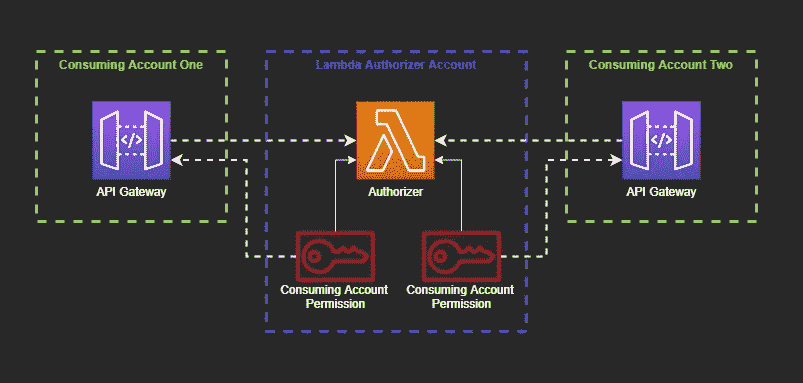
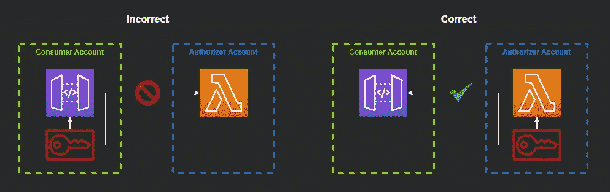

# 使用共享的 Lambda 授权器构建一次授权

> 原文：<https://levelup.gitconnected.com/build-auth-once-with-a-shared-lambda-authorizer-9936dc7e7897>


图片来自[皮克斯拜](https://pixabay.com/?utm_source=link-attribution&amp;utm_medium=referral&amp;utm_campaign=image&amp;utm_content=2168233)

## 大型组织使用许多 AWS 帐户来管理他们的应用程序。了解如何在所有帐户之间共享一个 lambda authorizer，这样您只需构建 auth 一次。

每个人都有关于如何使用 AWS 账户的意见。

有些人认为你应该有一个单一账户，把你的 AWS 生态系统中的所有东西都存储在一个地方。

其他人认为一个单独的应用程序(由多个微服务组成)属于一个单独的 AWS 帐户。

而其他人则走极端，在 AWS 账户中保留单个微服务。

这些方法没有一个是无意中出错的(除了你可能会遇到一些单一账户的[资源限制](https://docs.aws.amazon.com/general/latest/gr/aws_service_limits.html)，但是它们都遇到了同样的问题:

*您如何在不同账户间保持一致的授权？*

如果您使用定制的 Lambda 授权器，答案既简单又不那么简单。

# 什么是 Lambda 授权器？

如果你选择阅读这篇文章，你可能已经知道什么是λ授权者。

但是作为一个补充，*Lambda authorizer 是一个 API 网关特性，它使用 Lambda 函数来执行对 API 调用的授权。*

它可以验证 OAuth 或 SAML 令牌，应用一些业务逻辑来确定访问，以及介于两者之间的任何事情。

对于无服务器应用程序，在 API 网关上安装一个 Lambda 授权器会很有用，有助于对各个端点的控制进行微调。

# 在 SAM 中定义 Lambda 授权者

[无服务器应用模型(SAM)](https://docs.aws.amazon.com/serverless-application-model/latest/developerguide/what-is-sam.html) 是 CloudFormation 之上的一层，旨在使无服务器应用的定义变得简单易行。

为了最简单的易用性和可移植性，本文中的所有示例都将在 SAM 模板中定义，因此您可以将学到的内容立即部署到您自己的 AWS 帐户中。不需要摸索通过控制台。

λ授权器只是一个函数。它的声明方式没有什么特别的。它只是期望一个[不同的事件主体](https://docs.aws.amazon.com/apigateway/latest/developerguide/api-gateway-lambda-authorizer-input.html)而不是一个由 API 网关代理的 Lambda。

在[我的示例 repo](https://github.com/allenheltondev/aws-cross-account-lambda-authorizer) 中，我们这样定义 Lambda 授权器:

```
LambdaAuthorizerCrossAccountFunction: 
  Type: AWS::Serverless::Function 
  Properties: 
    CodeUri: lambdas/lambda-authorizer
    Runtime: nodejs12.x
    Handler: lambda-authorizer.lambdaHandler
    Role: !GetAtt LambdaAuthorizerRole.Arn
     FunctionName: LambdaAuthorizer
```

示例 repo 有 SAM 模板，但没有实现授权者的代码。例如构建授权器本身，AWS 在 GitHub 上有[蓝图。](https://github.com/awslabs/aws-apigateway-lambda-authorizer-blueprints)

定义了授权者功能后，下一步是允许其他帐户使用它。

# 建筑授权者权限

对于 AWS 来说，跨帐户权限可能很棘手。需要在源帐户中定义权限，以允许消费者访问他们的资源。这意味着你必须提前了解你的消费者(老实说，这是一件好事)。

有了 Lambda 授权器，权限就一目了然了。您必须在消费者帐户中授予 API Gateway 执行授权者功能的权限。



*其他账户中 API 网关如何使用 Lambda 授权器的示意图*

在我们的 SAM 模板中，所需的权限定义为:

```
ConsumerOneAuthorizerPermission: 
  Type: AWS::Lambda::Permission 
  Properties: 
    Action: lambda:InvokeFunction
    FunctionName: !Ref LambdaAuthorizerCrossAccountFunction 
    Principal: apigateway.amazonaws.com
    SourceArn: !Sub arn:${AWS::Partition}:execute-api:${AWS::Region}:${ConsumerOneAccountId}:*/authorizers/*
```

这个代码片段说 API 网关，即*主体*，被允许调用一个具有特定名称的函数。 *SourceArn* 表示允许哪个资源执行该功能。我已经参数化了帐户 id 以及 AWS 分区(商业或 GovCloud)和区域。

每个消费账户都需要一个权限来执行授权。由于我们正在实践 POLP，这似乎是一个值得的权衡，因为随着时间的推移，我们将不得不保持这一点，因为我们为组织带来了新的客户。

# 在另一个账户中使用授权人

这就是乐趣的开始。随着授权器的建立和权限的创建，我们可以设置我们的消费帐户来开始使用它。

在我们的一个消费帐户的 SAM 模板中，无服务器 API 和授权者是用下面的代码片段定义的:

```
ConsumerServiceApi: 
  Type: AWS::Serverless::Api 
  Properties: 
    StageName: test
    Auth: 
      DefaultAuthorizer: LambdaAuthorizer
      AddDefaultAuthorizerToCorsPreflight: false
      Authorizers: 
        LambdaAuthorizer: 
          FunctionPayloadType: REQUEST
          FunctionArn: !Sub arn:${AWS::Partition}:lambda:${AWS::Region}:${AuthorizerAccountId}:function:LambdaAuthorizer 
        Identity: 
          Headers: 
            - Authorization 
          ReauthorizeEvery: 3600
```

这里要注意的主要部分是我们正在创作的`FunctionArn`。为了安全起见，我们将`AuthorizerAccountId`存储在一个参数中，并在部署时将其传入，这样帐户 id 就不会出现在源代码中。

这类似于我们在上面定义授权者本身时所做的。它组装 arn 并使用它来指向我们想要的资源。

部署该模板时([参见部署说明](https://github.com/allenheltondev/aws-cross-account-lambda-authorizer#usage))，将在消费者账户中创建一个 Lambda 授权人，其使用的功能位于授权人账户中。

这就把我带到了最后一部分:SAM 缺陷的解决方案。

# 修复故障

SAM 模板只是一个花哨的 CloudFormation 脚本，它有一堆在部署时转换的别名。SAM 提供了创建无服务器功能和所述功能的触发器的简单快捷方式。

在部署时，由 AWS 维护的一个`Transform`被调用，以获取规范中写的快捷方式，并将它们转换成完整的 CloudFormation 资源。将[基础设施写成代码](https://docs.aws.amazon.com/whitepapers/latest/introduction-devops-aws/infrastructure-as-code.html)要简单得多。

不幸的是，这个转换中有一个错误，它阻止我们在不同的帐户中使用 Lambda authorizer。

SAM 尝试将 lambda 权限从消费者帐户中的授权者配置到授权者帐户中的功能。由于 IAM 的工作方式，设置权限方向不起作用。



*必须在资源所在的帐户中声明对跨帐户资源的权限*

SAM 尽量友好地配置授权者调用该功能所需的权限。但是它不知道该函数存在于另一个帐户中，因此它创建的权限将使部署失败。

为了解决这个问题，我们可以创建一个 CloudFormation 宏来自动删除权限。

[宏是在部署时运行的函数](/automate-your-automation-with-cloudformation-macros-e3dc36f62ade)，为您自动转换资源。在这种情况下，我们希望删除由 SAM 生成的权限资源。

我在 NodeJS 中创建了一个宏，完全改编自报告的 GitHub 问题中的示例，并将其添加到[示例报告](https://github.com/allenheltondev/aws-cross-account-lambda-authorizer/blob/main/prerequisites/template.yaml)中的`prerequisite`堆栈中。

创建并部署宏后，必须更新所有使用交叉帐户授权者的堆栈才能使用它。

在您的 SAM 模板中，有一个`Transform`属性已经调用了 AWS SAM 宏。要添加 Lambda authorizer 宏，我们可以将该属性设为数组，它将在部署时开始运行。

```
AWSTemplateFormatVersion: '2010-09-09' 
Transform: [ AWS::Serverless-2016-10-31, RemoveAuthorizerLambdaPermissions ] 
Description: > 
  Consumer Stack. This AWS Account will consume the authorizer created in the *authorizer stack*
```

有了这个宏，消费者栈就可以部署了，你就有了一个跨账户 Lambda 授权者！

# 最后的想法

重用代码和资源是大规模可维护性的关键。只要有意义，就尽量重复使用。授权/认证是可重用性的完美例子，也为您的应用程序提供了一种内聚的感觉。

每个人都想重新发明轮子，自己造。这就是开发者的本性。当您在整个组织中使用代码、资源、API 和其他特性时，需要治理，这不仅仅是一个技术问题。

消除技术障碍是第一步。第二步是付诸行动。

我已经向您展示了在您的软件生态系统中维护一致授权的第一步。

现在轮到你了。