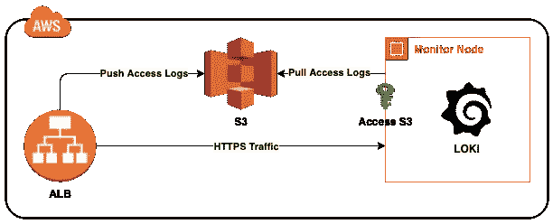
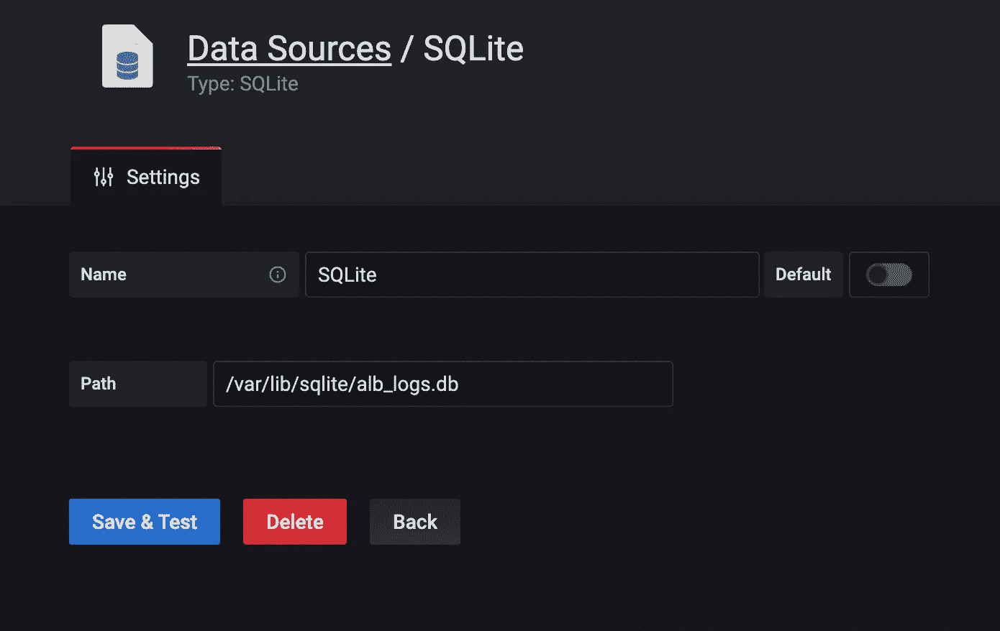
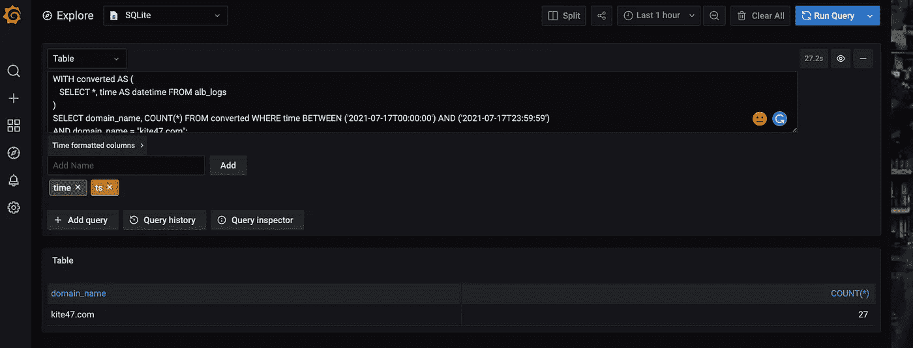

# 在 Grafana 中构建 AWS Athena 外观

> 原文：<https://levelup.gitconnected.com/build-aws-athena-look-alike-in-grafana-f6da6e3473c5>

一个 WS Athena 允许用户使用简单的 SQL 查询分析来自 S3 的数据。另一方面，当您查询大量数据时，成本会更高。在本文中，我将详细阐述我们如何实现一个经济高效的 Athena 模仿程序来分析我们的负载平衡器通过 Grafana 存储在 S3 的访问日志。



体系结构

如图所示，我们在 ALB 后面运行一个监视器节点。ALB 将访问日志发送到 S3，监控节点提取日志并将其发送到 Grafana 进行可视化。

监视节点有足够的 IAM 权限从 S3 提取日志。我们使用一个简单的 bash 脚本来完成这项任务。该脚本提取日志，将它们存储在给定的路径中，并删除超过给定持续时间的日志。它已被配置为 cron 作业。

```
*/2,7,12,17,22,27,32,37,42,47,52,57 * * * * /bin/get_alblogs.sh
```

crontab 配置背后的基本原理是，ALB 每 5 分钟将访问日志推送到 S3(每个可用性区域一个日志文件)。cron 在 2 分钟后运行，并获取最新的日志。

接下来，我们应该将这些日志插入到一个关系数据库中，以便以后查询。这里我们使用了 SQLite3。

上面的 python 脚本从本地路径读取日志文件，并将它们插入到 SQLite3 DB 中。你可以参考[这里的](https://docs.aws.amazon.com/elasticloadbalancing/latest/application/load-balancer-access-logs.html)来了解更多关于 AWS ALB 访问日志的字段。该脚本比`get_alblogs.sh`晚运行一分钟。

```
*/3,8,13,18,23,28,33,38,43,48,53,58 * * * * python3 /bin/alb_logs_executor.py
```

下一步将是将 SQLite3 DB 与 Grafana 集成，通过 Grafana 查询和可视化数据。在这里你可以找到如何为 Grafana 安装 SQLite3 插件。

安装完成后，在 Grafana 中配置 SQLite3 数据源。



SQLite3 数据源

接下来在 Grafana 中导航到 Explore，选择数据源为 SQLite3，输入下面给出的查询(更改域名)并单击“运行查询”。

```
WITH converted AS (
   SELECT *, time AS datetime FROM alb_logs
)
SELECT domain_name, COUNT(*) FROM converted WHERE time BETWEEN ('2021-07-17T00:00:00') AND ('2021-07-17T23:59:59')
AND domain_name = "kite47.com";
```

这就是全部，现在您将能够在表格部分下查看结果。同样，您可以运行任何 SQL 查询。



SQLite3 数据查询

欢迎反馈！


参观 kite47.com