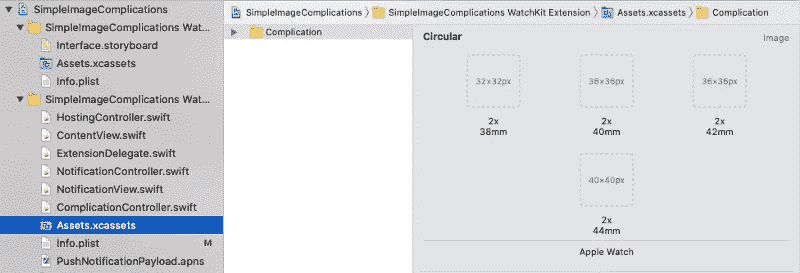
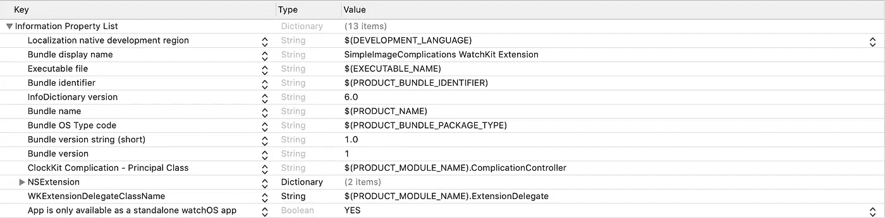

# 为 WatchOS 构建基本的复杂功能

> 原文：<https://levelup.gitconnected.com/build-basic-complications-for-watchos-13e67e214973>

## 如何创建一个复杂的图像

有了最新的苹果 WWDC，制造 Apple Watch 复杂功能的方法改进了很多。现在有了 SwiftUI，你可以创造一些惊人的复杂功能，直接在你的手腕上显示大量信息。然而，有时，我们的应用程序并不适合这些复杂的情况，我们只是想显示应用程序徽标图像作为一个复杂的情况。

几周前，我遇到了这种需要。令我惊讶的是，网上几乎没有关于如何做到这一点的文档。关于从网站获取数据或在特定时间显示多种信息的复杂情况，很少有过时的教程，但几乎没有关于简单图像的教程。

创建一个复杂的静态图像没什么大不了的，但是对于刚开始开发 WatchOS 的人或者完全不熟悉复杂的人来说，这个过程可能并不简单。

# 启用复杂功能

为了给我们的应用程序增加复杂性，第一步要做的是为它们提供支持。在最新的 Xcode 版本(12)中，当您创建一个新的 WatchOS 应用程序时，Xcode 会自动为您启用复杂功能。

然而，要将它们添加到现有的 watchOS 应用程序中，您需要自己创建一些元素。

首先创建一个采用`CLKComplicationDataSource` portocol 的类。

默认编译控制器文件

接下来，打开`Assets.xcassets`文件，在`[*your_project_name]WatchExtension*` 文件夹里面。然后，选择编辑器>添加资产> watchOS >新建手表复杂占位符，如下图所示

最后，最重要的步骤是在项目导航器中选择您的应用程序，并打开扩展的 General 选项卡。在复杂配置中，将`Data Source Class`和`Complication Group`设置为您刚刚创建的类别和资产目录组。

**请注意:**在进入下一段之前，我们必须检查`[*your_project_name]WatchExtension*` 文件夹的`Info.plist`文件中的`ClockKit Complication — Principle Class`键值。该值应该与下图显示的值相同。

# 设置复杂功能系列

正如我之前所说，你可以在网上找到的关于这个话题的教程已经过时了。watchOS 7.0+创建 AppleWatch 复杂功能的方式发生了很大变化。这个新版本的 watchOS 引入了一种叫做`getComplicationDescriptors`的新方法。

苹果开发者文档中的声明方法

在数据的源实现中，我们必须调用`handler`并传递包含应用程序复杂性描述符的`descriptors`数组。

在我们的示例中，我们只想支持 3 个**并发症系列**:

1.  圆形小

2.图形圆形

3.图形角

你可以在[人机界面指南——苹果开发者](https://developer.apple.com/design/human-interface-guidelines/watchos/overview/complications/)找到所有不同的复杂功能系列。

让我们用我们支持的复杂系列更改`descriptors`数组的`supportedFamilies`参数的默认值:

现在，根据`Assets.xcassets`为我们感兴趣的复杂功能系列提供的解决方案，我们必须调整应用程序徽标图标的大小。注意你为你的并发症选择的颜色。重要的是要考虑当构建一个复杂的场景时，你的视图看起来如何去饱和。否则，您会遇到一些视觉问题，如下图所示。

" www.flaticon.com[的](http://www.flaticon.com/)[自由派](https://www.flaticon.com/authors/freepik)制作的图标"

图形圆形和图形拐角复杂是完美的，而圆形显示的是一个空白的圆。为了防止这种行为，我们可以删除图标的背景，只保留美元符号。

现在好多了，对吧？如果你想了解更多关于 AppleWatch 调色的信息，我建议你看看这个由苹果制作的[视频。](https://developer.apple.com/videos/play/wwdc2020/10048/?time=394)

# 显示复杂情况

展示我们的复杂性的第一步是修改`getCurrentTimelineEntry`方法。该方法的实现必须创建一个 timeline 条目，其中包含要立即显示的数据。您可以为时间线条目指定一个日期，以反映当前时间或当前时间之前的某个时间。在我们的例子中，我们需要分配当前时间。

为了保持代码的整洁，我们可以写一个叫做`getComplicationTemplate`的辅助方法。该方法将根据支持的复杂系列返回正确的`CLKComplicationTemplate`。通过这种方式，我们可以显示特定并发症家族的不同数据或图像。最后，在`getCurrentTimelineEntry`方法中，我们用当前时间轴条目调用处理程序。

最后要实现的方法是`getLocalizableSampleTemplate`。安装扩展时，WatchOS 对每个支持的复杂情况调用一次该方法，并缓存结果。

> 在您的实现中，实例化适当的模板类并用本地化数据填充结果对象。你提供的数据应该是假的，但它应该反映你的并发症通常是什么样子。
> 
> 如果您将`*nil*`传递给处理程序，系统会根据您的应用程序的图标和名称生成一个默认的占位符模板。
> 
> [苹果开发者文档](https://developer.apple.com/documentation/clockkit/clkcomplicationdatasource/1650686-getlocalizablesampletemplate)

如果我们现在运行我们的应用程序，我们的复杂功能应该是这样的:

应用程序在运行

感谢阅读！我希望你喜欢这个小教程，你学到了一些新的东西。你可以在 [GitHub](https://github.com/andreac30/WatchOS-Image-Complications-Image) 上找到已经完成的项目。

*资源:* [*苹果开发者文档*](https://developer.apple.com/documentation/)