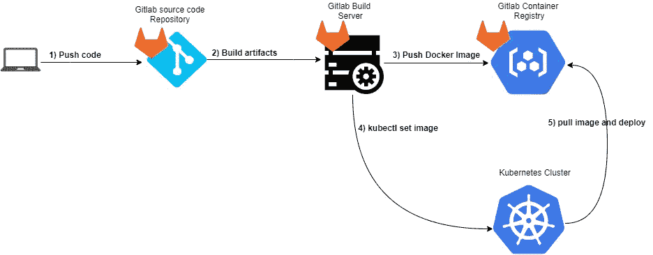
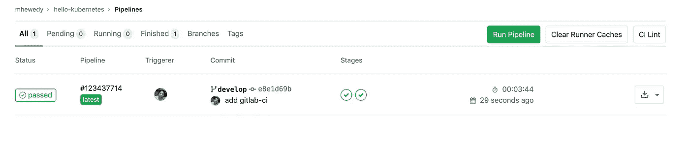
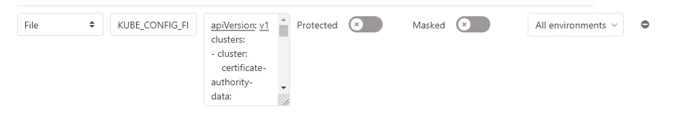
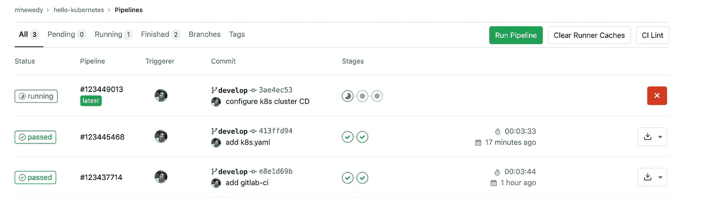

# 在 GitLab 和 Kubernetes 上为 spring-boot 应用程序构建持续交付

> 原文：<https://levelup.gitconnected.com/build-continues-delivery-for-a-spring-boot-application-on-gitlab-and-kubernetes-6b562da099c2>


泰勒·凯西在 [Unsplash](https://unsplash.com?utm_source=medium&utm_medium=referral) 上的照片

在本教程中，我们将一步一步地为 Kubernetes 集群中的 spring boot 应用程序构建、部署和构建一个连续的交付管道，其中源代码将托管在 Gitlab 中。

大局



大局

## 在本地安装 Kubernetes 集群

你可以考虑在本地安装 Kubernetes 集群:

[](https://medium.com/@mhewedy_46874/install-kubernetes-cluster-in-virtual-machines-the-easy-way-337ef0c4e37f) [## 以最简单的方式在虚拟机中安装 Kubernetes 集群

### 在这篇文章中，我们将看到如何安装一个由 1 个主节点和 1 个工作节点组成的 Kubernetes v1.18 集群

medium.com](https://medium.com/@mhewedy_46874/install-kubernetes-cluster-in-virtual-machines-the-easy-way-337ef0c4e37f) 

# 步骤 1:创建项目并在本地运行它

转到 [start.spring.io](https://start.spring.io/#!type=maven-project&language=java&platformVersion=2.2.5.RELEASE&packaging=jar&jvmVersion=1.8&groupId=com.example&artifactId=hello-kubernetes&name=hello-kubernetes&description=Demo%20project%20for%20Spring%20Boot&packageName=com.example.hello-kubernetes&dependencies=web) 并下载一个新的应用程序，将 web 作为依赖项(为简单起见，但您可以添加任何其他依赖项)

让我们添加一个简单的控制器

```
@RestController
**public class** HelloController {

    **private static final** String ***template*** = **"Hello from %s!"**;
    **private final** AtomicLong **counter** = **new** AtomicLong();

    @Value(**"${application.env}"**)
    **private** String **env**;

    @GetMapping(**"/"**)
    **public** Greeting greeting() {
        **return new** Greeting(**counter**.incrementAndGet(), String.*format*(***template***, **env**));
    }

    **static public class** Greeting {
        **public long id**;
        **public** String **content**;

        **public** Greeting(**long** id, String content) {
            **this**.**id** = id;
            **this**.**content** = content;
        }
    }
}
```

让我们给`application.properties`添加一个简单的属性，如下所示:

```
**application.env**=**dev**
```

现在，让我们测试从 IDE 本地运行的应用程序，并测试它:

```
$ curl localhost:8080
{"id":1,"content":"Hello from dev!"}
```

现在停止服务器，准备下一步

# 步骤 2:创建 Docker 图像

将以下 Dockerfile 文件添加到应用程序的根目录

```
**FROM** openjdk:8-jdk-alpine **AS *builder* WORKDIR** target**/**dependency
**ARG *APPJAR***=target**/***.jar
**COPY** ${***APPJAR***} app.jar
**RUN** jar **-**xf .**/**app.jar

**FROM** openjdk:8-jre-alpine
**VOLUME /**tmp
**ARG *DEPENDENCY***=target**/**dependency
**COPY --**from=***builder*** ${***DEPENDENCY***}**/**BOOT-INF**/**lib **/**app**/**lib
**COPY --**from=***builder*** ${***DEPENDENCY***}**/**META-INF **/**app**/**META-INF
**COPY --**from=***builder*** ${***DEPENDENCY***}**/**BOOT-INF**/**classes **/**app
**ENTRYPOINT** [**"java"**,**"-cp"**,**"app:app/lib/*"**,**"com.example.hellokubernetes.HelloKubernetesApplication"**]
```

要测试 docker 文件，请在应用程序的根目录下运行以下命令:

> 注意:如果您没有在本地安装 **docker** ，那么您可以跳到下一步，但是在本地测试它当然更好。

```
$ mvn clean package
$ docker build -t hellokubernetes/hellokubernetes .
$ docker run -d -p 8080:8080 hellokubernetes/hellokubernetes
$ curl localhost:8080{"id":1,"content":"Hello from dev!"}%
```

现在让我们停止容器，进入下一步

```
docker rm -f $(docker ps -f expose=8080 -q)
```

# 步骤 3:设置 Gitlab

让我们创建一个 Gitlab 资源库，在我们的例子中，这个项目是在[https://gitlab.com/mhewedy/hello-kubernetes](https://gitlab.com/mhewedy/hello-kubernetes/-/tree/develop)创建的

> 注意，项目 URL 将影响容器注册表 URL

在我们推送代码之前，让我们在项目的根目录下添加`.gitlab-ci.yml`文件:

```
services:
  - docker:dind
stages:
  - test
  - build
  - deploy
variables:
  MAVEN_OPTS: "-Dhttps.protocols=TLSv1.2 -Dmaven.repo.local=$CI_PROJECT_DIR/.m2/repository -Dorg.slf4j.simpleLogger.log.org.apache.maven.cli.transfer.Slf4jMavenTransferListener=WARN -Dorg.slf4j.simpleLogger.showDateTime=true -Djava.awt.headless=true"
  MAVEN_CLI_OPTS: "--batch-mode --errors --fail-at-end --show-version -DinstallAtEnd=true -DdeployAtEnd=true"
  DOCKER_HOST: "tcp://docker:2375"
  DOCKER_DRIVER: overlay2
  REGISTRY_URL: registry.gitlab.com/mhewedy/hello-kubernetes
  DOCKER_BUILD_ID: ${CI_COMMIT_REF_NAME}_${CI_COMMIT_SHORT_SHA}
image: maven:3.3.9-jdk-8
cache:
  paths:
    - .m2/repository
.verify: &verify
  stage: test
  script:
    - 'mvn $MAVEN_CLI_OPTS verify'
  artifacts:
    paths:
      - target/
  except:
    - master
verify:jdk8:
  <<: *verify
build_image:
  stage: build
  image: docker:git
  script:
    - docker login ${REGISTRY_URL} -u ${CI_REGISTRY_USER} -p ${CI_REGISTRY_PASSWORD}
    - docker build -t ${REGISTRY_URL}:${DOCKER_BUILD_ID} .
    - docker push ${REGISTRY_URL}:${DOCKER_BUILD_ID}
    - docker tag ${REGISTRY_URL}:${DOCKER_BUILD_ID} ${REGISTRY_URL}:latest
    - docker push ${REGISTRY_URL}:latest
  only:
    - develop
```

让我们向 GitLab 添加代码:

```
$ git init
$ git remote add origin git@gitlab.com:mhewedy/hello-kubernetes.git
$ git add .
$ git commit -m "Initial commit"
$ git push -u origin master
$ git checkout -b develop  # create & switch to develop branch
```

现在转到[https://gitlab.com/mhewedy/hello-kubernetes/pipelines](https://gitlab.com/mhewedy/hello-kubernetes/pipelines)，您将看到构建正在通过，docker 映像被推送到 Gitlab 容器注册表



Gitlab 管道显示构建成功

**反弹步骤**:您可以从 Gitlab 注册表中提取并运行本地机器上的 docker 映像:

```
$ docker login registry.gitlab.com **#enter your gitlab credentials**
$ docker run -d -p 8080:8080 registry.gitlab.com/mhewedy/hello-kubernetes
$ curl localhost:8080{"id":1,"content":"Hello from dev!"}%
```

再次运行以下命令删除容器:

```
docker rm -f $(docker ps -f expose=8080 -q)
```

# 第四步:创建库本内特 YAML

**首先**，你需要创建一个包含你的 GitLab 凭证的秘密拉图:

```
$ **kubectl** create secret docker-registry gitlab-auth --docker-server=https://registry.gitlab.com --docker-username=**<gitlab-username>** --docker-password=**<gitlab-password>**
```

**第二个**，这是`k8s.yaml`文件(确保将它与您的项目一起保存，以便您可以在以后需要时使用它)

```
**apiVersion**: v1
**kind**: ConfigMap
**metadata**:
  **name**: hello-kubernetes-configs
**data**:
  **application.properties**: |
    application.env=prod
---
**apiVersion**: apps/v1
**kind**: Deployment
**metadata**:
  **name**: hello-kubernetes-deployment
**spec**:
  **replicas**: 2
  **selector**:
    **matchLabels**:
      **app**: hello-kubernetes
  **template**:
    **metadata**:
      **labels**:
        **app**: hello-kubernetes
    **spec**:
      **containers**:
      - **name**: hello-kubernetes
        **image**: registry.gitlab.com/mhewedy/hello-kubernetes
        **args**: [**"--spring.config.location=/etc/hello-kubernetes/application.properties"**]
        **ports**:
        - **containerPort**: 8080
        **volumeMounts**:
        - **name**: config-vol
          **mountPath**: /etc/hello-kubernetes
        **readinessProbe**:
          **httpGet**:
            **path**: /
            **port**: 8080
      **volumes**:
      - **name**: config-vol
        **configMap**:
          **name**: hello-kubernetes-configs
      **imagePullSecrets**:
      - **name**: gitlab-auth
---
**apiVersion**: v1
**kind**: Service
**metadata**:
  **name**: hello-kubernetes-service
**spec**:
  **type**: LoadBalancer
  **selector**:
    **app**: hello-kubernetes
  **ports**:
  - **port**: 80
    **protocol**: TCP
    **targetPort**: 8080
```

您只需应用上述文件一次，如下所示:

```
$ kubectl apply -f k8s.yaml
```

现在，您可以使用以下命令测试部署:

```
$ curl "http://$(kubectl get svc -o jsonpath='{@.items[?(@.metadata.name=="hello-kubernetes-service")].status..ip}'):80"{"id":3,"content":"Hello from **prod**!"}
```

生产**配置**已经应用。

> 您可以像配置属性 application.env 一样配置生产配置(如数据库设置)

您可以通过以下方式随时获取应用程序的 URL:

```
$ echo "http://$(kubectl get svc -o jsonpath='{@.items[?(@.metadata.name=="hello-kubernetes-service")].status..ip}'):80"
```

# 步骤 4:在 Gitlab 管道中实现 CD

**首先**，让我们将 Kubernetes 集群`~/.kube/config`作为一个变量添加到 GitLab CI/CD 中，转到`Settings > CI/CD > Variables`并使用关键字`KUBE_CONFIG_FILE`创建一个类型为 **File** 的新变量，并使用上述文件的内容作为关键字的值。



Gitlab CI/CD 变量

> 您可以从您的集群中获取文件`*~/.kube/config*`的内容，例如在 GKE 打开控制台和`*cat ~/.kube/config*`，对于数字 occean，您可以从 web 控制台下载该文件。

**第二个**，让我们修改`.gitlab-ci.yml`文件并在文件末尾添加以下内容:

```
**deploy_to_stage**:
  **stage**: deploy
  **when**: manual
  **before_script**:
    - curl -LO https://storage.googleapis.com/kubernetes-release/release/`curl -s https://storage.googleapis.com/kubernetes-release/release/stable.txt`/bin/linux/amd64/kubectl
    - chmod +x ./kubectl
    - mv ./kubectl /usr/local/bin/kubectl
    - kubectl version --client
    - mkdir -p $HOME/.kube && cp $KUBE_CONFIG_FILE "$HOME/.kube/config"
 **script**:
    - >
      kubectl set image deployment hello-kubernetes-deployment
      hello-kubernetes=${REGISTRY_URL}:${DOCKER_BUILD_ID}
      --record
```

现在推送至 Gitlab:

```
$ git commit -am 'configure k8s cluster CD'
$ git push origin develop # note we already switched to the develop branch
```

转到 Gitlab 管道，您会注意到管道中添加了第三个阶段，如下所示:



现在点击右边的第三个圆圈**来部署到您的 Kubernetes 集群。**

现在使用以下命令检查部署:

```
$ kubectl rollout history deployment hello-kubernetes-deploymentdeployment.apps/hello-kubernetes-deploymentREVISION  CHANGE-CAUSE1         <none>2         <none>3         kubectl set image deployment hello-kubernetes-deployment hello-kubernetes=registry.gitlab.com/mhewedy/hello-kubernetes:develop_e8e1d69b --record=true
```

就这样…好好享受吧！

> 注意，这是一个基本的设置，为了更安全，你需要做的不仅仅是上面的步骤。例如，您需要创建一个在`.gitlab-ci.yml`中使用的服务帐户。

# 参考资料:

[https://spring.io/guides/gs/spring-boot-kubernetes/](https://spring.io/guides/gs/spring-boot-kubernetes/)
[https://VIX . digital/blog/technology/how-get-kubernetes-pulling-private-git lab-container-registry/](https://vix.digital/blog/technology/how-get-kubernetes-pulling-private-gitlab-container-registry/)
[https://medium . com/@ mhewedy _ 46874/building-a-cheap-continuous-deployment-environment-2174 a 5772 a0c](https://medium.com/@mhewedy_46874/building-a-cheap-continuous-deployment-environment-2174a5772a0c)
[https://docs . spring . io/spring-boot/docs/1 . 0 . 1 . 0 . 1 . release/referen](https://docs.spring.io/spring-boot/docs/1.0.1.RELEASE/reference/html/boot-features-external-config.html)