# 使用 Dockerfile 构建自定义 Nginx 映像，并将其推送到 ECR！

> 原文：<https://levelup.gitconnected.com/build-custom-nginx-image-using-dockerfile-and-push-it-to-ecr-7aced9ced256>

了解 Docker，并通过使用 Dockerfile 部署自定义 Nginx 映像，并将其推送到 Amazon ECR。

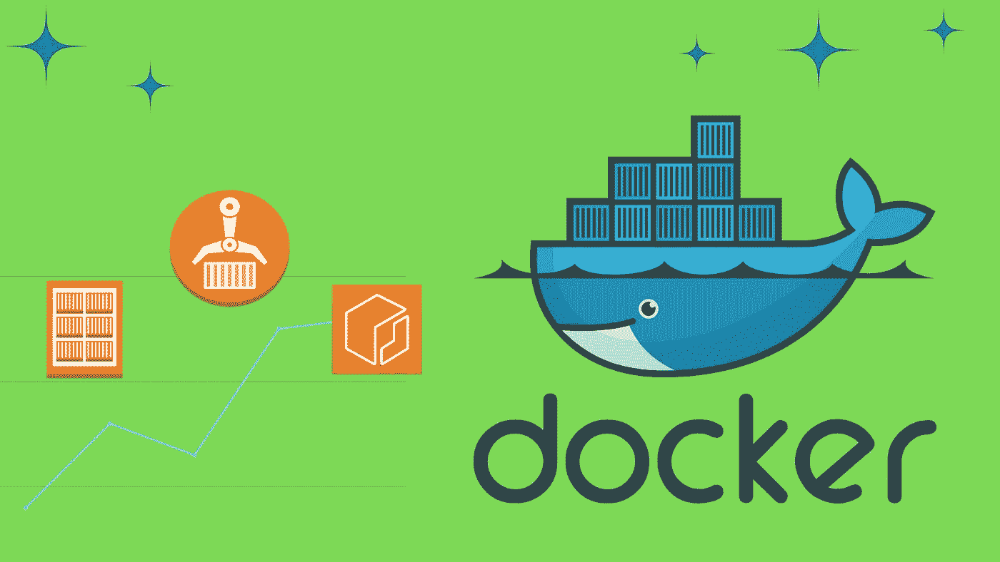

Docker ECR 工作在进行中

# Docker 是什么？

Docker 是一个开源的容器化平台，用于在轻量级可视化环境中开发、部署和管理应用程序。将每个应用程序打包到独立的容器中也使得开发、部署、维护和使用应用程序变得更加容易。它使用类似于虚拟机的虚拟化，但以一种非常轻量级的方式处理它，用单个进程来处理容器，该容器处理它自己部署的应用程序。

## Docker 和虚拟机的区别？

*a) Docker 在几毫秒内启动，而 VM 需要一分钟或更长时间
b)存储大小可能被限制在几百 MB，VM 需要的空间超过 GB 即使在较轻的操作系统版本中，也高达 20–80gb。
c)容器是内核虚拟化，VM 做硬件虚拟化。d) Docker 占用很少的内存，但 VM 占用大量内存。
e)像本机应用程序一样运行，虚拟机性能可能会受到操作系统及其硬件的限制。容器共享主机操作系统，但是每个虚拟机都在自己的操作系统中运行。*

**docker 架构** —这是一种客户端-服务器架构，Docker 客户端与 Docker 守护进程对话，后者的作用类似于服务器。Docker 客户端与 Docker 引擎交互，Docker 引擎包含**守护进程、containerd** 和 **runc** 。

## 码头工人

Docker 守护进程(***Docker***)**监听 Docker API 请求并管理 Docker 对象，如图像、容器、网络和卷。一个守护进程也可以与其他守护进程通信来管理 Docker 服务。它安装在一台主机上，本质上充当 Docker 的大脑，它代表您创建和管理您的 Docker 映像。它的全部目的是**执行客户端发出的命令**。Docker **卷**是一个持久文件，Docker 可以在附加时存储和检索数据。**

## 集装箱 d

容器管理生命周期，如开始、停止、暂停和删除。

## runC

runC 是一个轻量级、可移植的容器运行时。它包括 Docker 用来与容器相关的系统特性进行交互的所有管道代码

## Docker 图像

Docker 映像是一个**只读模板**，它包含一组用于创建可以在 Docker 平台上运行的容器的指令。它提供了一种方便的方法来打包应用程序并创建一个配置好的服务器系统。

Docker file→Docker image→Docker Container→隔离(单独)代码运行

## 什么是亚马逊(ECR)弹性容器注册表？

[Amazon Elastic Container Registry(Amazon ECR)](https://docs.aws.amazon.com/AmazonECR/latest/userguide/what-is-ecr.html)是一个 AWS 托管的容器映像注册服务，它是安全的、可伸缩的和可靠的。Amazon ECR 使用 AWS IAM 支持基于资源的权限的私有存储库。这是为了让指定的用户或 Amazon EC2 实例可以访问您的容器存储库和映像。

## 小贴士:

如果你想在 docker 周围玩而不免费安装任何东西，那么你有 docker [游乐场](https://labs.play-with-docker.com/)。它是基于 docker 本身构建的。

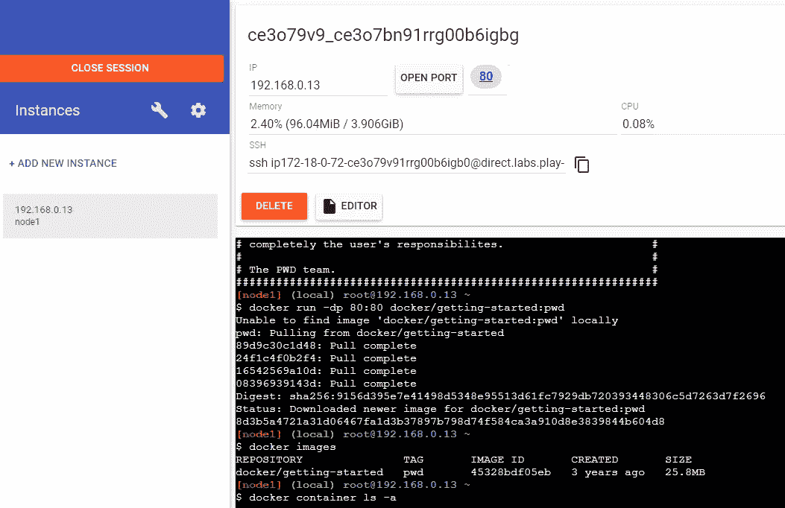

码头游乐场

## 要完成的任务:-

*1。使用 Nginx 创建您自己的映像，并添加一个文件来告诉您容器的部署日期。
2。在端口 8080 打开的情况下部署容器
3。将容器数据保存到 AWS 弹性容器注册表(ECR)*

## **先决条件:**

1.  使用您的 AWS 帐户凭据配置的 AWS CLI。
2.  vscode 或您选择的代码编辑器。

**注意**:该任务在 Ubuntu 上执行，vscode 已经配置了 AWS CLI 和 GitHub。唯一后来安装的是 docker。所以开始工作前一定要安装。

# 任务:1

> **使用 Nginx 创建您自己的映像，并添加一个文件来告诉您容器的部署日期。**

我们必须创建一个文件夹，然后将 Nginx 和 html 文件放在一起，这样我们就可以用它来创建一个自定义图像。为了完成这项任务，我们使用 **dockerfile** 。

一个`[**Dockerfile**](https://docs.docker.com/engine/reference/builder/)` [](https://docs.docker.com/engine/reference/builder/)是一个文本文档，它包含用户可以在命令行上调用的所有命令来组合一个图像。本页描述了您可以在`Dockerfile`中使用的命令。我们将使用 docker 文件来构建我们的自定义映像。

> **我们要做这个任务:1 以更小的步骤:**

## 步骤 1:为你的 docker 镜像创建文件夹/目录

我在 Ubuntu 中使用的是 vscode，所以我已经用 GitHub 配置了它，所以所有的更改都被推送到 Git 库。让我们从 mkdir 开始创建目录并移动到它。

```
mkdir <DIRECTORY/FOLDER NAME>
cd <DIRECTORY/FOLDER NAME>
```

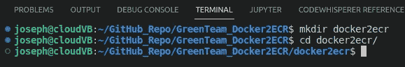

## 步骤 2-拉 docker 图像

让我们把 docker 图片放到我们的目录中。

```
docker pull nginx:latest
```

糟糕，在开始这项任务之前，我忘记在我的系统中安装 docker 了。让我们安装它。

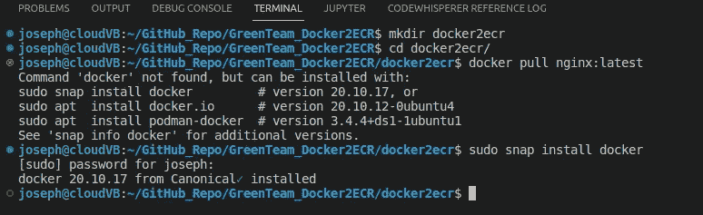

已安装码头

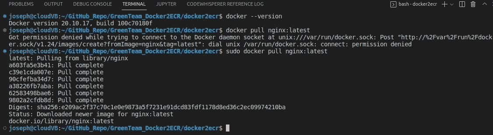

用 sudo 做码头拉

所以现在我们在本地目录中有了 nginx 映像。让我们检查一下。

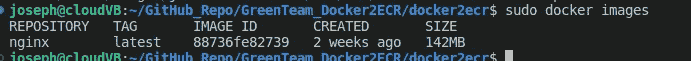

nginx 图像

为了解决我所面临的 docker 许可问题，我必须做一些整理工作。创建一个 docker 组并在其中添加用户。

```
sudo groupadd docker
sudo usermod -aG docker $USER
```

请在登出后立即返回，以反映我们在 Ubuntu 中的变化。让我们看看已经解决了我们的问题。

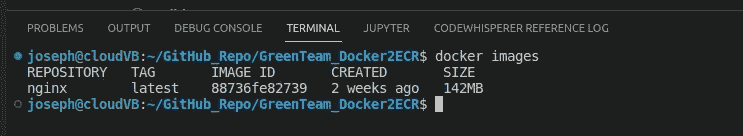

是的，它修复了权限问题

## 步骤 3-创建 index.html，打印出容器部署的日期和时间。

现在让我们集中创建显示日期和时间的 index.html 文件。

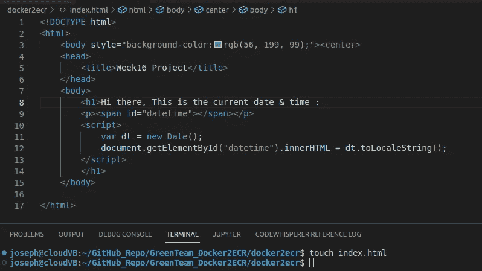

创建并编辑了我们的索引文件

## 第 4 步:创建一个 Dockerfile 文件来包含索引文件和 nginx

让我们创建一个 docker 文件来包含 index 和 nginx，以构建我们的自定义图像。确保移出当前目录来创建 dockerfile。第一张 **$cd** ..然后触摸 dockerfile。

```
touch dockerfile
```

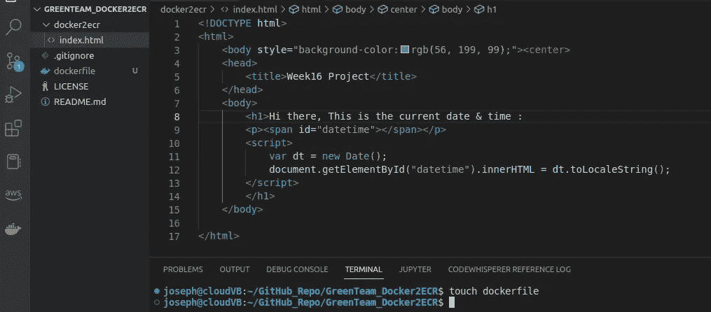

在父目录中创建了 dockerfile

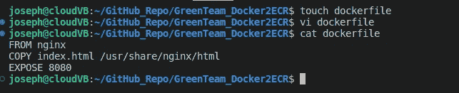

dockerfile 包含代码

## 步骤 5-构建 docker 映像

现在是构建它的时候了，让我们从 docker 文件中构建图像。需要注意的是。末尾带空格的表示当前目录。

```
docker build -t <nameofcontainer> .
```

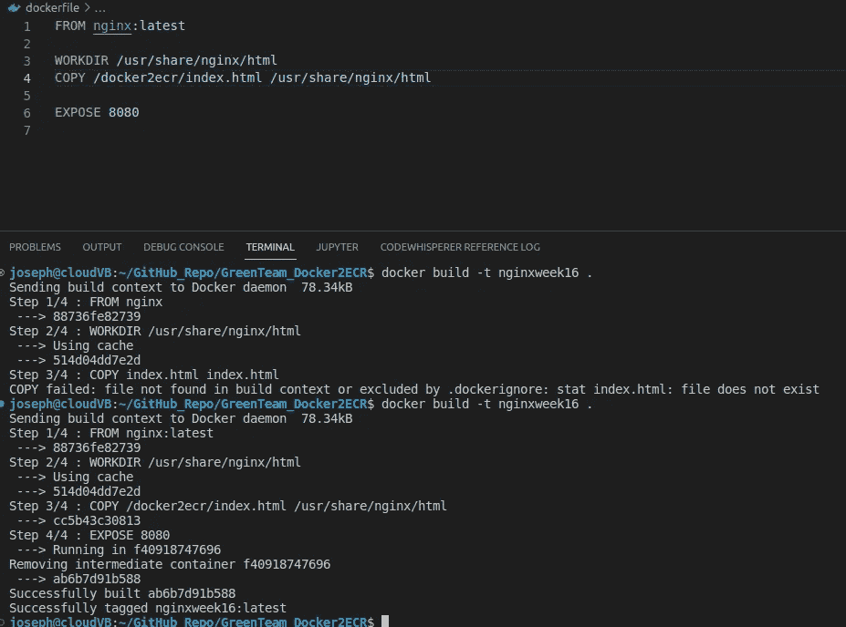

在一些错误之后，它被执行

我们面对的是文件没有找到，所以我给它一个完整的路径→*COPY/docker 2 ECR/index . html/usr/share/nginx/html*。所以修好了，让我们再检查一遍。

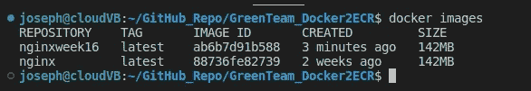

这是一个成功——我们可以看到 nginxweek16

> ***任务二。打开端口 8080 部署您的容器***

现在让我们用这个 cmd 从我们的映像创建我们的容器。

```
docker run -d --name <container-name> -p 8080:80 nginxweek16
docker run -d --name itsjoescontainer -p 8080:80 nginxweek16
docker ps
```

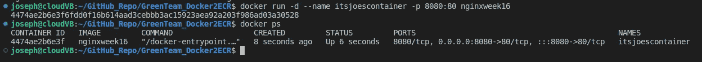

检查一下 docker ps，它显示在名字下面

检查容器是否正常工作。让我们转到 localhost:8080，检查我们是否有 index.html

```
curl loclhost:8080
```

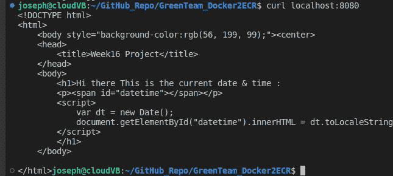

它在工作，我们可以看到我们的 index.html

现在在浏览器中检查相同的内容。

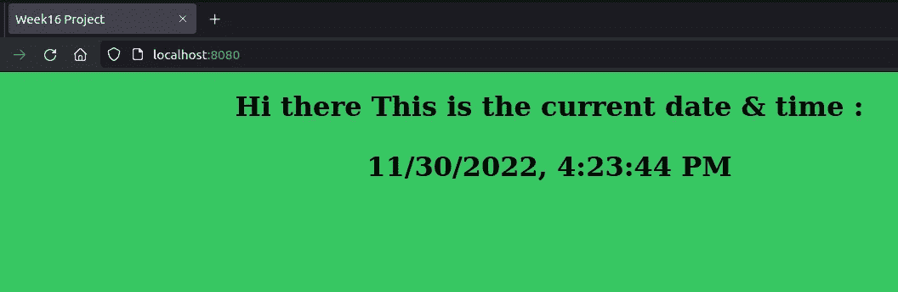

它工作正常。

> ***任务三。*将您的容器数据保存到 AWS 弹性容器注册表(ECR)**

1.  要将我们的映像推送到 AWS ECR，我们必须首先创建一个存储库。为此，我们使用此命令来初始化一个新的存储库:

```
aws ecr create-repository --repository-name <name> --region <region>
aws ecr create-repository --repository-name nginxweek16 --region us-east-1
```

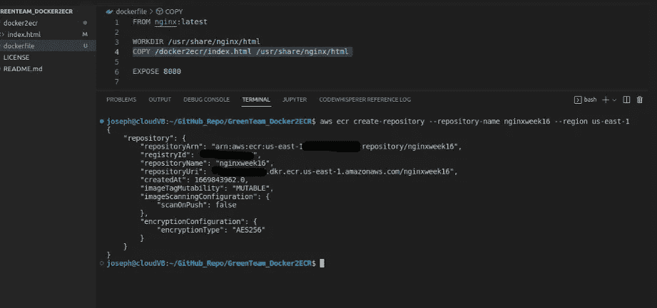

创建的存储库

我们去 AWS 控制台检查一下。

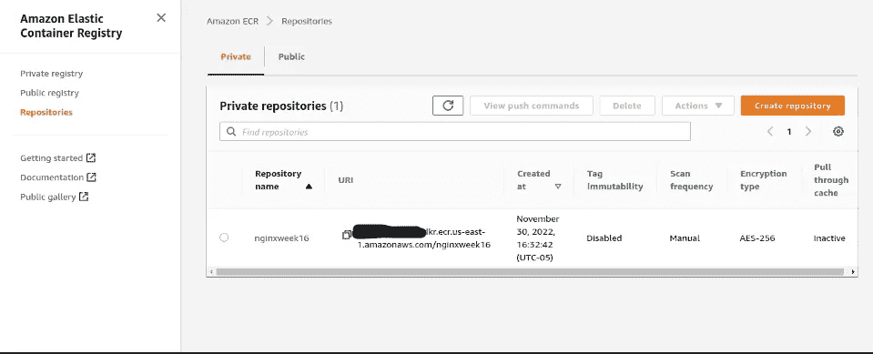

参见 nginxweek16

现在，单击存储库名称继续下一步。

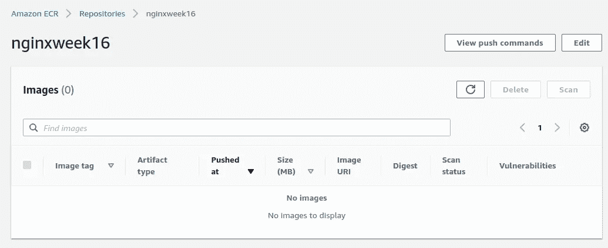

点击查看按钮命令按钮

现在，单击 view push commands 查看我们需要执行的 cmd。

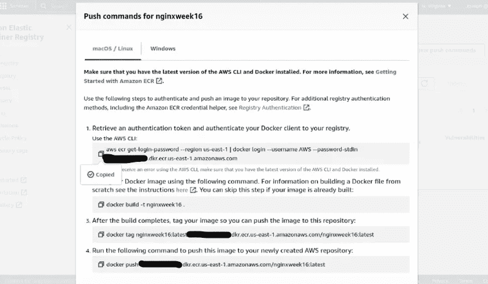

将 cmd 复制到这里并粘贴到 aws cli 中

我们可以按照这里给出的说明，将每一个复制并粘贴到 aws CLI 上。结果很好。

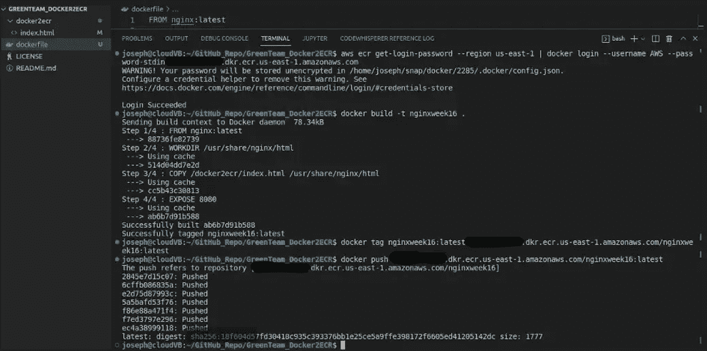

看到我们的 sha256 以浅绿色突出显示

现在去检查我们的仓库。两处见 sha256:18f604d57。

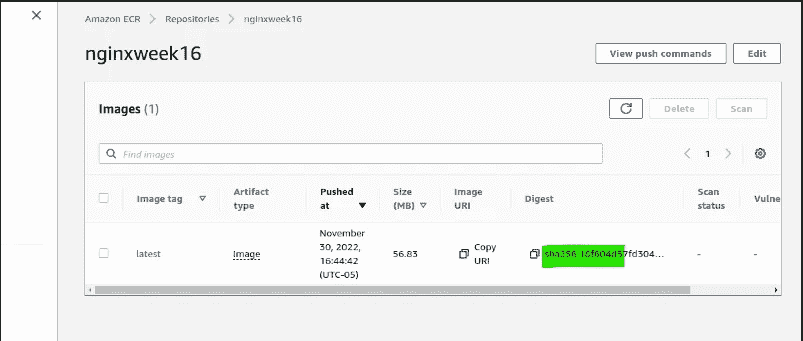

它有相同的 sha256 键，用于我们推入 ECR 的图像

万岁！！！，我们终于做到了。

## 总结:

我们在这里所做的是，首先我们简要地看了一下 docker，然后开始构建自定义映像，并使用自定义端口对其进行部署。然后我们把我们的图片推送到亚马逊 ECR。希望你学习了一些 docker 的概念，并学会了如何将图像推送到 ECR。谢谢你评论我的文章。我感谢你的好意。

**参考资料:**
Docker—[https://docs.docker.com/get-started/overview/](https://docs.docker.com/get-started/overview/)
Docker runC—[https://www.docker.com/blog/runc/](https://www.docker.com/blog/runc/)
Docker file—[https://docs.docker.com/engine/reference/builder/](https://docs.docker.com/engine/reference/builder/)