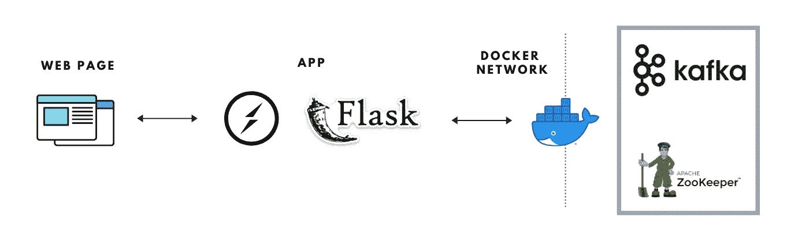
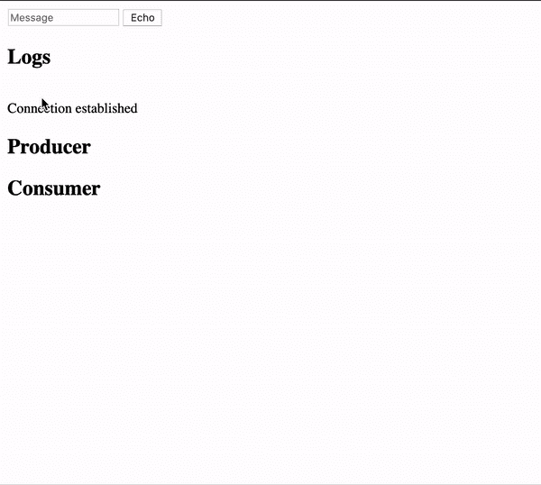

# 使用 SocketIO 构建 Flask APIs 来生成/消费 Kafka 消息

> 原文：<https://levelup.gitconnected.com/build-flask-apis-using-socketio-to-produce-consume-kafka-messages-95a15df2d1bc>

假设你有一个卡夫卡集群。您可以使用一些客户端代码轻松地从主题中生成和读取消息。如果您想通过端点公开您的 Kafka 集群来产生/消费消息，该怎么办？你会怎么做？

我们需要 3 个抽象组件来实现这一点，

1.  卡夫卡装置
2.  连接到 Kafka 设置的应用程序
3.  一些网页来测试应用程序的端点

这篇文章给出了构建和测试以下架构的指导。



目标结构

因此，我们将使用 docker 容器来设置 Kafka，并使用 Flask web-sockets 来公开 Kafka。让我们一次破解一个组件的架构！

# 步骤 1:使用 Docker 设置 Kafka

kafka 可用的两个 docker 图像是 [spotify/kafka](https://hub.docker.com/r/spotify/kafka/) 和 [wurstmeister/kafka](https://hub.docker.com/r/wurstmeister/kafka/) 。Wurstmeister 是一个受欢迎的选择，我们将使用它进行设置。

参考 [**Github 文件夹**](https://github.com/Stack-Box/stackbox-tutorials/tree/master/flask-kafka) 中用于构建这个例子的所有代码。

> **注:**代码根据读者的问题/PRs 不断更新。因此，这里提到的片段和回购协议中的片段可能会有一些差异。参考这篇文章底部的更新。

让我们使用一个 [docker-compose.yml](https://github.com/Stack-Box/stackbox-tutorials/blob/master/flask-kafka/docker-compose.yml) 来打开 Kafka 和 Zookeper 容器。

```
version: '3' 
services:  
   kafka:    
      environment:      
        KAFKA_ZOOKEEPER_CONNECT: zookeeper:2181
        KAFKA_ADVERTISED_HOST_NAME: <your-ip>  
      image: wurstmeister/kafka    
      ports:      
        - "32770:9092"    
      volumes:      
        - /var/run/docker.sock:/var/run/docker.sock    
      depends_on:      
        - zookeeper   
   zookeeper:    
      image: wurstmeister/zookeeper    
      ports:      
        - "2182:2181"
```

## 解码 docker-compose.yml

我们在 compose 文件中定义了两个服务，Kafka 和 Zookeeper。Kafka 内部运行在 docker 网络的 9092 上，外部运行在 32770(本地主机)和 zookeeper 上，内部运行在 2181 上，外部运行在 2182 上。

*KAFKA _ ZOOKEEPER _ CONNECT*被设置为 *zookeeper:2181* 。这里 zookeeper 是 docker 网络中的服务名，端口也是内部端口。必须将 KAFKA_ADVERTISED_HOST_NAME 设置为您机器的 en0 IP。例如，在 mac 上，您可以使用 ipconfig getifaddr en0 找到它

如果您想在提出代理本身的同时增加更多的代理或创建话题，请参考[wurstmeister/Kafka-docker](https://github.com/wurstmeister/kafka-docker)自述文件以获得更多有用的配置。

回到设置。现在运行下面的命令来启动您的容器。

```
docker-compose up 
```

**提示**💡—如果您已经设置好 IP，并且端口没有被占用，那么您的容器应该是打开的。有时，当 Kafka brokers 没有任何问题时，修剪 docker 映像、容器和卷，甚至重启 docker 都神奇地帮我解决了这个问题。

所以我们完成了我们的 Kafka 设置！

对于那些想知道，我如何把这个设置。使用

```
docker-compose down
```

把集装箱拿下来。但是在你测试运行你的应用程序或者网页的时候，确保你有容器。您可以使用以下命令列出正在运行的容器。

```
docker ps
```

# 步骤 2:编写烧瓶插槽应用程序

现在我们已经准备好了 Kafka，让我们写一些读写消息的连接。

参考完整的工作 [app.py](https://github.com/Stack-Box/stackbox-tutorials/blob/master/flask-kafka/app.py) ，我在下面解释一些重要的代码。

由于我们不能完全使用 REST APIs 来读写我们的 Kafka，我们将编写套接字来在我们的应用程序运行时保持与 Kafka 集群的连接，并且我们也可以将这些更改实时传输到我们的网页。Web-sockets 是一个很酷的编程范例，用在简单的 get/post/put 不起作用的应用程序中，您需要一个连接来持续更长时间以实时获取/上传数据。阅读更多关于 web-sockets、SocketIO 的内容，理解和欣赏套接字的概念💡

我们将使用 [**烧瓶套接字**](https://github.com/miguelgrinberg/Flask-SocketIO) 在我们的应用程序中编写套接字。你所需要做的就是添加 **@socket** decorator 而不是通常的 route decorator 来作为一个套接字公开。

我们在应用程序中有 3 个套接字端点。

1.  **连接**:只是一个插座，检查通道上是否建立了连接
2.  **kafkaproducer** :获取一条消息(从网页)并将其发布到一个已配置的 kafka 主题
3.  **kafkaconsumer** :读取主题中的所有消息，并将它们发送回同一个通道。这个发出的消息列表可以通过网页获取。

这里我们将坚持一个名为*卡夫卡*的频道。

Top 从 python 连接到卡夫卡，我们就用[**Kafka-python**](https://pypi.org/project/kafka-python/)**。**所有需求都可以在 [requirements.txt](https://github.com/Stack-Box/stackbox-tutorials/blob/master/flask-kafka/requirements.txt) 中找到。我用 python 3.6 来实现。

## 生产者代码

生产者片段非常简单。

```
@socketio.on('kafkaproducer', namespace="/kafka")
def kafkaproducer(message):
    producer = KafkaProducer(bootstrap_servers=BOOTSTRAP_SERVERS)
    producer.send(TOPIC_NAME, value=bytes(str(message),
        encoding='utf-8'), key=bytes(str(uuid.uuid4()),
        encoding='utf-8'))
    emit('logs', {'data': 'Added ' + message + ' to topic'})
    emit('kafkaproducer', {'data': message})
    producer.close()
    kafkaconsumer(message)
```

1.  使用 kafka-python 中的 KafkaProducer 连接到 Kafka
2.  然后将消息发布到 Kafka(所有消息和密钥都需要是字节)
3.  然后，我们发出一些日志，说明消息已经发布。
4.  然后调用 kafkaconsumer 片段(这是为了在网页中显示通过消费者生成的消息)
5.  整个方法都是用 socketio、一个名称和一个命名空间来修饰的。名称是方法在网页中被调用的方式，名称空间相当于通道，在通道中所有的发出和发送将被协调。

## 消费者代码

消费者需要一些额外的代码在消费完所有消息后停止。否则，它会一直监听新消息，不会退出。

```
[@socketio](http://twitter.com/socketio).on('kafkaconsumer', namespace="/kafka")
def kafkaconsumer(message):
    consumer = KafkaConsumer(group_id='consumer-1',
                             bootstrap_servers=BOOTSTRAP_SERVERS)
    tp = TopicPartition(TOPIC_NAME, 0)
    consumer.assign([tp])
    consumer.seek_to_end(tp)
    lastOffset = consumer.position(tp)
    consumer.seek_to_beginning(tp)
    emit('kafkaconsumer1', {'data': ''})
    for message in consumer:
        emit('kafkaconsumer', 
             {'data': message.value.decode('utf8')})
        if message.offset == lastOffset - 1:
            break
    consumer.close()
```

1.  使用 kafka-python 中的 KafkaConsumer 连接到 Kafka
2.  找出流中最后一条消息的位置
3.  阅读所有消息，直到最后一条消息，并断开连接
4.  还将这些消息发送给通道，使网页能够获取它们。
5.  对“kafkaconsumer1”的初始发出是告诉 web 页面一组新的消息即将到来，并清除页面中现有的消息列表。

现在当你跑的时候

```
python app.py
```

你将有你的网络插座启动和运行。Flask SocketIO 不会显示任何启动日志，所以不要吃惊😛

# 第三步:写网页

我写了一些[超级基本的 HTML](https://github.com/Stack-Box/stackbox-tutorials/blob/master/flask-kafka/index.html) 来连接应用程序并显示消息。它使用 [SocketIO](https://socket.io/) 脚本从应用程序中传输数据。html 有一个简单的表单，它接收一些消息并将其发送给生产者。有些部分可以读回来自消费者的所有消息，还可以显示日志。

现在运行你的 kafka 设置，运行你的应用并打开 index.html。



工作

是时候庆祝了！(或者直接进入评论区提问，或者在 [Github](https://github.com/Stack-Box/stackbox-tutorials) 上提出问题并解决问题，然后..CEL-EB-ratee！！)

结束了。在下面找到代码、包和其他有用资源的链接。拜拜👋

*   [代码](https://github.com/Stack-Box/stackbox-tutorials)
*   [卡夫卡码头工人](https://github.com/wurstmeister/kafka-docker)
*   [烧瓶插槽](https://github.com/miguelgrinberg/Flask-SocketIO)
*   [卡夫卡-巨蟒](https://pypi.org/project/kafka-python/)
*   [socket.io](https://socket.io/)

*—作者:* [*索米亚·纳加拉詹*](https://medium.com/u/a640a517f7d8?source=post_page-----95a15df2d1bc--------------------------------)

> **2021 年 2 月 25 日—更新**
> 
> 向读者大声喊出来 [halvnok](https://github.com/halvnok) 和 [Exchizz](https://github.com/Exchizz) 寻求他们对代码的反馈和建议。
> 
> **变更**
> 
> 1.烧瓶代码现在已经集装箱化了。请参考[堆栈箱-教程/pull/2](https://github.com/Stack-Box/stackbox-tutorials/pull/2) 。依赖版本的更新也很少。