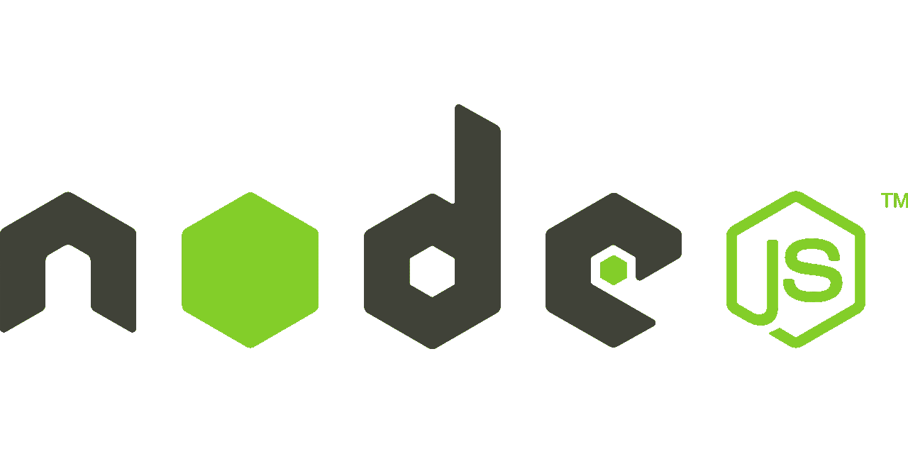

# 使用 typescript 通过 express 构建 NodeJS 服务器应用程序

> 原文：<https://levelup.gitconnected.com/build-node-js-server-application-with-express-using-typescript-b8caa0a68755>

> 今天让我们学习使用 express framework 构建 nodeJS 应用程序。



图片来自 [Pixabay](https://pixabay.com/vectors/node-js-logo-nodejs-javascript-736399/) 的 [CopyrightFreePictures](https://pixabay.com/users/copyrightfreepictures-203/)

NodeJS 是一个开源的、跨平台的运行时环境，构建在 Google Chrome 网络浏览器中使用的相同 JavaScript 引擎上。它允许开发人员构建服务器端应用程序中间层，包括用于平台 API 的 web 服务器和 web 服务。

Express 是 Node 之上的最基本的 web 应用程序框架。可用于快速构建 web 应用、RESTFUL APIs 等的 JS。

现在让我们开始构建我们的第一个 nodeJS 应用程序。

# 先决条件

节点是必须安装在我们的机器上，其次让我们确保我们有一个用户友好的编辑器来处理我们的项目。

## 安装节点

首先，我们必须确保节点安装在我们的机器上。

我们可以通过从终端运行命令`node --version`来验证它。如果已经安装在计算机上，此命令应该显示已安装的节点版本。

否则，要安装节点，请访问[节点网站](https://nodejs.org)并点击绿色大安装按钮。

## **代码编辑器**

我们可以使用任何我们喜欢的代码编辑器。但是如果你的系统上还没有安装任何代码编辑器，那么我强烈推荐使用 [VS 代码编辑器](https://code.visualstudio.com/download)。

# 1.设置项目

首先，让我们创建一个保存源代码的目录。

```
mkdir my-nodejs-appcd my-nodejs-app
```

这里`my-nodejs-app`是我们的项目名称。

# 2.正在初始化项目

一旦我们进入项目文件夹`my-nodejs-app`，我们将使用命令`npm init`为我们的应用程序创建 package.json 文件。该命令提示一些与应用程序的名称、版本和入口点相关的问题。现在我们可以通过传递选项`-y`来保持简单，它将所有值设置为默认值。

```
npm init -y
```

接下来，我们将通过使用以下命令创建`tsconfig.json`来初始化我们的项目:

```
npx tsc --init
```

上面的命令在我们的项目目录中生成一个`tsconfig.json`文件。这个`tsconfig.json`文件允许我们配置和定制 TypeScript 和`tsc`编译器如何交互。在这个项目中，我们将使用默认配置。

# 3.安装依赖项

现在，我们将通过运行以下命令 **:** 来安装项目中所需的所有依赖项

```
npm install express —Snpm i typescript ts-node nodemon @types/express @types/node -D
```

选项`-D`用于安装仅在开发期间需要的模块，选项`-S`用于安装运行时需要的模块。

模块`@types/node`和`@types/express`是节点和快速模块的类型定义。

在我们应用程序的开发过程中，我们将使用`nodemon`模块进行热重装。

# 4.创建服务器文件

现在，当我们的项目设置完成后，我们可以开始实现我们的实际服务器。

让我们在项目中创建`index.ts`文件，并将下面的代码复制到其中。

这里我们已经导入了 express，并使用一个简单的回调函数在端口`8000`上初始化了我们的服务器，以记录我们的应用程序的状态。

我们创建了一个简单的 GET route，它的基本路径为空，应该会返回一个简单的字符串作为响应。

# 5.构建并运行应用程序

现在让我们更新我们的`package.json`文件。首先，我们将通过添加脚本来构建和运行我们的应用程序，从而更新`scripts`块。

我们还需要确保应用程序的入口点`main`指向我们的`index.ts`文件

现在，为了构建和运行应用程序，我们将使用这个命令，

```
npm run start
```

现在，当我们点击浏览器上的`http://localhost:8000`时，我们应该会看到从 GET API 路径返回的响应`Welcome to node world!!`。

## 用 nodemon 开发

现在让我们看看如何在开发阶段运行和测试我们的应用程序。我们将使用`nodemon`为我们提供热重载特性，这使我们能够在编码的同时进行测试。对于运行以下命令，

```
npm run start:dev
```

现在让我们在`index.ts`中更改我们的路线

这里我们可以看到，随着保存在我们的`index.ts`文件中的每个更改，我们的应用程序都在重建，新的更改也反映在我们的应用程序中。

# 6.测试节点应用程序

我们当然不希望依靠手动测试来保证我们的应用程序没有错误。在本节中，我们将学习在节点应用程序中合并单元测试和集成测试。

在本文中，我们将依靠 jest 和 supertest 来编写我们的测试。因此，让我们继续安装所需的依赖项。

```
npm i jest ts-jest supertest @types/supertest @types/jest -D
```

## 单元测试

单元测试用于测试孤立的小块代码或功能。为了简单起见，我们将考虑一个简单的 add 函数进行测试。

在这里，我们为上面提到的简单的 add 函数编写一个单元测试。

要运行测试，请将以下命令添加到脚本块中的 package.json。

```
“test:unit”: “jest”
```

## 整合测试

集成测试用于测试交互中多个更大的单元(组件),这反过来有助于确保系统作为一个整体正常工作。

我们将使用 [**supertest**](https://www.npmjs.com/package/supertest) ，这是一个通过另一个库 superagent 帮助断言网络请求的库。

节点应用程序

在下面的集成测试中，我们将测试网络请求的各个方面，如状态代码和响应数据。

我们使用 jest 来运行我们的测试。我们可以用 jest 命令给出测试文件的路径，以便从特定的测试文件夹中运行测试。现在，我们将使用测试命令的脚本标记来更新 package.json。

我们的第一个 Node.js 应用程序已经准备就绪，热烈欢迎来到 Node world！！

祝你黑客愉快，并在评论中留下更多问题。