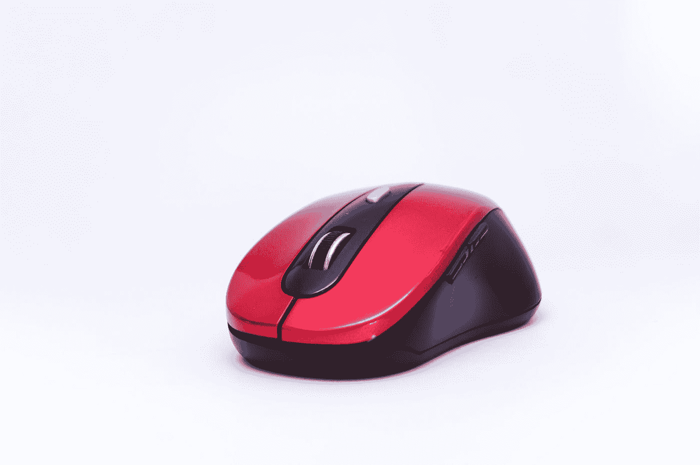
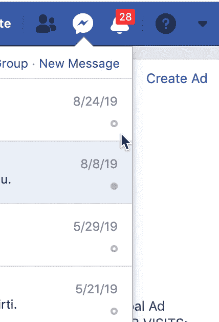
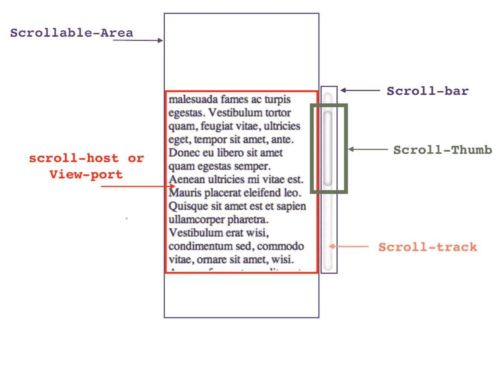
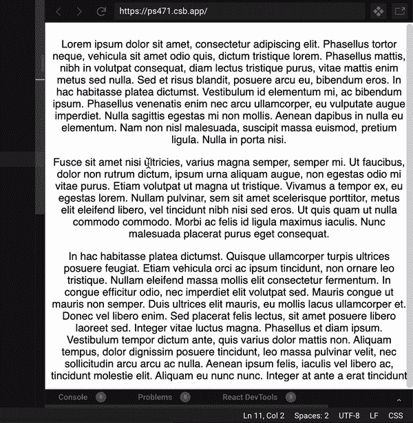
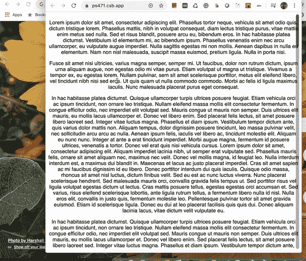
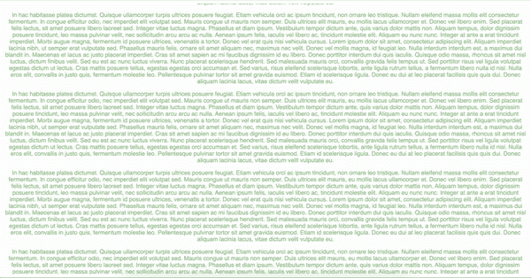

# 在 React 中构建悬停自定义滚动条

> 原文：<https://levelup.gitconnected.com/build-on-hover-custom-scrollbar-in-react-d846194a7ea4>

沙加尔·赛义德在 [Unsplash](https://unsplash.com?utm_source=medium&utm_medium=referral) 上的照片

我们都知道滚动条是一个 UI 组件，通常位于窗口的最右侧或底部，它允许你上下左右移动窗口查看区域。今天大多数人都熟悉**滚动条**，因为几乎每个网页和应用程序都需要上下滚动。

# web 应用程序中滚动条的问题

*   所有操作系统都有不同类型的原生滚动条，并且大多数浏览器继承了特定于操作系统的滚动条，这使得你的 web 应用程序滚动条在不同的操作系统上有不同的外观和感觉。基于 Web-kit 的浏览器通过 CSS 支持[滚动条 UI 定制](https://css-tricks.com/custom-scrollbars-in-webkit/)，但是其他的呢？
*   它们在水平或垂直方向上占用了一些额外的空间，这减少了您的网页内容或内容容器(如表格)的可用空间(基于 WebKit 的浏览器提供了一个 [overlay](https://developer.mozilla.org/en-US/docs/Web/CSS/overflow) value，使 scrollbar 绘制在内容的顶部，以消除这些额外的空间，但是其他浏览器呢？)

# **动机**

Facebook Messenger 自定义滚动条

*   **脸书**:我在脸书信使弹出窗口中发现了一个自定义滚动条，它会在鼠标悬停时出现。
*   **Gmail:** 你也可以在 Gmail 中看到类似的滚动条，位于悬停时的电子邮件撰写按钮下方
*   你可能已经注意到其他应用程序中类似的滚动条，甚至在“代码沙箱”项目中你也能注意到类似的滚动条

在这个故事中，我将带你经历如何在 React 中创建自定义滚动条的步骤，我们可以在其他前端框架中使用相同的技术，如 Angular，但在深入研究之前，让我们可视化滚动条的不同组件

滚动条组件

 [## hkurra/悬停滚动条时反应

### 这是一个基本但有用的例子，演示了如何在 react 中创建一个自定义滚动条，鼠标悬停时可以看到它…

github.com](https://github.com/hkurra/react-on-hover-scrollbar) 

完成代码沙盒项目[链接](https://codesandbox.io/s/github/hkurra/react-on-hover-scrollbar/tree/master/)

## 我们需要执行的步骤

1.  隐藏浏览器的原生滚动条
2.  添加自定义滚动条用户界面，鼠标悬停时可见
3.  在滚动条中添加自定义的**滚动块**
4.  基于可滚动内容计算**滚动块** ***高度***
5.  在滚动主机中改变鼠标滚动上的**滚动块*位置*和**
6.  鼠标拖动时改变**滚动-拇指** ***位置***

所有这些步骤在下面都有深入的解释

# 隐藏本机滚动条

首先我们需要做的是在 scroll-host 元素上隐藏浏览器的原生滚动条，不要禁用通过 ***溢出:隐藏*** 的滚动

> 为什么？我们很快就会看到原因。

下面是在不同浏览器上隐藏滚动条的 CSS。这里的是代码沙盒项目的链接，我已经用下面的 CSS 隐藏了我的滚动主机容器上的滚动条

隐藏浏览器原生滚动条的 CSS

所以，我们通过上面的步骤摆脱了浏览器自带的滚动条。在进入下一步之前，我已经创建了一个[代码沙盒项目](https://codesandbox.io/s/hide-scroll-bar-ps471?file=/src/onHover.js)，它有一个完整的实现。具有中级或更高级经验的用户可以直接转到那里，直接从代码中理解逻辑。虽然，我会推荐通读文章，详细了解一切。

# 让我们创建我们的自定义滚动条

下一步是在我们的滚动主机上呈现一个**滚动条**和**滚动框滑块**，这将帮助我们通过鼠标拖动来滚动内容。首先，我们将添加一个滚动条，将出现在悬停。下面是代码片段及其 CSS。

基于 React 的 CustomScrollDiv 组件

基于 React 的 CustomScrollDiv 组件 CSS

所以，现在我们有了单独的可重用组件名 **CustomScrollDiv** ，它将你的内容和**滚动条**一起呈现在组件中，并且这个滚动条只有当用户将鼠标悬停在你的 **CustomScrollDiv** 组件上时才可见。

## 提供；给予

*   **Scroll-host** :它代表你的自定义 **div** 容器，它将在悬停时呈现自定义滚动条，它将保存可滚动的内容(在第 **25 行**它正在呈现**子**道具)，你提供给 **CustomScrollDiv** 的任何道具都将在这个 div 上得到应用。参见**第 23 行**
*   **滚动条**:这将容纳滚动块，并为滚动块提供一个跟踪区域。在后面的部分中，我们将在这个组件中添加 scroll-thumb。这里，我们利用**绝对**定位 CSS 属性在固定位置将滚动条容器呈现在我们的**滚动主机**上，保持其高度等于**滚动主机容器的 100%。**
*   **Scroll-host-container** :它是你实际组件 aka **scroll-host** 的容器/包装器。作为一个容器，它正在监听**鼠标经过**和**鼠标离开**事件(**第 17 行，18** )，而不是**滚动主机**。

> 我们为什么需要这个？
> 
> 这将有助于我们保持滚动条高度等于**滚动主机**的客户端高度，否则你必须保持**滚动条**的高度等于**滚动主机**的 **scrollHeight** 的高度，当你的 scrollHeight 非常大时，这将导致闪烁问题(我将在最后一节解释)

## **状态**

目前，我们只保持一种状态，即**悬停**，

我们正在更改 [**mouseout**](https://developer.mozilla.org/en-US/docs/Web/API/Element/mouseout_event) 和 [**mouseover**](https://developer.mozilla.org/en-US/docs/Web/API/Element/mouseover_event) 事件处理程序下的值，该事件处理程序注册在 **Scroll-host-container 上。随着我们的前进，我们将增加更多的州**

现在有了上面的组件和 CSS，你会注意到**滚动条**在悬停时可见，你的内容仍然可以滚动

自定义滚动条在鼠标悬停滚动主机上可见

> 你知道为什么你的内容仍然可以滚动吗？

为了隐藏滚动条，我们**没有**使用 [**溢出:隐藏**](https://developer.mozilla.org/en-US/docs/Web/CSS/overflow) **，它对滚动**做了两件事

1.  **隐藏**滚动条
2.  不允许用户滚动内容

有了这个，你也就有了上述问题的答案。

# 让我们拿着滚动条，滚动拇指

我们的下一步是呈现**滚动块(框)**或**滚动块**，通过它们，用户不仅可以通过鼠标拖动来滚动内容，还可以帮助用户根据其相对于**滚动条**的位置来确定可滚动内容的长度。这是该实现中最关键/最复杂的部分。所以，先喝一杯咖啡/茶🍮 😉。

## 滚动缩略图呈现

首先，我们将在代表**滚动块**的**滚动条**中添加一个新的 **div** 元素

## **滚动块高度计算**

*   接下来，我们必须根据可滚动的内容找到这个滚动块的高度，这是刷新基本数学百分比公式的时候了。
*   不要太紧张，这是简单的数学。在使用公式之前，让我们先理解下面的术语

> [**clientHeight**](https://developer.mozilla.org/en-US/docs/Web/API/Element/clientHeight) :元素的内部高度
> 
> [**scroll height**](https://developer.mozilla.org/en-US/docs/Web/API/Element/scrollHeight)**:**是一个元素的高度的**内容**

*   现在，这里是公式，其中滚动主机或可滚动区域的 RHV 的高度

> ***scroll thumbheight =(client height/scroll height)* client height***

滚动块高度计算

*   设置滚动框的最小高度为 20 px，以避免在滚动内容非常大的情况下滚动框的高度为负。
*   在 React 中，我们将在我们的 **CustomScrollDiv** 元素在 DOM 中挂载之后计算这个高度，如果是基于类的组件，您可以使用 **componentDidMount** 生命周期方法，如果是功能组件，您可以使用 **useEffect** 钩子。

## 滚动缩略图定位

*   为了改变鼠标滚动时上面的**滚动块**的位置，我们需要**按照下面的步骤
    1。**处理**滚动主机
    2 上的 ***滚动*** 事件。**根据以下公式，在步骤 1 中注册的处理器中，每次滚动移动时，改变**滚动块**的*顶部*位置

> scroll thumb top =(scroll top/scroll height)* client height

滚动-拇指在鼠标滚动上移动

*   更改后， **CustomScrollDiv** 组件将如下所示

鼠标滚动时滚动拇指位置计算

## 滚动拇指拖动

*   现在，我们有了正确大小的**滚动条和滚动块**,它们也可以在滚动主机区域的鼠标滚动中正确移动。尽管如此，鼠标在**滚动拇指**上拖动还是不起作用，让我们看看如何处理:
*   为了处理滚动块上的拖动，我们需要处理
    1。 ***mouseDown*** 事件发生在**滚动块**元素和
    2 上。 ***鼠标移动*** ， ***鼠标移动&鼠标离开*** 文档

> 为什么记录？
> 
> 因为当拖动时，你可以在文档中的任何地方移动你的鼠标，这是所有滚动条的默认行为，你可以在阅读这篇文章时通过滚动来验证这个行为

*   为了识别用户是否在拖动滚动块，我们将在组件中保留状态**正在拖动**,还需要存储用户开始拖动时**滚动块**元素的 Y 坐标
*   现在，让我们看一下在每个事件处理程序中我们需要做什么

## 先将 ***鼠标按下*** 处理程序 ***放在*滚动条上**

鼠标按下滚动块意味着，用户将开始拖动**滚动块**，因此，我们保持**滚动块**的当前 Y 坐标位置，并将**正在拖动**状态更改为真

## 文档 ***鼠标离开和鼠标抬起事件***

**文档上的 mouseLeave** 和 **mouseUp** 事件表示如果当前正在拖动鼠标拇指，用户将停止拖动，所以我们将**正在拖动**状态改为 false

## 文档**鼠标移动处理**

为了在拖动时产生滚动效果，我们需要改变下面组件的滚动顶部:

*   **Scroll-Thumb:**Scroll-Thumb 的滚动顶部的变化是拖动过程中鼠标位置的垂直变化。为了计算该值，我们需要最后一个**滚动拇指**位置，该位置已保存在 l**astscrollhumbposition**状态中。在**第 9 行(**见下文 **)** 我们正在改变**滚动块**的位置，在**第 15 行**我们正在将**滚动块**的顶部增加该值。
*   **Scroll-Host:** 如果你注意到新的 scroll-top 是拖动过程中鼠标位置变化的百分比，那么 Scroll-Host 的滚动顶部的变化使用下面的公式计算。

> newScrollHostTop =(scroll height/offset height)* deltaY；

我们在**第 10 行**计算 scrollTop 的变化，并将其应用于**第 20 行**

现在，我们已经实现了我们的目标，我们定制的悬停滚动条已经准备好了，它也可以在**滚动拇指**上拖动鼠标，这就是它现在的工作方式。

# 结论

虽然我已经尽力让这个故事容易理解，但它需要先决条件，如 [**React**](https://reactjs.org/) ， [**React-Hooks**](https://reactjs.org/docs/hooks-intro.html) ， **DOM** 布局， [**JS DoM API**](https://developer.mozilla.org/en-US/docs/Web/API/Document_Object_Model#HTML_DOM) 等。有些部分可能需要额外的阐述，但是为了保持故事的简洁和便于所有类型的用户理解，我只提到了重要的几点。欢迎在下面的评论区提出你的疑问和建议。

你可以在你的代码中自由使用 [CustomScrollDiv](https://codesandbox.io/s/custom-scrollbar-on-hover-ps471?file=/src/CustomScrollDiv.js:162-177) 组件，但是对于产品来说，你可能需要处理额外的东西，比如，目前，我只是在组件挂载之后计算 **scroll-thumb** 的高度，但是如果用户调整窗口大小，或者如果你的 scroll-host 延迟加载数据并延迟改变 scrollHeight，它就会改变。

瞧啊。！现在，我们有了自己的自定义滚动条:)

注意安全，继续编码！！