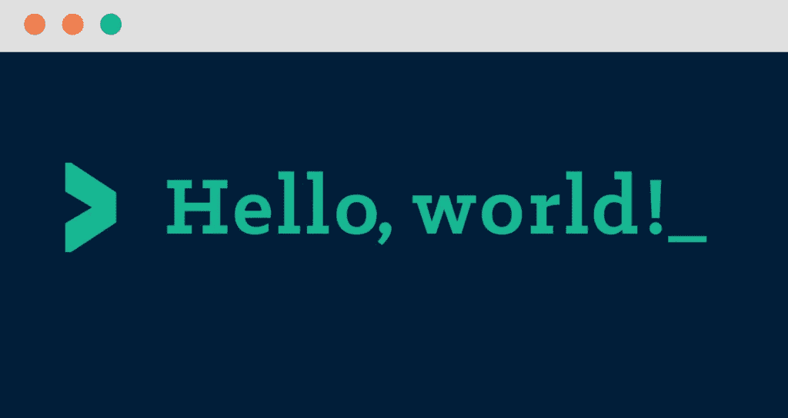
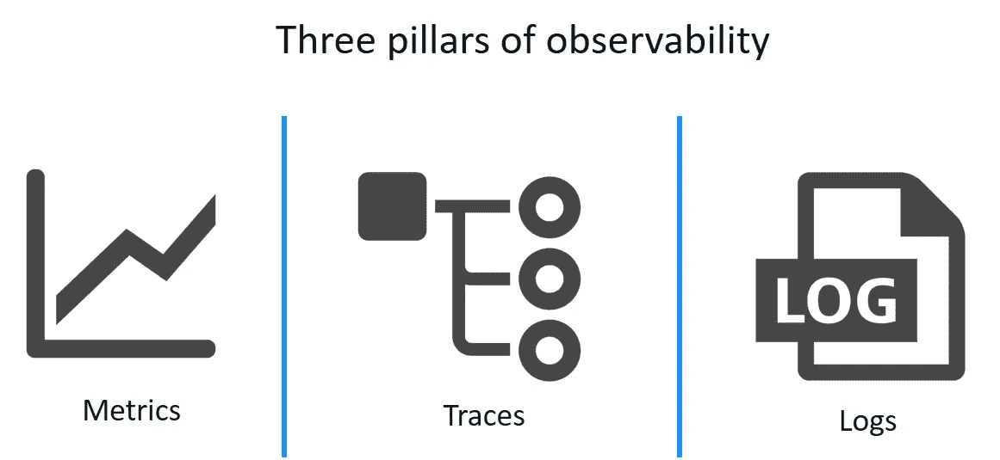
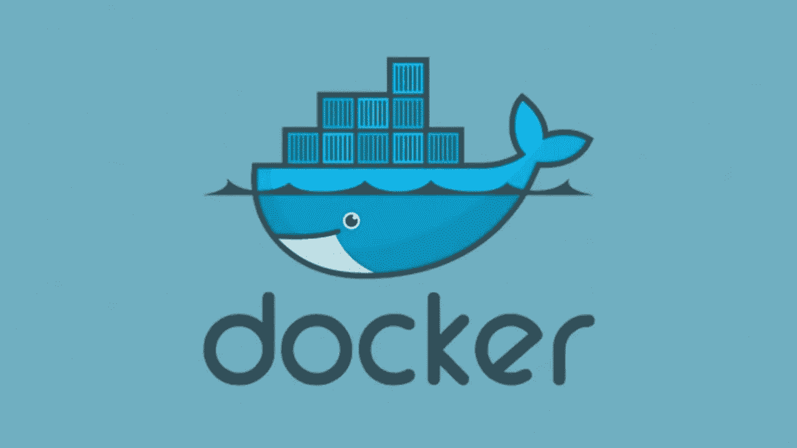

# 从“Hello World”，到生产级微服务

> 原文：<https://levelup.gitconnected.com/build-production-grade-microservices-a1bbbf68247d>

如今，利用在线资源，构建“hello world”服务相当容易。

图片来自走向数据科学

例如，这是如何用 Golang 编写 Hello World 服务。

在 Node.js 中也很容易做到。

然而，弄清楚如何从这种微服务转向生产级微服务并不容易。用于构建生产服务的在线资源相当分散，有时非常稀缺。

这篇文章的目标并不是提供构建生产微服务的所有答案，而是提供一些需要考虑的关键问题。这是一个不全面的列表，所以请在评论中提出更多建议！

# **基础知识:**

以下是几乎所有类型的服务都需要的基础知识。

图片来自 hackernoon.com

**编程:**

*   **语言。**选择哪种语言？例如， **Golang** 是一种特别擅长多线程的性能语言；如果服务与机器学习或数据分析相关，Python 可能是一个不错的选择；如果你想保持 JavaScript 作为全栈语言，Node.js 可能是个不错的选择。Java 很棒，因为它被广泛使用，如果团队已经精通 Spring 框架，这将是一个优势。
*   [**依赖关系管理**](https://engineering.linkedin.com/blog/2018/09/managing-software-dependency-at-scale) 。每种语言都有自己的依赖管理工具。当 1 时，有时很难得到正确的结果。有外部和内部的依赖，2。处理依赖性升级，以及 3 .一个库依赖于多个版本。
*   **配置。**大多数服务需要将配置加载到流程中，如端口、数据库连接字符串或认证令牌。如何加载配置？如何区分本地/暂存/生产环境之间的配置？如何在应用程序代码中高效地传递配置？当配置改变时，如何动态地重新加载配置？

**网络服务器:**

*   **网络服务器库。**选择哪个服务器库？大多数流行的编程语言都提供了默认的 HTTP 服务器，并且有无数的第三方服务器可供选择。它们的利弊是什么？哪一个最符合您的需求？
*   **中间件**。你需要什么中间件？一些常见的是日志记录、异常恢复、遥测等。这里有一份 ExpressJS 中间件的清单。
*   **协议**。HTTP REST 还是 [GraphQL](https://graphql.org/) ？ [gRPC](https://grpc.io/) 、[节俭](https://thrift.apache.org/)，还是 [WebSocket](https://en.wikipedia.org/wiki/WebSocket) ？它们各有各的优势和用例，所以使用哪一个取决于你的需求。

# 质量:

代码质量可能意味着很多事情。两个重要的是代码可理解性和代码覆盖率。

照片由[斯科特·格雷厄姆](https://unsplash.com/@homajob?utm_source=unsplash&utm_medium=referral&utm_content=creditCopyText)在 [Unsplash](https://unsplash.com/s/photos/technology?utm_source=unsplash&utm_medium=referral&utm_content=creditCopyText) 上拍摄

**可理解性:**

*   **认知复杂性。代码是否容易理解，即使是对新人来说？在其上构建容易吗？代码是否有合适的抽象层次而不会使事情复杂化？文件夹/文件结构有意义吗？**
*   **林挺**。一致和标准的代码风格对于代码可读性至关重要，linters 不仅仅做风格检查。使用哪种棉绒？如何使其成为当地开发流程的一部分？以及如何使其作为 CI 构建的一部分运行？
*   **文档。**对于 HTTP APIs，他们有 Swagger/OpenAPI 文档吗，API 变化时是最新的吗？代码库有足够数量的注释来解释代码吗？它有一个信息丰富和简洁的自述文件吗？

**测试:**

*   单元测试。如何写出更好的单元测试，实现更好的代码覆盖率？使用哪些测试框架？如何高效地模仿对象？如何做测试驱动开发？
*   **组件/集成测试。如何创建它们？如何以快速和自动化的方式在本地和 CI 上运行它们？**
*   **代码覆盖率。**如何报告代码覆盖率，检测代码覆盖率滑动？

# **可观察性:**

没有对系统的强可见性，就好像在盲目地飞行。可见性的三大支柱是日志记录、遥测和分布式跟踪。

图片来自 dynatrace.com

*   **伐木。**如何收集结构化、分级的日志？使用哪个库包？如何用唯一的 ID 将单个会话中的日志链接在一起？
*   **遥测。**哪个框架收集指标，StatsD 还是 Prometheus 还是别的？怎么设置？**负责警戒。**如何设置遥测警报？基本阈值警报、异常检测等。与 PagerDuty、Slack 和 email 的集成通常是必要的。
*   **分布式追踪。**分布式跟踪有助于查明分布式系统中的性能瓶颈和问题。怎么设置？当不是所有的微服务都在做的时候用处就不大了，那么如何让它跨服务和团队保持一致呢？

# **安全性:**

微服务通常意味着更分散的安全责任。我们可以做很多事情来让事情变得更安全。

图片来自 xkcd

*   **设计安全。例如，验证和净化用户输入。**
*   **HTTPS。**将 HTTPS 用于外部和内部 APIs 网站。攻击者可能在您的网络内外。
*   **认证/授权。**认证确保身份与其声称的一致。授权确保经过身份验证的用户拥有正确的权限级别。这不是一个无关紧要的话题，值得另文讨论。
*   **机密管理。**第一，不要把秘密签入代码。那么如何安全地存储和传输秘密呢？有像 HashiCorp Vault 这样的解决方案，也有云提供商的解决方案。
*   **限速。**适当的速率限制可以减缓拒绝服务攻击，保护内部服务的完整性和性能。这可以在公共 API 的 API 网关级别实现，也可以在服务网格和中间件中实现。有许多技术可以强制执行速率限制。

**静态安全分析:**

*   扫描**码**。使用适当的工具来扫描硬编码的凭证、SQL 查询构造、不安全的加密算法、不安全的随机数生成等。
*   扫描**依赖关系**。第三方依赖通常是应用程序中 80%的代码。使用静态分析工具来查找其中的漏洞。
*   扫描 **Docker 图像**。使用最少的基本映像、使用最少的特权、扫描开源漏洞等。
*   扫描 Docker 和 Kubernetes **配置文件**中的漏洞。

# **开发流程:**

拥有一个高效、健壮且易于理解的开发环境对开发人员的生产力(和快乐)至关重要。

图片来自 Docker

*   **本地环境设置。**如何使用一个命令在本地构建和运行微服务？同样重要的是，要快？如何确保在每个开发人员的机器上有相同的环境，并且在 CI、试运行和生产上有相同的环境？
*   **码头工人。**如何编写一个生产质量的 Dockerfile，产生一个小的映像足迹(更快的部署，更小的攻击区域)，并且它是快速的，可理解的(<希望有 15 行)？
*   **CI/CD:** 市面上选哪个系统？比如 GitHub Actions，TravisCI，CircleCI，DroneCI？如何创建生产质量的配置文件，使配置项快速而全面？哪个工件注册中心存储构建的工件？

# **不同一天的话题:**

长话短说，今天还有其他与微服务相关的重要话题没有涉及。

*   容器编排
*   数据存储
*   API 网关
*   服务对服务通信
*   还有更多…

感谢大家阅读这篇文章。我希望从这篇文章中得到的一点是:构建一个生产级微服务**并不容易，这是显而易见的**。把事情做好需要经验和时间。并且在整个工程团队中保持一致是很困难的。

处理上述所有事情将会占用您的时间，而这些时间可以用来构建业务逻辑。我正在执行一项任务，帮助工程团队更快地提高生产质量。如果您的团队对技术咨询会议感兴趣，请随时通过 [LinkedIn](https://www.linkedin.com/in/jingjiezhan/) 联系我。