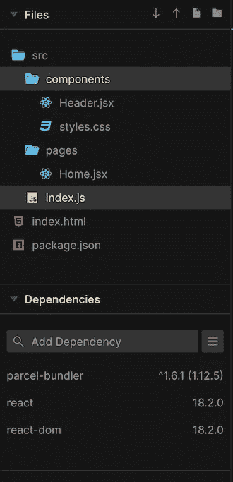

# 使用 Web 组件构建 React 应用程序

> 原文：<https://levelup.gitconnected.com/build-react-application-using-web-components-4d3ff46bc92f>

我们是否应该在应用程序中与 React.js 一起使用 Web 组件一直是有争议的。然而，将 Web 组件与 React 一起使用是很简单的。两者可以毫不费力地共存。React.js 可用于构建直观的 UI 和管理数据。Web 组件可用于创建可重用的 DOM 元素。但是， [React 社区并不推荐在 React app](https://reactjs.org/docs/web-components.html) 中使用 Web 组件制作组件。

在本文中，我们将把 Web 组件集成到 React.js 应用程序中。我们还将看到在 React.js 应用程序中集成 [Lit 元素](https://lit.dev/)的示例。


## **先决条件**:

在继续之前，您应该对 React.js 和 Web 组件有一个基本的了解。

## 1.创建基本的 React 应用程序

我们将使用[package bundler](https://parceljs.org/)在 CodeSandbox 中创建一个简单的 React 应用程序。我们将创建一个主页组件和一个标题组件。稍后，我们将迁移 Web 组件中的 Header 组件。项目目录将如下所示



头组件是非常基本的。它有菜单项。单击菜单项时，它会提示菜单项名称。

```
function Header() {
  const onLinkClick = (name) => alert(`You have clicked on "${name}"`);
  return (
    <header>
      <ul>
        <li onClick={() => onLinkClick("Home")}>Home</li>
        <li onClick={() => onLinkClick("About")}>About</li>
      </ul>
    </header>
  );
}
```

主页组件导入了标题和一个带有表格的部分。

```
import Header from "../components/Header";function HomePage() {
  return (
    <div>
      **<Header />**
      <section>
        <table>
          <thead>
            <tr>
              <th>Name</th>
              <th>Age</th>
            </tr>
          </thead>
          <tbody>
            <tr>
              <td>Deepak</td>
              <td>33</td>
            </tr>
            <tr>
              <td>Sam</td>
              <td>20</td>
            </tr>
          </tbody>
        </table>
      </section>
    </div>
  );
}
```

可以在给定的 CodeSandbox 中找到完整的代码。

## 2.将 React.js 组件迁移到 Web 组件

要将 React 组件转换为 Web 组件，首先我们需要创建 HeaderElm。HeaderElm 将扩展`HTMLElement`。在组件创建上，我们需要打开影子根，修改`shadowRoot`的`innerHTML`内容。

```
class HeaderElm extends HTMLElement {
  constructor() {
    super();
    const shadow = this.attachShadow({ mode: "open" });
    shadow.innerHTML = `
    <style>
    header {
      height: 40px;
      width: 100%;
      padding: 10px 20px;
      background-color: rebeccapurple;
      color: #fff;
    }
    header ul {
      list-style: none;
      padding: 0;
      margin: 0;
    }
    header ul li {
      display: inline;
      line-height: 40px;
      margin-right: 10px;
    }
    header ul li:hover {
      background-color: red;
      cursor: pointer;
    }
    </style>
    <header>
      <ul>
        <li >Home</li>
        <li>About</li>
      </ul>
    </header>
    `;
  }connectedCallback() {
    this.attachedListener(this.shadowRoot);
  }
  attachedListener(root) {
    for (let elm of root.querySelectorAll("ul li")) {
      elm.addEventListener("click", ({ target: { textContent } }) =>
        alert(`You have clicked on ${textContent}`)
      );
    }
  }
}
if (!customElements.get("app-header"))
  customElements.define("app-header", HeaderElm);
```

它可能看起来很冗长，因为我们必须在`innerHTML`中附加样式。然而，我们可以将 CSS 字符串迁移到一个**外部 JS** 文件，并在需要时导入它。你应该注意的另一件事是，我们需要从影子根和`addEventListener`中获取元素。由于有了 **JSX** ，在 React 组件中添加事件监听器要容易得多。

为了使用`app-header`，我们需要稍微修改一下 JSX。

```
function HomePage() {
  return (
    <div>
      **<app-header></app-header>**
      <section>
        { /* Rest of the code */ }
      </section>
    </div>
  );
}
```

可以在给定的 CodeSandbox 中找到完整的代码。

## 3.将数据从 React.js 传递到 Web 组件

您可以使用属性将数据从 React 组件传递到 Web 组件。但是，由于 HTML 的限制，您只能将字符串数据作为属性值传递。然后，您必须对字符串数据进行反序列化。

```
// HomePage.jsxfunction HomePage() {
  return (
    <div>
      <app-header **data={JSON.stringify({ name: "deepak" })}**></app-header>
      { /* Rest of the code */ }
    </div>
  );
}// Header.js
class HeaderElm extends HTMLElement {
  // Rest of the code
  connectedCallback() {
    **const data = JSON.parse(this.getAttribute("data"));
    console.log(data);**
  }  
}
```

将数据作为属性传递既乏味又容易受到攻击。另一种传递数据的方法是直接获取 web 组件并将数据分配给元素。但是，您确实需要某种更新方法来确认 Web 组件您已经更新了数据。

```
// Header.js
class HeaderElm extends HTMLElement {
  // rest of the code
  update() {
    console.log(this.userdata);
  }
}// HomePage.jsxfunction HomePage() {
  **const hederRef = useRef(null);** **useEffect(() => {
    hederRef.current.userdata = { name: "deepak" };
    hederRef.current.update();
  }, []);**return (
    <div>
      <app-header
        **ref={hederRef}**
        data={JSON.stringify({ name: "deepak" })}
      ></app-header>

    </div>
  );
}
```

*还有另外一种方法，使用* [*自定义事件*](https://developer.mozilla.org/en-US/docs/Web/Events/Creating_and_triggering_events) *。您可以在 Web 组件中添加一个事件侦听器，并从 React App 向 Web 组件分派事件。我将把实现留给您来尝试。*

N **注:**如果你想学习更多关于 web 组件和围绕它们的设计模式的知识。请参考我之前的文章[build-react-like-we b-components-in-plain-JavaScript](https://javascript.plainenglish.io/build-react-like-web-components-in-plain-javascript-b9921dcf6df0)。它将指导您通过不同的设计模式来传递数据，就像 React.js 组件一样。

可以在给定的 CodeSandbox 中找到更新的代码。

## 结论

如您所见，在 React.js 应用程序中使用 Web 组件并不困难。但是，它会增加应用程序的复杂性，并且复杂性会随着应用程序的增加而增加。所以，我不建议你把 React.js 和 Web 组件混合使用。除非你想创建一个独立的跨框架 Webb 组件库。

## 参考

1.  [https://reactjs.org/tutorial/tutorial.html](https://reactjs.org/tutorial/tutorial.html)
2.  [https://reactjs.org/docs/hooks-reference.html](https://reactjs.org/docs/hooks-reference.html)
3.  [https://reactjs.org/docs/web-components.html](https://reactjs.org/docs/web-components.html)
4.  [https://JavaScript . plain English . io/build-react-like-we b-components-in-plain-JavaScript-b 9921 DCF 6 df 0](https://javascript.plainenglish.io/build-react-like-web-components-in-plain-javascript-b9921dcf6df0)
5.  [https://developer . Mozilla . org/en-US/docs/Web/Events/Creating _ and _ trigging _ Events](https://developer.mozilla.org/en-US/docs/Web/Events/Creating_and_triggering_events)

# 分级编码

感谢您成为我们社区的一员！在你离开之前:

*   👏为故事鼓掌，跟着作者走👉
*   📰查看[升级编码出版物](https://levelup.gitconnected.com/?utm_source=pub&utm_medium=post)中的更多内容
*   🔔关注我们:[Twitter](https://twitter.com/gitconnected)|[LinkedIn](https://www.linkedin.com/company/gitconnected)|[时事通讯](https://newsletter.levelup.dev)

🚀👉 [**将像你这样的开发人员安置在顶级创业公司和科技公司**](https://jobs.levelup.dev/talent/welcome?referral=true)