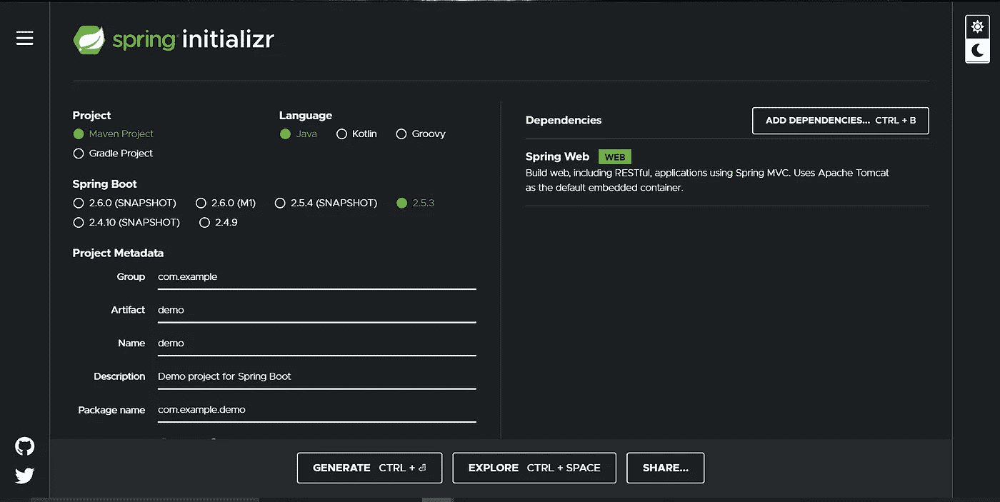
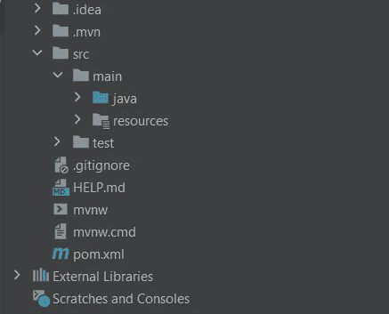
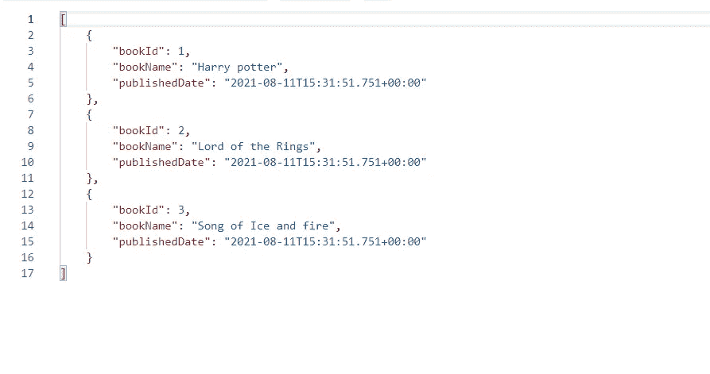
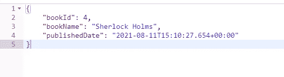
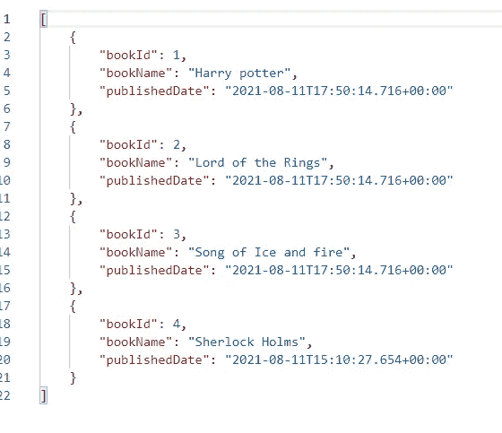

# 使用 Spring 构建简单的 REST 服务

> 原文：<https://levelup.gitconnected.com/build-simple-rest-services-using-spring-ac3564a3ed32>

因为 REST 易于创建和使用，所以它很快成为在互联网上建立 web 服务的事实上的标准。关于 REST 如何融入微服务的世界，还有很多要说的，但是就本文的目的而言，让我们简单地关注于创建 RESTful 服务。


道格拉斯·洛佩斯在 [Unsplash](https://unsplash.com/s/photos/api?utm_source=unsplash&utm_medium=referral&utm_content=creditCopyText) 拍摄的照片

## 为什么要休息？

REST 涵盖了 web 的所有方面，包括它的架构、特性和好处。这并不奇怪，因为这本书的作者 Roy Fielding 至少参与了十几个与 web 相关的规范。

作为 REST 的一个好处，web 及其基本协议 HTTP 提供了一系列功能:

1.  合适的操作，如获取、发布、上传、删除等
2.  贮藏
3.  重定向和转发
4.  加密和认证

这些都是构建弹性服务的重要方面。然而，这还不是全部。因为 web 是由许多小的规范组成的，所以它能够扩展而不会陷入“标准战争”的泥潭。

开发人员可以使用第三方工具包来实现这些不同的规范，使他们能够快速访问客户端和服务器技术。

在 HTTPS 之上开发 REST APIs 时，可以实现以下特性:

*   向后兼容的 API
*   API 是可以进化的
*   可扩展且安全的服务
*   一系列无状态到有状态的服务

## 让我们开始编码

在本文中，我将创建一个简单的应用程序来获取和发布书店的详细信息。为了存储图书的详细信息，我使用了一个列表。记住，这篇文章是基于我第一次亲身体验的春装。让我们开始吃吧。

要开始这个项目，你需要使用 [Spring initializer](https://start.spring.io/) 添加依赖项。用户界面很容易被用户理解。



弹簧初始化器

你需要做的是，选择项目和语言。你可以根据你的知识和经验来选择。但是在这里，我选择 Maven 和 java。以及 Spring web 作为添加的依赖项。

创建完上述需求后，就可以生成初始代码并下载了。

一旦你下载并解压文件夹，你就可以开始了。您可以选择任何 IDE 来运行您的应用程序。我更喜欢用 IntelliJ IDE 来导入项目。当您打开项目时，您可以看到这样的文档结构。



首先，你需要做的是，转到 *src/main/java/* 里面，你可以得到 *DemoApplication* java 文件。运行这个文件，检查是否一切正常。

现在，我们需要为我们的应用程序创建逻辑。因此，在我的场景中，我将图书的详细信息存储在一个列表中。每本书都有唯一的 Id、名称和日期。我创建了 Book.java 类，它有构造函数和相关变量。

现在我们继续为这个应用程序创建 BookService。

```
The **@Component** annotation in Spring is used to indicate that a class is a component. When annotation-based configuration and classpath scanning are utilized, Spring framework will autodetect these classes for dependency injection.
```

列表<books>包含了添加到书店的所有书籍的详细信息。我们可以用数据库代替列表。但在这里我继续列举。</books>

*findAllBooks()* 方法被定义为获取所有的图书细节。 *addBook()* 方法是向商店添加一本新书，而 *searchBook()* 方法是使用图书 Id 搜索相关图书。让我们为应用程序创建最重要的服务文件。

spring***@ rest controller***注释用于一个类，将其标记为请求句柄。而且是用 ***@Controller*** 和 ***@ResponseBody 标注的方便注释。***

要用 Spring MVC 构建 RESTful web 服务，请使用 RestController 注释。请求数据到已定义的请求处理程序方法的映射由 Spring RestController 处理。创建响应体后，handler 方法将响应体转换为 JSON 或 XML。

【RestController 与控制器的区别

```
@RestController is the combination of @Controller and @ResponseBody. @RestController **returns an object as a response instead of a view**. @Controller returns View.@Controller
public class Book{

  @RequestMapping(value={"/uri"})
  @ResponseBody
  public ObjectResponse functionRestName(){
      //logic
      return instance
   }
}
```

在 RestController 中，默认情况下,@ResponseBody 是打开的。没有必要将它包含在函数签名之上。

```
@RestController
public class Book{

  @RequestMapping(value={"/uri"})
  public ObjectResponse functionRestName(){
      //...
      return instance
   }
}
```

**获取地图**

```
Annotation for assigning specific handler methods to HTTP GET requests. @RequestMapping(method = RequestMethod. GET) is a constructed annotation that functions as a shorthand for **@GetMapping(method = RequestMethod. GET).**
```

**邮戳**

```
**@RequestMapping(method = RequestMethod. POST)** is a constructed annotation that functions as a shortcut for @PostMapping. Annotated methods with the @PostMapping annotation handle HTTP POST requests that match a particular URI expression.
```

在 PostMapping 中，我已经单独定义了 book 对象来访问 URI。下面的代码片段显示了定义特定 Url 的方法，该 URL 可以将图书 id 分配给 URL。

```
@PostMapping("/books") //Add data
public ResponseEntity<Object> createBook(@RequestBody Book book){

    Book saveBook = bookService.addBook(book);
    URI newBookLocation = ServletUriComponentsBuilder.*fromCurrentRequest*()
            .path("/{bookId}")
            .buildAndExpand(saveBook.getBookId())
            .toUri();

    return ResponseEntity.*created*(newBookLocation).build();
}
```

毕竟是做了，你需要在***localhost:8080***端口上运行程序看输出。



get 请求的返回详细信息

让我们使用 postmen 中的 POST 方法添加另一个图书数据，并检查输出。



新添加的图书数据。



更新的书目

你可以在这个[链接](https://github.com/RaviduShehan/Simple-REST-service-using-Springboot)获得完整的项目。这是一个在 Springboot 中开发 REST 服务的基本示例。所以希望你能学到新东西。

编码快乐！！！