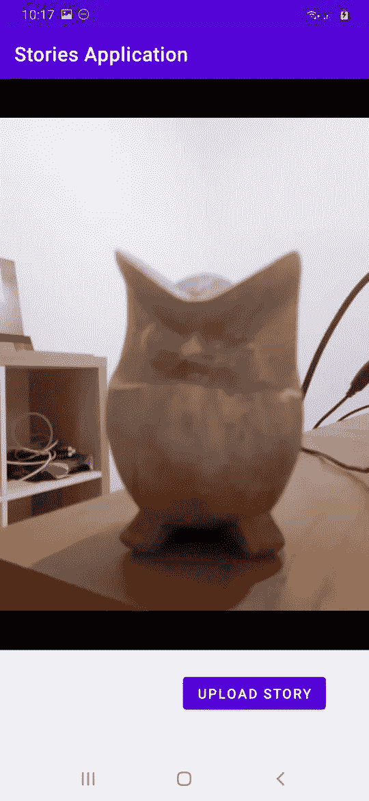

# 使用 Android 和 Python 构建社交媒体风格的故事

> 原文：<https://levelup.gitconnected.com/build-social-media-style-stories-with-android-and-python-aeaed2a22f9c>

Instagram 有一个受欢迎的功能，叫做 Stories，灵感主要来自 Snapchat。故事使用户能够创建一个视频或静态图片，它们将在很短的时间内(24 小时)消失。后来，其他社交媒体平台也开发了这一功能，如 Linkedin 和 Twitter。

在本教程中，我们将使用 Vonage 的视频 API 为 Android 构建这一功能，我们还需要一个服务器来处理客户端的会话和令牌，这将使用 Python 来构建。

# 先决条件

*   [Python 3](https://www.python.org/download/releases/3.0/)
*   [姜戈 3](https://www.djangoproject.com/)
*   [Android Studio 4](https://developer.android.com/studio)
*   Android 设备(可选)
*   [Ngrok](https://learn.vonage.com/blog/2017/07/04/local-development-nexmo-ngrok-tunnel-dr/) (可选)

# 构建服务器

首先，我们将构建一个我们的移动应用程序可以与之通信的服务器。这个服务器将使用 [Django](https://www.djangoproject.com/) ，一个 Python web 框架。

## 安装依赖项

首先，通过运行以下两个命令创建一个 Python 虚拟环境:

然后，我们可以为后端服务器安装依赖项:

上面的命令将安装 Django，并打开 Vonage 视频 Python SDK。

## 创建项目和应用程序

通过运行以下命令初始化 Django 项目:

在开始编写代码之前，我们需要在 Django 项目中创建至少一个应用程序。一个 Django 项目可以包含许多应用程序。例如，项目 A 可以是一个故事应用程序，而项目 B 可以是一个消息应用程序或电子商务应用程序。首先，将当前目录更改为项目目录，然后用下面显示的两个命令初始化一个新的应用程序:

您不必执行下一个命令，因为在本教程中我们不会使用数据库。但是，除非我们执行迁移命令，否则警告将持续存在，因此运行以下命令来停止这些警告。

为了确保我们的 Django web 应用程序能够工作，您可以运行 webserver 脚本。

您可以使用端口 8000 访问本地主机上的 web 应用程序。在您的浏览器中，它将看起来像`http://localhost:8000`。如果你访问这个网址，你会收到一条成功的信息和一张火箭的图片。

## 环境变量

我们的代码将需要使用您的 Vonage Video(也称为 OpenTok) API 密钥和秘密，它们永远不应该硬编码到您的应用程序中。为了提高应用程序的安全性，可以使用环境变量。在您的终端中，您可以设置这两个值，如下例所示。确保用您的值替换`xxxxxx`。您可以在 [Vonage 视频 API 文档](https://www.vonage.id/communications-apis/video/)中获得 API 密钥和 API 秘密的这些值。

## 创建视图

视图是在 Django 应用程序中呈现的模板。打开`storiesserver/storiesapp/views.py`文件，并用以下内容替换其内容:

这段代码的第一部分创建了一个 OpenTok 实例，它将使用我们为 API key 和 API secret 预先设置的环境变量。

然后我们有两个全局变量，`videos`和`index`。它们就像内存中的迷你数据库，保存着我们的故事(或视频)信息。

在第一种方法中，我们用`get_token`方法生成会话和令牌。为了创建一个会话，我们使用 OpenTok 实例中的`create_session`方法。它接受两个参数:媒体模式和归档模式。我们将`MediaModes.routed`值用于媒体模式，因为我们将视频作为故事发布，而不是用于视频聊天。`MediaModes.routed`表示我们将视频发送到服务器，而不是另一个客户端。我们将`ArchiveModes.manual`值用于存档模式，因为我们想要手动存档(记录)视频，以便获得存档 id。当我们想要获取录制视频时，这个 id 很重要。如果没有，我们必须从存档列表中迭代它，这是不方便的。为了生成令牌，我们使用会话实例中的`generate_token`方法。我们将过期时间值作为参数传递给这个方法。最后，我们将会话、令牌和 API 密钥发送给客户端。

在第二种方法中，即`video_stream`方法，我们从存档 id 中获取视频 URL。如果您注意到，这个方法除了通常的参数之外还有一个额外的参数，`request`。我们如何获得存档 id 是在另一个方法中完成的。

第三种方法是`videos_list`方法，我们将视频列表发送给客户端。基本上就是我们用 JSON 包装的`videos`变量。

第四种方法是`video_start_archive`方法，我们将视频存档。这个方法有一个额外的参数`session_id`。我们使用 OpenTok 实例中的`start_archive`方法。它接受 OpenTok 会话。执行此方法后，我们的视频会话将被记录。`start_archive`方法返回存档 id。我们将它存储到`videos`变量中。除了存档 id，我们还为这个视频生成了一个好听的名字，比如“故事 1”、“故事 2”等等。

最后一个方法是`homepage`方法，只是为了测试 Django web 应用程序是否可以访问。

## 创建 URL 映射

然后我们需要创建一个从 URL 到这些视图方法的映射。创建`storiesserver/storiesapp/urls.py`文件，并将以下示例复制到该文件中:

`path`方法接受三个参数:

URL 路径要访问的方法路由的名称，以供参考。

例如，第二个路径将视图中的`token` URL 映射到`get_token`方法。

在 Django 应用程序的服务器端，我们需要修改`urls.py`文件以映射到 stories URLs，因此定位文件:`storiesserver/storiesserver/urls.py`并用以下内容替换该文件的内容:

## Ngrok

为了在开发过程中向互联网和我们的 Android 设备公开 Django 应用程序，我们将使用 Ngrok。连接您的帐户后，我们可以启动一个 HTTP 隧道，将它转发到我们的 Django web 应用程序端口 8000:

创建隧道后，您将看到类似于`https://xxxxxxxx.ngrok.io`的公共 URL。然后您需要修改`storiesserver/storiesserver/settings.py`文件，将`"xxxxxxxx.ngrok.io"`、`"10.0.2.2"`和`"localhost"`字符串添加到`ALLOWED_HOSTS`变量中。`10.0.2.2`地址是 Android 模拟器访问你电脑中本地主机的方式。

修改后，您的`ALLOWED_HOSTS`变量应该是这样的:

然后要访问`token` URL，您应该访问这个 URL: `[https://xxxxxxxx.ngrok.io/stories/token](https://xxxxxxxx.ngrok.io/stories/token.)` [。](https://xxxxxxxx.ngrok.io/stories/token.)

至此，您已经构建了服务器组件，该组件可以生成令牌、归档视频记录并提供视频记录 URL。接下来，您将构建一个 Android 应用程序，作为这个服务器应用程序的客户端。使用这个移动应用程序，您可以录制视频并观看视频录制内容。

# 客户端

启动 Android Studio，创建一个新项目，选择“空活动”作为项目模板。最低 SDK 选择“API 16: Android 4.1(果冻豆)”语言选择“Kotlin”。

# 属国

在 Android Studio 中构建项目的第一件事是添加任何需要的依赖项。打开项目级的`build.gradle`，在位于`allprojects`区块内的`repositories`区块内添加以下行。然后同步文件。

你要做的第二件事是在文件上添加依赖项，这个文件有相同的名字`build.gradle`，但是在应用级(或者模块级)。将这些线添加到`dependencies`模块中。不要忘记同步文件。

该项目使用了五个额外的库，它们是:

Vonage Video SDK (OpenTok) OkHttp 库向我们的后端服务器发送请求，Gson 库解析 JSON 响应，EasyPermissions 库在我们的 Android 应用程序请求使用摄像头和麦克风的权限时处理权限，Coroutines 库方便地处理非阻塞和阻塞代码。

## 网络安全配置

这一步是可选的。如果您想用模拟器测试应用程序，而不想使用 Ngrok，那么您需要创建一个网络配置文件。在`res`目录中创建`xml`目录，然后在`xml`目录中创建一个名为`network_security_config.xml`的新文件。将以下内容复制到其中:

这意味着您可以在没有后端 URL HTTPS 协议的情况下开发应用程序。

## Android 清单

要激活该网络配置，打开`AndroidManifest.xml`文件，将以下属性添加到`application`节点:

然后在`manifest`节点中添加以下内容。

我们需要这两个附加物，因为我们想把我们的移动应用程序连接到我们的后端服务器。

当我们在这个文件中时，让我们创建对稍后将创建的另外两个活动的引用。在唯一的`activity`节点后添加这几行。

## 布局

我们有三个活动，但我们需要为这些活动创建 3 个布局。我们还需要为 MainActivity 中使用的 RecyclerView 中的行布局创建一个额外的布局。

首先，通过在`app/src/main/res/layout`目录下创建一个名为`row.xml`的新文件来创建行布局。将以下 XML 复制到这个新文件中:

上面定义了一个按钮的创建，该按钮将用于启动一个观看故事或视频的活动。

接下来，我们需要创建一个布局来显示视频。在布局目录中创建一个名为`activity_viewing_story.xml`的新文件，并将以下 XML 添加到该文件中:

该布局包含一个将呈现视频的`WebView`。

接下来，我们必须创建`activity_creating_story.xml`文件。这是本活动用来创建视频的布局。删除文件内容，并向其中添加以下代码:

Video SDK 使用 ID 为`publisher`的 FrameLayout 来显示发送到视频服务器的视频。本活动中按钮的作用是停止录像并结束活动。

最后，我们需要编辑`activity_main.xml`文件。这个文件包含 MainActivity 使用的布局，它将列出已经创建的所有故事(视频)。该文件还将包含一个按钮，用于启动创建视频的活动。用以下 XML 替换该文件的内容:

## 添加服务器 URL

让我们在`strings.xml`文件中定义服务器 URL，该文件可以在`values`目录中找到。为此，请将以下内容添加到您的`resources`节点中:

如果您正在使用 Ngrok，请将其更改为以下示例(确保用您的 ngrok URL 替换`xxxxx`):

## 课程和活动

首先，我们需要为 RecyclerView 创建必要的类。RecyclerView 需要一个适配器和一个容器。通过在`package`目录中创建名为`StoryViewHolder.kt`的文件来创建一个持有者文件。这个包类似于位于`java`目录中的`com.example.storiesapplication`。将以下代码复制到这个新文件中:

对于您创建的每个类或活动文件，如果您的包不同，请确保将`com.example.storiesapplication`包更改为您的包。

这是一个标准的 holder 类，可以用一个字符串参数设置按钮的文本，并为按钮设置一个回调。

创建 holder 类后，我们需要一个 adapter 类。适配器是数据和 RecyclerView 视图之间的桥梁。在`java/package/`目录下创建一个名为`StoryAdapter.kt`文件的新文件，并在该文件中添加以下代码:

`onCreateViewHolder`方法扩展了`row`布局并创建了 holder 类的一个实例。`onBindViewHolder`方法将数据设置到 RecyclerView 的特定行，而`getItemCount`方法返回存储的项目数。

现在是时候在 MainActivity 中创建 RecyclerView 了。修改`MainActivity.kt`文件，将内容替换为以下内容:

`onCreate`方法向该活动中的浮动按钮添加了一个回调，该回调将调用`getToken`方法来获取令牌、会话和 API 密钥，然后将它们传递给`CreatingStoryActivity`活动。RecyclerView 还加载视频列表，对于每一行，我们添加一个回调来调用`ViewingStoryActivity`活动。

在上面的`onCreate`方法中，我们请求摄像机、互联网和音频录制的权限。如果我们有权限，我们将使用令牌、会话和 API 密钥创建一个会话对象。我们还必须为这个会话对象设置监听器。我们还在这个活动中设置了一个对按钮的回调。该按钮将发送一个停止存档视频的请求。

我们有许多会话监听器所需的方法。最重要的一个是`onConnected`方法，如果我们的会话已经连接到 OpenTok 服务器，就会调用这个方法。

我们创建一个 publisher 对象，并将 FrameLayout 设置为 publisher 的视图。我们还必须将我们的会话对象连接到这个 publisher 对象。然后，我们创建一个请求对象来开始归档视频。

首先，我们通过向 Django 应用程序发送请求，从存档 id 中获取视频 URL。然后，我们在 WebView 中加载 URL。

## 启动应用程序

启动应用程序。如果您想使用 Android 设备，记得使用 Ngrok 或在云上部署 Django 应用程序。起初，你会看到一个空屏幕和一个浮动按钮。

按下浮动按钮，设备会将视频从您的相机传输到 OpenTok 服务器。当你为你的故事录制好足够的内容后，按下屏幕上的“上传故事”按钮。

你将被重定向回主屏幕，现在显示你的故事列表。

如果您按下故事行，您将被重定向到查看故事屏幕。您可以观看之前录制的视频。

# 结论

这个应用程序远非完美。如果您注意到，录制的视频比录制会话短。这是因为发送视频存档请求需要时间。最重要的是，我们的故事列表是一个简单的循环视图。你可以把它们转换成水平卷轴。每个故事都被包裹成一个圆形，就像 Instagram Stories 的样子！我们也没有认证和授权。这个故事没有主人。这个视频在 OpenTok 服务器上存储了一段时间。之后，该视频将被删除。在此之前，您可以选择将视频保存到其他地方。

# 资源

*   点击查看我们的 Vonage 视频 Api [文档](https://www.vonage.id/communications-apis/video/)
*   这篇博文的代码在 [GitHub](https://github.com/arjunaskykok/android-stories/) 上

*最初发布于*[*https://learn . vonage . com/blog/2021/03/23/build-social-media-style-stories-with-Android-and-python/*](https://learn.vonage.com/blog/2021/03/23/build-social-media-style-stories-with-android-and-python/)