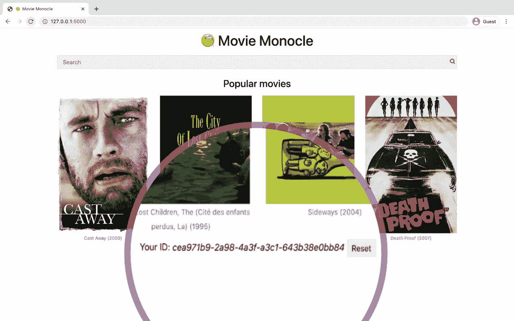

# 在你的网站上建立社交网络

> 原文：<https://levelup.gitconnected.com/build-social-network-on-top-of-your-website-b6e16bc4cc07>

## 如何向现有 web 应用程序添加社交功能

*(图片作者。所有标识和海报属于其各自的所有者，用于信息或编辑目的，以识别特定的产品和服务。)*

社交媒体应用已经占据了我们生活和应用市场的很大一部分，并且其数量还在继续增长。最近的热门话题是会所及其语音聊天功能。社交网络巨头已经在模仿他们了。

这是这个行业常见的模式。一个替代者出现了，用一些新的东西作为讨价还价的筹码，然后脸书和 Twitter 复制这些新功能。在这种情况下，他们利用他们的用户群，不必浪费资源在无利可图的事情上。

但是硬币还有另一面。你也有机会成为繁荣市场的一部分。通过使用提醒经典社交媒体功能(赞、订阅源)的功能，你可以改善用户体验，并减少在了解新应用和网站时的认知开销。

在上一篇文章中，我们创建了一个电影搜索引擎页面，[向其中添加了内容推荐](/how-to-add-content-recommendations-to-a-website-be107c336117)。由于我们使用了一个预先制作的带有用户电影评级的数据集，所以推荐是静态的。

在这一部分中，我将向您展示如何为您的站点注入一些活力，并给予用户共同创建站点的能力。使用[无管道](https://pipeless.io/)，我们将为每个视频添加喜欢/不喜欢按钮和一个简单的活动提要。

[🔔想要更多这样的文章？在这里签名。](https://fischerbach.medium.com/membership)

原始项目的所有变更都可以在存储库中找到，分支`social`:

 [## 财政预算/电影

### 在 GitHub 上创建一个帐户，为 fischerbach/moviemonocle 的发展做出贡献。

github.com](https://github.com/fischerbach/moviemonocle/tree/social) 

# 用户识别

让我们从识别用户开始。因为我们的目标是为用户量身定制推荐，并使他们能够以一种无压力的方式与社区的其余部分进行交互。

*UUID 是唯一标识符的一种流行格式。如果您在浏览器中浏览 cookie，您肯定会发现许多这种格式的 cookie ids。(图片来自* [*关于饼干替代品的文章*](https://medium.datadriveninvestor.com/alternatives-to-third-party-cookies-in-2020-857609f8f2bb) *)*

因此，我们将为每个新访问者分配一个随机 ID，并将其存储在 cookie 中，而不是用电子邮件地址进行传统的注册。

请注意，这种自动微注册是经典登录系统的一种有趣的替代方式，然后可以很容易地扩展到添加电子邮件。但是，虽然使用 UUID 可以最大限度地降低猜测 cookie id 和假冒用户的风险，但在涉及任何更重要的个人信息时，最好不要使用它。

我们还将允许用户使用按钮重置它。

# 我👍这🎞️

既然用户已经在网站中获得了一些身份，现在让他们表达对视频的看法。与前一篇文章类似，用户与视频的交互将通过喜欢和不喜欢来表达。

要做到这一点，我们需要考虑两个因素:

*   用户界面—每部电影页面上的按钮，
*   在数据库中发送和存储电影分级。

关键要素是将数据发送到无管道。因此，我们不仅要向无管道 API 客户端添加一个新方法，我们在服务器端使用它，而且还要创建每个简单前端客户端。

主要修改:

由于本教程关注的是社交功能和交互流程的问题，我跳过了大多数典型的 web 开发人员的工作。所有的更改都可以在文章所附的存储库中预览。

事件在无管道仪表板中可见。

> 旁注。你可能已经注意到按钮在网站刷新之间不会保持它们的状态。根据您特定站点的架构，您可以通过为数据库收集评级或使用内置于无管道的[解决方案来解决这个问题。如果我要重构 Movie Monocle，我会选择后者，以避免应用层之间的冗余。](https://docs.pipeless.io/reference/general#get-relationship-exists)

# 酷，但这是为了什么？

第一个收获是让推荐引擎更加优秀。请记住，电影《单片眼镜》的第一版只对一系列封闭的电影进行了少量的评级。例如，如果我们想将今年的版本添加到数据库中，它们不会出现在推荐中。但是，由于喜欢/不喜欢的系统，渐渐地，如果他们获得观众，迟早引擎会“赶上”。

我们可以通过引入活动源使网站更加生动。

# 最近的活动

通过 Pipeless，我们可以获得与特定对象(帐户、产品、标签、帖子、视频等)相关的最近活动。).指定对象后，算法会提取该对象上最近的用户操作。在我们的例子中，它类似于:“获取用户对这部电影的最新喜好”。

像往常一样，我们将首先用新特性更新 Python 客户端库:

我们的后端也是如此:

对于电影，我们只需要下载入站事件。如果我们正在创建一个用户提要，我们可能会对双向交互感兴趣。

让我们看看这是否可行:

现在我们已经有了需要的数据，让我们向视频详细信息页面添加一个活动框。

电影单片眼镜 2.0 在网上提供，所以你喜欢你最喜欢的电影，并检查其他用户的意见。

> [MOVIEMONOCLE2.HEROKUAPP.COM](https://moviemonocle2.herokuapp.com/details/0032910)

# 外卖食品

如你所见，使用 Pipeless 向现有网站添加基本的社交媒体功能并不需要太多努力。我承认代码已经变得相当混乱。在如此混乱的环境中实现 Web 2.0 解决方案是一项非常危险的任务。计划的功能无缝工作的事实证明，分离与推荐和社交活动相关的层(在这个特定的例子中，我们使用了无管道)是有意义的。在实际应用中，我建议重新考虑架构，以便通过数据模型中的单点联系来完成与无管道的集成。

# 参考

 [## 内容推荐:如何给网站添加个性化建议

### 向用户展示他们想要的东西(即使他们甚至不知道他们想要什么)

levelup.gitconnected.com](/how-to-add-content-recommendations-to-a-website-be107c336117)  [## 无管的

### 使用简单的 API 提供实时个性化推荐和活动源

无管道 io](https://pipeless.io/)