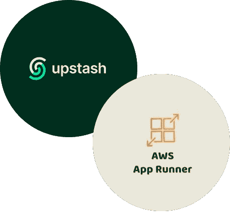
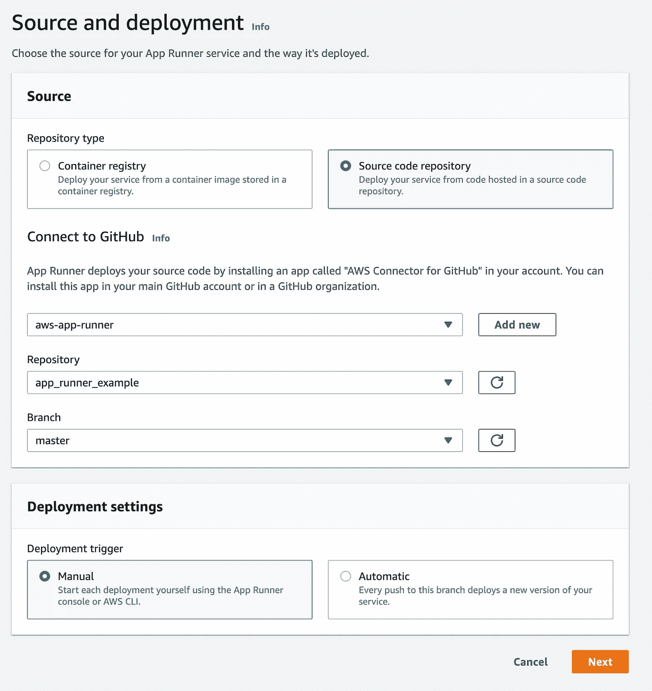
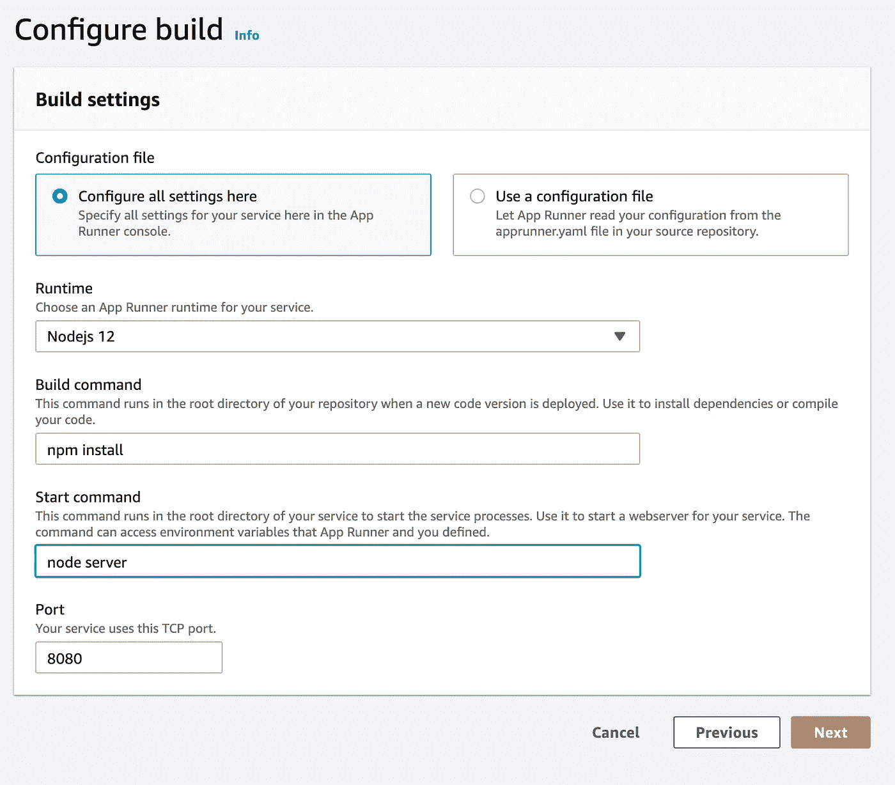
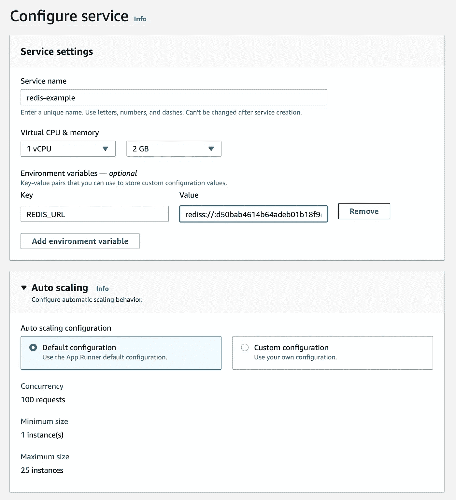

# 使用 AWS App Runner 和无服务器 Redis 构建有状态应用程序

> 原文：<https://levelup.gitconnected.com/build-stateful-applications-with-aws-app-runner-and-serverless-redis-92a29c300136>



AWS App Runner 是一个容器服务，其中 AWS 以无服务器的方式运行和扩展您的容器。容器存储是短暂的，因此您应该将状态保存在外部数据存储中。在本教程中，我们将构建一个简单的应用程序，它将在 Redis 上保持状态，并将应用程序部署到 AWS App Runner。

# 堆栈

*   无服务器计算:AWS 应用程序运行程序(Node.js)
*   无服务器数据存储:通过 Upstash 的 Redis
*   部署来源:github repo

# 项目设置

为您的项目创建一个目录:

```
mkdir app_runner_examplecd app_runner_example
```

创建节点项目并安装依赖项:

```
npm initnpm install ioredis
```

从[的上游](https://console.upstash.com)创建一个 Redis 数据库。在“数据库详细信息”页面中，复制连接代码(“节点”选项卡)。

# 代码

在节点项目文件夹中，创建 server.js 并复制以下代码:

```
var Redis = require("ioredis");
const http = require('http');if (typeof client === 'undefined') {
    var client = new Redis(process.env.REDIS_URL);
}const requestListener = async function (req, res) {
    if (req.url !== '/favicon.ico') {
        let count = await client.incr("counter");
        res.writeHead(200);
        res.end('Page view:' + count);
    }
}const server = http.createServer(requestListener);
server.listen(8080);
```

正如您所看到的，代码简单地在 Redis 上增加了一个计数器，并将响应作为页面视图计数返回。

# 部署

您有两种选择来将您的代码部署到 App Runner。您可以与 AWS 共享您的 Github repo，也可以将您的 docker 映像注册到 ECR。在本教程中，我们将与 App Runner 分享[我们的 Github repo](https://github.com/upstash/app_runner_example) 。

为您的项目创建一个 github repo 并推送您的代码。在 AWS 控制台中，打开 App Runner 服务。点击`Create Service`按钮。选择`Source code repository`选项，通过连接您的 Github 和 AWS 帐户添加您的存储库。



在下一页中，选择`Nodejs 12`作为运行时，`npm install`作为构建命令，`node server`作为启动命令，`8080`作为端口。



下一页配置您的 App Runner 服务。为您的服务设置一个名称。将您从 Upstash 控制台复制的 Redis URL 设置为`REDIS_URL`环境变量。您的 Redis URL 应该是这样的:`rediss://:d34baef614b6fsdeb01b25@us1-lasting-panther-33618.upstash.io:33618`您可以将其他设置保留为默认设置。



点击下一页的`Create and Deploy`。你的服务将在几分钟内准备好。点击默认域，您应该看到带有查看计数器的页面，如[这里的](https://xmzuanrpf3.us-east-1.awsapprunner.com/)。

# App Runner vs AWS Lambda

*   AWS Lambda 运行函数，App Runner 运行应用。因此，有了 App Runner，你就不需要把你的应用程序分成不同的功能。
*   App Runner 是一个更便携的解决方案。您可以将应用程序从 App Runner 移动到任何其他容器服务。
*   AWS Lambda 价格降至零，而 App Runner 的价格则没有。使用 App Runner，您需要为至少一个实例付费，除非您暂停系统。

当你需要更多的控制你的无服务器运行时和应用程序时，App Runner 是一个很好的选择。查看此视频了解更多关于 App Runner 的信息。

*最初发表于*[T5【https://docs.upstash.com】](https://docs.upstash.com/tutorials/aws_app_runner_with_redis)*。*