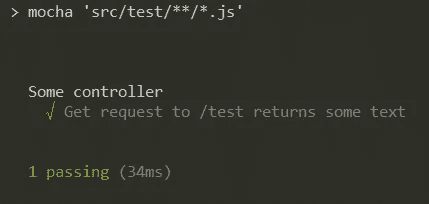
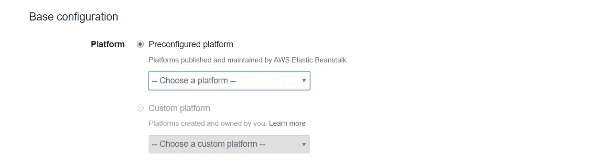

# 使用 CodeCommit、CodePipeline、CodeBuild 和 Elastic Beanstalk 构建、测试和部署 Node.js 应用程序

> 原文：<https://levelup.gitconnected.com/build-test-deploy-node-js-app-with-codecommit-codepipeline-codebuild-elastic-beanstalk-c6d89f971ef2>


# 我们的仓库

我将使用 [AWS CodeCommit](https://aws.amazon.com/codecommit/) 作为该项目的源代码库，以及我们的管道将用来构建和部署我们的应用程序的源代码。CodeCommit 存储库是私有的，因此只能由 IAM 策略和组中设置的用户访问。然而，源代码也可以在[的公共 GitHub 库](https://github.com/LukeMwila/elastic-beanstalk-node-api)中获得。

如果你喜欢这篇文章，请在这里给我买杯咖啡[☕️](https://www.buymeacoffee.com/lukemwila)😃。

这些是我们将要遵循的简单步骤:

步骤 1:创建存储库

步骤 2:为 IAM 帐户上的 CodeCommit 生成 Git 凭证

步骤 3:克隆我们创建的回购协议

## 第一步

使用 IAM 登录到 AWS 控制台，然后转到 CodeCommit。记住，根据你所在的地区，检查你是否在适当的地区创建了回购。接下来的步骤非常简单，所以您可以直接完成呈现给您的表单。

我将我的存储库命名为**简单节点应用**。


在 AWS 代码提交中创建了存储库

## 第二步

一旦您创建了 repo，您应该能够在 CodeCommit 上的 repositories 下面看到它。但是，您还不能克隆它(除非您已经获得了 IAM 帐户的 Git 凭证)。接下来，转到 IAM，创建或选择您希望向其提供凭据的用户。在选定的用户上，单击“安全凭证”选项卡，滚动到标题为“**AWS 代码提交的 HTTPS Git 凭证**”的部分。

点击**生成凭证**并将凭证保存在安全的地方🔒。

## 第三步

获得 IAM 用户的 Git 凭证后，返回 CodeCommit 并单击您几分钟前创建的存储库。在那里，使用 CLI 将 repo 克隆到您机器上的本地目录中。然后会提示您输入用户名和密码，请确保使用为您选择的 IAM 用户生成的 Git 凭据，而不是您的 AWS 控制台凭据。

这应该会成功地将**简单节点应用**库克隆到您的机器上。

# 我们的应用


节点。射流研究…

好了，现在是时候进入代码区了💻。我们不会开发任何新奇的东西，因为这不是这篇文章的主要目的。

## 项目结构和依赖关系

在我们的**简单节点应用**的目录中，让我们创建一个基本的 Express API 应用程序，它有一个我们将为其编写测试的单一路径。使用以下初始化命令开始该过程:

```
$ npm init -y
```

一旦我们的 **package.json** 文件被创建，我们就可以安装一些依赖项了。

```
$ npm i --save express cors body-parser$ npm i -D chai mocha supertest
```

您还需要在本地计算机上全局安装 mocha:

```
$ npm i -g mocha 
```

在应用程序文件夹/目录中，您可以使用`mkdir`命令或您的 IDE 创建一个 **src** 目录。应用程序的文件夹结构(在 **src** 中)如下所示(您可以随意使用):

```
├── test/index.js
├── app.js
└── index.js
```

## 测试脚本

让我们把注意力转向初始化命令生成的 **package.json** 文件。我们将添加一个脚本，该脚本在运行时将检查`src/test`目录中的文件并运行任何测试。正如您从上面的安装中可能已经猜到的，我们将使用 [Mocha](https://mochajs.org/) 作为我们的测试框架，使用 [Chai](https://www.chaijs.com/) 作为我们的断言库，使用 [SuperTest](https://www.npmjs.com/package/supertest) 作为 HTTP 断言。添加以下脚本:

```
"test": "mocha 'src/test/**/*.js'"
```

## 试验

在`src/test`文件夹的 **index.js** 文件中，我们可以添加以下内容来测试我们将要创建的路由的响应、状态代码、响应格式和消息。

```
const { expect } = require('chai');
const { agent } = require('supertest');
const app = require('../app');const request = agent;describe('Some controller', () => {
  it('Get request to /test returns some text', async () => {
    const res = await request(app).get('/test');
    const textResponse = res.body;
    expect(res.status).to.equal(200);
    expect(textResponse.text).to.be.a('string');
    expect(textResponse.text).to.equal('Simple Node App Working!');
  });
});
```

**快递 API**

接下来，让我们初始化并配置我们的 Express API 服务器，并向它添加一个`/test`路由。

**app.js**

```
// Express App Setup
const express = require('express');
const http = require('http');
const bodyParser = require('body-parser');
const cors = require('cors');// Initialization
const app = express();
app.use(cors());
app.use(bodyParser.json());// Express route handlers
app.get('/test', (req, res) => {
  res.status(200).send({ text: 'Simple Node App Working!' });
});module.exports = app;
```

**index.js**

```
const http = require('http');
const app = require('./app');// Server
const port = process.env.PORT || 3001;
const server = http.createServer(app);
server.listen(port, () => console.log(`Server running on port ${port}`));
```

这就是我们的应用程序代码😃，现在让我们继续运行我们的测试，并确保它按预期通过。

```
$ npm run test
```



试验结果

看起来我们在做生意了👍。在提交和推送这些本地更改之前，让我们创建一个应用程序环境并设置我们的管道。

# 我们的应用环境

AWS Elastic Beanstalk 是轻松部署应用程序的好工具。使用 Beanstalk 是免费的，但是，您需要为获得的底层资源付费。

切换回 AWS 控制台，前往弹性豆茎。在本节中，我们将遵循以下简单步骤:

步骤 1:创建新的应用程序

步骤 2:创建和选择环境层

步骤 3:配置环境

## 第一步

在右上角，您应该会看到一个蓝色标签，上面写着“**创建新应用程序**”，请点击它。


创造弹性豆茎的新应用

应该会弹出上面的表单。然后，您可以随意命名应用程序，除非您愿意，否则不必填写描述字段。我们不会包括任何标签，所以也不用担心。

## 第二步

接下来，我们必须创建并选择希望 Beanstalk 为我们设置的环境类型。继续为您的应用程序创建一个新环境。因为我们正在设置一个标准的 web API，所以您可以继续默认选择 **Web 服务器环境**。


选择环境层

## 第三步

在这最后一步，我们真的不需要改变太多。如果愿意，您可以更新应用程序的环境名，但是我将保留我的环境名不变。这里重要的一步是在基本配置部分选择一个预配置的平台。您可以选择 Node.js 选项，因为我们的应用程序是基于 Node.js 的 web API。



应用程序的基本配置

这就是弹性豆茎😃，继续保存环境，Beanstalk 将根据我们的选择供应和配置底层资源。一旦 Beanstalk 完成，环境应该是健康的，并且所有设置都有一个到示例应用程序的链接(见下图)。在您的例子中，**运行版本**应该有“**示例应用程序**，而不是下面这样的应用程序版本 ID。


# 我们的构建管道

让我们把注意力转向 [AWS CodePipeline](https://aws.amazon.com/codepipeline/) ，这是一种完全托管的 CD(连续交付)服务，有助于自动化发布管道。我们现在要创建一个新的管道。以下是我们将要遵循的步骤:

步骤 1:选择管道设置

步骤 2:添加源

步骤 3:添加构建阶段

步骤 4:添加部署阶段

步骤 5:检查并创建管道

## 第一步

在继续下一步之前，首先给管道一个名称和一个新的服务角色。


选择管道设置

## 第二步

接下来，让我们为我们的应用程序选择源代码，即 CodeCommit。确保选择相关的存储库和分支。至于'**变化检测'**选项，我们将保留默认设置 [Amazon CloudWatch](https://aws.amazon.com/cloudwatch/) 。


添加源阶段

## 第三步

现在我们来到构建阶段。我们将使用 [AWS CodeBuild](https://aws.amazon.com/codebuild/) 作为我们的构建提供者。CodeBuild 是一个完全托管的 CI(持续集成)服务，它将编译我们的源代码，在我们的 Node.js 应用程序中运行测试，并生成一个可以部署的软件包。我们还没有在 AWS CodeBuild 中创建任何项目，所以我们必须通过点击 **Create project** 按钮来创建一个项目。


添加构建阶段

通过点击该按钮，将出现一个新的弹出窗口，供您在 CodeBuild 中创建一个构建项目。继续输入项目名称和描述(可选条目)。对于环境设置，我们将保持默认的托管映像和新服务角色的选择。

对于 Buildspec 部分，我们将使用一个 **builspec.yml** 文件，因此它可以保持不变。构建规范是构建命令和相关设置的集合，采用 YAML 格式，代码构建使用它来运行构建。

将日志输出到 CloudWatch 的选项也可以保持不变。

## 第四步

最后，我们到了最后一个主要步骤——部署阶段。如果您想知道弹性 Beanstalk 应用程序的目的是什么，现在就需要它了。我们将使用 Elastic Beanstalk 作为我们的部署提供商。记得选择相关的应用程序和环境。


添加部署阶段

## 第五步

一旦我们完成了这些，剩下的就是检查管道并继续创建它。

# 向应用程序添加 Buildspec

此时，我们的管道应该已经准备好了。在测试之前，让我们在项目的根目录下添加 buildspec 文件。我在上一节的步骤 3 中提到了这个文件的重要性。现在让我们继续并在我们的项目中实现它，因为 AWS CodeBuild 将在我们管道的构建步骤中寻找这个文件。

该文件将指定代表 CodeBuild 在构建的每个阶段运行的命令的阶段。你可以在 buildspec 文件[上阅读更多细节。](https://docs.aws.amazon.com/codebuild/latest/userguide/build-spec-ref.html)

*安装*:安装构建
*pre_build* 可能需要的依赖项:构建
*build* 之前要执行的最终命令:实际构建命令
*post_build* :收尾工作

**buildspec.yml**

```
# Do not change version. This is the version of aws buildspec, not the version of your buldspec file.
version: 0.2phases:
  install:
    runtime-versions:
      nodejs: 10
    commands:
      - echo Installing Mocha...
      - npm install -g mocha
  pre_build:
    commands:
      - echo Installing source NPM dependencies...
      - npm install
  build:
    commands:
      - echo Build started on `date`
      - echo Compiling the Node.js code
      - npm run test
  post_build:
    commands:
      - echo Build completed on `date`
# Include only the files required for your application to run.
artifacts:
  files:
    - src/index.js
    - src/app.js
    - package.json
    - node_modules/**/*
```

# 触发新版本

在将构建规范添加到代码的根之后，您可以继续提交所有的更改，并将其推送到主分支。这将在我们刚刚创建的管道中触发一个新的构建和部署。

在这种情况下，我们的管道将从源代码中提取(CodeCommit)，然后构建我们的应用程序并运行我们创建的测试(可以从构建日志中查看)。如果这些通过，那么 Elastic Beanstalk 将继续部署我们的应用程序。


成功的构建和测试


成功部署

## 测试我们部署的 Web API

现在，你期待已久的时刻到了。假设部署成功，我们可以从我们在 Elastic Beanstalk 中的应用程序环境的概览页面中获取显示的 URL(以**[region]. Elastic Beanstalk . com**结尾)。然后，您可以使用我们添加的`/test`路由对此 URL 运行 GET 请求，您应该会得到以下响应:


从部署的 API 获取请求响应

你可以在这里找到这个基础项目[的源代码😃，快乐编码！](https://github.com/LukeMwila/elastic-beanstalk-node-api)