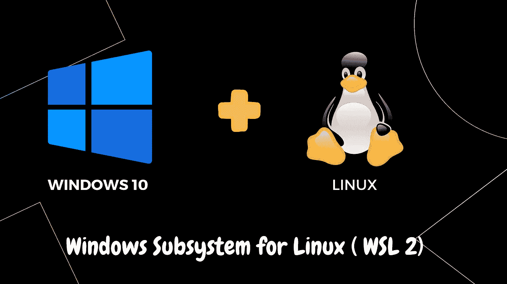

# 在 Windows11 上安装支持 CUDA 的 Linux 系统的终极指南

> 原文：<https://levelup.gitconnected.com/build-the-environment-for-deep-learning-in-windows-11-subsystem-of-linux-wsl-f26ffc4548b2>

带有 Bash shell 的 Linux 操作系统为程序员提供了一个熟悉且高度可控的工作流程。然而，我们总是需要 Windows 系统为我们的日常工作和娱乐活动提供其他常用软件。为了在 Linux/Bash 界面和 Windows 界面之间无缝转换，我们在本文中提供了两个选项。

这是一本实用指南。因此，为了深入理解，我会解释每个命令，并记下注意事项(我假设读者是熟悉常见 bash 命令的合格程序员)。此外，由于代码片段是嵌入在这篇文章中的，这种变化将反映在这篇文章中，以确保它不会在我每次更新原始代码片段时过时。

同样，这是一个实用的指南。我会在开头列出每种解决方案的优缺点，这样你就可以选择适合你的情况的方案，然后进入那一部分。我只列出每个解决方案的优点，因为一个解决方案的优点会变成另一个的缺点。对于第二种解决方案，虽然有很多云提供商提供虚拟机，但我发现 Azure 大多与 Windows 上的一些常见微软软件兼容。例如，你可以通过[、扩展](https://code.visualstudio.com/docs/azure/extensions)和高速网络获得几乎原生的 VS 代码体验。

**WSL2**

*   提供完全本土的体验(就我所体验的而言)
*   可以在没有互联网的情况下离线使用
*   没有网络延迟

**Azure 虚拟机**

*   可以启用多个 GPU
*   提供完整的 Python 环境，甚至是通用的数据科学库和机器学习框架

# 用于 Linux 的 Windows 子系统

微软现在使用 Linux 的 Windows 子系统(WSL)。更令人惊讶的是深度学习实践者，WSL2 现在支持带有 CUDA 的 Nvidia GPUs，因为底层 Linux 内核现在基于微软 Hyper-V。

然而，如果你只遵循微软和英伟达的官方指导方针，还是有一些需要注意的地方。因此，本文提供了一个非常简明的指南来避免这些警告。

## 使用中的另一个警告

*   在 WSL 中，僵尸进程可能不会被杀死。因此，当你开始使用 CUDA 时，比如训练神经网络，在使用你的 CUDA 之前，确保代码是可运行的。否则，您的显卡将不可用。这个问题还没有解决。您可以关注并查看讨论:[无法在 WSL 或任务管理器中终止进程问题# 1021 Microsoft/WSL(github.com)](https://github.com/microsoft/WSL/issues/1021)。

# 另一个解决方案:在 Windows 上使用 Azure Linux 虚拟机

该脚本执行自动创建和设置[数据科学虚拟机](https://docs.microsoft.com/en-us/azure/machine-learning/data-science-virtual-machine/overview)。我还阐述了每个命令的细节。所以一用就看。

# (可选)在 Linux 上设置 Python 环境

如果您使用 Azure DSVM，这个片段不是必需的，但是如果您使用 WSL2，它会很有帮助，因为您需要自己设置环境。