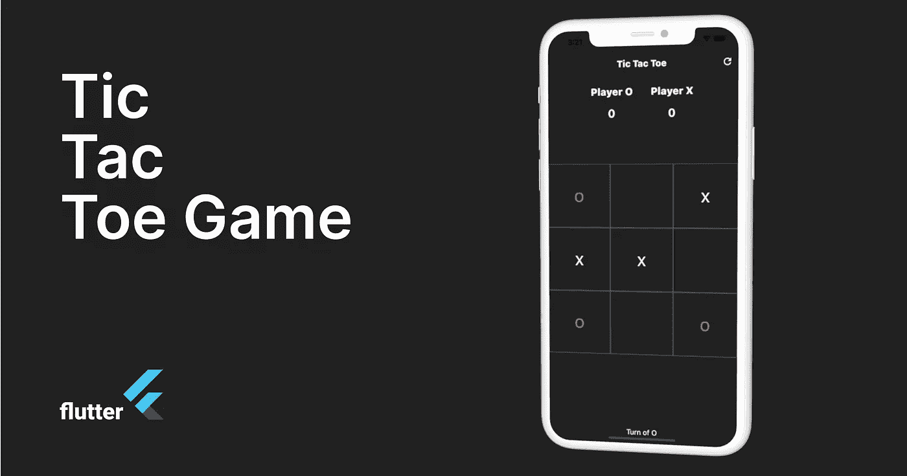
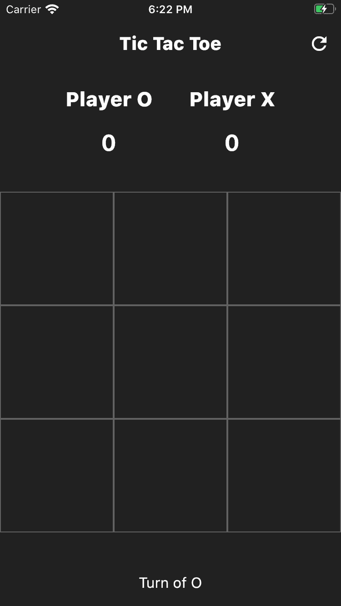
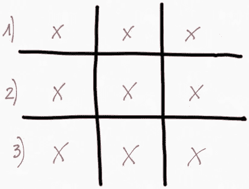
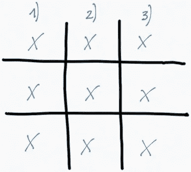
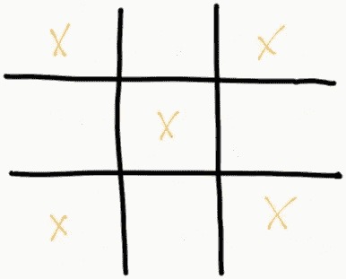
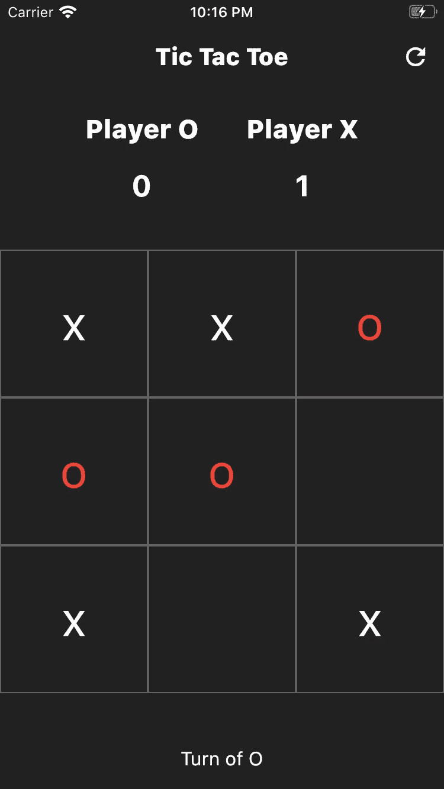

# 在 Flutter 中构建著名的井字游戏

> 原文：<https://levelup.gitconnected.com/build-the-famous-tic-tac-toe-game-in-flutter-8c6464869bca>

在这篇文章中，我将探讨如何为著名游戏**井字游戏**构建 UI 和业务逻辑。

我从头开始构建整个应用程序，我将深化这个框架的一些概念。

让我们开始创建` *main.dart* 文件:

在 Flutter 中，出现在屏幕上的所有东西都是一个小部件。当我们创建用户界面时，我们制作了一个小部件的组合。当我们将一个窗口小部件嵌套在另一个窗口小部件中时，我们创建了一个叫做**窗口小部件树**的层次结构。

` *main()* '函数是入口点，而` *runApp()* '函数获取`*小部件*的实例，并使其成为小部件树的根。

` *MyApp* `是一个扩展了` *StatelessWidget* 的类。

在` *build* `方法中，我使用了由 Flutter 提供的` *MaterialApp* `小部件。它代表了遵循材料设计准则的用户界面的框架。我的小部件的家是另一个小部件，叫做“主屏幕，我将很快创建它。

## 无状态和有状态小部件

在 Flutter 中，一个小部件可以扩展或者` *StatelessWidget* 或者` *StatefulWidget* `。

1.  **StatelessWidget** 是一种不需要可变状态的小部件，也就是说 UI 不会随着时间而改变。([更多信息](https://api.flutter.dev/flutter/widgets/StatelessWidget-class.html))

2. **StatefulWidget** 是一个具有可变状态的小部件，也就是说 UI 会随着时间而改变。([更多信息](https://api.flutter.dev/flutter/widgets/StatefulWidget-class.html))

## 键

您可能已经注意到，Flutter 提供的任何小部件都有可选的“ *key* ”参数。‘关键字’唯一地标识树中的小部件。

**主屏幕用户界面**

现在我创建了另一个名为` *home_screen.dart* 的文件，这个类扩展了一个` *StatefulWidget* `。该微件被插入到微件树中。` _HomeScreenState '是` HomeScreen `小工具的可变状态。

当 Flutter 重建窗口小部件树刷新 UI 时，调用` *build()* `方法。

稍后我将详细介绍如何刷新我们的视图，现在让我们构建我们的 UI。

在` *build* `方法中有一个` *Scaffold* `小部件，它实现了基本的材质设计布局结构。

它有一个` *AppBar* `放置在屏幕的顶部，带有相对动作按钮、标题和主体，在我们的例子中是一个`*列*`小部件。

在动作中，我插入了一个“ *IconButton* ”小部件，当图标被按下时，我将用它来重启游戏。

在`*列*`小部件中，我将在给定的空间约束下在垂直轴上插入三个孩子。

## 点数表

` *_buildPointsTable()* `方法，建立游戏的积分段。

这是一个简单的“*容器*,里面有一个“*行*”,在水平轴上放置更多的孩子。根据` *mainAxisAlignment* 的值，行中的小部件可以以不同的方式放置。在我们的例子中，我将小部件放在了行的中间。

然后我将使用一个`*列*小部件来输入玩家` *o* 和他的相对分数。对玩家` *x* '和他的相对分数重复同样的事情。

点数表微件

## 构建网格

` *_buildGrid* ()`方法，构建游戏的网格。本质上，它是一个 3 行 x 3 列的网格，带有边框装饰。对于网格中的每一项，我将添加一个点击事件，根据玩家的回合绘制一个` *o* 或` *x* `。

我也用白色或红色来区分两个玩家。

构建网格小部件

## 建立转弯

最后，在` *_buildTurn()* `方法中，我构建了一个简单的小部件来显示玩家的回合。

构建转弯微件

此时，如果我在模拟器上启动应用程序，我将得到以下结果。

应用程序的框架

## 业务逻辑

在进入管理游戏的逻辑部分之前，在我们的“build()”方法中，我插入了以下变量。

每个变量前的` *_* `表示它们是私有的。

` *_xOrOList* `代表我们的网格，它将包含玩家的所有不同的移动。

网格的第一个单元格匹配数组的第一个元素，网格的第二个单元格匹配数组的第二个元素，依此类推。

初始变量

## 抽头法

` *_tapped()* `方法，每当任何玩家单击网格的单元格时都会调用该方法。

每次点击都会检查是否轮到玩家“ *o* 或玩家“ *x* ”以及所选单元格是否为空。

根据具体情况，相应数组的索引值为“ *o* 或“ *x* ”,填充的单元格数量增加。

然后我会改变回合，通过调用` *_checkTheWinner()* `方法来检查是否有赢家。

`*State<T>的子类获得对` *setState()* 方法的访问，该方法重建小部件并因此刷新 UI。*

抽头法

` *_checkTheWinner()* `方法，检查是否有赢家只需检查在对角线、水平或垂直行中有三次相同的符号` o '或` x ',并显示一个带有消息的警告对话框。

如果不满足任何条件，并且所有 9 个单元格都已满，则会出现一个警告对话框，并显示一条绘制消息。

检查发生在:

*   第一排；
*   第二排；
*   第三排；

三排

*   第一列；
*   第二列；
*   第三列；

三根柱子

*   两条对角线

两条对角线

我只用了很少几行代码就能构建出一个完整的程序，它可以在 iOS 和 Android 操作系统上运行。

链接到我的源代码 https://github.com/davideagostini/tic_tac_toe

希望这篇教程能对你接下来的移动开发有所帮助。

下节课再见。😉