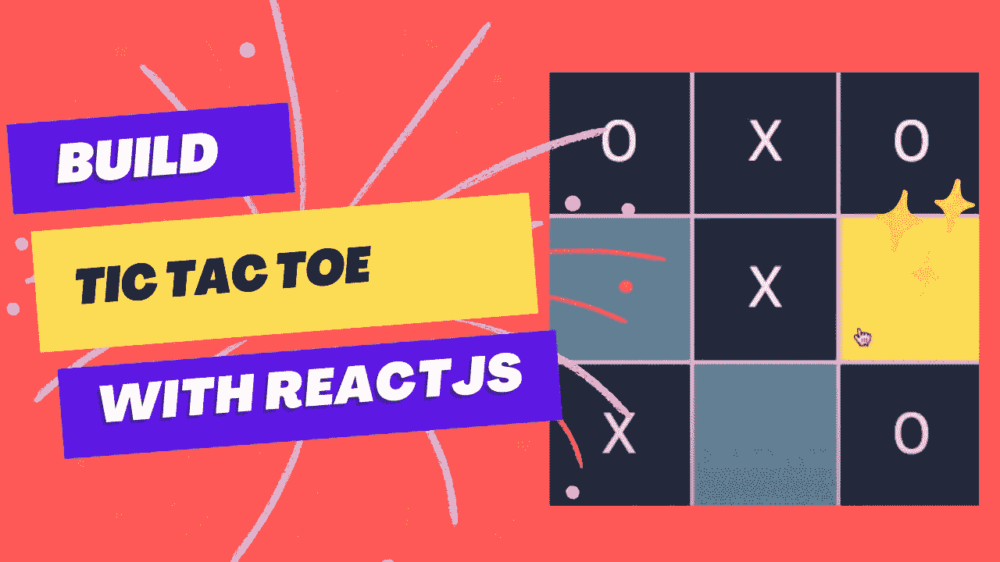

# 用 React 构建井字游戏

> 原文：<https://levelup.gitconnected.com/build-tic-tac-toe-with-reactjs-a967e99a0de1>

在本文中，我们将用 Reactjs 创建一个简单的井字游戏



# 涵盖的内容

—组件设计
—高级 JS 游戏逻辑
—高级 CSS 悬停特效
— CSS Flex
— CSS 形状构建

我们的井字游戏结果将如下所示:

使用 create-react-app 命令创建 React.js 应用程序的最简单方法。在您的终端中使用以下命令安装该软件包。

```
npx create-react-app Tic-Tac-Toe-using-React
cd Tic-Tac-Toe-using-React
npm start
```

像这样准备文件和文件夹:

```
src/
 App.css
 App.js
 EndGame.js
 index.js
 Square.js
 TicTacToe.js
```


我们将从方形组件开始

**方形构件**

用下面的代码打开“Square.js”文件并保存。

```
const Square = ({ clickedArray, handleClick }) => {
  return (
    <div className="board">
      {clickedArray.map((item, index) => {
        if (item === "") {
          return (
            <div
              key={index}
              className="square"
              onClick={() => handleClick(index)}
            >
              {item}
            </div>
          );
        } else {
          return (
            <div key={index} className="square clicked">
              {item}
            </div>
          );
        }
      })}
    </div>
  );
};
export default Square;
```

**残局组件**

打开**残局**。js "文件并编写代码:

```
const EndGame = ({ newGame, player, draw, X_PLAYER, O_PLAYER }) => {
  return (
    <div className="end-game-screen">
      {!draw && (
        <span className="win-text">
          Player {player ? O_PLAYER : X_PLAYER} Win!
        </span>
      )}
      {draw && <span className="win-text">Draw</span>}
      <button className="btn" onClick={newGame}>
        New Game
      </button>
    </div>
  );
};
export default EndGame;
```

**节气门组件**

这个组件将存储我们的游戏逻辑，但是我们稍后将添加游戏逻辑

```
import { useState } from "react";
import Square from "./Square";
import EndGame from "./EndGame";
const INITIAL = "";
const X_PLAYER = "X";
const O_PLAYER = "O";
const winCombination = [
  [0, 1, 2],
  [3, 4, 5],
  [6, 7, 8],
  [0, 3, 6],
  [1, 4, 7],
  [2, 5, 8],
  [0, 4, 8],
  [2, 4, 6],
];
const TicTacToe = () => {
  const [grid, setGrid] = useState(Array(9).fill(INITIAL));
  const [player, setPlayer] = useState(false);
  const [gameFinished, setGameFinished] = useState(false);
  const [draw, setDraw] = useState(false);
  const newGame = () => {
    setGrid(Array(9).fill(INITIAL));
    setGameFinished(false);
    setDraw(false);
  };

  return (
    <div>
      <div className="player-turn">
        Turn player: {player ? X_PLAYER : O_PLAYER}
      </div>
      {gameFinished && (
        <EndGame
          newGame={newGame}
          player={player}
          draw={draw}
          X_PLAYER={X_PLAYER}
          O_PLAYER={O_PLAYER}
        />
      )}
      <Square clickedArray={grid} handleClick={handleClick} />
    </div>
  );
};
export default TicTacToe;
```

为我们的游戏增添风格

App.css

```
* {
  margin: 0;
  padding: 0;
  box-sizing: border-box;
  font-family: "PT Sans", sans-serif;
}
.App {
  height: 100vh;
  background: #cbd2d6;
  display: flex;
  align-items: center;
  justify-content: center;
}
.square {
  background: #498da6;
  height: 10rem;
  width: 10rem;
  display: flex;
  align-items: center;
  justify-content: center;
  cursor: pointer;
  color: white;
  font-size: 4rem;
}
.square:hover {
  background: #fcf649;
}
.square.clicked {
  background: #01233d;
  cursor: not-allowed;
}
.board {
  display: grid;
  grid-template-columns: repeat(3, auto);
  align-items: center;
  justify-content: center;
  grid-gap: 5px;
}
.end-game-screen {
  display: flex;
  align-items: center;
  justify-content: center;
  flex-direction: column;
  position: absolute;
  top: 0;
  left: 0;
  height: 100vh;
  width: 100vw;
  background: rgba(0, 0, 0, 0.8);
}
.btn {
  background: #cbd2d6;
  color: #01233d;
  border: 2px solid #cbd2d6;
  font-size: 2rem;
  margin-bottom: 1rem;
  padding: 10px 14px;
  cursor: pointer;
  border-radius: 5px;
  transition: 0.3s ease-out;
  max-height: 7rem;
}
.win-text {
  color: white;
  font-size: 10rem;
}
.player-turn {
  color: #01233d;
  font-size: 2rem;
  margin: 2rem 0;
}
```

让我们打开 App.js 并修改代码

```
import "./App.css";
import TicTacToe from "./TicTacToe";
const App = () => {
  return (
    <div className="App">
      <TicTacToe />
    </div>
  );
};
export default App;
```

你应该看到这样的结果，但它还没有工作。


最后一步实现我们的游戏逻辑，打开 TicTacToe 组件修改 handleClick 函数并添加 isGameOver 函数。

最终 TicTacToe 组件代码

```
import { useState } from "react";
import Square from "./Square";
import EndGame from "./EndGame";
const INITIAL = "";
const X_PLAYER = "X";
const O_PLAYER = "O";
const winCombination = [
  [0, 1, 2],
  [3, 4, 5],
  [6, 7, 8],
  [0, 3, 6],
  [1, 4, 7],
  [2, 5, 8],
  [0, 4, 8],
  [2, 4, 6],
];
const TicTacToe = () => {
  const [grid, setGrid] = useState(Array(9).fill(INITIAL));
  const [player, setPlayer] = useState(false);
  const [gameFinished, setGameFinished] = useState(false);
  const [draw, setDraw] = useState(false);
  const newGame = () => {
    setGrid(Array(9).fill(INITIAL));
    setGameFinished(false);
    setDraw(false);
  };
  const handleClick = (id) => {
    setGrid(
      grid.map((item, index) => {
        if (index === id) {
          if (player) {
            return X_PLAYER;
          } else {
            return O_PLAYER;
          }
        } else {
          return item;
        }
      })
    );
    setPlayer(!player);
  };
  const isGameOver = () => {
    if (!gameFinished) {
      for (let i = 0; i < 8; i++) {
        if (
          grid[winCombination[i][0]] === X_PLAYER &&
          grid[winCombination[i][1]] === X_PLAYER &&
          grid[winCombination[i][2]] === X_PLAYER
        ) {
          setGameFinished(true);
          return;
        }
      }
      for (let i = 0; i < 8; i++) {
        if (
          grid[winCombination[i][0]] === O_PLAYER &&
          grid[winCombination[i][1]] === O_PLAYER &&
          grid[winCombination[i][2]] === O_PLAYER
        ) {
          setGameFinished(true);
          return;
        }
      }
      if (!grid.includes(INITIAL)) {
        setDraw(true);
        setGameFinished(true);
      }
    }
  };
  isGameOver();

  return (
    <div>
      <div className="player-turn">
        Turn player: {player ? X_PLAYER : O_PLAYER}
      </div>
      {gameFinished && (
        <EndGame
          newGame={newGame}
          player={player}
          draw={draw}
          X_PLAYER={X_PLAYER}
          O_PLAYER={O_PLAYER}
        />
      )}
      <Square clickedArray={grid} handleClick={handleClick} />
    </div>
  );
};
export default TicTacToe;
```

# 结论

搞定了。对于任何希望在学习 React、JavaScript 和 CSS 概念的同时获得乐趣的人来说，这是一个极好的项目。

源代码:[https://github.com/easywebsify/Tic-Tac-Toe-React](https://github.com/easywebsify/Tic-Tac-Toe-React)