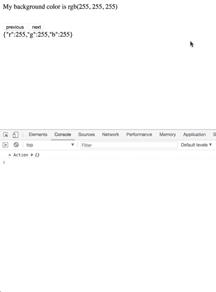

# 从头开始在 Redux 中构建时间旅行调试

> 原文：<https://levelup.gitconnected.com/build-time-travel-debugging-in-redux-from-scratch-665fea8fc6cc>


在本教程中，我们将一步一步从头开始构建时间旅行调试。我们将首先介绍 Redux 的核心原则，以及它们如何支持构建如此强大的功能。然后，我们将用纯 JavaScript 构建 Redux 核心库和时间旅行调试，并将其连接到一个简单的 HTML 应用程序，而不使用任何 React。



# Redux 时间旅行的基本原理

时间旅行调试指的是在应用程序的状态中前进和后退的能力，使开发人员能够准确理解在应用程序生命周期的任何一点上正在发生的事情。

[](https://gitconnected.com/learn/react) [## 学习 React -最佳 React 教程(2018) | gitconnected

### React 的前 48 门课程。教程由开发者提交并投票，让你找到最好的反应…

gitconnected.com](https://gitconnected.com/learn/react) 

Redux 是通量模式的扩展，它强制单向数据流。此外，Redux 为 flux 理念增加了 3 个原则。

1.  国家真相的单一来源。应用程序的整个状态存储在一个 JavaScript 对象中。
2.  **状态为只读**。这就是不变性的概念。状态永远不会改变，但是每个动作都会生成一个全新的状态对象，取代旧的状态对象。
3.  **纯功能变化**。这意味着任何时候产生一个新的状态，它都不会触发任何其他副作用。

通过利用 Redux 应用程序的状态是在这个线性且可预测的时间线中生成的基本概念，时间旅行调试通过存储每个被触发的动作所生成的状态树的副本来扩展这个概念。

UI 可以被认为是 Redux 状态的一个纯函数。时间旅行允许我们将应用程序的状态设置为所需的值，并生成将在这些条件下创建的精确 UI。这种应用程序的可见性和透明性对于开发人员来说是一个非常强大的工具，可以帮助他们充分了解应用程序内部发生的事情，并显著减少调试工作。

# 使用 Redux 和时间旅行调试构建简单的应用程序

我们将构建一个简单的 HTML 应用程序，它在单击时生成一个随机的背景颜色，并使用 Redux 来存储 RGB 值。我们还将创建一个时间旅行扩展，这将允许我们重放应用程序的每个状态，并直观地看到每一步的背景变化。

## 构建 Redux 核心库

如果您对构建时间旅行调试感兴趣，我也假设您熟悉 Redux。如果你是 Redux 的新手，或者需要复习一下悬挂物和减速器，在继续详细解释之前，请参考本文 margin-top: 30px;
}
</style>
<script>
// Application logic will be added here...
</script>
</body>
</html>

注意，我们还为调试器创建了一个`<div>`。有导航不同状态的按钮和列出状态中每个更新的节点。

在脚本内部，我们从引用 DOM 节点和我们的`createStore`开始。

```
const textNode = document.getElementById('background');
const timelineNode = document.getElementById('timeline');const createStore = (reducer, initialState) => {
  const store = {};
  store.state = initialState;
  store.listeners = []; store.getState = () => store.state; store.subscribe = listener => {
    store.listeners.push(listener);
  }; store.dispatch = action => {
    console.log('> Action', action);
    store.state = reducer(store.state, action);
    store.listeners.forEach(listener => listener());
  }; return store;
};
```

接下来，我们创建 reducer 来跟踪 RGB 值并初始化存储。初始状态将是白色背景。

```
const getInitialState = () => {
  return {
    r: 255,
    g: 255,
    b: 255,
  };
};const reducer = (state = getInitialState(), action) => {
  switch (action.type) {
    case 'SET_RGB':
      return {
        r: action.payload.r,
        g: action.payload.g,
        b: action.payload.b,
      };
    default:
      return state;
  }
};const store = createStore(reducer);
```

现在，我们可以为商店订阅一个函数，该函数将设置背景色并将文本 RGB 值添加到 DOM 中。这是因为对状态的任何更新都要在我们的 UI 中表示出来。

```
const setBackgroundColor = () => {
  const state = store.getState();
  const { r, g, b } = state;
  const rgb = `rgb(${r}, ${g}, ${b})`; document.body.style.backgroundColor = rgb;
  textNode.innerHTML = rgb;
};store.subscribe(setBackgroundColor);
```

最后，我们添加一个函数来生成一个 0–255 的随机数和一个`onClick`事件监听器，它将向商店发送一个新的 RGB 值。

```
const generateRandomColor = () => {
  return Math.floor(Math.random() * 255);
};// A simple event to dispatch changes
document.addEventListener('click', () => {
  console.log('----- Previous state', store.getState());
  store.dispatch({
    type: 'SET_RGB',
    payload: {
      r: generateRandomColor(),
      g: generateRandomColor(),
      b: generateRandomColor(),
    },
  });
  console.log('+++++ New state', store.getState());
});
```

这是我们应用程序逻辑的全部。我们在下面的脚本标签调用`store.dispatch({})`的底部添加上一节中的时间旅行代码来生成初始状态。


下面是该应用程序的完整工作代码。

# 包裹

我们的时间旅行调试教育实现描绘了 Redux 的核心原则。我们可以毫不费力地跟踪我们的应用程序正在进行的状态，使得调试和完全理解正在发生的事情变得容易。

[](https://levelup.gitconnected.com/)

*如果您觉得这篇文章有帮助，请点击*👏*。* [*关注我*](https://medium.com/@treyhuffine) *了解更多关于区块链、React、Node.js、JavaScript 和开源软件的文章！也可以在*[*Twitter*](https://twitter.com/treyhuffine)*或者*[*git connected*](https://gitconnected.com/treyhuffine)*上找到我。*

## [在区块链找工作和加密货币>](https://blockace.io)