# 通过学习嵌套框架构建 TODO APIs

> 原文：<https://levelup.gitconnected.com/build-todo-apis-by-learning-nest-framework-95a83979ce5a>

构建任何应用程序的关键是它的架构。从事 Node.js 架构一直是我的痛处，这也是我开始探索 Nest 的主要原因之一。JS 框架。在这篇文章中，我将尝试分享我关于学习鸟巢的想法和经验。Js 框架(提示:如果你是 Angular 开发者，你会喜欢 Nest 的😎)


**什么是窝(** [**文档**](https://docs.nestjs.com/) **涵盖了一切**😊)

> 这是一个用于构建高效、可伸缩的 Node.js 服务器端应用程序的框架

巢。JS 支持 TypeScript。它利用快递。引擎盖下的 JS，但也支持 Fastify👏👏

更多信息可以在他们的官方网站上找到。因此，让我们直接开始构建 TODO 应用程序💥💥💥

# **设置我们的待办事项应用**

我们可以通过使用 NEST CLI 或通过 Github 克隆来开始

在本例中，我们将使用 CLI，我建议您也这样做，因为我们将在以后的章节中看到 CLI 如何帮助我们生成文件。

所以第一步是在全球范围内安装 nest

```
npm i -g @nestjs/cli
```

全局安装 Nest CLI 后。让我们创建我们的项目

```
nest new todo-api
```

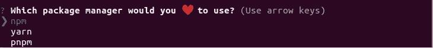

选择您❤️.的程序包管理器对我来说，这是故事🙂

成功创建项目后，您的应用程序在 IDE 上应该看起来类似于下面这样。您的初始设置已经就绪🎊🎊🎊

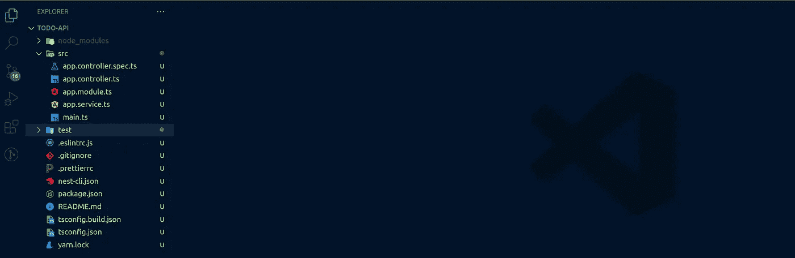

vscode 编辑器

# 设计 API

好的，每个 API 向服务器发送一个请求，服务器用一个响应来响应(显然是对的？😂)

但是让我们更进一步，尝试理解服务器内部发生了什么🤔

让我们假设我们正在请求获取给定日期的待办事项列表

> ***第一步:*** 服务器应该**验证**如果给定的日期是有效的，比如说在我们的例子中，它必须是✅✅当前或未来的日期
> 
> **第二步:**服务器应该确保请求来自经过**认证的**用户🔑🔑
> 
> ***第三步:*** *我们可以定义许多函数，但我们的服务器必须确保它将* ***路由*** *到所需的函数*🎯🎯
> 
> **第四步:**我们可能需要用服务器运行一些**业务逻辑**来从数据库🕴️🕴️获取数据
> 
> **第五步:**最后从我们的**数据库**中获取数据📊📊

现在让我们描绘一下 nest 框架是如何解决这些问题的

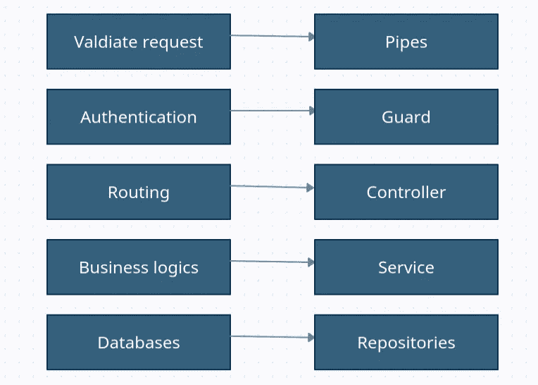

nest 框架❤️中可用的工具

现在，让我们看看如何使用这些工具来构建我们的 todo 应用程序。

# 模块

让我们建立我们的数据库。但在此之前，我们需要了解 Nest 使用的 [**模块**](https://docs.nestjs.com/modules) 。带有模块注释的类表示模块。该模块帮助我们对代码🧱.进行分组

每个应用程序都有一个根模块。在我们的应用程序中，它被称为**应用模块**。

每个功能或模块都可以有自己的模块。我们已经可以看到使用 nest 框架的一个主要优势。通过对代码进行分组，我们的应用程序变得松散耦合且易于阅读🤩

在这个应用程序中，我们将有三个模块

1.  AppModule:我们应用程序的根
2.  Todo:包含 todo 功能
3.  Auth:包含认证特性(将在第 2 部分中讨论)

# 数据库ˌ资料库

对于这个例子，我们将使用[**SQLite**](https://sqlite.org/index.html)**数据库和 [**类型模块**](https://docs.nestjs.com/techniques/database)**

**让我们安装依赖包**

```
yarn add @nestjs/typeorm typeorm sqlite3
```

**我们需要导入模块，导出所需的提供者**

**要设置数据库，我们需要 TypeORmModule。因此，让我们将 TypeOrm 添加到导入中，并提供设置 SQLite 数据库所需的选项**

**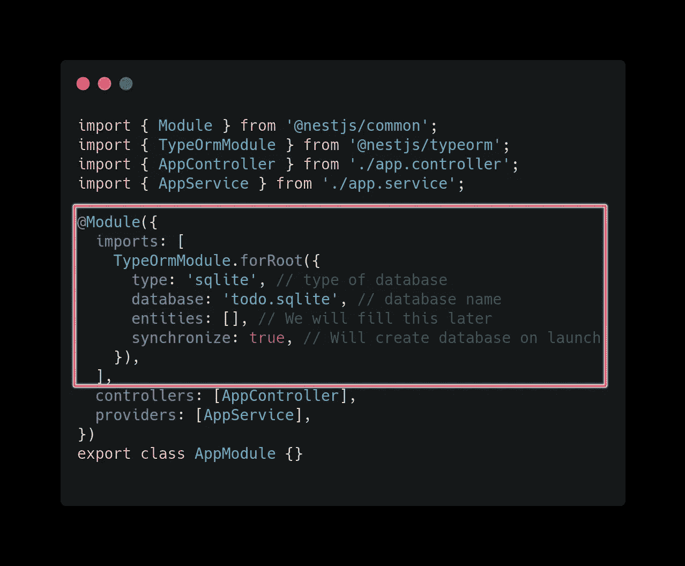**

**基本上，我们正在做的是通过传递数据库配置为 root 导入一个 TypeOrm 模块。请注意，同步真只能用于开发。对于生产，我们需要处理迁移。**

**当我们在根目录上启动应用程序时，这会创建一个数据库。您可以使用[这个](https://marketplace.visualstudio.com/items?itemName=alexcvzz.vscode-sqlite)扩展来查看 SQLite**

```
yarn start:dev
```

**你可以在这里找到初始设置[的源代码](https://github.com/suhas86/nest-todo-api/tree/25690f8cac35526ab23b90bbb3f3b0a59ac0ac78)**

# **创建模块**

**让我们从 Todo 模块🧱.开始**

**正如我前面提到的，模块只不过是我们代码的组合。**

**Todo 模块将拥有**控制器、服务和存储库**(参考设计 API 部分，了解我们为什么需要这些东西)。我们将使用 Nest CLI 来创建控制器和服务**

**因此，要创建 todo 模块，请打开终端并键入`nest g module todos`**

**这将创建一个名为 todos 的目录，并创建一个包含样板代码的文件。它还通过将 TodosModule 添加到 imports 数组来通知我们的根模块 AppModule**

**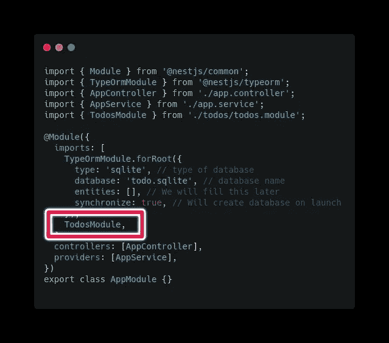**

**现在让我们创建一个**控制器和服务**。打开终端，键入`**nest g controller todos**`创建一个控制器，键入`**nest g service todos**`创建一个服务。这还会将 TodosController 添加到 todos 模块中的控制器数组，并将 TodosService 添加到提供者的数组**

**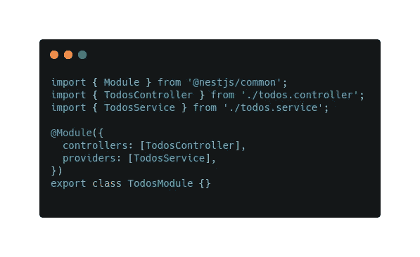**

**todos.module.ts**

**这部分的代码可以从[这里](https://github.com/suhas86/nest-todo-api/tree/feature/setup-todo-module)下载**

# **实体**

**实体非常类似于在 typescript 或任何其他语言中创建模态。一个实体将告诉所有应该出现在一个特定模块中的属性，在我们的例子中是 Todos 模块。NestJS 将在内部为这些实体创建存储库。**

## **创建实体**

**首先，让我们用 todos 模块所需的所有属性创建一个实体文件。因此，让我们在 todos 文件夹中创建 todos.entity.ts。**

**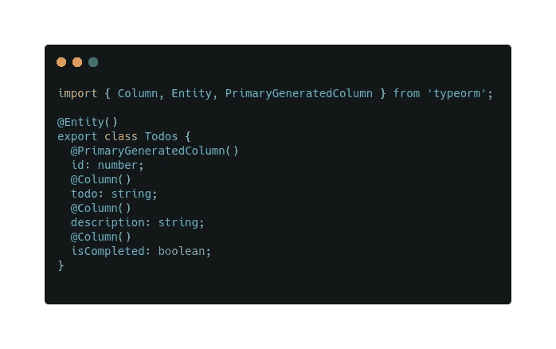**

**todos.entity.ts**

**现在我们来说说使用的装修工。**实体**装饰器将为所有用它装饰的类创建数据库模式，并且存储库可以被检索和使用。**

****PrimaryGeneratedColumn** 表示它是一个主键，必须自动生成**

****列**是告知它是一个表格列。**

**下一步是将我们的实体连接到父模块。这将使 Nest 在幕后创建一个存储库。**

**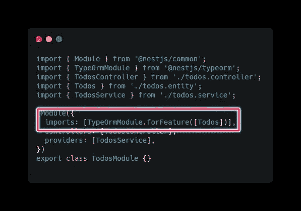**

**todos.module.ts**

**现在最后一步是将其连接到 app 模块。**

**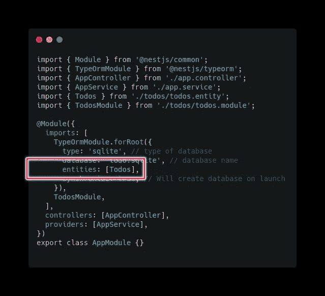**

**应用程序模块**

**这部分的代码可以从[这里](https://github.com/suhas86/nest-todo-api/tree/feature/entity)下载。**

# **路线**

**现在是时候创建路线了。我们在控制器中创建路线。对于 todo 模块，我们将有四条路线**

**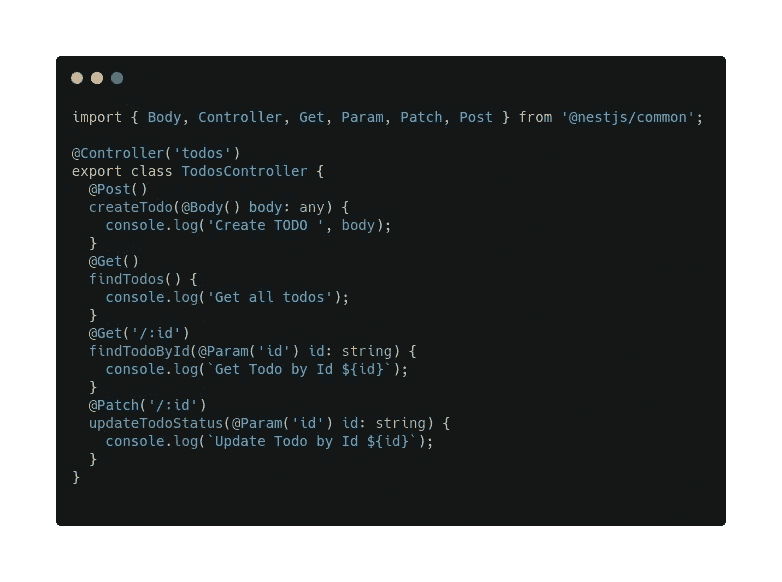**

**todos.controller.ts**

**添加路线非常简单。您可以使用 Get、Post、Put、Patch 或 delete 注释来定义方法类型。**

**您可以通过向控制器注释传递一个字符串值来定义路由名称。您还可以通过将值设置为其等效路由，为每个路由指定一个路径。**

**你可以在 VS 代码中使用 postman 或者 [Rest 客户端扩展](https://marketplace.visualstudio.com/items?itemName=humao.rest-client)来测试这些 API。我个人更喜欢 Rest 客户端扩展。您可以将`todos.http` 文件放在 `api-requests`文件夹下**

****注意:**我们将在未来的章节中删除任何🚨🚨**

**这部分的代码可以在这里找到**

# **服务**

**我们很快就会看到 API 的实际应用。我保证😀**

**第一步是将我们的 todos 存储库添加到我们的 todos 服务中**

**我们通过在我们的`todos.service.ts`构造函数中注入一个存储库来做到这一点**

```
constructor(@*InjectRepository*(Todos) *private* repo: Repository<Todos>) {}
```

**通过注入存储库，我们可以发现实体、插入、更新、删除等。💥**

**让我们向控制器中定义的路由添加服务方法**

**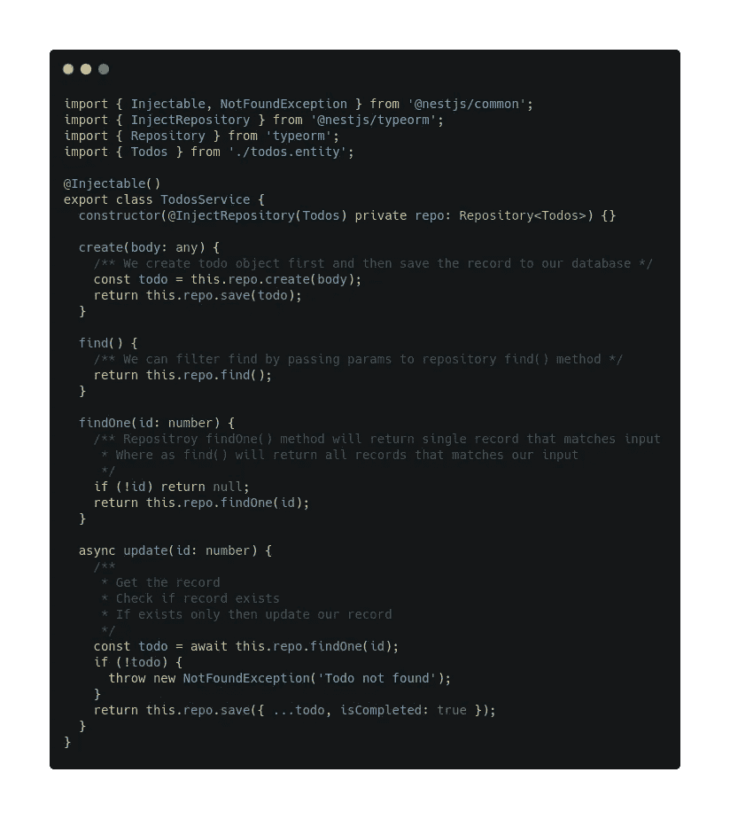**

**todos.service.ts**

**希望行内注释有助于理解每个方法的作用🤞**

**现在让我们将服务中定义的方法连接到控制器中它们各自的路径**

**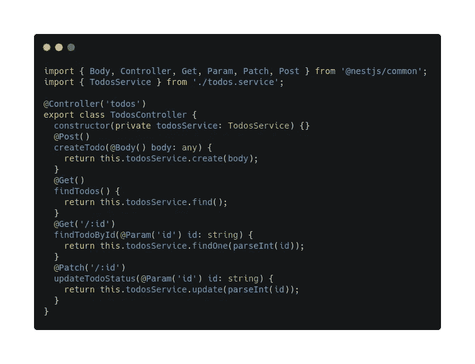**

**todos.controller.ts**

****注意:**已经给`isCompleted`我们的 todo 实体添加了默认值。您可以在 git 存储库中找到更新的代码🚨🚨**

```
@*Column*({ default: false })isCompleted: boolean;
```

**现在尝试使用 Rest 客户端或 postman 创建 todo**

```
*POST* http://localhost:3000/todoscontent-type: application/json{"todo":"First todo","description":"First todo description"}
```

****

**最后💥💥💥💥💥。您也可以测试其他 API，它应该可以工作**

**你可以在这里下载本节[的代码](https://github.com/suhas86/nest-todo-api/tree/feature/service)**

**一切看起来都很好，对吗？让我们向 todo 模块添加最后一个块**

# **验证管道**

**[验证](https://docs.nestjs.com/techniques/validation)传入的请求对于任何 API 来说都非常重要，因为这将最小化安全风险以及当我们试图从数据库中获取数据时不必要的错误**

**让我们从安装依赖项开始，创建一个验证管道✅**

```
yarn add class-validator class-transformer
```

**在 Nest 中，我们创建数据传输对象(dto ),并使用类验证器来验证传入的数据**

**让我们从 todos 模块内 dtos 文件夹下的`create-todo.dto.ts` 开始。**

**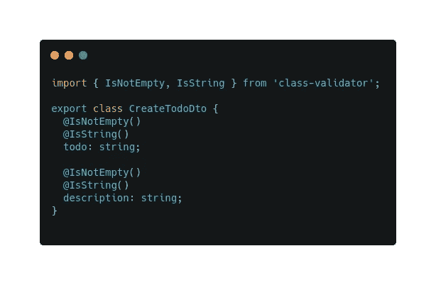**

**创建-todo.dto.ts**

**现在让我们替换掉任何来自`createTodo`的法体来使用`CreateTodoDto`**

```
@*Post*()*createTodo*(@*Body*() body: CreateTodoDto) {*return* this*.todosService.create*(body);}
```

**让我们重复同样的服务**

```
*create*(body: CreateTodoDto) {/** *We create todo object first and then save the record to our database* */const *todo* = *this.repo.create*(*body*);*return* this*.repo.save*(todo);}
```

**最后，我们需要在`main.ts`文件中全局注册验证管道**

**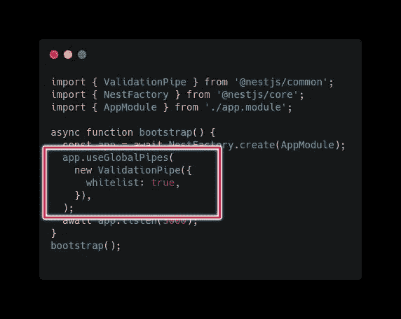**

**主页面**

**现在，如果我们删除，我们发送一个无效的请求，我们应该得到带有验证错误的响应代码 400。**

**该部分的代码可以在[这里](https://github.com/suhas86/nest-todo-api/tree/feature/validations)找到**

# **结论**

**🎊🎊🎊🎊🎊**

**todo 模块到此结束。你可以在这里下载最终代码**

**我将在第 2 部分扩展这个代码库并添加身份验证🔜。**

**我很喜欢学习 NestJs，希望我的经历能对你有所帮助。这个框架确实为你提供了很多特性，比如处理错误。您不必为每个响应代码定义错误。NestJs 会帮你做的。模块结构使得找到任何一段代码都非常容易。**

**当然，像所有框架一样，NestJs 有时也很有挑战性。👊👊**

**尤其是当你使用装饰器或者注入依赖注入的时候。但是一旦我们理解了核心功能，它将帮助你构建可维护的企业应用。**

**就我个人而言，如果我正在构建一个小规模或一些业余爱好的应用程序，我可能不会选择 Nest，但是如果我正在构建一个需要维护和可伸缩性的企业应用程序，我肯定会更喜欢 Nest 框架**

**我很高兴在不久的将来探索和学习的一些特性是 GraphQl 支持、Websockets 和我最喜欢的微服务。🤩🤩🤩**

**希望你喜欢我对如何使用 Nest 框架的解释。**

**编码快乐！！！干杯！！！🍻🍻🍻**