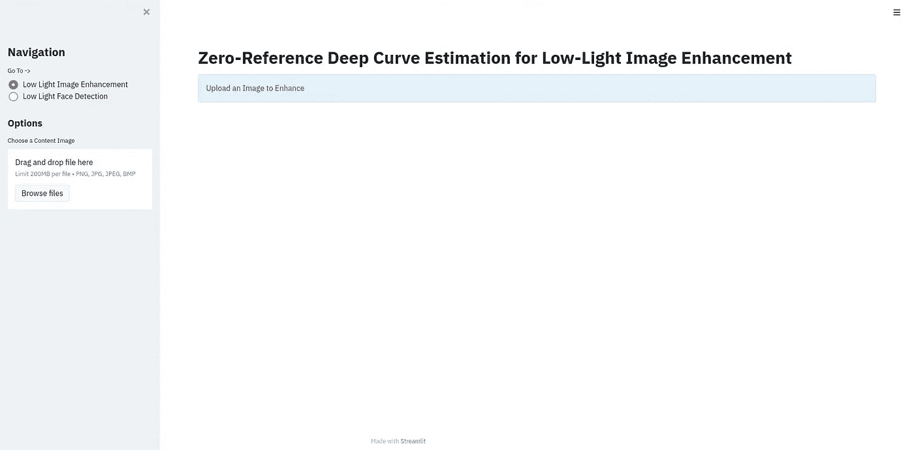
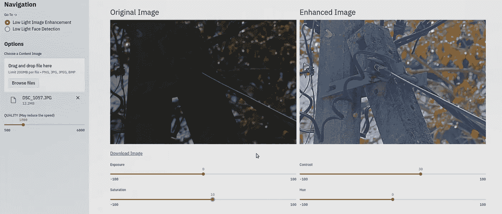

# 利用 Streamlit 在几分钟内为您的机器学习、深度学习项目构建 Web UI

> 原文：<https://levelup.gitconnected.com/build-web-ui-for-your-machine-learning-deep-learning-project-with-streamlit-in-minutes-b19df42da37b>

## 仅使用 python 构建 web UI 的最快方法。不需要前端经验


图片来自 [streamlit.io](https://streamlit.io/)

我将用不到 10 分钟的时间向您展示如何为您的 python ML 项目构建 web UIs。 [Streamlit](https://streamlit.io/) 开源 Python 库提供了一个 API，可以非常容易地在他们的服务器中构建和部署。我会一步一步地教你。因为机器学习项目将使用来自 GitHub[的**零参考深度曲线估计进行低光图像增强**。你可以在这里找到完整的论文](https://github.com/Li-Chongyi/Zero-DCE)。

## **为什么选择 Streamlit？**

*   你可以使用 python 来制作你的 UI，你不必担心前端库或框架。
*   更容易部署。如果您愿意，可以使用 Streamlit deploy。

## 设置环境

首先，我要做的是克隆那个棒极了的回购协议，并设置我的环境(CUDA 和其他必需品)。然后使用以下 pip 命令安装 Streamlit。

```
pip install streamlit
```

## 创建初始视图

我们将创建一个名为`web`的包，它将包含视图和图像生成模块。

从深度学习模型生成图像

这种 low_light 方法将向视图返回增强的图像。对于图像选择和上传，我们使用 streamlit**file _ uploader**，对于视图，我们将使用 **beta_columns、containers** 到来保存上传的图像和增强的图像。下载按钮是使用 base64 转换添加的。实用程序类的代码可以在教程 [repo](https://github.com/AselSiriwardena/streamlit-demo) 中找到。下面的代码将创建图像增强的用户界面。

为图像增强创建视图

对于弱光人脸检测，我将使用一个库([人脸识别 1.3)。](https://pypi.org/project/face-recognition/) 0)使用 dlib 最先进的人脸识别库构建。

创建人脸检测视图

使用 Try catch 块是因为大图像会导致 CUDA 内存不足的错误。

人脸检测

接下来，我们必须在根目录下创建一个 python 文件来运行 streamlit。所以我创建了一个 run.py 文件。它有一个基本的配置和用户界面，可以在人脸识别和弱光增强之间切换。

运行 streamlit 应用程序的根代码

正如你所看到的，它有一个增强和人脸检测的选项。使用`streamlit run run.py`运行它。该应用程序将在您的默认浏览器中自动启动。



登录页面

eYI 还添加了一些手动控件，用于使用我正在处理的项目编辑图像。可以使用`torchvision.transforms.functional` API。

调整曝光、亮度…



增强视图

恭喜你！你已经用 Python 在几分钟内完成了一个 web 应用程序。感谢阅读。相信这个简短的教程会有所帮助。工作代码示例可以在 [GitHub](https://github.com/AselSiriwardena/streamlit-demo) 上找到。