# 在 xcode 中使用聚合目标构建 xcframework

> 原文：<https://levelup.gitconnected.com/build-xcframework-using-aggregated-targets-in-xcode-cac4ceaf6cf0>

如果您已经熟悉如何使用命令行工具构建 xcframworks，那么本文将向您介绍如何将它提升到一个新的水平。

如果你还没有构建或者不知道如何构建 xcframeworks，我已经在我以前的文章[这里](https://medium.com/@ahmedfathi_28486/how-to-build-xcframework-with-xcode-b3d0b3c08f43)中详细解释过了。

# 聚集目标

当我们需要以某种方式一起构建多个目标时，使用聚合目标。

我们将从上一篇文章中的示例果篮开始，你可以从这个 [git repo](https://github.com/amfathi/FruitBasket) 下载它，这里是我们在那里的代码预览。

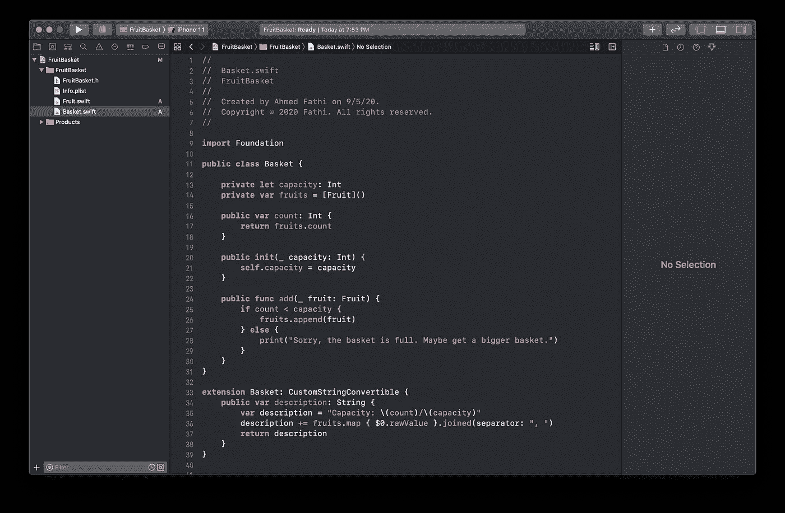

打开 xcode，从底部的+图标开始向你的项目添加新的目标。

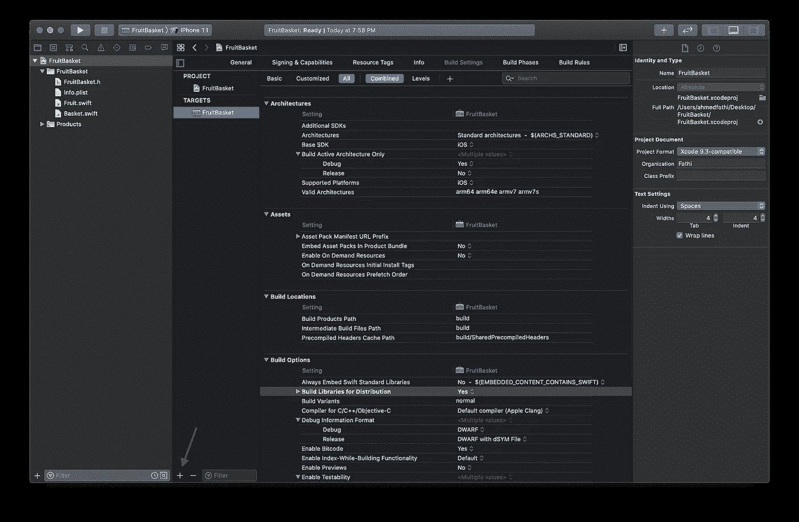

选择**跨平台**然后**聚合**。

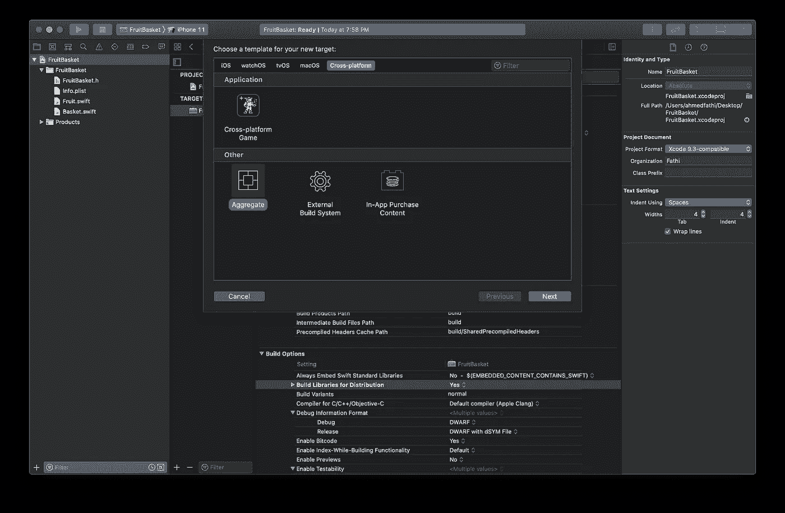

选择您想要的名称，在我的例子中，我将其命名为 **AggregatedFramework**

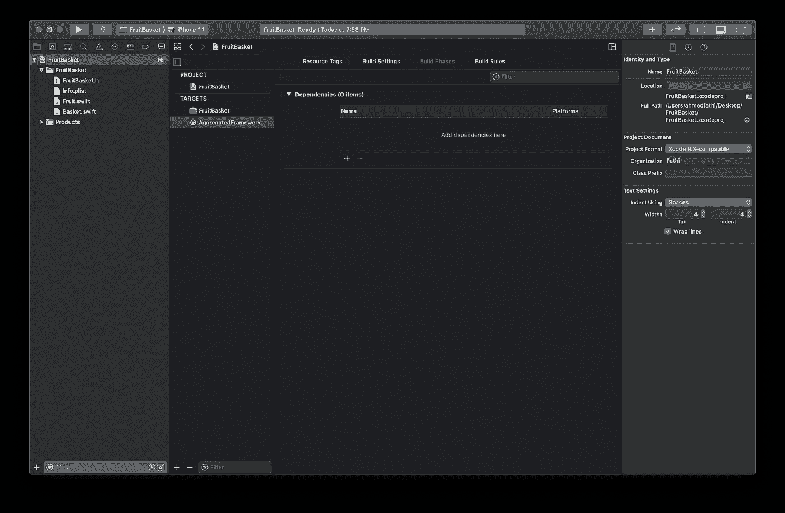

将方案更改为 **AggregatedFramework** 方案。

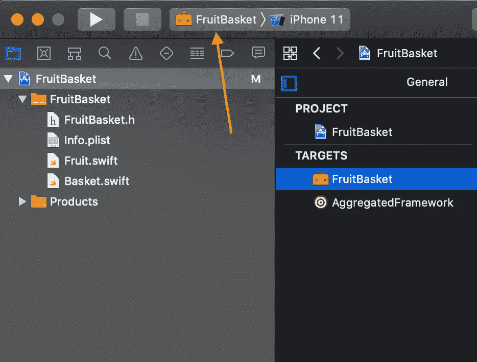

然后点击**编辑方案…**

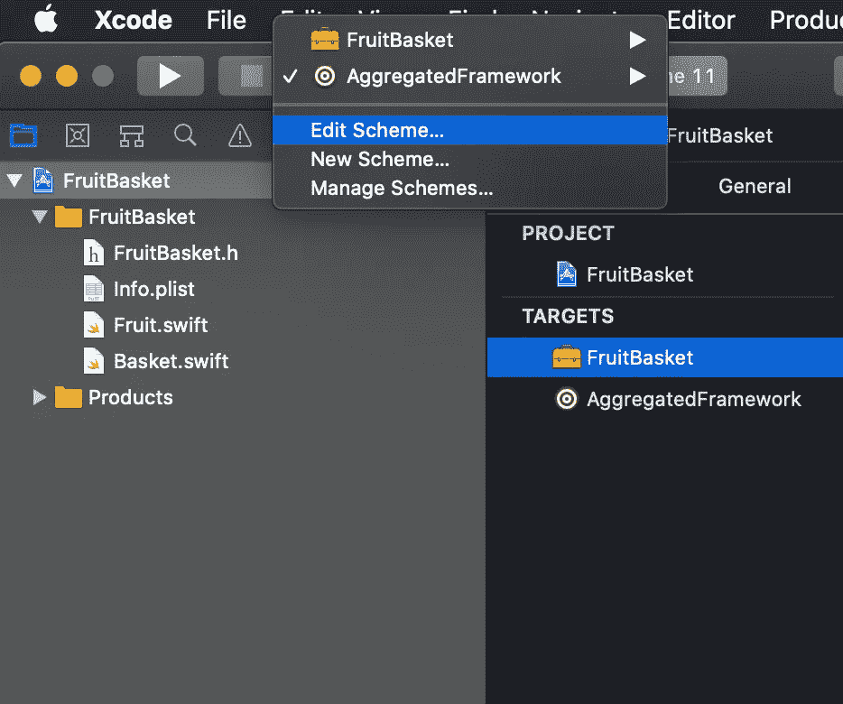

从左侧面板中选择**运行**选项卡，然后将**构建配置**更改为**发布。**

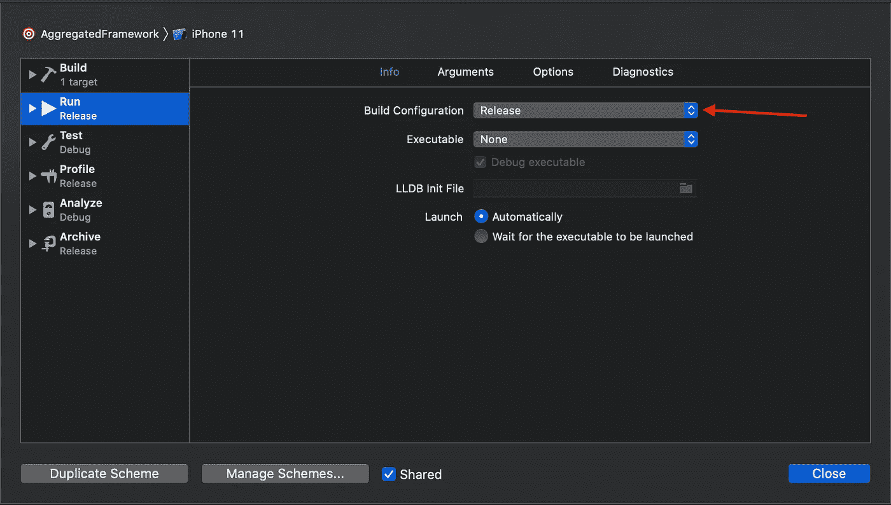

返回并从目标中选择 **AggregatedFramework** 然后选择**构建阶段**然后点击小+添加一个依赖项，并选择 **FruitBasket Framework** 目标。

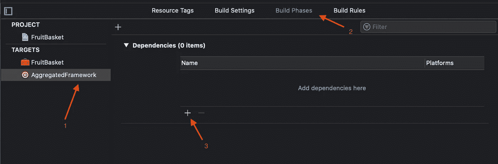

然后点击上面的其他+依存词添加一个**新的运行脚本阶段**

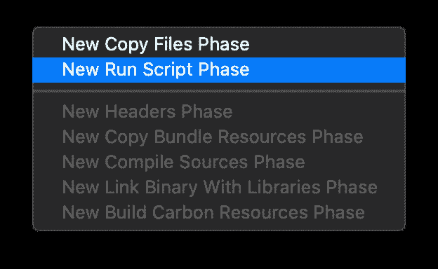

您可以根据脚本的用途对其进行重命名，例如**创建聚合框架**

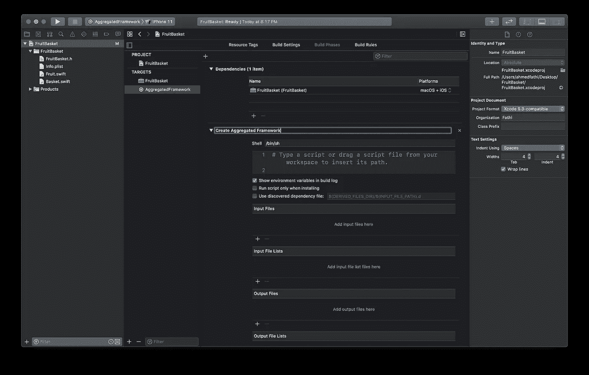

让我们开始在脚本区域输入。我将开始为我将在整个脚本中使用的东西创建一些变量，这样它会保持整洁、干净，对其他人来说是可读的，并且便于以后更改。

首先创建方案和框架名变量，如下所示

```
SCHEME_NAME="FruitBasket"
FRAMEWORK_NAME="FruitBasket"
```

如果您的项目中有多个 iOS 和 macOS 方案，那么在需要时创建所有这些变量，对于我们的情况，我们只有一个方案。

然后我将创建一些变量来保存 xcarchives 和输出的路径。

```
SIMULATOR_ARCHIVE_PATH="${BUILD_DIR}/${CONFIGURATION}/${FRAMEWORK_NAME}-iphonesimulator.xcarchive"DEVICE_ARCHIVE_PATH="${BUILD_DIR}/${CONFIGURATION}/${FRAMEWORK_NAME}-iphoneos.xcarchive"OUTPUT_DIC="./xcframework/"
```

然后，我将添加 xcodebuild 命令来生成模拟器 xcarchive，其中包含我们为模拟器归档文件创建的方案名称和路径

```
# Simulator xcarchieve
xcodebuild archive \
  -scheme ${SCHEME_NAME} \
  -archivePath ${SIMULATOR_ARCHIVE_PATH} \
  -sdk iphonesimulator \
  SKIP_INSTALL=NO
```

以及为设备生成 iphoneos xcarchive 的命令

```
# Device xcarchieve
xcodebuild archive \
  -scheme ${SCHEME_NAME} \
  -archivePath ${DEVICE_ARCHIVE_PATH} \
  -sdk iphoneos \
  SKIP_INSTALL=NO
```

是时候生成输出了，但是首先我们将清理旧的输出目录(如果存在的话)

```
# Clean up old output directory
rm -rf "${OUTPUT_DIC}"# Create xcframwork combine of all frameworks
xcodebuild -create-xcframework \
  -framework ${SIMULATOR_ARCHIVE_PATH}/Products/Library/Frameworks/${FRAMEWORK_NAME}.framework \
  -framework ${DEVICE_ARCHIVE_PATH}/Products/Library/Frameworks/${FRAMEWORK_NAME}.framework \
  -output ${OUTPUT_DIC}/${FRAMEWORK_NAME}.xcframework
```

完整脚本

```
SCHEME_NAME="FruitBasket"
FRAMEWORK_NAME="FruitBasket" SIMULATOR_ARCHIVE_PATH="${BUILD_DIR}/${CONFIGURATION}/${FRAMEWORK_NAME}-iphonesimulator.xcarchive"
DEVICE_ARCHIVE_PATH="${BUILD_DIR}/${CONFIGURATION}/${FRAMEWORK_NAME}-iphoneos.xcarchive" OUTPUT_DIC="./xcframework/" # Simulator xcarchieve
xcodebuild archive \
  -scheme ${SCHEME_NAME} \
  -archivePath ${SIMULATOR_ARCHIVE_PATH} \
  -sdk iphonesimulator \
  SKIP_INSTALL=NO # Device xcarchieve
xcodebuild archive \
  -scheme ${SCHEME_NAME} \
  -archivePath ${DEVICE_ARCHIVE_PATH} \
  -sdk iphoneos \
  SKIP_INSTALL=NO # Clean up old output directory
rm -rf "${OUTPUT_DIC}" # Create xcframwork combine of all frameworks
xcodebuild -create-xcframework \
  -framework ${SIMULATOR_ARCHIVE_PATH}/Products/Library/Frameworks/${FRAMEWORK_NAME}.framework \
  -framework ${DEVICE_ARCHIVE_PATH}/Products/Library/Frameworks/${FRAMEWORK_NAME}.framework \
  -output ${OUTPUT_DIC}/${FRAMEWORK_NAME}.xcframework
```

现在一切都设置好了，确保您仍然选择 AggregatedTarget 并运行您的项目。

一旦它成功构建，检查您的项目目录，您应该能够看到一个名为 **xcframework** 的新目录，其中包含您的框架，如果您查看内部，您应该会看到模拟器和 iphone 架构都在那里。

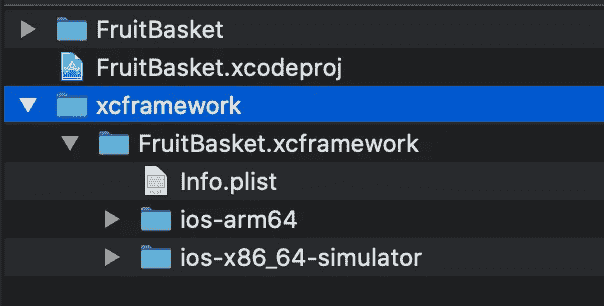

# 如果你也有 macOS 目标…

如果您也有 macOS 目标，那么您将调整脚本如下

```
IOS_SCHEME_NAME="YOUR_SCHEME_NAME_FOR_IOS"
MACOS_SCHEME_NAME="YOUR_SCHEME_NAME_FOR_MACOS"
FRAMEWORK_NAME="FruitBasket"SIMULATOR_ARCHIVE_PATH="${BUILD_DIR}/${CONFIGURATION}/${FRAMEWORK_NAME}-iphonesimulator.xcarchive"
DEVICE_ARCHIVE_PATH="${BUILD_DIR}/${CONFIGURATION}/${FRAMEWORK_NAME}-iphoneos.xcarchive"
MACOS_ARCHIVE_PATH="${BUILD_DIR}/${CONFIGURATION}/${FRAMEWORK_NAME}-macos.xcarchive" OUTPUT_DIC="./xcframework/"# Simulator xcarchieve
xcodebuild archive \
  -scheme ${IOS_SCHEME_NAME} \
  -archivePath ${SIMULATOR_ARCHIVE_PATH} \
  -sdk iphonesimulator \
  SKIP_INSTALL=NO # Device xcarchieve
xcodebuild archive \
  -scheme ${IOS_SCHEME_NAME} \
  -archivePath ${DEVICE_ARCHIVE_PATH} \
  -sdk iphoneos \
  SKIP_INSTALL=NO # MacOS xcarchieve
xcodebuild archive \
  -scheme ${MACOS_SCHEME_NAME} \
  -archivePath ${MACOS_ARCHIVE_PATH} \
  SKIP_INSTALL=NO # Clean up old output directory
rm -rf "${OUTPUT_DIC}" # Create xcframwork combine of all frameworks
xcodebuild -create-xcframework \
  -framework ${SIMULATOR_ARCHIVE_PATH}/Products/Library/Frameworks/${FRAMEWORK_NAME}.framework \
  -framework ${DEVICE_ARCHIVE_PATH}/Products/Library/Frameworks/${FRAMEWORK_NAME}.framework \
  -framework ${MACOS_ARCHIVE_PATH}/Products/Library/Frameworks/${FRAMEWORK_NAME}.framework \
  -output ${OUTPUT_DIC}/${FRAMEWORK_NAME}.xcframework
```

不要忘记更改方案名称以匹配您的名称，然后运行您的聚合目标并检查结果。

# 测试框架

从 xcode 创建一个新项目，单视图应用程序可以测试。

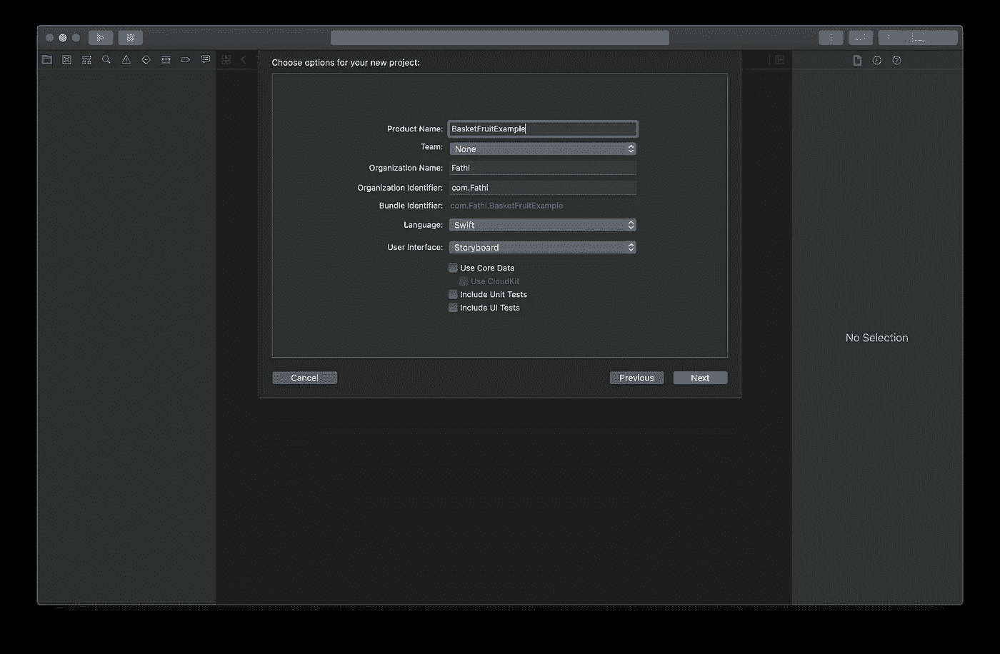

将刚刚创建的 xcframework 文件拖放到**框架、库和嵌入内容**中

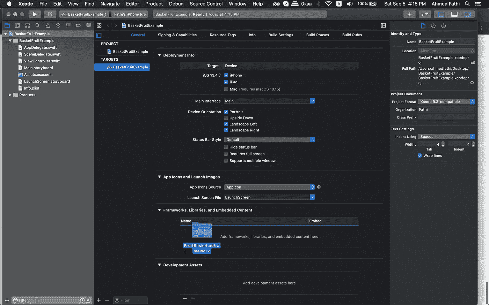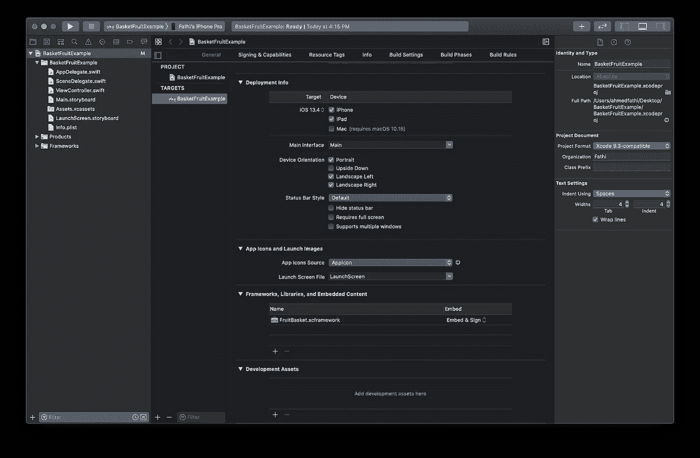

现在切换到您的视图控制器，导入框架并开始测试它。

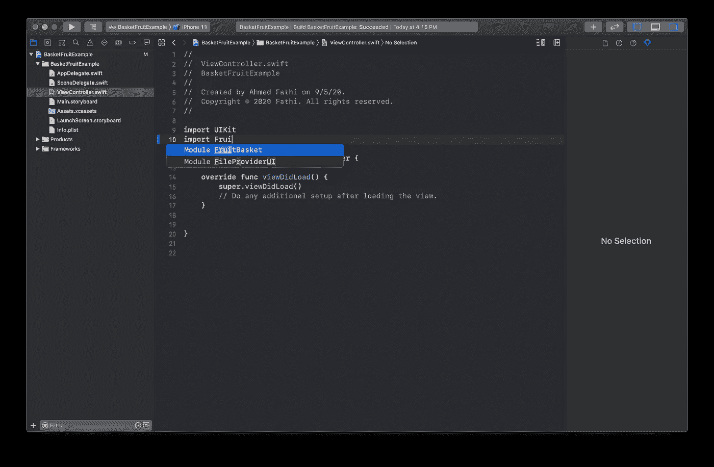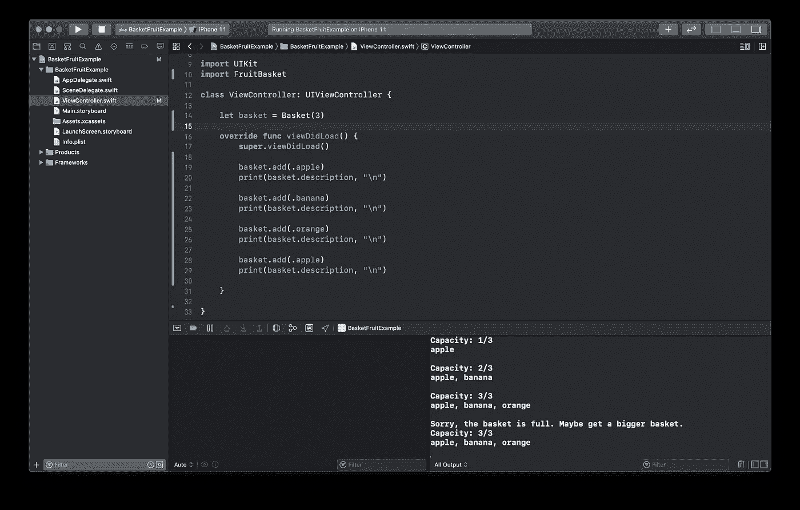

在模拟器和真实设备上运行它，它应该运行并给你相同的结果。

完整的代码在这个 [github repo](https://github.com/AhmedFathi680/FruitBasket/tree/aggregated-target) 上，确保你在**聚合目标**分支上。

谢谢你抽出时间。欢迎您的所有意见和想法。
[AhmedFathi680@gmail.com](mailto:ahmedfathi680@gmail.com)
[LinkedIn](https://www.linkedin.com/in/amfathi/)
[Github](https://github.com/amfathi)