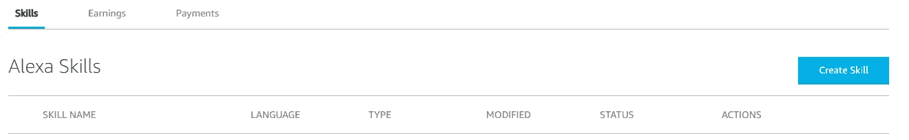
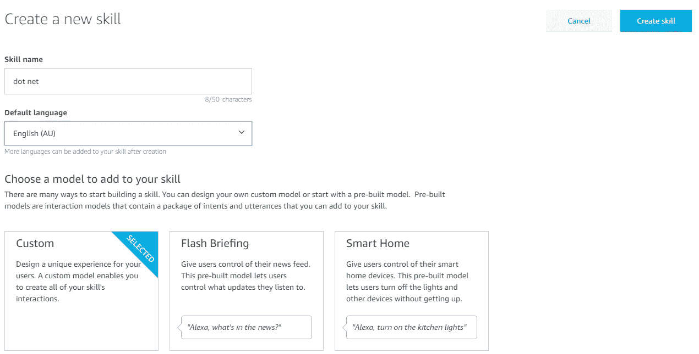
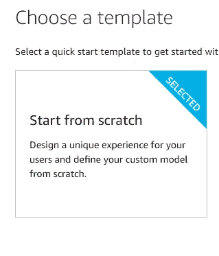
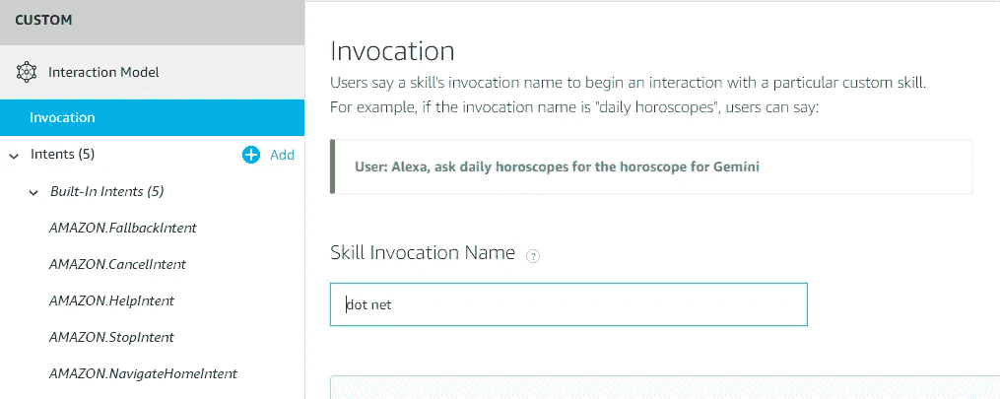
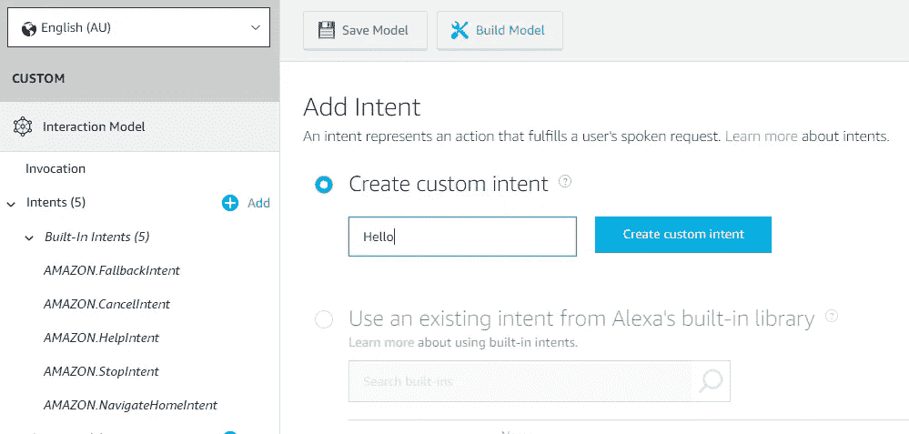
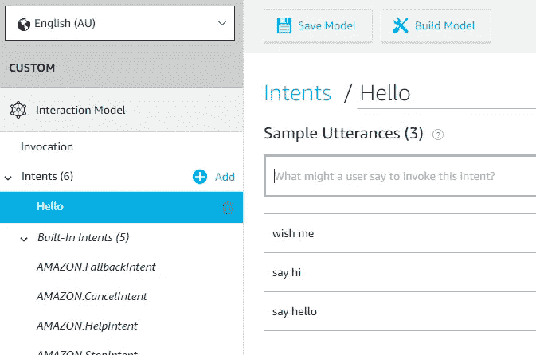
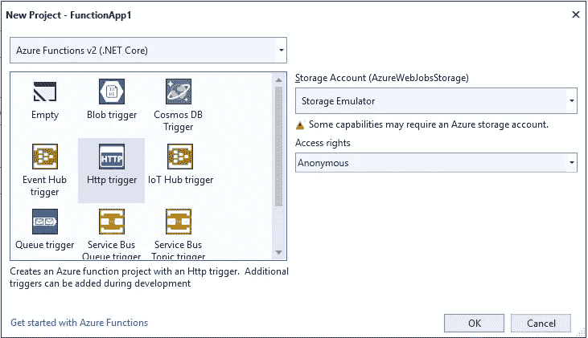
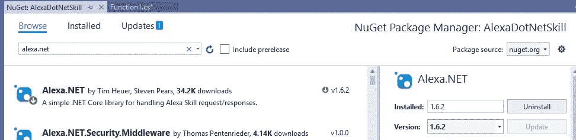
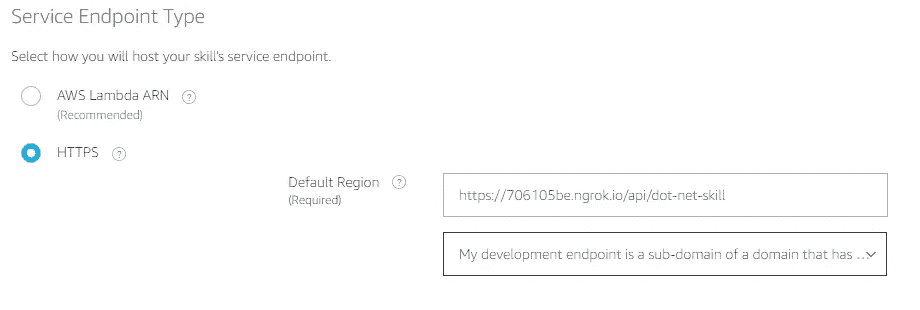
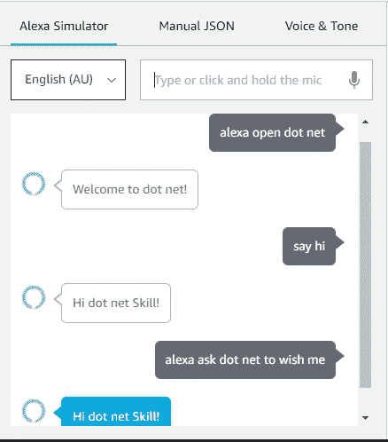

# 用 Alexa 和 Azure 函数建立你的第一个 Alexa 技能

> 原文：<https://levelup.gitconnected.com/build-your-first-alexa-skill-with-alexa-net-and-azure-functions-aa5a7ff75b55>

我有机会玩亚马逊 Echo 设备，我对语音交互的质量印象深刻。这促使我开始构建一个简单的 Alexa 应用程序。当我第一次听到 Alexa 技能这个词的时候，我并不太明白。亚马逊提出了这个创造性的术语“技能”，但它只不过是一个语音辅助应用程序。你可以建立各种各样的技能，最常用的是自定义技能。这包括订购披萨、预订搭车或购物语音应用程序等。

## **Alexa 技能如何发挥作用？**

我们对 Alexa echo 的语音请求被传输到 Alexa Could 服务。这是真正的奇迹发生的地方。在 Alexa Could Service，语音流通过使用*ASR——自动语音识别*被翻译成文本。使用*NLP——自然语言处理*，该文本被分解以识别用户意图。它构造用户意图并将其传递给 web 服务(REST API ), web 服务对其进行处理并发回响应。这个响应文本被传回 echo 设备，它将使用*SSML——语音合成标记语言*为您读出

下面是使用 Alexa.NET 和 Azure 函数构建自定义技能的分步指南。

你需要一个亚马逊开发者账户。如果你没有，在这里创建一个[。](https://developer.amazon.com/)

# 首先构建您的定制模型

1.  登录你的亚马逊开发者控制台，打开 Alexa 开发者控制台。找到“创建技能”按钮并点击它

2.给出一个技能名称(我选择了“点网”)，然后点击“创建”

3.保留默认选择(“从头开始”模板)

4.您将被导航到自定义模型构建页面。单击左侧窗格中的“调用”,保持名称不变。这是将用于调用我们的技能的名称。

5.点击“添加意向”按钮。这将用户意图带到后端服务。它可以是预订一个旅程，订购一个比萨饼等等。您将在后端识别它，然后处理它。这一个将是一个基本的，所以命名为“你好”。

6.点击“你好”意图并添加话语。当用户说出这些话语时，它将调用“你好”意图。

**在我们进入下一步**之前保存模型

# 构建一个 Azure 函数来处理您的意图

亚马逊强烈推荐 Lambda 表达式来处理语音命令。同时也支持微软生态系统。用 Azure 函数来做吧。

1.  创建一个 Azure 函数。选择“HTTP 触发器”并将“访问权限”设置为匿名

2.打开你的 Azure 功能，安装 Alexa.NET nu get 包

3.将以下代码粘贴到您的 Azure 函数中

# 综合

1.  现在你可以直接部署这个 Azure 功能，但是调试会很困难。我们将使用 ngrok 将我们的端口暴露给一个公共 URL，并在 dev 控制台中进行配置，以便我们可以进行调试。关注我在 ngrok 上的另一篇文章，通过 ngrok 将您的本地 web 服务器端口公开来获取您的 Azure 函数的公共 URL。这将有助于您在将它部署到 Azure 之前进行测试。

 [## 将 localhost 公开为公共 URL，并使用 ngrok 进行调试

### ngrok 是一个很棒的开源工具，它可以通过 SSL 将您的本地端口公开为一个公共 URL，您可以复制它…

levelup.gitconnected.com](/expose-localhost-as-a-public-url-and-debug-using-ngrok-8912a91e6740) 

2.从 ngrok 获得公开的 URL 后，在自定义模型中打开自定义模型配置端点。

# 测试

打开测试控制台，测试技能。如果 Azure 函数中有调试器的话，它会命中调试器。

下一次和我一起。这将是关于使用帐户链接的用户身份验证——它如何工作以及如何测试。我会尽最大努力尽快给你。