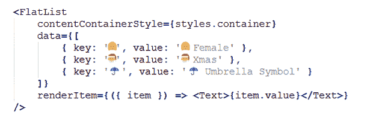

# 使用 React Native 在 10 天内构建您的移动应用

> 原文：<https://levelup.gitconnected.com/build-your-mobile-app-in-10-days-with-react-native-8c359fa39d50>

想知道如何在 2021 年仅仅 10 天内开发出你的第一个 REACT 原生应用吗？嗯，今天我们生活在一个高度科技驱动的世界，如果你走在正确的道路上，并配备了正确的工具，一切皆有可能。当谈到用 React Native 开发移动应用程序时，这种说法是 100%正确的。

在本帖中，我们将从概念的基础开始，详细介绍帮助您使用 REACT NATIVE 构建全功能应用的所有内容。因此，无论你是一个一直计划从新的 React 原生应用程序开始的企业家，还是一个从未有机会了解该框架的开发人员，这里都是你们开始的地方！

***简短说明:*** *到本文结束时，我们将拥有一个你肯定能够在真实设备或模拟器上运行进行测试的应用程序结构！*

> 那么让我们开始游戏吧！

在开始学习 React Native 的不同组件之前，有必要先了解一下框架的基础知识。因为我们被各种各样的技术、工具和框架所包围，这些技术、工具和框架无疑使应用程序开发人员的生活变得简单和有序，但另一方面，广泛的技术选择使每个人都陷入两难境地，即在不牺牲质量的情况下，以更少的时间和成本开发移动应用程序的最佳方法是什么。

跨平台应用程序开发的一大亮点是 React Native。它由脸书开发和支持，但目前正在被一些世界领先的品牌使用，包括 Instagram、Tesla、沃尔玛、Uber Eats、Discord、Wix 等。

# ***什么是 React Native？***

简而言之，React Native 是一个 JavaScript 库，允许应用程序开发人员创建一个外观、感觉和执行都非常像本机应用程序的应用程序。它使用与常规 iOS 和 Android 应用相同的基本 UI 构建模块。你所需要做的就是使用 JavaScript 和 React 把这些构件放在一起。使用 React Native 最令人兴奋的部分是，它使用几乎相同的概念来构建用于创建 web 应用程序的跨平台应用程序。

但是，React Native 没有 DOM，因为它利用了领先平台(包括 Android 和 iOS)提供的 UI 组件。它不像科尔多瓦或 PhoneGap 那样使用网络视图。React Native 的基本原则是将 React 引入移动应用程序开发，因此，它基于一次学习，随处编写。React Native 使用 *RCTBridgeModule* 在本机代码和 JavaScript 代码之间建立连接。

> **除此之外，以下是 React Native 的快速关键亮点:**

*   React Native 是一个开源框架，非常适合混合应用程序开发。
*   提供多种类似本机的 UI 组件选择。
*   React 原生应用程序包含 85%到 90%的由 JavaScript 和 JSX 代码组成的代码。

> **选择 React Native 进行应用开发的回报优势**

*   一个应用程序，目标是多个应用程序平台，包括 iOS、Android、Windows 或 Web，具有相同的代码库和工作。
*   它以对开发者的大量社区支持而自豪。
*   它为您的应用程序添加了本机支持，这意味着您可以选择适合您的用例或应用程序类型的本机代码。

***现在该何去何从？***

通过这篇简短的笔记，我们强烈鼓励那些刚刚开始使用 JavaScript 的人阅读这篇 React Native App 开发教程，因为我们已经以非常有序的方式列出了有价值的要点，即使是初学者也可以轻松掌握。

# **React 原生 App 开发教程入门**

要开始，您需要深入 React Native 的生态系统，并开始安装 React Native 设置的先决条件。

## **1。React 原生 App** 设置要求

由于您的目标是在 10 天内完成开发项目，因此，确保您已经为 React Native 创建了合适的环境。而 React 原生应用开发公司已经有了这样的东西做后盾，所以这是针对单独处理项目的开发者的。

*因此，要在您的机器上部署任何种类的 React 本地应用程序，您可能需要:*

> **机器依赖性:**

**Node.js:** Node.js 是使用 React Native 开发 JavaScript 代码所必需的。如果你还没有安装 Node.js，那么[点击](https://nodejs.org/en/)这里从官网获取。要构建 React 原生应用，建议使用 *LTS 10.x.x 版本*。

*   T21:这是一款脸书的产品，专门用来监视文件的变化。强烈建议安装以获得更好的性能。
*   **对于 iOS 用户:**你将需要*家酿* macOS 包来安装 *watchman: brew 安装 watchman* 。
*   **对于窗口用户:**没有看守人，所以你可以坚持使用 Node.js 和 *python2。*

*此外，无论您使用的是什么类型的机器，都要确保您已经从这里安装了 Java SE 开发工具包(JDK)。版本应该至少是> =8。*

> **要为特定平台设置原生 SDK，您需要:**

*   **iOS:** 确保你已经安装了 Xcode，Xcode 可以免费安装或者很可能已经预装在机器上。
*   Android: 对于 Android，我们建议您遵循这些指南。

## **2。安装 React**

第一步显然是安装 React。无论是聘请 [**手机 app 开发公司**](https://www.xicom.ae/solutions/mobile-app-development/) 还是自己做，大家都得顺着这个[环节](http://reactnative.dev/docs/getting-started)去追求*【入门】*文档。说到构建 React 原生应用，*有两种方法可以开始:*

*   没有工具链的 Creating-React-Native-App
*   从 CLI 构建 React 本机应用程序[npm install -g react-native-cli]

这两个选项之间的基本区别是决定你是否想要用 [Expo](https://expo.io/) 来构建你的 RN 项目。Expo 是一个工具链，它变成了 create-React-Native-App 库，消除了前端开发部分的各种障碍，并稍微加快了这个过程。

所以我们决定参加博览会，因为我们的目标是在 10 天内建立一个应用程序，而没有意识到这一事实，即这条路线将增加后端的障碍。

有了世博会，你可以消除前端的一些障碍。但是当你需要在开发生命周期中实现某些库时，你会很快理解 Expo 缺乏支持。

所以最后开始 React 原生应用的构建过程，我们的移动应用开发团队推荐你去安装***React-Native-CLI***。打开终端并运行以下命令。

> ***npm 安装-g react-native-cli***

> (CLI 是一个必不可少的工具，因为它用于构建一个包含开发和运行 React 本机应用程序所需的一切的启动项目。npm)

***为了确保你已经成功运行了 CLI 工具，你可以考虑下面这个命令:***

## **3。React 原生 App 的文件夹结构**

要开始这个项目，您需要使用刚刚安装的 CLI 工具创建一个项目目录。

***安装 React 后，建议您按照以下步骤开始创建文件夹结构:***

*   在根目录下添加一个文件夹，命名为“app”。
*   将 App.js 文件移动到名为 App 的根应用程序中。
*   接下来，将 index.js 导入语句更新为“import App from”。/app/App.js”。
*   最后，在“app”内部创建文件夹。

在您的终端中运行"*react-native init emojidictrn "*，并将其命名为您想要添加到项目目录中的任何名称。一旦你在终端中运行这个命令，一个名为“App”的文件夹就在你的系统中被创建了，它将会受到广泛的文件选择的欢迎，如下图所示。

[图片来源](https://austinhale.medium.com/building-a-mobile-app-in-10-days-with-react-native-c2a7a524c6b4)

> **但是从上面的图片中，让我们告诉你什么文件或目录对你的项目是必不可少的:**

*   **App.js:** 这是 React Native app 中的第一个文件，实际上是作为开发过程的一个入口点。无论你在这个文件中写了什么代码，都会直接反映到移动设备上。
*   **Node_Module:** 这是一个主文件夹，包含了开发和运行这个项目所需的所有基本依赖项或包。
*   **Package.json:** 这是一个文件夹，您可以在其中找到所有已安装的依赖项的列表。
*   **Index.js:** 是在设备或模拟器上触发 app 的入口。
*   **iOS:** 一个文件夹，包含一个 Xcode 项目和为 iOS 设备引导此应用程序所需的代码集。
*   **Android:** 一个文件夹，保存所有 Android 相关的代码，为 Android 设备引导这个应用程序。

> **除了文件夹结构，记住你需要的应用程序的条款和功能:**

**屏幕:**这些是该应用程序的主要视图。

**资产:**基本上你在这个目录里会有两个文件夹——图片和动画。

**组件:**您将在这里存储所有共享的组件。

配置:在这里你可以在 Color.js 文件中设置你的应用程序的配色方案，以方便管理。

从现在起，你可以忽略这些文件，把你的注意力放在运行你的项目的步骤上。

## **4。运行应用程序**

为了运行您的应用， *react-native-cli* 工具附带了一些默认的代码片段，可以为您的应用添加一些操作。你只需要使用终端运行应用程序。

所以对于 iOS，我们使用模拟器，对于 Android，你可以使用模拟器。请记住，我们没有对代码做任何更改。因此，要运行 app，只需运行*“NPM start”*命令即可。它将启动 metro bundler 来跟踪项目中. js 文件的任何更改。

但是，在为 iOS 和 Android 构建项目时，请确保该命令在单独的窗口中运行。

> 让我们从应用程序运行开始:

> **在 iOS 上运行应用**

无论你有多少个屏幕或者它有什么样的内容，你只需要在另一个窗口运行这个命令*“react-native run-IOs*”。

此命令将开始构建您的应用程序，并在 iOS 模拟器上启动它。因为您是第一次构建这些文件，所以这个过程将会花费一些时间。*一旦该过程完成，您的设备将打开如下图所示的屏幕:*

要在任何特定的 iOS 设备上运行您的应用程序，您需要添加一个标志并运行命令*“xcrun sim CTL list devices*”。比如你需要为 iPhone 11 构建并运行一个 app，那么你可以运行这个“*react-native run-IOs—simulator = " iPhone 8 Plus*”命令。

> **运行在安卓系统上**

要运行 React 原生 Android 应用程序，您需要一台 Android 设备。此外，您可以选择一个 Android 虚拟设备，它允许您在您的计算机上模拟 Android 设备。

要在 Android 模拟器上运行您的应用程序，请打开 Android studio 并选择选项“*打开现有项目/文件夹*”。如果您试图在虚拟设备上运行它，那么您可以从另一个终端窗口运行命令“*react-native-run-Android*”。

完成后，您将看到此屏幕！

一旦您的项目成功构建，您将在屏幕上看到这条消息！

[图像来源](https://www.javatpoint.com/react-native-first-app-hello-world)

> **简短提示:要在两台设备上查看应用程序的运行情况，您可以使用下面提到的代码，该代码可在 App.js 中找到。**

在 iOS 上按下*“Cmd+R”*，在 Android 设备上按下双*“R”*，就可以很容易地在你的屏幕上看到这些代码的结果。您将看到如下图所示的屏幕。

> **但是，请记住，该文件在根目录的*“index . js”*中呈现这个 App 组件。你可以考虑下面的代码:**

AppRegistry 是应用程序的任何应用程序组件和根组件应该通过使用*" appregistery . register component "*注册的入口点。使用这段代码的目的是通过启动*“appregistry . run application”*，让原生系统加载 app 的捆绑包，运行 app。

有了所有这些步骤和说明，你已经成功地开发了你的项目，现在轮到用其中的组件开发一个应用程序了。

# **开发 React 原生 App 的基本步骤**

要开始任何应用程序开发项目，您需要创建一个已经使用 CLI 工具生成的项目。现在，下一步是收集组件来构建应用程序。

组件是您在 React Native App 的屏幕上实际看到的可视元素。通过选择最好的 [**应用程序开发公司**](https://www.xicom.ae/solutions/mobile-app-development/) ，你可以很容易地克服这一步，*但我们仍然涵盖了可供 React 原生核心使用的主要组件。*

*   基本或核心组件包括文本、图像、视图、滚动视图、文本输入、样式表。
*   用于列出产品的组件，如 Flatlist 和 SectionList。
*   为您的应用程序添加功能的 UI 组件有选择器、滑块、按钮、开关等。
*   Android 特定组件，如 ToastAndroid、ViewPagerAndroid、TimePickerAndroid、DatePickerAndroid、PermissionsAndroid 等。
*   iOS 特定组件包括 ActionSheetIOS、SegmentedControlIOS、AlertIOS、PushNotificationsIOS 等。
*   其他组件包括提醒，动画，相机滚动，尺寸，剪贴板，状态栏，键盘，链接，活动指示器，WebView 和模式等。

还没完呢！React Native core 中有更多可用的组件和 API，您可以根据项目的需要从官方文档中选择。

> 让我们开始开发流程…
> 
> **因此，在进入开发流程之前，决定你到底要在你的应用中开发什么。**

由于我们的目标是在 10 天内开发一个应用程序，因此，我们将继续使用这个小应用程序，让您熟悉基本组件，并使您能够开始使用这个应用程序。

***你的 app 最终结果会是这样的下图:***

> **让我们开始这个应用程序的编码…**

开发这个页面只需要快速的努力，因为这个文本直接来自组件的状态。

你需要做的就是在项目的根目录下创建一个新的 *src/components* 目录，在组件内部创建一个名为 *Emojidict.js* 的文件，它实际上将这些表情添加到屏幕上。

这是代码。

***现在正如我们上面提到的，你可以使用下面的代码修改 App.js 文件来显示组件。***

如果您在运行这些代码后检查模拟器上的屏幕，您会在屏幕上发现以下结果。

是的，首先，您需要考虑 *EmojiDict* 文件，然后继续从 React Native 导入基本组件。之后，是时候使用视图组件了，它通过 CSS 放置了一个支持带有 *flexbox* 和其他样式的布局样式的容器元素。您可以使用*样式表*向视图添加样式。因此，简而言之，您可以说视图组件主要用于子元素的样式和布局。

***现在轮到使用下面的代码通过文本组件添加文本了。***

***这些编码的最终结果将是:***

最后，我们已经完成了我们的第一个 React 原生应用，我们建议你 [**雇佣移动应用开发者**](https://www.xicom.ae/services/mobile-app-developers/) 来超越这个功能。要开发一个成熟的应用程序，需要集成多种特性和功能，比如推送通知、UI 设计、用户注册、点击按钮等等。因此，我们建议你去寻求专家的指导。

# **结论**

如果您最终决定为您的业务开发一个跨平台的应用程序，那么 React Native 无疑是最受欢迎的框架选择之一，它使您能够构建具有漂亮的本机 UI 的应用程序。通过本教程，希望你已经学会了如何在 10 天内开始使用基本的 React Native 应用程序。

这个教程真的很管用，如果你准备投入长时间沉迷于学习 app 开发的过程。休息，建议雇佣一家 [**移动应用程序开发公司**](https://www.xicom.ae/solutions/mobile-app-development/) 帮助你开发一款完全符合你业务需求的全功能应用程序。

# 分级编码

感谢您成为我们社区的一员！ [**订阅我们的 YouTube 频道**](https://www.youtube.com/channel/UC3v9kBR_ab4UHXXdknz8Fbg?sub_confirmation=1) 或者加入 [**Skilled.dev 编码面试课程**](https://skilled.dev/) 。

 [## 编写面试问题+获得开发工作

### 掌握编码面试的过程

技术开发](https://skilled.dev)