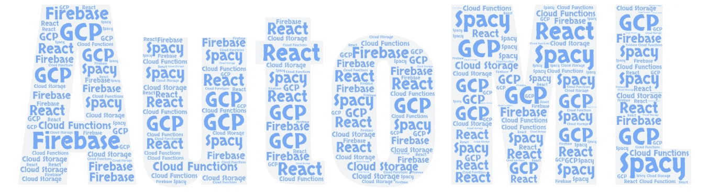
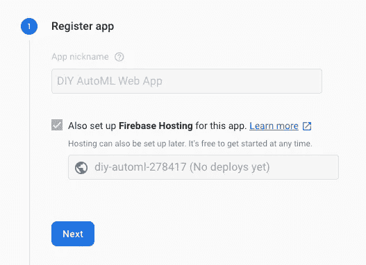
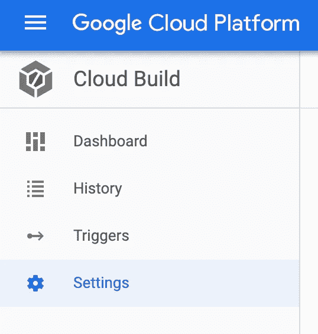

# 使用 spaCy & Firebase 建立你自己的自动文本分类。(第一部分)

> 原文：<https://levelup.gitconnected.com/build-your-own-automl-text-classification-using-spacy-firebase-part-1-6093a59dd32c>



AutoML 是谷歌的一套出色的产品，为那些想要利用机器学习(ML)的人降低了准入门槛。它允许您上传数据集，并负责为您创建机器学习模型。然后，它托管模型供您使用。可以想象，这对那些想利用机器学习但在创建和部署模型方面经验有限的人来说非常有用。然而，正如我从惨痛的教训中了解到的那样，运营成本可能会变得很高。谷歌对托管模型的使用收费，随着时间的推移，这可能会增加。

考虑到这一点，[我](https://www.linkedin.com/in/andrew-hayes-belfast/)认为用一些现成的工具和库创建我自己版本的 AutoML 会很有趣。我的目标是创造一个简单易用、低成本的 AutoML 替代品，几乎和 T2 的一样好。而 AutoML 涵盖了许多内容，如计算机视觉和一些类型的自然语言处理(NLP)。这个版本将只关注 NLP 的文本分类部分。在这些文章中，我将解释我是如何做到的，并带您构建自己的。

第 1 部分(本文)将解释我使用的工具、项目架构以及如何配置它。[第 2 部分](https://medium.com/@adhayes88/build-your-own-automl-text-classification-using-spacy-firebase-part-2-3cd08e4298da)将着眼于将它们粘合在一起的代码，并带你完成代码的部署。完整的源代码可以在 GitHub 页面上找到:[https://GitHub . com/Andrew-Hayes/DIY-auto-ml-with-spacy-and-GCP/tree/v 1 . 0 . 0](https://github.com/Andrew-Hayes/diy-auto-ml-with-spacy-and-gcp/tree/v1.0.0)，我建议您创建它的一个分支，并在您的本地机器上克隆它，因为我在整篇文章中经常提到它。为了保持一致，本文引用分支“v1.0.0”。您还应该安装 javascript 包管理器:' [npm](https://www.npmjs.com/get-npm) '。

# 分解问题

为了重新创建 AutoML，我们必须分解它的各个方面，并依次解决它们。那么，我认为制作我自己版本的 AutoML 需要解决的主要问题是什么呢？

1.  上传数据集的能力
2.  分析数据集注释并向用户显示它们的统计数据
3.  在数据集上训练文本分类机器学习模型
4.  部署模型
5.  告知用户如何使用该模型

虽然有些问题比其他问题更容易解决，但没有一个是不可克服的。问题 1、2 和 5 很容易解决，而 3 和 4 是比较难的部分。

# 解决简单的问题

当创建一个 web 应用程序时，我的首要解决方案是将 [Firebase](https://firebase.google.com/) 和 [React](https://reactjs.org/) 结合起来。Firebase 是谷歌的另一个工具套件，它使创建和部署大多数 web 应用程序变得容易。React 是一个 javascript 库，当与[语义 UI](https://react.semantic-ui.com/) 结合使用时，使得 web 应用 UI 的创建变得简单。

根据经验，我知道这种组合可以解决大多数需要的东西。Firebase 为云存储提供了库，为处理后端请求提供了云函数，并提供了一个数据库来存储所需的统计/数据。所以剩下的就是模型训练和部署，这能有多难？

# 解决困难的部分…

机器学习并不容易，然而，有很多聪明人在制作工具，帮助我们其他人变得更容易。谈到自然语言处理，我的首要解决方案是 [spaCy](https://spacy.io/) 。SpaCy 是一个生产就绪的 python 库，速度非常快，更重要的是，它具有机器学习功能。所以它非常适合我们的 AutoML 版本。我们可以使用 SpaCy 来创建我们需要的文本分类 ML 模型，然后您需要担心的就是部署它。为此，你可以使用谷歌的“云构建”和“云运行”。Cloud Build 是一个持续集成工具，您可以使用它将我们的模型放入 docker 容器，然后它可以将该容器部署到 Cloud Run。Cloud Run 是一种无服务器的容器运行方式，因此是托管我们模型的最佳场所。

# 体系结构

这张图应该有助于形象化我使用的设置。


DIY AutoML 的基本架构

AutoML 工作流适合项目，如下所示:

1.  使用 firebase 存储库，用户可以将他们的数据集上传到谷歌的云存储中。
2.  当上传完成时，它会触发一个云函数来分析上传的数据集，并将统计数据保存到数据库中。
3.  如果用户对数据集满意，他们可以触发云功能开始训练。这将把数据集发送到云构建，云构建将从代码存储库中获取空间代码，并使用它来训练容器中的文本分类模型。
4.  一旦构建了包含模型的容器，Cloud Build 将使用新构建的容器部署云运行服务。然后，Cloud Run 将提供一个服务 URL，用户可以调用它来对文档进行分类
5.  将 URL 保存到 DB，DB 将使用如何使用该模型的说明来更新 UI

正如你所看到的，Firebase 和 spaCy 完成了大部分繁重的工作。Firebase 还附带了一个慷慨的免费层，这将有助于保持低运行成本。因此，让我们开始设置！

# 配置

要运行这个项目，您需要配置一些东西。一旦完成，您就可以部署代码并开始使用您自己的 AutoML 了。您需要配置的是:

1.  创建一个 Firebase 项目，启用 Firestore 数据库、Firebase 功能、Firebase 托管和 Firebase 存储
2.  Firebase 会自动创建一个 GCP 项目，在这个项目中，您需要启用云运行、云构建和其他一些功能
3.  最后，您需要在 GCP 项目上启用源代码库，并将其链接到这个项目的 GitHub 分支。

要创建 Firebase 项目，请转到 [Firebase 控制台](https://console.firebase.google.com/)。单击 add new project 并为其命名，在本例中为“Make your own AutoML”。


项目创建完成后，点击左侧的“数据库”选项卡。在这里，您可以创建 Firestore 数据库。


我选择以“生产模式”开始我的工作，并把它放在欧洲，因为那里离我更近，但是你可以选择最适合你的方式。创建好数据库后，单击“认证”,这样就可以启用登录了。


然后点击“登录方式”选项卡，并启用“电子邮件/密码”登录选项。


然后导航回“用户”选项卡，将自己添加为用户。

设置好登录方法后，在左侧菜单中单击“存储”部分，导航至该部分。


点击“开始”设置存储，现在只接受默认设置。这将为您创建一个默认桶，并初始化所需的基本设置。存储设置完成后，单击“项目概述”返回主控制面板。在这里，您可以创建一个“web 应用程序”:


我将我的网络应用命名为“DIY AutoML 网络应用”,并勾选了“Firebase 托管”选项。它在这一点上提供了一些配置代码，但是我现在忽略了它。



之后，它解释了如何在 CLI 中安装 Firebase:


安装完成后，您就可以在您的机器上启动 Firebase 项目了:


确保您位于“v1.0.0”分支，并运行“DIY-auto-ml-with-spacy-and-GCP/DIY-auto-ml-ui”目录中的“firebase init”。它会询问要激活哪些 firebase 服务，您应该选择' *Firestore* '、 *Functions* '、 *Hosting* 和' *Storage* 。


一旦你选择了这些，选择“*使用现有的项目*”并选择你刚刚创建的项目。然后会询问 Firestore 规则使用什么文件，只需按回车键。然后它会询问你是否想要覆盖本地文件，键入' *N* '。


它将对" *Firestore indexes* "进行同样的操作，同样只使用默认文件，并在询问您是否要覆盖它时输入' *N* '。然后它会询问函数使用什么语言，选择“ *Javascript* ”。之后它会问你是否想使用 ESLint，我选择了' *N* '。当询问是否要覆盖' *functions/package.json* '文件时，输入' *N* '。然后，当它询问您是否要覆盖' *functions/index.js* '时，再次输入' *N* '，当它要求覆盖' functions/时，再次输入' *N* '。gitignore。它还会询问“*您是否希望现在安装与 npm 的依赖关系*”，您应该键入“ *Y* ”。

一旦安装了依赖项，它将询问'*您希望使用什么作为您的公共目录？*你应该把它设置为*构建*。


现在，它会问'*配置为单页 app(将所有网址重写为/index.html)？*而你应该输入 *Y* 。最后，它将询问‘什么文件应该用于存储规则？ **'** 你只要按下回车键就可以使用默认。现在你的 firebase 项目已经设置好了！

接下来，您需要为 Firebase 添加一些权限，以生成“签名的 URL”(将数据集发送到容器)，启动云构建并部署到云运行。当你创建一个 Firebase 项目时，它会自动创建一个 GCP 项目。所以打开 [GCP 控制台](https://console.cloud.google.com/)，从顶部的下拉菜单中选择你创建的项目。


然后，您可以启动一个“云外壳”终端来配置 Firebase 服务帐户的权限。为此，请单击控制台右上角的“激活云外壳按钮”:


这可能需要一段时间来启动，但是一旦启动，您就可以运行这些命令(用您的项目 ID 替换<project_id>:</project_id>

```
gcloud projects add-iam-policy-binding <PROJECT_ID> --member=serviceAccount:<PROJECT_ID>@appspot.gserviceaccount.com --role=roles/iam.serviceAccountTokenCreatorgcloud projects add-iam-policy-binding <PROJECT_ID> --member=serviceAccount:<PROJECT_ID>@appspot.gserviceaccount.com --role=roles/cloudbuild.builds.builder
```

这将向 Firebase 服务帐户添加“serviceAccountTokenCreator”、“cloudBuildBuilder”和“cloudRunAdmin”角色，并允许它生成签名的 URL、启动云构建并部署到云运行。您还需要启用一些 API:IAM API、云资源管理器 API、容器注册 API 和云运行 API。为此，在您的云终端中运行以下命令:

```
gcloud services enable iam.googleapis.comgcloud services enable cloudresourcemanager.googleapis.com
```

接下来，您需要启用“云构建”，这样您就可以构建您的模型了。单击左侧菜单中的“云构建>仪表板”:


然后点击“启用”:


恼人的是，云构建需要一个计费账户才能工作，所以你应该启用它。好消息是，你每天有 120 分钟的免费构建时间，这将使你能够免费构建模型，如果你把它们间隔几天的话。启用 API 后，您需要设置一些权限来允许云构建服务部署到云运行。为此，请单击左侧的云构建设置



然后启用“云运行管理员”角色:


它可能会要求额外的权限，所以也要启用它们:


云构建现在将能够部署云运行服务。然后，您需要启用云运行。点击左侧菜单中的“云运行”


一旦加载，点击“开始使用云运行”,这将启用云运行 API。

最后的配置步骤是将我们的 GitHub repo 链接到我们的 GCP 项目，这样您就可以在云构建中使用代码了。这样做的第一步是在 GitHub 中派生存储库。转到 GitHub 上的[库，点击右上角的‘Fork’](https://github.com/Andrew-Hayes/diy-auto-ml-with-spacy-and-gcp/tree/v1.0.0)


这样，它将位于您自己的名称空间下，当您将 GitHub 帐户链接到 GCP 时就可以使用了。一旦你有回购分叉，回到 GCP 控制台点击左侧菜单中的“源库”。


然后，您可以单击屏幕右上角的“添加存储库”:


这将打开一个模式来创建一个新的存储库或选择一个现有的存储库。选择“连接外部存储库”:


然后你需要让 GCP 访问你的 GitHub 库。一旦它被链接，它会显示一个你的库列表，选择你刚刚创建的 diy-auto-ml-with-spacy-and-gcp 分支，然后点击“连接选择的库”。一旦连接上，您就拥有了需要配置的一切！

# 摘要

在本文中，您了解了 DIY AutoML 项目的体系结构。您还在 GCP 配置了一些东西，即:

1.  设置一个具有 DB、托管、云存储和云功能的 Firebase 项目。这将允许您托管项目的 web 界面并上传数据集以进行模型训练。
2.  在您的项目上启用云运行和云构建。这将允许您训练和部署模型。
3.  将您的项目链接到 GitHub 上的资源库。这将允许您利用空间代码并快速构建您的模型。

现在一切都配置好了，你可以前往[第二部分](https://medium.com/@adhayes88/build-your-own-automl-text-classification-using-spacy-firebase-part-2-3cd08e4298da)。在[第 2 部分](https://medium.com/@adhayes88/build-your-own-automl-text-classification-using-spacy-firebase-part-2-3cd08e4298da)中，我将讨论用于将关键组件粘合在一起的代码以及如何部署它们。