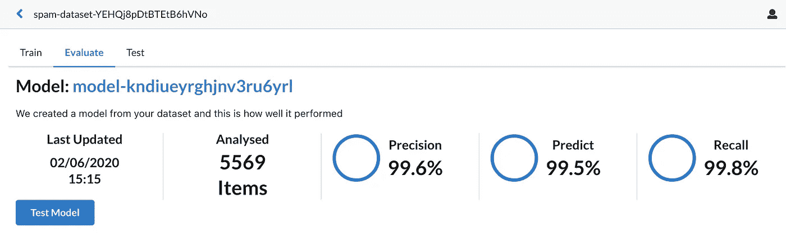

# 使用 spaCy & Firebase 建立你自己的自动文本分类。(第二部分)

> 原文：<https://levelup.gitconnected.com/build-your-own-automl-text-classification-using-spacy-firebase-part-2-3cd08e4298da>


这是使用 spaCy 和 Firebase 等现成组件创建自己的 AutoML 文本分类器指南的第 2 部分。在第一部分、[和](https://www.linkedin.com/in/andrew-hayes-belfast/)中，我谈到了项目的架构以及如何设置运行项目所需的各种组件。在本文中，我将讨论将各部分粘合在一起所需的关键代码，然后讨论如何部署代码。该项目的完整代码可以在[回购](https://github.com/Andrew-Hayes/diy-auto-ml-with-spacy-and-gcp/tree/v1.0.0)中找到，具体分支为“v1.0.0”。我不会检查每一段代码，只检查需要的关键部分。如果您只想部署它，请跳到底部的部署步骤。

# 关键零件

概括地说，要得到一个类似 AutoML 的文本分类器，需要解决的 5 个主要问题是:

1.  上传数据集的能力
2.  分析数据集注释并将它们显示给用户
3.  在数据集上训练文本分类机器学习模型
4.  部署模型
5.  告知用户如何使用该模型

在第 1 部分中，我提到了可以用来解决这些问题的工具。Firebase(带云存储和云功能)可以解决 1、3、5。SpaCy 可用于训练模型，从而求解 3。最后云构建和云运行相结合解决 4。因此，现在我将逐一介绍，向您展示如何使用这些工具来解决这些问题。

# 1.上传数据集

Firebase 附带了“ [Firebase Storage](https://firebase.google.com/docs/storage) ”，这是一个谷歌云存储集成。这意味着您可以使用 Firebase 库来上传数据集。Firebase 将处理身份验证、存储桶配置和文件检查。在这个项目中，我设置了规则，只有登录的用户才能上传文件，并且文件必须小于 50mb。代码本身取自 [Firebase 存储上传文档](https://firebase.google.com/docs/storage/web/upload-files)。当用户点击“上传”时，该功能在 UI 中:

如你所见，它几乎是直接从文档中复制的。它获取用户选择的文件，并要求 Firebase 存储库上传它。然后，它会要求定期更新上传进度。关键区别在于，它为数据集创建了一个新的 Firestore 条目，并对“状态”管理做出了一些反应。该文件的完整代码可以在[这里](https://github.com/Andrew-Hayes/diy-auto-ml-with-spacy-and-gcp/blob/v1.0.0/diy-auto-ml-ui/src/components/upload/Upload.js#L58-L122)找到。需要的另一部分是上传的规则。这就是 Firebase 如何知道什么是允许的，什么是拒绝的。这是通过更改“storage.rules”文件来实现的。这些规则基于 [Firebase 安全规则文档](https://firebase.google.com/docs/storage/security/start)。

规则相当简单，用户必须登录，文件大小必须小于 50mb，文件类型必须是 CSV，元数据必须包含所有者的电子邮件地址。有了这些规则，Firebase 可以确保上传正确类型的数据，数据不会太大，并且可以将其链接回所有者。这些规则可以在回购[这里](https://github.com/Andrew-Hayes/diy-auto-ml-with-spacy-and-gcp/blob/v1.0.0/diy-auto-ml-ui/storage.rules)找到。有了这些关键代码片段，你可以允许用户上传他们想要分析的数据集。

# 2.分析数据集注释并显示它们

现在，用户可以上传数据集，你会想用它们做一些有用的事情。在 AutoML 中，它提取文本上使用的注释和每个注释的统计信息。在回购的[样本数据](https://github.com/Andrew-Hayes/diy-auto-ml-with-spacy-and-gcp/blob/v1.0.0/sample-data/spam_dataset.csv)中，短信上有‘垃圾’和‘火腿’标注。因此，当用户上传数据集时，您希望显示这些注释的明细。示例:


在这里，您可以看到样本数据注释统计信息已经从数据集中提取出来。为此，您可以利用 Firebase 云函数触发器，更具体地说，就是 Firebase 存储[云函数触发器](https://firebase.google.com/docs/functions/gcp-storage-events)。为此，需要一个监听最终文件事件的函数。

一旦数据集上传完成，这个函数将被自动调用。然后，它会将文件下载到内存中(50mb 的大小规则确保它不会使功能崩溃)。一旦下载，它将解析 CSV 并检查其格式是否正确。然后，它收集注释统计信息，并将它们保存到数据库中。然后可以在 UI 中向用户显示它们。完整的代码可以在这里找到[。](https://github.com/Andrew-Hayes/diy-auto-ml-with-spacy-and-gcp/blob/v1.0.0/diy-auto-ml-ui/functions/index.js#L452-L536)

# 3.在数据集上训练文本分类机器学习模型

现在是最难的部分，创建文本分类机器学习模型。此时，用户可以上传他们的数据集并查看注释统计，但是他们还不能对数据集做任何有用的事情。幸运的是，spaCy 使得创建文本分类模型变得相对容易。 [spaCy docs](https://spacy.io/usage/training#textcat) 给出了一个很棒的例子来创建一个可以适应我们需求的文本分类器。它利用一个 spaCy 预训练模型来实现迁移学习，因此我们的新模型只需调整参数即可工作。它还被设计为在 CPU 上运行，因此可以在云构建环境中运行。两者结合起来将节省大量的时间和精力。 [spaCy docs](https://spacy.io/usage/training#textcat) 中的例子是将 IMDB 评论分为“正面”或“负面”，然而，只需稍作调整，它就可以变得更加通用。只需稍作修改，它就可以加载数据并基于数据集动态生成标签，而不是硬编码。

代码将读入数据集，解析出标签和文本数据。然后将它们分成训练集和测试集。然后这些可以被传递到 spaCy 文本分类管道来训练它。一旦完成训练，它会将新的空间模型保存到磁盘，以便在其他地方重用。其代码与 spaCy 示例中的代码几乎相同:

训练模型的完整代码可以在[这里](https://github.com/Andrew-Hayes/diy-auto-ml-with-spacy-and-gcp/blob/v1.0.0/containers/classifier/create_model.py)找到。

# 4.部署模型

创建机器学习模型只是成功的一半，实际机器学习中经常被忽略的一部分是部署该模型以便可以使用。使用修改后的空间代码能够创建模型，那么可以用什么来部署它呢？

这是您将利用云构建和云运行的地方。Cloud Run 是一个以无服务器方式运行容器的工具。这意味着您可以给云运行一个容器，它将为您部署该容器并负责确认管理。所以你需要做的就是把 spaCy 代码创建的文本分类模型放到一个容器中，交给 Cloud Run，剩下的事情就交给它了。这样做的方法相当简单，您创建一个运行模型训练代码的 Docker 文件，代码输出模型，Docker 将模型打包到一个容器中供云运行。docker 文件如下所示:

这个文档分为两部分。第一部分接受数据集的 URL 并下载它。然后它调用模型训练空间代码。该代码使用数据集对模型进行定型并保存它。第二部分采用经过训练的模型，并将其包装在一个简单的 HTTP web 服务器中。这允许 Cloud Run 部署和调用容器。可以在报告[这里](https://github.com/Andrew-Hayes/diy-auto-ml-with-spacy-and-gcp/blob/v1.0.0/containers/classifier/Dockerfile)找到 Dockerfile 文件。

既然可以将模型构建到容器中，那么就可以使用 Cloud Build 将其部署到 Cloud Run。为了让云构建工作，需要一个构建配置来告诉 it 从哪里获取代码以及构建它需要哪些步骤。在这种情况下，它将从链接到 GitHub 存储库的源存储库中获取代码。那么构建代码的步骤如下:

1.  接受数据集的 URL，并将其传递给 Dockerfile。然后使用 docker 文件创建一个包含文本分类模型的容器。
2.  将容器上传到容器注册表，以便 Cloud Run 可以部署它。
3.  告诉 Cloud Run 使用新创建的容器部署服务。

用于此目的的云构建配置 JSON 如下所示:

下一个问题是如何让这个配置进入云构建，因为它通常是通过静态构建触发器来完成的。最简单的方法是使用云构建 API。恼人的是，以这种方式触发构建的文档很少。然而，它可以使用谷歌 API 客户端完成，只需将上面的配置发布到 API，完整的代码可以在回购[这里](https://github.com/Andrew-Hayes/diy-auto-ml-with-spacy-and-gcp/blob/v1.0.0/diy-auto-ml-ui/functions/index.js#L313-L451)找到。为了使用户能够利用这一点，对 API 的调用被放在一个 [Firebase 可调用函数](https://firebase.google.com/docs/functions/callable)中。这意味着 Firebase 将代码部署为云函数，但允许在 UI 中调用它，就像它是本地函数一样。在 UI 中，事情就像这样简单:

```
var train_model = functions.httpsCallable('train_model');
train_model({ datasetID: this.state.datasetID })
.then(() => {...
```

UI 中的完整代码可以在[这里](https://github.com/Andrew-Hayes/diy-auto-ml-with-spacy-and-gcp/blob/v1.0.0/diy-auto-ml-ui/src/components/datasetView/DatasetView.js#L104-L115)找到。

这样，当用户单击“训练模型”按钮时，它将执行以下操作:

1.  该按钮将调用本地“train_model”函数，该函数又调用“train_model”云函数。
2.  云函数获取数据集，生成一个 URL 并将其传递给云构建 API。
3.  Cloud Build 创建一个容器，从 URL 下载数据集并训练文本分类模型。
4.  然后，模型被包装在容器中的 web 服务器中，容器被存储。
5.  然后，Cloud Build 告诉 Cloud Run 部署新创建的容器。
6.  模型部署完毕！

# 5.告知用户如何使用该模型

所有这一切的最后一步是通知用户如何利用部署的模型。谢天谢地，GCP 让这变得相当容易。每当云构建完成时，它都会向“云构建”[发布/订阅](https://cloud.google.com/pubsub/docs/)主题发送一条消息。因此，您所要做的就是创建一个云函数，该函数监听有关“云构建”主题的消息，并在部署完成时将详细信息记录到 Firestore DB 中。例如:

```
exports.build_updated = functions.pubsub.topic('cloud-builds').onPublish((message) => {
   const buildMessage = message.json ? message.json : undefined;
   console.log(buildMessage);
```

每当云构建完成时，这个云函数将被自动调用。在其中，您可以解析已经完成的构建的详细信息。使用这些细节，您可以获得新部署模型的云运行 URL，并将其保存到 DB。然后，用户可以使用该 URL 来利用他们的模型。做所有这些的完整代码可以在回购[这里](https://github.com/Andrew-Hayes/diy-auto-ml-with-spacy-and-gcp/blob/v1.0.0/diy-auto-ml-ui/functions/index.js#L32-L117)找到。

# 部署

现在是有趣的部分！部署代码以便您可以使用它！幸运的是，Firebase 让这变得简单，我知道这很令人震惊。如果您已经完成了第 1 部分中的所有配置步骤，那么只需要再部署几个步骤。

第一部分是将 Firebase 项目的 API 键复制到代码中。可以通过进入 [Firebase 控制台](https://console.firebase.google.com/)并导航到项目设置来访问密钥。


向下滚动并选择“配置”单选按钮:


这将显示一段带有 Firebase API 配置的代码，复制它并替换代码[中的配置。之后，你需要在](https://github.com/Andrew-Hayes/diy-auto-ml-with-spacy-and-gcp/blob/v1.0.0/diy-auto-ml-ui/src/components/fire.js#L4-L13)[这里](https://github.com/Andrew-Hayes/diy-auto-ml-with-spacy-and-gcp/blob/v1.0.0/diy-auto-ml-ui/functions/index.js#L13-L15)找到的云函数文件中用你自己的项目 ID、库名和区域替换项目 ID、库名和区域。(如果地区不同，您还需要在这里更新[。)](https://github.com/Andrew-Hayes/diy-auto-ml-with-spacy-and-gcp/blob/v1.0.0/diy-auto-ml-ui/src/components/fire.js#L28)

文件更新后，导航至 repo 目录

```
diy-auto-ml-with-spacy-and-gcp/diy-auto-ml-ui
```

一旦有你将需要建立所需的 UI 文件。您可以通过拨打以下电话来完成此操作:

```
npm install
npm run-script build
```

一旦完成，你可以告诉 Firebase 部署，它会处理剩下的。

```
firebase deploy
```

完成后，它会告诉您新 web UI 的 URL，您可以导航到那里并开始训练模型！

*注意:有时部署会失败，但是，如果您再次运行“firebase deploy ”,通常会解决问题。*

# 看看它的实际效果

下面是一些展示 DIY AutoML 运行的截图:


数据集表


模型定型时的数据集详细信息页



数据集模型评估页面


模型测试页面


模型详细信息页面