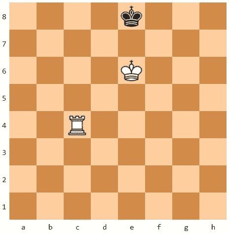
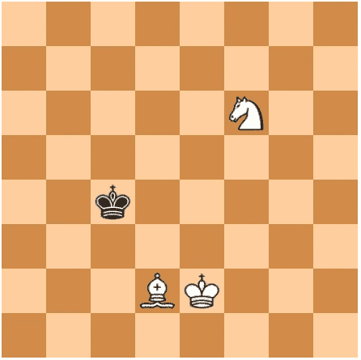
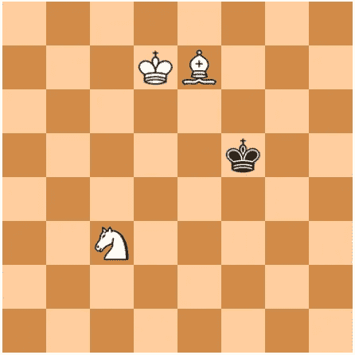
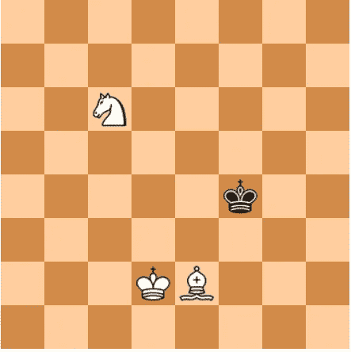
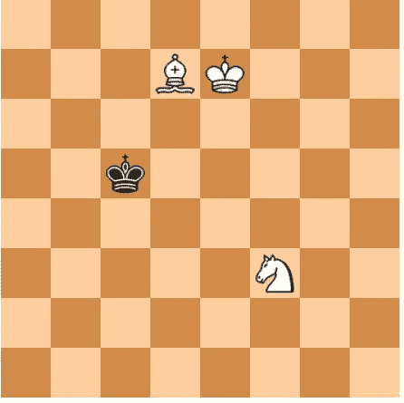
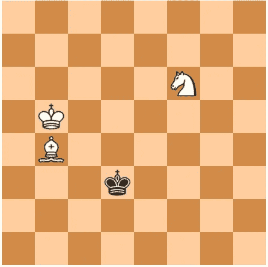
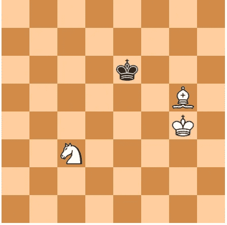
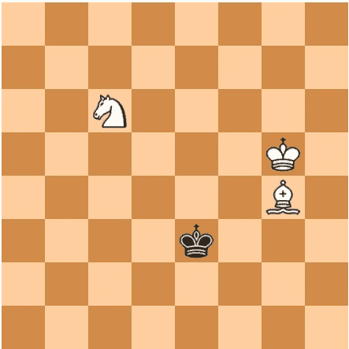
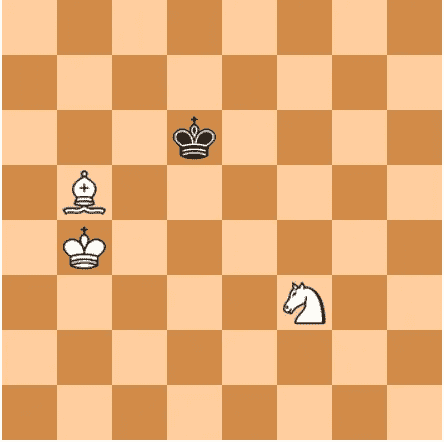
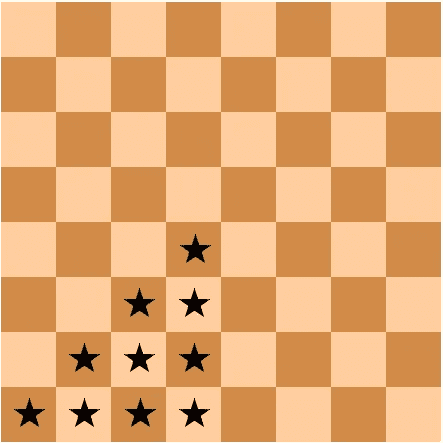

# 建立自己的象棋残局怪物

> 原文：<https://levelup.gitconnected.com/build-your-own-chess-endgame-monster-a3fb23bb3ec1>

## 生成最佳残局数据库的算法


安妮·尼加德在 [Unsplash](https://unsplash.com?utm_source=medium&utm_medium=referral) 上拍摄的照片

回到 1993 年 4 月，我开始第三次尝试编写一个下棋的计算机程序。我的前两次努力令人沮丧，但都是教育上的失败。八个月后，从我的错误中吸取教训，第一个工作版本的 [Chenard](https://github.com/cosinekitty/chenard) 开始运行。它不是世界上最强的国际象棋人工智能，但我很高兴看到它做一些聪明和不可预测的事情。

在接下来的几年里，我对算法进行了调整和优化，并对其进行了显著改进。很快就稳定了。在那之后，我基本上不去管它的 AI。

到 2005 年，计算机已经变得如此之快，以至于几乎每次我玩它，Chenard 都能打败我。通常我会在复杂的中局位置上犯一些小的战术错误。切纳德会利用这个错误，强行取得决定性的物质优势。切纳德的优势会像滚雪球一样越滚越大，我会陷入绝望的境地。

## 残局问题

然而，有一个令人沮丧的问题。有时，Chenard 在残局中以获胜优势结束，但它不知道如何强行将死。例如，我可能有一个孤王，而 Chenard 可能有一个王和一辆车。作为一个相当熟练的人类玩家，在切纳德的地方强行将死对我来说很容易。然而，切纳德将继续做出毫无意义的举动，永远不会更接近胜利。

这个问题是由于 Chenard 使用的搜索算法的性质造成的。这种算法被称为[极小最大搜索](https://en.wikipedia.org/wiki/Minimax)，它包括生成计算机可以做出的所有合法动作的列表，尝试每一个动作，生成人类对手可以做出的所有合法动作的列表，等等。像[奇异博士对灭霸](https://www.youtube.com/watch?v=eGKPfZTXHsc)一样，极大极小搜索递归地探索数百万个可能的未来位置，以决定哪一步走向最好的结果。

随着计算机对未来的展望越来越远，假设的董事会席位的数量呈指数增长。经过一段设定的时间后，计算机停止探索，并在其有限的未来视野内做出最佳选择。

这种算法在中局位置工作得很好，人工智能可以逐渐利用对手的错误，积累不断增加的优势。但在残局中，即使有位置动机迫使对手的孤王走向棋盘边缘，将死本身也往往在未来太远而看不到。

## 修复问题

我知道，大多数世界级的国际象棋程序使用预先计算的数据库来解决这个问题，这些数据库是针对某些残局配置的理想棋步。例如，有一个数据库，其中包含了国王和车与对手国王的每种可能的安排。对于每种安排，数据库会告诉获胜方应该采取什么行动，以便在最短的时间内将对方将死，无论失败方如何回应。

我决定创建自己的残局数据库。努力的结果是值得的。切纳德的残局弱点已经没有了。在任何被支持的残局情况下，切纳德都是一个可怕的怪物，通过一系列最佳的锋利的移动来迫使将死。

它是如何工作的？让我们来了解一下！

## 现场演示

为了使这些想法更容易解释，我专门为本文创建了一个简化的 endgame 数据库生成器。在我们深入研究算法和样本代码之前，这里有一个现场演示来展示它的运行。(如果这个嵌入的演示不能在你的浏览器中运行，你可以在另一个浏览器标签中运行:[https://doncross.net/endgame/](https://doncross.net/endgame/))。

在这个演示中，你扮演黑方的国王，计算机使用残局数据库在尽可能少的棋步数下强行将死。打两三个回合，说服自己真的管用。反抗是徒劳的！

尽管这个基于浏览器的演示是用 HTML、CSS 和 TypeScript 实现的，但生成数据库的程序是用 C++编写的。在本文中，我将重点介绍生成器算法。在阅读下面的讨论时，你可能想参考文件 [endgame.cpp](https://github.com/cosinekitty/endgame/blob/master/generate/endgame.cpp) 。

## 白色和黑色可以互换

为了简单明了，残局生成器任意将白方视为胜方，黑方视为败方。如果使用数据库的国际象棋程序在下黑棋时真的赢了，它知道交换白棋和黑棋来找到正确的走法。因此,“白”只是赢方的名字,“黑”是输方的名字。

## 每种情况一个数据库

当您运行生成器程序时，您指定棋盘上除两个国王之外的一个或两个白棋。在上面的演示中，我支持两种残局情况:

*   黑王对白王和白车
*   黑王对白王和白皇后

以下命令分析第一种情况并生成 TypeScript 文件`endgame_r.ts`:

```
./endgame generate r 
```

对于第二种情况，以下命令生成`endgame_q.ts`:

```
./endgame generate q
```

需要理解的主要一点是，每次运行`endgame`生成器程序时，它都会考虑一组特定的棋子，并生成一个单独的类型脚本文件来处理该组棋子。

## 合法移动枚举器

在继续之前，我需要提一下。残局数据库生成器最复杂的部分是合法移动枚举器。这个函数产生一个给定棋手在给定棋盘位置上可以走的所有合法棋步的列表。

它必须排除任何会使移动一方的国王受到控制的走法，因为这样的走法在国际象棋中是非法的。因此，枚举器的逻辑由两部分组成。

第一部分列举了所有的候选棋步，基于不同种类的棋子的行为。它知道国王可以向任何方向移动一个方格，车可以水平和垂直移动任意数量未被阻挡的方格，等等。

合法移动枚举器的第二部分是检查检测器。我将它实现为一对函数`ChessBoard::IsAttackedByWhite`和`ChessBoard::IsAttackedByBlack`。举例来说，当尝试白方的候选移动时，枚举器尝试进行移动，然后调用`IsAttackedByBlack(wkpos)`，其中`wkpos`是棋盘上白方国王的位置。如果`IsAttackedByBlack`返回 true，这意味着白方不能合法地走这步棋，因为这会使他的国王处于牵制状态。

如果你已经写了一个象棋程序，毫无疑问你已经实现了一个合法的移动枚举器。这是任何国际象棋程序的核心。你需要一个来决定人类玩家的行动是否合法。合法移动枚举器也是任何极小极大搜索的基本要求。通过重用现有的合法移动枚举器，实现一个 endgame 数据库生成器要容易得多。

在我的样本象棋残局数据库生成器中，合法移动枚举器在文件 [board.cpp](https://github.com/cosinekitty/endgame/blob/master/generate/board.cpp) 中，从这个成员函数开始:

```
void ChessBoard::GenMoves(MoveList &movelist)
{
    if (isWhiteTurn)
        GenWhiteMoves(movelist);
    else
        GenBlackMoves(movelist);
}
```

成员函数`GenWhiteMoves`和`GenBlackMoves`实现了支持残局所需的国际象棋规则的子集。他们排除了任何关于卒和阉割的知识。

如果您感兴趣，TypeScript 代码包括一个完整的合法移动枚举器；它支持国际象棋的所有规则。这在成员函数`Board.LegalMoves`中的文件[wheel . ts](https://github.com/cosinekitty/endgame/blob/master/web/flywheel.ts)中。你会看到棋子规则和阉割规则增加了很多复杂性！

现在，我们已经做好了理解残局数据库生成器算法的准备。

## 所有可能的位置

给定一个黑王、一个白王和一两个特定的白棋，生成器程序会扫描棋盘上这些棋子的每一种可能的排列。如下所述，它会多次这样做。

许多职位是不合法的。例如，如果两个国王被放在一起，他们会互相牵制。这是国际象棋规则所不允许的。生成器忽略所有这样的非法位置，因为它们永远不会出现在实际的国际象棋游戏中。

生成器算法就像一个砌砖墙的泥瓦匠。首先，它建立了一个底层，由所有的黑色将死的位置组成。然后它建立一个所有位置的层，在那里白棋可以移动导致黑棋被将死。上面的砖墙的下一层是所有轮到黑棋移动的位置，不管他做什么，他最终会在其中一个位置，在那里白棋可以移动并将死他。

一层一层地，残局生成器从所有可能的游戏结束位置向后工作到更早的位置，白棋需要越来越长的时间来迫使将死。

有了这个总体想法，让我们来处理实现细节。

## 两张桌子

数据库生成器创建了两个名为`blackTable`和`whiteTable`的数组。第一个是`blackTable`，类型为`std::vector<short>`，为轮到黑棋移动的每个合法位置保存整数“分数”值。`blackTable`中的所有值开始初始化为-2000，一个指示位置尚未被评估的标记值。

第二个数组`whiteTable`的类型为`std::vector<Move>`，其中`Move`是一个结构，包括一个分值、一个移动的源方块和一个移动的目标方块。像`blackTable`一样，`whiteTable`条目都用 sentinel 值初始化，指示还没有对白棋的位置进行评估。

进入`whiteTable`和`blackTable`的每个索引都是一个整数，代表了片段的唯一配置。稍后我将回到如何从一个国际象棋位置计算指数，因为这有点棘手。现在，只要知道给定任何一个棋位，都有一个方法来计算代表它的整数。

## 第一关:仅将死

在第一次扫描所有合法的国际象棋位置时，发生器假设轮到黑棋移动。在每个位置，发生器执行两种计算:

*   它找到了一个黑棋可以采取的所有合法行动的列表。
*   如果列表为空，则确定黑方的国王是否过牌。

在国际象棋中，如果一个棋手没有合法的走法，当这个棋手的王没有被攻击(没有被检查)时，这盘棋就是和局。这个平局案例叫做*僵持*。但是如果玩家没有合法的移动，并且他的国王被阻止，他就输了这场游戏。这种情况叫做*将死*。

因此，第一遍发现所有将死和僵局的立场。这些位置通过在`blackTable`中设置它们的`score`值来标注。如果黑色被将死，`blackTable[index].score`被设置为+1000，这个值意味着“立即将死”如果黑色已经僵持不下，`blackTable[index].score`设置为 0，表示“平局”

这里必须提到另一个案例。如果黑棋确实有合法的走法，但其中至少有一个走法是抓到一枚白棋，生成器会将一个位置标记为和棋。这表示一个错误，白棋移动了一个棋子，黑棋可以抓住它。

任何黑棋达到和棋的位置都会被白棋避开。

## 第二关:白棋的移动导致将死

在使用指定棋子第二次通过所有合法的国际象棋位置时，生成器假定该轮到白棋走了。对于每个位置，它生成一个白棋合法移动的列表。对于每个合法的移动，生成器在棋盘上进行该移动，然后检查`blackTable`是否显示结果位置是白棋的强制胜利。

在第二关中，唯一的强制胜利将是第一关中找到的将死。然而，重要的是要明白，这两个通行证(黑和白)将重复许多次，建立我们隐喻的砖墙越来越多的层。

当生成器看到不止一个获胜的移动时，它会记住在最短时间内获胜的移动:它是得分最高的移动。生成器将最佳移动和分数存储在`whiteTable`中的位置计算索引处。需要理解的重要一点是，存储在`whiteTable`中的分数减 1，表示延迟一个回合。例如，如果白棋有一步棋导致黑棋被将死，那一步棋和+999 的分数会被储存在`whiteTable`中。它是+999，而不是+1000，表示在将死之前延迟 1 步。

一个例子将使这一点更加清楚。当生成器考虑下面显示的位置 *A* 时，它会看到有 5 个方格可以让白移动他的王，还有 14 个方格可以让他移动他的车。



立场 A:白棋打 Rc8#就能赢。

在这 19 个合法移动中，移动车到 c8 导致位置 *B* ，黑棋移动:


位置 B:黑棋被 Rc8 将死。

将车移动到 c8 并看到位置 *B* 后，生成器参考`blackTable`并看到分数+1000。因此它知道 Rc8 是一个赢棋，因为它会导致将死。从+1000 减去 1 得到+999，并将移动 Rc8 和分数+999 存储在`whiteTable`中位置 *A* 的索引中。+999 表示将军会需要从位置 *A* 移动一次。

## 更多黑白通行证

发生器以这种方式保持黑白交替。每一次交替传球都扩大了数据库，从每一个比赛结束的位置向更早的情况倒退，在这种情况下，白棋需要越来越多的移动来迫使对手获胜。

在轮到黑棋的每一轮中，生成器会找到额外的位置，无论黑棋做什么，他最终都会输掉游戏。

在白棋的每一次回合中，它会找到更多的位置，在这些位置上白棋可以以最少的移动次数将对手将死。

在这两种类型的传递中，加到两个表上的分数从+1000 向下增长，因为强制将死需要白棋更多的移动来实现。

发生器不断在黑色通道和白色通道之间交替，直到无法解析更多位置。这是砖墙完成的点。没有更多的砖了。

完成工作后，生成器将`whiteTable`的内容编码为一个 TypeScript 数组声明，并将其写入输出文件。一旦`whiteTable`完成，就不再需要`blackTable`。

## 计算位置的表索引

我之前提到过，计算表索引有点棘手。乍一看，表索引应该是一个简单的想法。我们只需要一些公式，为每个可能的位置计算一个唯一的整数，对吗？

国际象棋棋盘上有 64 个方格。如果你从黑王开始，它必须位于这些方块中的一个上，给 0 值..63.同样，我们可以赋值为 0..白方国王为 63，并且(假设这是国王/国王/车表)值为 0..白车 63 分。这给了我们总共 64 =262，144 个表条目。

对于带有额外白色块的数据库表，另一个因子 64 需要一个 64⁴=16,777,216 条目表。这开始变得令人痛苦，尤其是在我们生成需要通过浏览器下载的 JavaScript 的情况下。页面加载缓慢是访问者放弃页面的主要原因，谷歌惩罚加载缓慢的页面，降低搜索排名。

因此，减小生成输出的大小会更好。我们如何做到这一点？

## 对称拯救世界

答案是利用对称性。在一个没有任何棋子的残局位置，可以用八种不同的方式旋转和翻转棋盘，而不会改变其战术意义。以下所有棋位都是等效的:



通过消除数据中的八倍冗余，我们可以极大地缩小输出大小。我的算法是通过依次尝试上述八种对称来做到这一点的，除了将黑王留在这里的 10 个带星号的方块之一中的那些之外，忽略所有的对称:



为了消除对称冗余，黑王必须在 10 个带星号的方块中的一个。

有时八个方位中有一个以上的方位会将黑王留在一个星号方块上。为了打破任何束缚，该算法选择产生最小整数表索引的方向，如下所述。

## 计算表索引

通过分配整数 0 来计算索引..9 表示黑王在哪个星形方块上。把这个值叫做`BK`。然后是整数 0..63 被分配给白方国王(`WK`)和棋盘上的任何其他白色棋子。假设这些值按照`[BK, WK, ...]`的顺序放入一个列表中。然后，我们执行以下循环:

```
index = list[0]
for i = 1..(n-1) do
    index = (64*index) + list[i]
```

这导致了一个`whiteTable`和一个`blackTable`，它们的大小是没有利用对称性时的 10/64，或者说不到 16%。这也使得生成表格的速度更快，因为每一遍中要探索的位置更少。

## 使用残局数据库

可以生成多个残局数据库。在上面的嵌入式演示中，我包括了国王/国王/王后和国王/国王/车表。使用残局数据库的国际象棋程序可以识别何时位置匹配残局数据库之一。

使用上述相同的对称算法，程序可以计算表索引并查看存储的数据以找到理想的移动。该程序必须执行理想移动的逆变换，以便它匹配实际的棋盘，而不是表中的对称表示。

一个程序也可以宣布在不可避免的将死之前剩余的最大移动次数。在演示中，我通过在板上打印“Mate in *N* 来实现这一点。

残局数据库不仅仅是在某些位置上替代极大极小搜索。它们也有助于改进极大极小搜索算法本身。如果 minimax 搜索可以检测到与已知残局数据库相匹配的未来位置，它可以使用存储在数据库中的分数来即时准确地评估该位置，从而在可以交易材料以到达这样的残局的位置中产生更敏锐的战术。

## 其他策略游戏

虽然我在本文中关注的是国际象棋，但是这里提出的思想可以适用于任何两人、完全信息、零和策略的游戏，其中极大极小搜索是合适的。只要存在有限数量的位置小到足以使存储表可行的情况，残局数据库可能就是将你的 AI 带到下一个级别的东西。

## 参考

1.  基于浏览器的现场演示在:【https://doncross.net/endgame/ 
2.  残局数据库演示代码:[https://github.com/cosinekitty/endgame](https://github.com/cosinekitty/endgame)。参见`generate`子目录中生成 endgame 表的 C++代码，以及`web`子目录中基于浏览器的演示的类型脚本代码。
3.  Chenard 源代码:[https://github.com/cosinekitty/chenard](https://github.com/cosinekitty/chenard)。
4.  Chenard 下载页面:[http://cosinekitty.com/chenard/](http://cosinekitty.com/chenard/)。您可以下载 32 位或 64 位版本的 Chenard for Windows，或者从源代码构建 Linux 版本。Chenard 的残局数据库在这里有一个单独的 zip 文件。