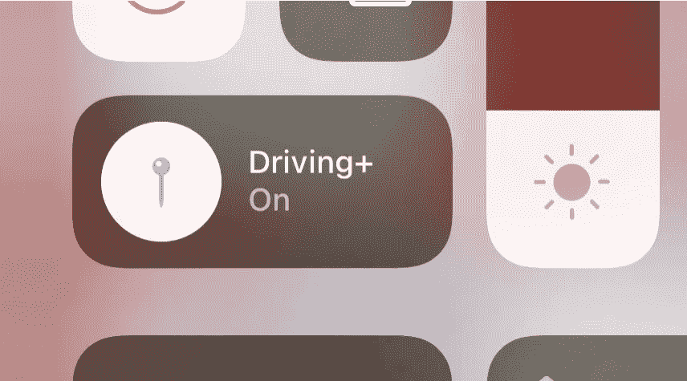
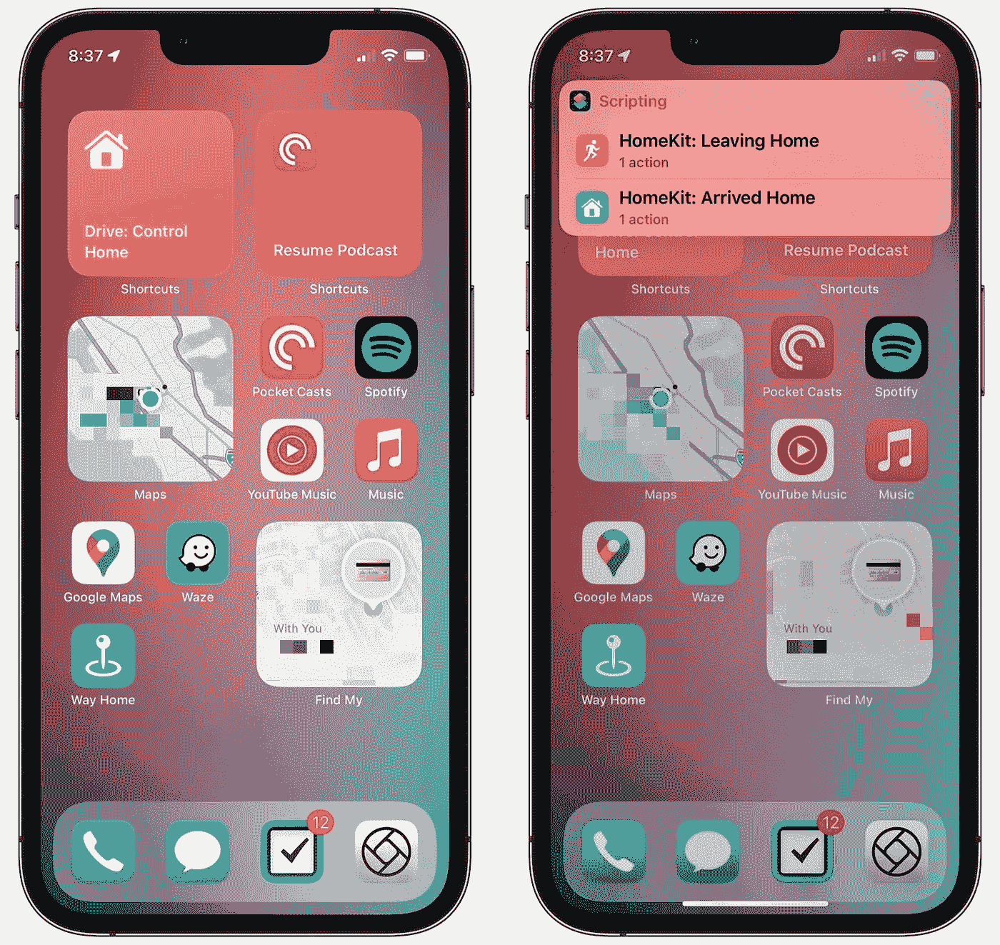
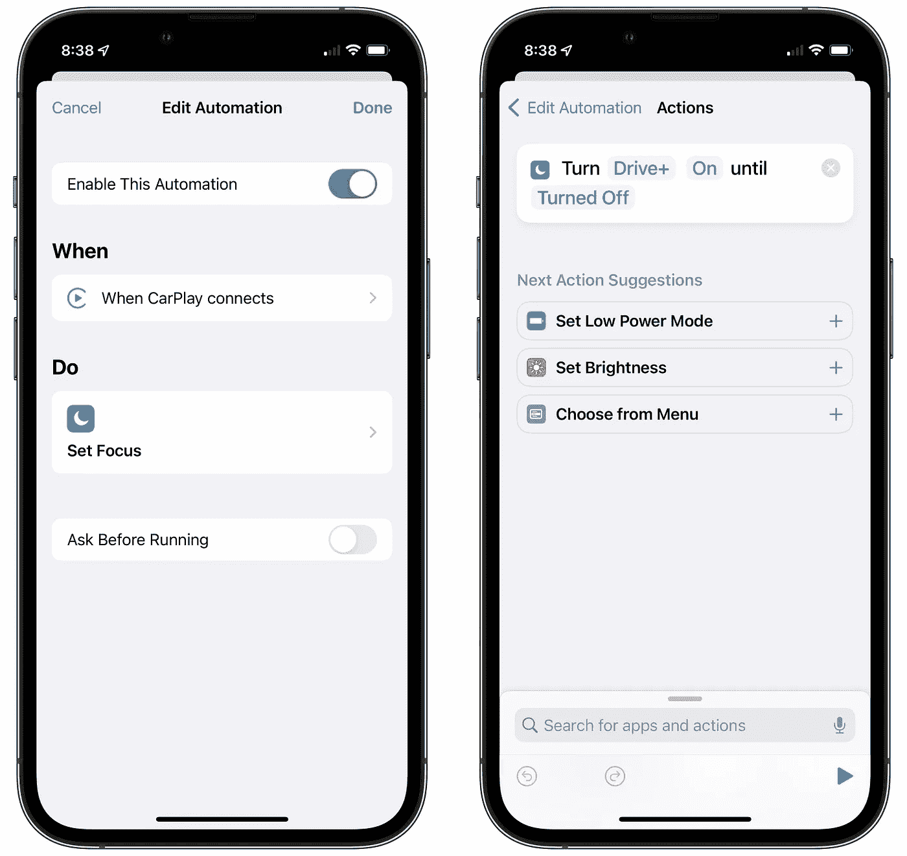

# 在 iOS 中建立自己的“驾驶”模式

> 原文：<https://levelup.gitconnected.com/build-your-own-driving-mode-in-ios-209f7f5a9d88>

“驾驶+”聚焦模式:一种“驾驶”模式的替代

我为 iOS 内置的“驾驶”对焦模式找了一个替代品。这里是如何&为什么。

在 iOS 15 中，苹果推出了 [**聚焦**](https://support.apple.com/en-us/HT212608) :以前你打开&关闭的*【请勿打扰】*已经转变为更灵活的&扩展。

如果您不熟悉，该功能提供用户定义**聚焦模式。Y** 你可以创建&配置一个模式，激活后，只有少数精选联系人&应用程序可以接通你。每一个人和每一件事都堆积在一个积压的日志里，直到你关掉它，你才会看到。它还允许您指定在该模式下显示或隐藏哪些主屏幕。它旨在帮助您管理您的设备如何吸引您的注意力。

苹果令人难以置信地将预先存在的驾驶模式融入到这个系统中:[一个名为*【驾驶】*](https://support.apple.com/en-us/HT208090#:~:text=Driving%20Focus%20automatically-,Go%20to%20Settings%20%3E%20Focus%20and%20tap%20Driving.,connected%20to%20car%20Bluetooth%20devices.) 的特殊聚焦模式被预先配置为阻止所有人&应用程序在你开车时弹出并窃取你的宝贵注意力，以及发送自动回复，所有驾驶模式在 iOS 15 之前能够做的事情。该模式配置为每次连接 CarPlay 时自动激活(不记得这是不是 iPhones 默认进来的行为…)

B 但是与其他对焦模式不同，*“驾驶”模式不允许您配置显示哪个主屏幕页面。我很失望地发现了这一点:我期待着在我的主屏幕上设置一个专为我开车时定制的页面，我希望它在我准备好开车时自动激活。*

它看起来会像这样:

驾驶+对焦模式主屏幕(左)；通过“从菜单中选择”快捷方式用 HomeKit 控制报警系统(右图)

最上面的两个小工具是我在车道上最常用的快捷方式:第一个让我启动或解除家里的警报系统。第二个命令告诉 [Pocket Casts](https://www.pocketcasts.com/) 从我离开我的播客队列的地方继续播放(由于一些奇怪的原因，该应用程序无法通过 CarPlay 的用户界面继续播放，直到我先在 iPhone 上滚动球……)

1.  中间一排的[苹果地图](https://www.apple.com/maps/) 小工具。这主要是作为一个启动器，但有时它提供了正确的目的地，总是整洁。
2.  一个音频应用网格，一个导航应用和快捷方式网格。
3.  一个[找到我的](https://www.apple.com/icloud/find-my/)小工具，它显示我是否忘了带钱包。

最重要的是，我最常使用的是实际上比应用程序图标更大的小工具:容易浏览，需要更少的精确度来激活&更难错过。开车时，你不会更喜欢这些吗？我发现切换主屏幕页面并不是默认驾驶焦点的一个选项，这真的很不幸。

# “驾驶+”对焦模式

为了填补这个空白，我开始创建一个自定义的聚焦模式来替代内置的模式。我从一开始就怀疑我是否能做出类似的东西，但最终我对结果非常满意。我把对焦模式叫做“开车+”。将内置的焦点模式复制到这个自定义模式中实际上并没有我想象的那么难:只是没有太多需要复制的东西！

有一件事需要对 iOS 做进一步的修改:

## 连接到 CarPlay 时自动激活

这是小菜一碟:我[在快捷方式](https://support.apple.com/guide/shortcuts/create-a-new-personal-automation-apdfbdbd7123/5.0/ios/15.0) 中创建了一个个人自动化来在我连接到 CarPlay 时激活这种对焦模式，并且它工作得很好:

连接 CarPlay 时，快捷方式中用于打开“驾驶+”对焦模式的“个人自动化”的屏幕截图。

我确保关闭内置*“驾驶”*对焦模式的等效选项，这是替换:前往*设置>对焦>驾驶>自动打开… >同时驾驶*并将其设置为*“手动”*，然后在同一设置屏幕中关闭*“用 CarPlay 激活”*。

## 自动回复

这是我发现唯一不可能复制的东西。据我所知，没有办法建立这个功能——似乎苹果赋予了这个选项内置的驾驶模式排他性。然而，这对我来说不是一个交易破坏者:让我的驾驶优化主屏幕页面在我需要时自动激活的优势肯定值得没有这个的代价，这是一个我可以接受的权衡。

# 关闭

我越来越欣赏 iOS 的一点是，尽管在个性化和装饰方面，允许的可定制性水平与 Android 相比相形见绌，但苹果为更广泛的最终用户定制开辟的少数途径——特别是 w/ Focus 模式和快捷方式——肯定感觉更实用，而且真的非常有用，以至于我一点也不想念 Android 的定制空间。事实上，我很高兴来到这里。