# 使用网络摄像头构建自己的运动检测器，并在 Python 中打开 CV

> 原文：<https://levelup.gitconnected.com/build-your-own-motion-detector-using-webcam-and-opencv-in-python-ff5bdb78a55e>

M 运动检测是指检测物体相对于其周围环境的位置变化，反之亦然。系好安全带，和我以及你可爱的蟒蛇一起穿过这个运动探测器应用程序。

您可以使用该应用程序执行以下任务，尽管列表并不完整: *1)在家工作时，在屏幕前寻找时间。2)监控孩子在屏幕前的时间。3)发现有人闯入你的后院。4)在你的房间/房子/小巷等周围找到不需要的公共/动物活动。*

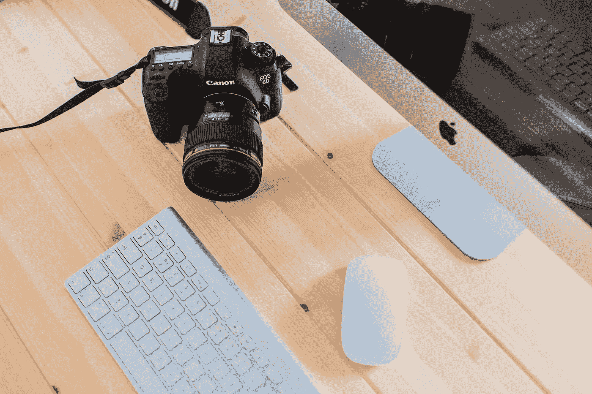

照片由[威廉·托马斯](https://unsplash.com/@williamauto?utm_source=medium&utm_medium=referral)在 [Unsplash](https://unsplash.com?utm_source=medium&utm_medium=referral) 上拍摄

*硬件要求:安装了网络摄像头或任何类型摄像头的计算机。*

*软件要求:Python 3 以上。*

*附加要求:30 分钟的时间，对主题的热情*

我将指导您一步一步地构建应用程序。首先，你将通过网络摄像头捕捉第一帧。该帧将被视为**基线帧**。运动将通过**计算该基线帧和带有一些物体的新帧之间的相位差**来检测。新帧将被称为 ***增量帧*** 。

然后你将使用**像素强度**来优化你的 delta 帧。细化后的帧将被称为 ***阈值帧*** 。然后你将应用一些复杂的图像处理技术，如 ***阴影去除、膨胀、轮廓*** 等。在阈值帧上捕捉实体对象。下面是您将要实现的目标的截图:

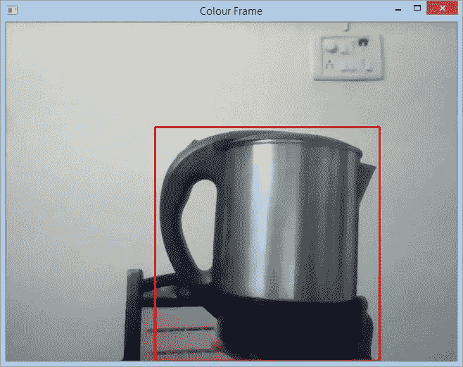

检测到的对象

当一个物体进入和退出画面时，你将能够捕捉到**时间戳**。因此，你将能够找到屏幕上的时间。

> 我不会在这里嵌入我的代码，因为我希望你能改善指尖的血液循环。

从基础安装开始，请通过 pip 安装 python 3 或以上版本、 *pandas、*和 *opencv。完成后，您就可以开始了:*

> **第一步:导入所需的库:**

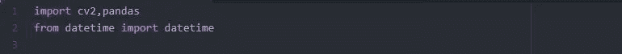

> **步骤 2:初始化变量、列表、数据帧:**

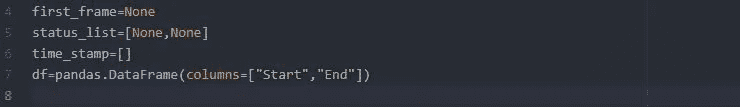

你会知道在下面的代码中什么时候需要上面的每一个。

> **第三步:用网络摄像头捕捉视频画面:**

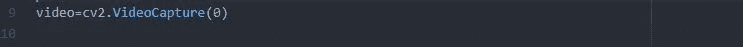

OpenCV 内置了打开相机和捕捉视频帧的功能。“0”表示计算机硬件端口号为 0 的摄像头。如果您安装了多个摄像机或外部摄像机或闭路电视系统，您可以相应地提供端口号。

> **步骤 4:将捕获的帧转换为灰度级，并应用高斯模糊来去除噪声:**

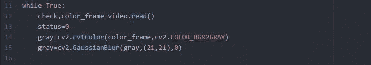

我们将彩色帧转换为灰色帧，因为不需要额外的颜色层。 ***高斯模糊*** 用于图像平滑，进而提高检测精度。在*高斯模糊*函数中，对于第二个参数，我们定义了*高斯核*的宽度和高度，对于第三个参数，我们提供了*标准偏差*值。这些是一组高阶微分定理，因此您可以使用内核大小的标准值(21，21)和标准差 0。要了解有关平滑的更多信息，您可以参考:

 [## 平滑图像-OpenCV 2.4.13.7 文档

### 与高斯滤波器类似，双边滤波器也考虑具有权重的相邻像素…

docs.opencv.org](https://docs.opencv.org/2.4/doc/tutorials/imgproc/gausian_median_blur_bilateral_filter/gausian_median_blur_bilateral_filter.html) 

> **步骤 5:仅捕获第一个灰色帧**

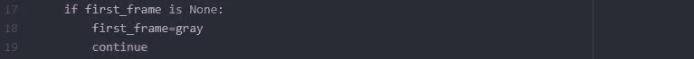

该第一帧将被视为基准帧**。将通过计算该基线帧和包含一些物体的新帧之间的相位差来检测运动。拍摄第一帧时，摄像机前方不应有**和**移动。一旦你得到了第一帧，你就不想再进一步处理第一帧了。因此，如果您想跳过接下来的步骤，请使用 *continue* 语句。**

> **步骤 6:创建增量帧和阈值帧**

现在，我们必须找出第一帧和当前帧之间的差异。因此，我们应用 *absdiff* 函数，并将得到的不同帧称为 **delta 帧。仅仅发现差异不足以满足我们的用例，因此我们需要定义一个像素阈值，它可以被认为是一个真实的对象。**

作为标准，您可以选择 30 像素作为**阈值**，并将阈值的颜色定义为白色(颜色代码:255)。 *THRESH_BINARY* 函数返回一个元组值，其中只有第 2 项([0]为第 1 项，[1]为第 2 项)包含结果阈值帧。**二元阈值**函数是一个非连续函数，仅处理 2 个离散值:0 或 1。如果摄像机前面没有物体，我们将当前帧的状态视为 0；如果摄像机前面有物体，我们将当前帧的状态视为 1。

要了解有关阈值图像处理的更多信息，您可以参考:

 [## 杂项图像转换-OpenCV 2.4.13.7 文档

### 使用分水岭算法执行基于标记的图像分割。该函数实现了其中一个变量…

docs.opencv.org](https://docs.opencv.org/2.4/modules/imgproc/doc/miscellaneous_transformations.html?highlight=thresh#threshold) 

> **第七步:扩张阈值框，在其中寻找像素轮廓**

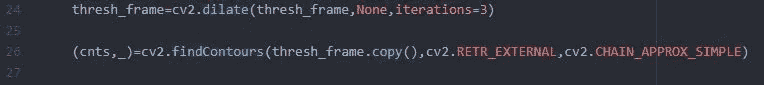

> *“眼睛总是被光捕捉，但阴影有更多的话要说。”——格莱葛利·马奎尔*

对象的每个部分都会在背景上或自身的其他部分投射阴影。这可能看起来令人困惑。例如，鼻子在你的嘴唇上投下阴影，任何较大的静止物体在它旁边的较小物体上投下阴影，飘动的光源，具有不同发光强度的多个光源，你房间的窗帘，光源的方向和视角等。

这些是在实时捕捉的帧中发现的一些干扰。因此，为了最大限度地减少这类噪声，我们需要对图像进行滤波。在**扩张功能**中，我们可以通过设置迭代次数来设置平滑度。迭代次数越高，越平滑，处理时间就越长。所以，建议保持标准化为 3。扩张函数中的“None”参数表示结构化元素，这在我们的场景中是不需要的。

要了解更多关于扩张的信息，您可以参考:

 [## 图像过滤-OpenCV 2.4.13.7 文档

### 本节描述的函数和类用于执行各种线性或非线性过滤操作…

docs.opencv.org](https://docs.opencv.org/2.4/modules/imgproc/doc/filtering.html?highlight=dilate#cv2.dilate) 

一旦帧被过滤，我们必须在我们的帧中找到轮廓。**轮廓**是一条曲线，沿着这条曲线，一个函数在所有点上都有一个恒定值。我们需要当前帧中的轮廓来识别对象的大小和位置。为此，我们将过滤后的帧的副本传递给 *findCountors* 方法。我们使用过滤帧的副本而不是原始帧来寻找轮廓，因为我们不想干扰原始过滤帧。

这里有点棘手，因为您必须将轮廓存储在一个元组中，并且只需要元组的第一个值。请看 python 3 中声明 tuple 的语法:(name，_)。

现在，我们只需要在我们的过滤层上找到物体的外部轮廓，因为就我们的用例而言，除了极端外部轮廓之外的轮廓是没有用的。我们必须使用一些近似方法来优化恢复轮廓的过程。您可以使用任何曲线近似或曲线插值方法，但我们可以使用**简单链近似规则**，它压缩水平、垂直和对角线段，只留下它们的端点。因此，我们能够非常快速地获得最佳拟合轮廓。要了解更多信息，请参考随附的 PDF。

> **步骤 8:找到轮廓区域并在矩形中界定端点:**

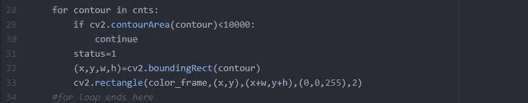

我们不想捕捉像昆虫这样的小物体，而是捕捉像人/动物这样的大物体。这可以通过使用**轮廓区域**的概念来定制。这里，我们跳过那些面积小于**10000 像素**的物体。对于大于此的区域轮廓，我们设置状态=1，即物体被检测到。

要了解图像处理中的轮廓，您可以参考:

 [## 结构分析和形状描述符-OpenCV 2.4.13.7 文档

### 绘制轮廓或填充轮廓。该函数在图像中绘制轮廓或填充区域…

docs.opencv.org](https://docs.opencv.org/2.4/modules/imgproc/doc/structural_analysis_and_shape_descriptors.html?highlight=findcontours#findcontours) 

我们现在使用 *boundingRect* 函数捕捉轮廓的坐标。然后，我们使用这些坐标在彩色框架上绘制一个所需颜色和厚度的矩形。这个矩形描绘了实际检测到的对象。

> **第九步:捕捉物体进出画面时的时间戳:**

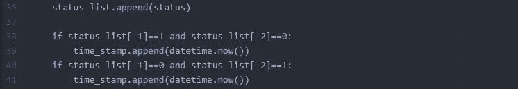

status_list 存储值 0:未检测到物体和 1:检测到物体。该状态值从 0 变为 1 的时刻:对象进入帧的那一刻。类似地，当这个状态值从 1 变到 0 的时刻:物体从帧中消失的时刻。因此，我们从状态列表的最后两个值中捕获这两个**触发事件**的时间戳。

> **第十步:真正的魔术:显示所有不同的画面**

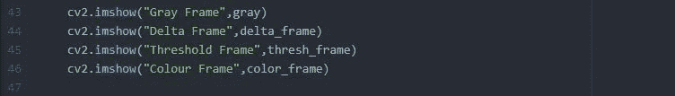

使用 *imshow* 方法，您将能够在单独的窗口中显示每一帧并比较它们。

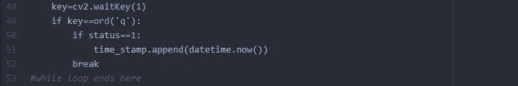

我们使用*等待键*功能来延迟该过程，直到按下一个键。这里，为了从摄像机获得连续的实时反馈，我们使用 waitKey(1)。当您只想停止拍摄视频时，只需按键盘上的“ **Q** 键。

我们还必须捕获按下“Q”时的最后一个时间戳，因为这将导致程序结束从摄像机捕获视频，并在稍后生成时间数据。

下面是使用该应用程序生成的实际图像输出。第一幅图像表示基线帧的 4 种类型的帧，第二幅图像表示具有对象的帧的 4 种类型的帧。你能比较一下区别吗？

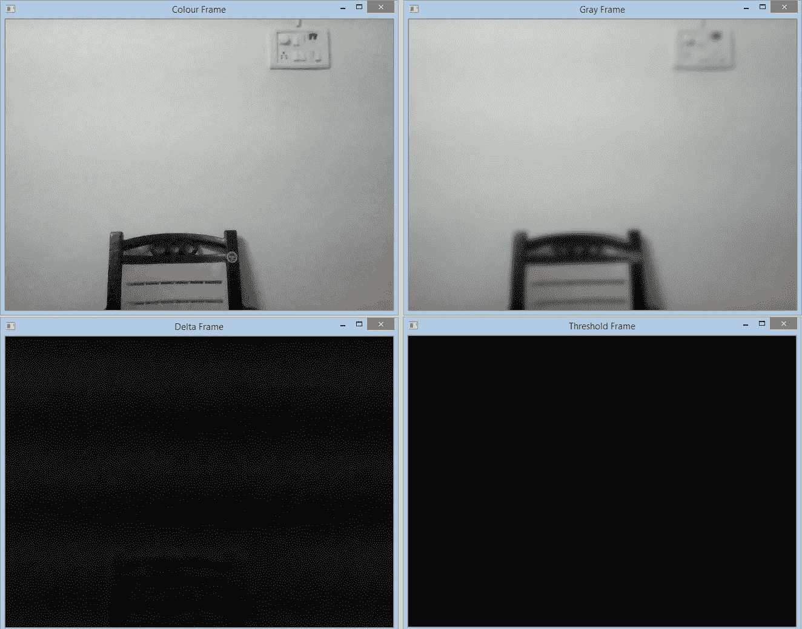

基线第一帧

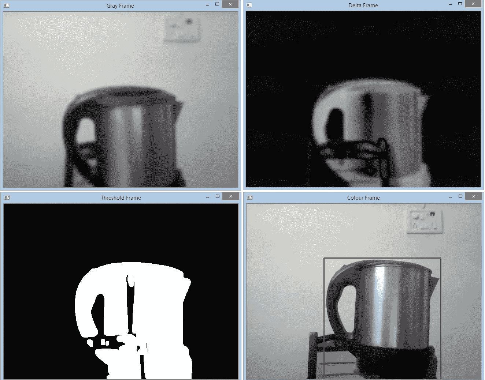

带有检测到的对象的帧

> **步骤 11:生成时间数据**

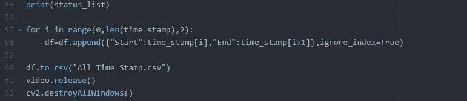

到目前为止，所有的时间戳都存储在熊猫数据帧中。为了深入了解生成的数据，我们将把数据框导出到本地磁盘上的 csv 文件中。

> 请不要忘记释放视频变量，因为它已经占用了相当多的内存空间。还要销毁所有窗口，以避免出现任何错误。

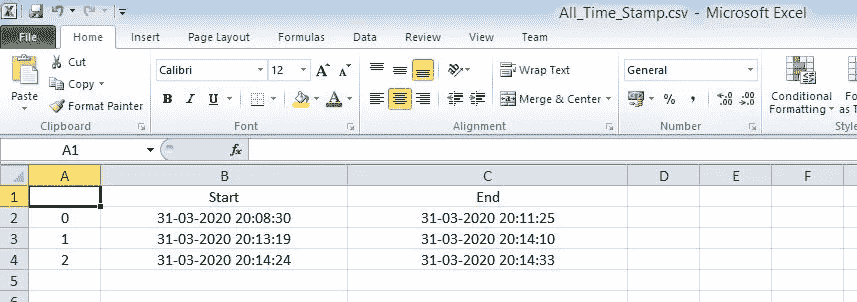

这是生成的 csv 的样子。如你所见，在程序结束之前，这个物体已经被探测了 3 次。您可以看到开始和结束时间，并计算对象在摄像机前的时间。

这个应用还不够刺激吗？这个应用程序不是远离典型的充满无聊的编程吗？物联网爱好者甚至可以在 Raspberry-Pi 服务器上部署这个程序，创造奇迹！

要了解更多关于树莓派的信息，请点击这里:

 [## 树莓派入门

### 在这个项目中，你将连接一台 Raspberry Pi 计算机，看看它能做什么。注意:本指南是一个…

projects.raspberrypi.org](https://projects.raspberrypi.org/en/projects/raspberry-pi-getting-started)