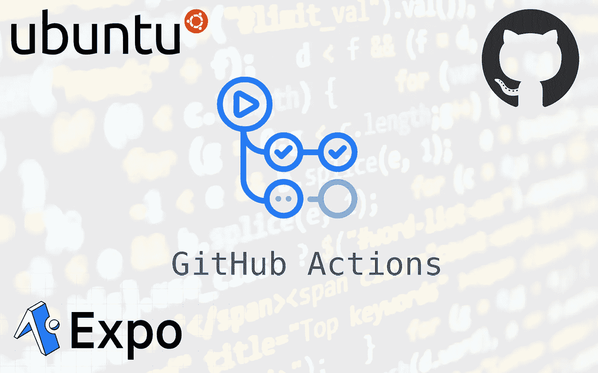
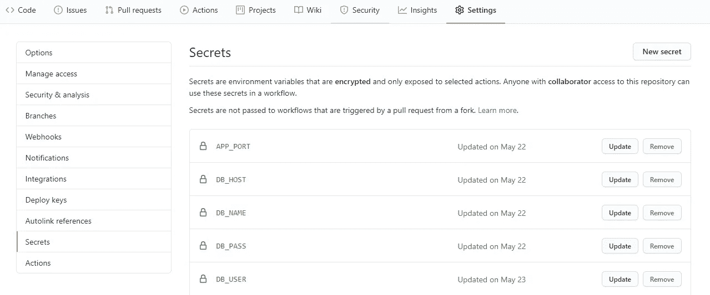
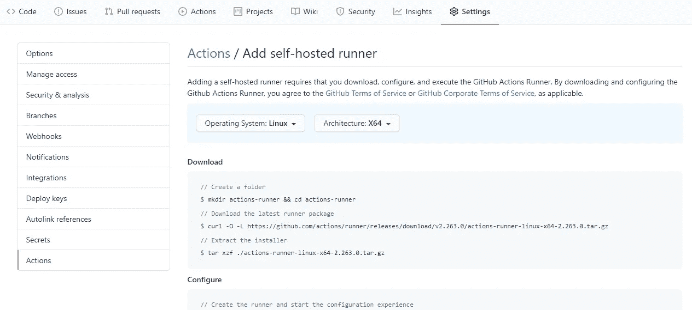
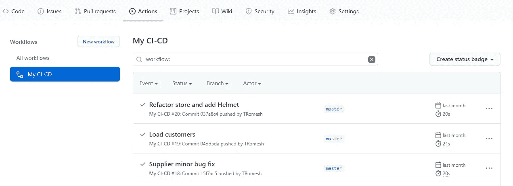
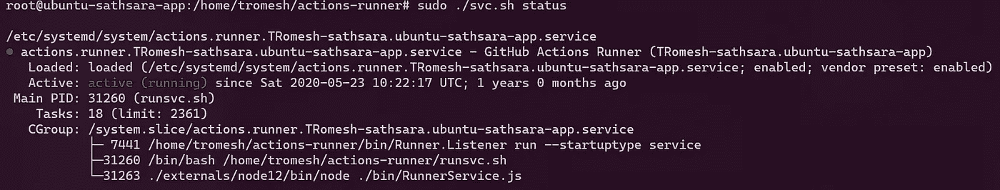

# 使用 GitHub 操作构建您自己的自托管 CI/CD 工作流

> 原文：<https://levelup.gitconnected.com/build-your-own-self-hosted-ci-cd-workflow-with-github-actions-ec9ee1dcd800>



GitHub 引入了 **GitHub Actions** ，这使得开发者能够直接从他们的 GitHub 库自动化工作流。软件开发生命周期(SLDC)工作流，如构建、单元测试、端到端测试，可以通过 GitHub 快速完成，无需使用任何第三方工具或专用资源。您可以自定义 GitHub 操作或使用 GitHub Marketplace 中提供的标准模板。此外，GitHub actions 提升了操作系统环境(Windows、OSX、Linux)，使用户能够执行或运行任何使用操作系统相关工作的工作流。

这篇文章将集中在创建我们的工作流托管在我们的专用服务器(自托管)。与 GitHub 托管的运行程序相比，自托管的运行程序提供了对硬件、操作系统和软件工具的更多控制。例如，您可以选择创建具有更多处理能力或内存的自定义硬件配置，以使用自托管运行程序运行更大的作业。自托管 runners 还允许我们安装您本地网络上可用的软件，并选择 GitHub 托管 runners 不提供的操作系统。此外，这种自托管工作流可以进行功能扩展，以创建我们的 CI/CD 工作流。

# Github 操作入门

为此，让我们考虑一个使用 MySQL 作为数据库的小型 express 应用程序。我们将使用 PM2，它是 JavaScript runtime Node.js 的进程管理器

GitHub 使用 **YAML** 来配置动作，所以我们必须在应用程序中添加 YAML 来定义你的工作流配置。我们应该将这个 YAML 配置文件添加到**中。github/workflows** 目录，我们应该将它添加到项目的根目录中。姑且称之为 **nodejs.yaml.**

```
name: My CI-CD on:
  push: 
    branches: [master]jobs: 
  build: 
    runs-on: **ubuntu-latest**

    steps: 
      — uses: actions/checkout@v2 
      — run: | 
          cd my-express-app && pwd
          npm i
          export DB_HOST=${{ **secrets.DB_HOST** }} 
          export DB_NAME=${{ **secrets.DB_NAME** }} 
          export DB_USER=${{ **secrets.DB_USER** }} 
          export DB_PASS=${{ **secrets.DB_PASS** }} 
          export APP_PORT=${{ **secrets.APP_PORT** }} 
          **pm2** delete all — || : 
          **pm2** start index.js — name express-api -i 2
```

如果您保存并提交该文件，并将其推送到您的 GitHub 存储库，它将自动检测工作流目录下的 YAML 文件并创建一个操作。在触发一个动作或将新的变更推送到存储库之前，让我们来看一下 YAML 配置。YAML 被配置为触发对主分支的推送(或合并拉取请求)操作，该作业将在最新版本的 ubuntu 中运行。您可以在按键**run-on 下看到此信息。**这个键是做自托管动作运行器时最重要的，在**步骤下，**我们使用 action[**actions/check out @ v2**](https://github.com/actions/checkout)**，**从库中拉下代码。

YAML 的另一个独特之处是使用像 **secrets 这样的密钥。DB_HOST。我们可以将这些秘密密钥**存储在 GitHub 中，这可以通过导航到**设置下的**秘密**来完成。**要创建新的密钥，请点击新密钥按钮并添加必要的密钥。



如果我们触发这个动作，它将在 GitHub 中启动一个 Ubuntu 环境，并运行 YAML 文件中提到的任务。但是我们想要的是在我们自己的环境/服务器中运行它。为了让这个动作在我们的服务器上工作，我们需要再做一些配置。首先，我们需要 ssh 到我们的服务器，并在服务器中安装自托管的 runner。

# 走向自主托管

对于这个例子，我们将使用 Ubuntu 20.04 服务器。“设置”->“操作”下提供了以下命令。在这里，您必须选择与您的服务器相同的操作系统。



```
// Create a folder
$ mkdir actions-runner && cd actions-runner// Download the latest runner package
$ curl -O -L [https://github.com/actions/runner/releases/download/v2.263.0/actions-runner-linux-x64-2.263.0.tar.gz](https://github.com/actions/runner/releases/download/v2.263.0/actions-runner-linux-x64-2.263.0.tar.gz//)[//](https://github.com/actions/runner/releases/download/v2.263.0/actions-runner-linux-x64-2.263.0.tar.gz//) Extract the installer
$ tar xzf ./actions-runner-linux-x64–2.263.0.tar.gz // Create the runner and start the configuration experience
$ ./config.sh --url [https://github.com/<username>/](https://github.com/TRomesh/sathsara)<reponame> --token <given key>// Last step, run it!
$ ./run.sh
```

这将启动自托管运行程序。现在，您必须编辑 YAML 文件，以表明我们正在运行一个自托管的运行程序。

```
 runs-on: **self-hosted**
```

现在是运行/触发动作的时候了。首先，您必须提交一些更改并进行推送，这将触发操作。如果一切顺利，你最终会得到这样的结果。



如果您 ssh 到您的服务器，您可以注意到您的代码已经被拉入您的服务器。另外，请注意，服务器是用给定的密钥启动的，这些密钥可以在 Github keys 上找到。这个工作流可以通过为自托管运行程序提供服务来进行改进，这样当您重新启动服务器时，您就不必手动启动自托管运行程序。我们可以通过以下步骤实现这一点。

1.  如果自托管 runner 应用程序当前正在运行，请将其停止。
2.  使用以下命令安装服务:
    `sudo ./svc.sh install`

3.使用以下命令启动服务:
`sudo ./svc.sh start`

这将启动自托管 runner 作为服务。您可以通过以下命令检查该服务的状态。

`sudo ./svc.sh status`

它将输出类似这样的内容



Github 自托管 runner 服务

Feather 可以通过告诉 GitHub actions 仅在引入对特定目录路径的更改时触发构建来改进上述工作流。

```
name: My CI-CD
on:  
  push:
    **paths**:
      - **"api/**"**
      - **"mobile/**"**
    branches: [master, staging]
```

通过上面的 YAML 配置，您可以看到我们只为特定的路径配置了动作，如 **api** 和 **mobile。**因此，每当您将更改推送到上述两个目录时，runner 将开始在您的服务器中进行拉取和构建。

# 自动发布移动应用程序

正如你所看到的，GitHub 动作允许你灵活地通过你的配置和插件/动作运行器提供的特性来扩展特性。在这一部分，让我们看看如何自动化我们的移动应用程序的发布工作流。

对于这个例子，我将使用一个名为[**expo-github-action**](https://github.com/expo/expo-github-action)**的特定动作工作流，因为我有一个使用 Expo 平台的 react-native 应用程序。**

```
**publish**:    
  name: Mobile Publish
  runs-on: ubuntu-latest    
  steps:      
    - uses: actions/checkout@v2
    - uses: actions/setup-node@v1
      with:      
        node-version: 14.x
    - uses: **expo/expo-github-action@v5**
        with:          
          expo-version: 4.x
          expo-token: ${{ **secrets.EXPO_TOKEN** }}
    - run: |         
        rm -rf client  
        rm -rf api  
        mv mobile/* . 
        rm -rf mobile  
    - run: yarn install    
    - run: **expo publish** 
    - run: **expo build:android**
```

**将上面的 publish 部分添加到 node.js.yml 文件将使您能够将应用程序发布到 expo 平台。请注意，我们已经将 **EXPO_TOKEN** 添加到 github 密钥中，EXPO 将需要它来发布您的应用程序。您也可以通过这种配置构建您的应用程序。配置的最后一行说要构建应用程序的 android 版本。该构建所需的依赖项和其他相关应用程序由**Expo/Expo-github-action @ V5**动作工作流**提供。****

# **结论**

**总之，Github Actions 是实现 CI/CD 工作流的最好和最简单的方法之一。Github Actions 非常灵活，它允许您自定义动作工作流，直到您可以在专用服务器上运行。对于不同类型的应用程序和不同的 CI/CD 工作流，有许多可用的操作工作流。所有这些都是免费的，无需使用任何第三方服务，如 [Circle CI](https://circleci.com/) 等等。**

**Github 操作的简单性也使它成为初学者开始使用 CI/CD 工作流和自动化的一个很好的选择。最后，感谢您花时间阅读本文。我想看看你下面的问题和评论。**

**干杯！**

# **了解更多信息**

**[](/jotai-atom-based-state-management-for-react-1ce8fd380296) [## jotai:React 的基于原子的状态管理

### 在过去的几年里，国家管理有了很大的发展。有很多库和方法可以让你…

levelup.gitconnected.com](/jotai-atom-based-state-management-for-react-1ce8fd380296) [](/hookstate-the-simplest-state-management-tool-b02f7d3b01a4) [## 最简单的状态管理工具

### 小型、最小、简洁、可扩展、基于钩子的状态管理库

levelup.gitconnected.com](/hookstate-the-simplest-state-management-tool-b02f7d3b01a4) [](https://medium.com/swlh/intro-to-recoil-d689a77c5f04) [## 反冲介绍

### 反冲是一个反应的状态管理库，是由脸书的实验和开放源码…

medium.com](https://medium.com/swlh/intro-to-recoil-d689a77c5f04)**