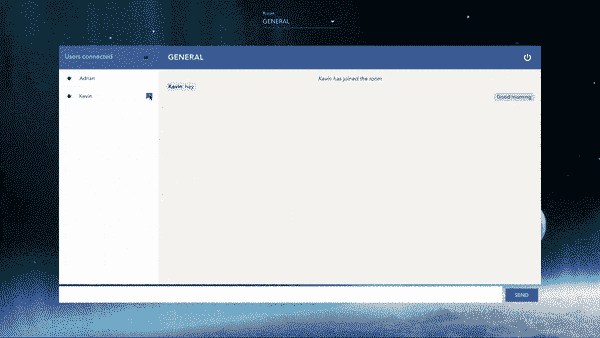
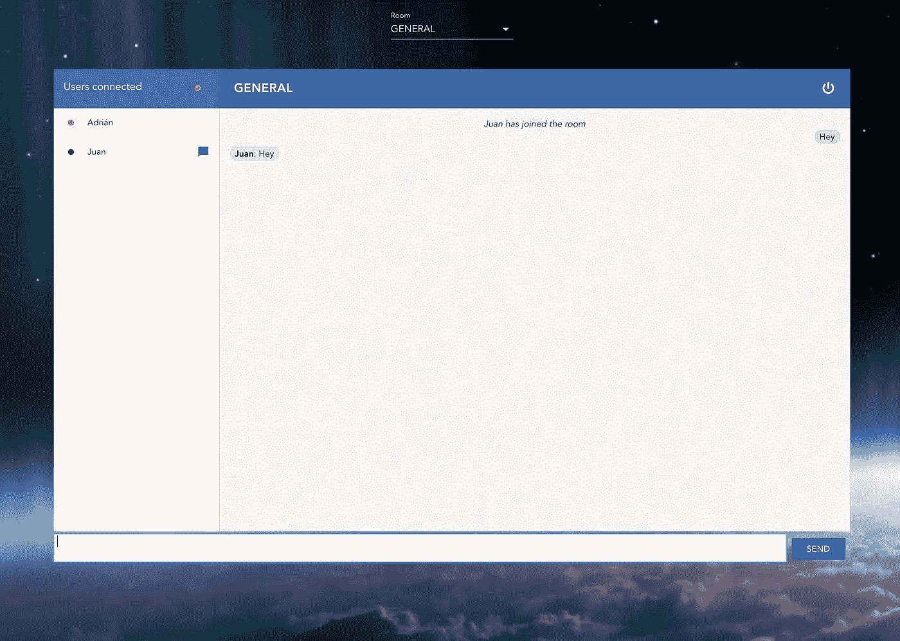
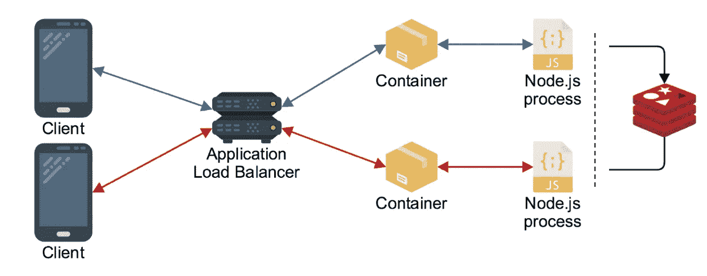
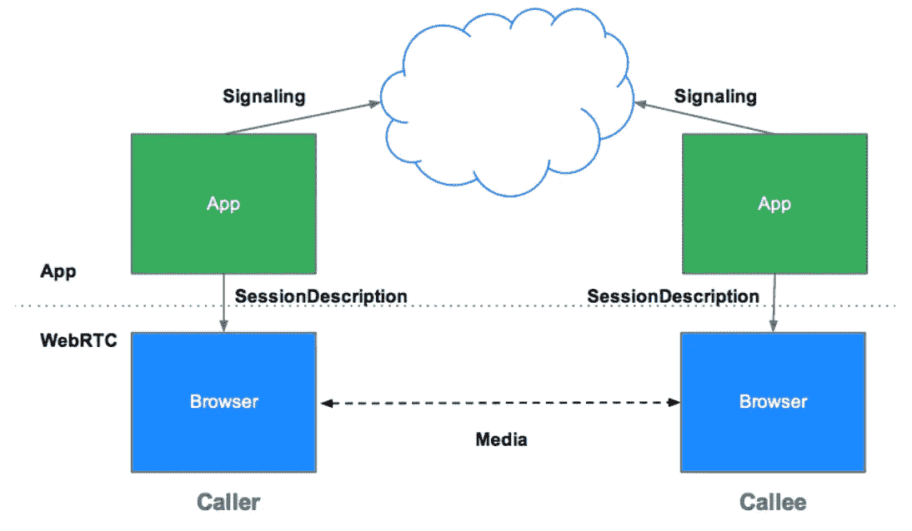
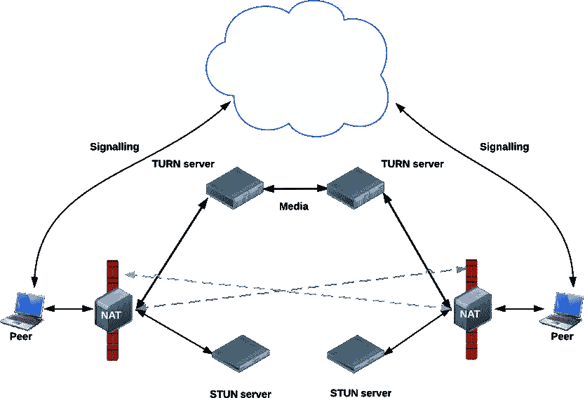
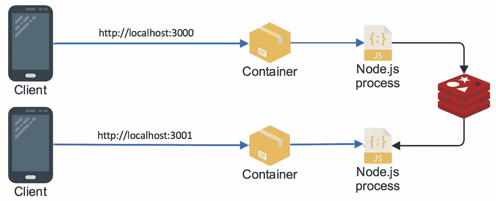
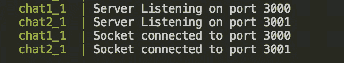
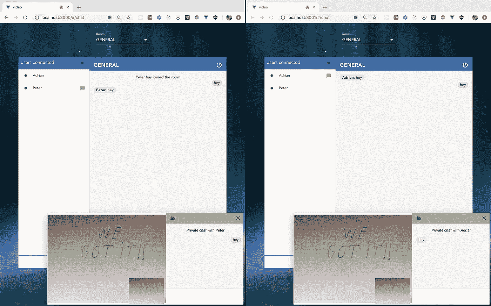

# 使用 Vue、WebRTC、SocketIO、Node & Redis 构建您自己的视频聊天

> 原文：<https://levelup.gitconnected.com/build-your-own-video-chat-with-vue-webrtc-socketio-node-redis-eb51b78f9f55>

## 通过水平缩放构建多房间视频聊天

如今，市场上有很多免费的应用程序提供聊天和视频会议功能。几乎只需一次点击，我们就可以与世界上任何地方的任何人交流，但是，为什么我们不尝试构建自己的应用程序，让它变得更加真实呢？我们开始吧！


我们的应用程序的主要特点将是:

*   几个可用的房间和跳过它们的可能性
*   用户状态(在线/缺席/不可用)
*   能够与同一个房间中的任何人进行私聊(同一时间只能进行一次私聊),并获得该用户是已经在与其他人交谈还是已经结束聊天的通知
*   能够在同一个私聊中开始视频会议



私人聊天和视频示例

为了建造它，我们将使用以下技术:

*   **Vue.js** 作为前端框架。Vue 最近越来越流行了，赶上它是个好机会。我们还将使用 **Vuex** 来存储用户和聊天信息
*   后端将通过 **Express** 在 **NodeJS** 中实现
*   **Socket.io** 和 **WebRTC** 用于实时引擎和通信
*   **Redis** 作为内存中的数据库
*   **Docker**&**Docker Compose**

谈到这种技术(特别是 Sockets 和 WebRTC ),我们可以想走多远就走多远，在更复杂的方面深入探讨，但这不是目的。我们希望构建一些简单的东西来理解每个部分的基本要点，但完全可以工作，所以让我们开始吧。

**一个新的抬头！我刚刚发布了一篇新文章，讨论如何实现多对多功能的视频会议。这是我们在这里解释和构建的一个扩展，所以在完成这篇文章后看看吧！**

[](https://medium.com/@adrigardi90/multiparty-video-conference-using-vue-webrtc-socketio-node-redis-e8c5a059d332) [## 使用 Vue、WebRTC、SocketIO、Node & Redis 的多方视频会议

### 第二部分:对等网格体系结构

medium.com](https://medium.com/@adrigardi90/multiparty-video-conference-using-vue-webrtc-socketio-node-redis-e8c5a059d332) 

# 应用程序框架

首先，我们安装使用`[@vue/cli](https://cli.vuejs.org/)`轻松创建主骨架:

```
npm install -g @vue/cli 
vue create video-chat
```

之后，系统会提示您选择一个预设。在我们的例子中，我们手动选择 *Babel* 、 *Router* 、 *Vuex* 、 *CSS 预处理器*和 *Linter* 支架

为了加速这个过程，我们将使用`[vue-materia](https://vuematerial.io/getting-started)l`作为一个风格框架(尽管他们声称 API 不会改变，但它仍然是测试版)

```
npm install vue-material --save
```

关于 HTTP 和 WebSocket 通信，我们将使用`[vue-resource](https://github.com/pagekit/vue-resource)`和`[vue-socket.io](https://github.com/MetinSeylan/Vue-Socket.io)`作为 Vue.js 的定制实现

```
npm install vue-resource vue-socket.io --save
```

一旦全部安装完毕，我们可以在我们的 ***main.js*** 文件中配置它们:

> 通过 vuex 配置中的 **actionPrefix** 和 **mutationPrefix** *，我们可以分别触发服务器端 vuex* [动作](https://vuex.vuejs.org/guide/actions.html) *和* [突变](https://vuex.vuejs.org/guide/mutations.html) *。在我们的例子中，我们不会使用它们，因为我们将在监听套接字服务器事件*后在客户机中分派动作

对于 *VueSocketIO* 和 *Vue* 实例所附带的商店，我们可以在 ***store.js*** 文件中对其进行如下配置:

每当用户触发一个动作时，我们将把它分派给存储，生成一个突变执行，并以一个新的状态结束。

> 通常，无论您选择哪种框架，状态管理模式都是非常相似的。在这种情况下，查看 [**Vuex**](https://vuex.vuejs.org/) 实现以了解更多细节

正如我们所看到的，套接字配置需要一个连接 url，所以在继续登录页面之前，让我们构建服务器的主要基础

# 计算机网络服务器

首先，我们需要安装所有的主要软件包来设置我们的服务器基础

```
npm install express http body-parser path cors socket.io --save
```

其次，在项目根目录下的`/server`文件夹中，我们创建了 ***index.js*** 和 ***app.js*** 文件作为我们的主服务器入口点:

服务器 index.js 文件。我们服务器的入口点

> *我们在* config.js *文件中定义所有的服务器配置。这将有助于我们将来轻松配置应用程序的几个实例*

使用之前的配置，我们主要实现了:

*   创建和配置 http 和 express 服务器
*   为登录和房间定义 REST APIs(为了简单起见，这两个 API 都将信息存储在内存中)
*   创建静态服务器，为我们前端的所有静态文件提供服务
*   创建 websocket 名称空间并配置其服务器事件

> 但是，名称空间的确切含义是什么？那些服务器事件是什么？

[**名称空间**](https://socket.io/docs/rooms-and-namespaces/) 本质上是我们的 WS 连接的端点或路径。默认情况下总是`/`，它是 socket.io 客户端默认连接的对象。在我们的例子中，我们将它设置为`/video-chat`

> 这就是套接字客户端连接到`${url}/video-chat`的原因

关于事件，现在我们只定义了基本事件*加入房间。*在`/chat_namespace`文件夹下，我们创建 ***index.js*** 文件:

joinRoom 服务器侦听器

在连接回调中，我们正在监听`joinRoom`事件。一旦它被触发，我们加入房间，我们将用户添加到房间中，并通过`newUser`事件发送回房间中的所有用户。因此，我们的前端将发出***join joum***事件，它将侦听 ***newUser*** one

> 您可以在 socket . io[**emit cheat sheet**](https://socket.io/docs/emit-cheatsheet/)中查看所有可用的服务器事件

此时，我们已经准备好开始构建我们的前端

# 前端

我们将有两个主页:登录和主聊天页面。

我们不会使用任何认证机制，所以对于第一个，我们只需要用户和房间加入。用户将作为系统中的主键，因此用户名必须是唯一的。除了主房间，想法是 ***使用用户名作为私人对话的房间值***

> 如果我们想同时允许一个以上的私人聊天，我们可以用私人对话中涉及的两个用户名创建一个唯一的约束名

在一个新的`/views`文件夹中，我们创建文件 ***Home.vue*** ，如下所示:

现在我们只需要获取房间并提交用户信息:

在 [***创建***](https://vuejs.org/v2/guide/instance.html#Lifecycle-Diagram)***d***生命周期方法中，我们获取房间并将其保存在我们的商店中。提交表单时也一样，一旦用户发送了正确的信息，我们就保存房间并导航到主聊天页面。

> 我们改变状态，将事件和适当的有效负载一起发送到商店`this.$store.dispatch(<name>, payload)`

对于主聊天页面，为了获得一些结构上的帮助，我们将主要使用 [***素材 app***](https://vuematerial.io/components/app)*组件，包含以下部分:*

**

*公共休息室*

*-更换房间选择*

*-标题(房间名称和注销按钮)*

*-用户列表区(及其状态)*

*-消息区*

*-发送消息的文本区域*

*对于私聊，我们将使用 [***素材对话框***](https://vuematerial.io/components/dialog) 组件。*

> *即使我们使用了 material 组件，我们仍然需要一些调整:)
> 为此，我在除了两个父页面(登录和聊天)之外的所有子组件中使用了 [**样式封装**](https://vue-loader.vuejs.org/guide/scoped-css.html#mixing-local-and-global-styles) 。对于这些，我使用全局范围，因为他们的自力更生的性格和简单性，当覆盖一些材料的风格。你可以在这里查看 Vue.js 中作用域 CSS 的解释*

*此时我们可以区分以下事件:*

*   ****加入房间*** :加入一个主房间(如上所述)*
*   ****public message***:用户发送消息时。服务器向同一房间内的所有用户发回一个带有消息的 ***新消息*** 事件*
*   ****离开房间*** :当用户改变房间时。服务器离开房间并发回该房间的新用户列表。之后，客户端将在 *joinRoom* 事件之后加入新房间*
*   ****leaveChat*** :用户注销时。服务器通过 ***leaveChat*** 事件发出新用户列表并离开套接字空间*
*   ****changeStatus*** :用户改变状态时。服务器对其进行更新，并使用与之前相同的 ***newUser*** 事件发回新值*
*   ****joinPrivateRoom*** :当用户(A)打开与别人(B)的私聊时。服务器加入房间，并发回一个 ***privateChat*** 事件来通知另一个用户(B)。如果最终用户(B)已经在讲话，服务器通知用户(A)并通过***leavePrivateRoom***事件迫使他离开私人房间*
*   ****leavePrivateRoom***:用户关闭私聊时。服务器发出相同的事件来通知其他用户*
*   ****private message***:用户发送私人消息时。服务器向双方用户发送回带有***private message***事件的消息*

*现在，在同一个`/views`文件夹下，我们创建了 ***Chat.vue*** 文件，其中包含了我们主聊天页面的主要组件:*

*主要聊天组件*

*这是我们的父组件，它将负责监听服务器发出的所有套接字事件。为此，我们只需要在我们的 Vue 组件中创建一个 [***套接字对象***](https://www.npmjs.com/package/vue-socket.io#-component-level-usage) ，并为每个服务器事件创建一个*监听器方法:**

*加入主房间。新消息发射器和监听器的示例*

*在那个例子中，当用户发送一条公共消息时，我们发出***public message***事件，我们监听 ***newMessage*** 服务器事件来获取消息。*

> *请记住，所有用户都将运行相同的客户端代码，因此我们需要构建一种通用方法来处理任何情况下的所有逻辑*

*浏览每个组件的所有细节会花费很长时间，所以我们将解释主要的功能。它们基本上只是在套接字侦听器被触发后获取输入数据，并在用户操作下向父对象发出事件:*

*   ****<消息区>*** 文本区发送消息。每当用户发送公共消息时，它向父节点发出一个事件，向服务器发出一个***public message***套接字事件*
*   ****<聊天区>*** 它显示一个房间内的所有公共消息，根据用户使用指令格式化消息:*

*指令来显示公共消息*

*   ****<UserList>***显示当前用户状态和用户列表及其状态。当用户想要打开私聊时，它向父节点发出一个事件来打开私聊模式，并发出***joinPrivateRoom***socket 事件。当用户改变状态时，它更新状态并发出 ***changeStatus*** 套接字事件。*
*   ****<chat dialog>***私聊。对于每个消息，它发出一个***private message***套接字事件。当关闭对话时，它向发出***leavePrivateRoom***套接字事件的父节点发出一个事件。它还包含了具有所有视频功能的***<video area>***组件*

*之后，是时候将新的监听器添加到我们之前的服务器文件 ***index.js*** 的`/chat_namespace`文件夹中了:*

*新事件监听器*

*随着我们获得更多的事件，我们对该文件做了轻微的修改，并在同一个`/chat_namespace`文件夹下创建了一个新的 ***events.js*** 文件，其中包含所有的回调函数:*

*所有监听器的回调函数实现*

> *等等，但是如果我们有多个实例运行我们的服务器，会发生什么呢？*

*在整个过程中，我们把所有的信息都存储在内存中。这种方法适用于简单的情况，但是一旦我们需要扩展，它就不能正常工作了，因为每个服务器实例都有自己的用户副本。不仅如此，用户可能连接到不同的实例，因此没有办法与两个套接字连接进行通信。*

**

*两个实例的水平缩放*

## *添加 Redis*

*在我们的服务器上实现 [***Redis 适配器***](https://github.com/socketio/socket.io-redis) 解决了这个问题。*

```
*npm install socket.io-redis redis --save*
```

*在服务器入口点 ***index.js*** 我们添加以下几行:*

*为 socket.io 添加 redis adator*

*此外，我们将使用[***Redis***](https://redis.io/)作为数据库来存储所有连接的用户。为此，我们在服务器的新`/redis`文件夹中创建一个 ***index.js*** 文件:*

*Redis 作为一个数据库。哈希模式*

> *在我们的例子中，我们实现了 [**散列**](https://redis.io/commands/hset) 模式来存储数据，但是我们可以根据搜索需求使用更多的 [**数据类型和抽象**](https://redis.io/topics/data-types-intro) 。此外，还有一些 node.js
> [**redis 客户端**](https://redis.io/clients) 通过一层抽象提供额外的功能*

*之后，我们只需要更新内存中对用户的所有引用，并将其更改为使用我们的 redis 实现。*

> *视频呢？你忘了吗？*

# *WebRTC*

*[***WebRTC***](https://webrtc.org/)是一个免费开放的项目，通过简单的 API 为 web 和移动应用程序提供实时通信(RTC)功能。*

**

*JSEP (Javascript 会话建立协议)架构*

*WebRTC 支持点对点通信，尽管它仍然需要一个服务器来处理*信令*过程。 [***信令***](https://www.html5rocks.com/en/tutorials/webrtc/infrastructure/#what-is-signaling) 是协调两个客户端之间的通信以交换建立通信所需的某些元数据(会话控制和错误消息、媒体元数据等)的过程。然而，WebRTC 并没有为此指定任何方法和协议，所以由应用程序来实现适当的机制。*

***在我们的例子中，我们将使用私人房间作为两个用户之间的信令机制***

> *为了保护生产中的 WebRTC 应用，必须使用 [**TLS**](https://en.wikipedia.org/wiki/Transport_Layer_Security) **(传输层安全)** *作为信令机制**

*为此，我们将在服务器配置中添加一个新的服务器监听器:*

*在 A(呼叫者)和 B(被呼叫者)之间建立通信的机制如下:*

1.  ***一个**用 ***ICE 服务器*** 配置创建一个***RTCPeerConnection***对象*
2.  ***A** 使用 RTCPeerConnection***create offer***方法创建报价(SDP 会话描述)*
3.  ***一个**调用 ***setLocalDescription(提供)*** 方法同提供*
4.  ***A** 使用信令机制(***privateMessagePCSignaling***)向 **B** 发送要约*

1.  ***B** 得到报价，用 **A 的报价**调用***setRemoteDescription()***(所以 B RTCPeerConnection 知道 A 的设置)*
2.  ***B** 用 RTCPeerConnection***create answer***方法创建答案*
3.  ***B** 调用 ***setLocalDescription(答案)*** 方法同答案*
4.  ***B** 使用信令机制(***privateMessagePCSignaling***)将答案发回给 **A***
5.  ***A** 使用***setRemoteDescription()***方法将 **B 的答案**设置为远程会话描述*

*除了该过程之外，两个用户都必须设置以下内容:*

*   *访问摄像机，获取流并将其附加到本地视频标签*
*   *在添加流 监听器上设置 RTCPeerConnection ***以获取远程轨道媒体并将其附加到远程视频标签****
*   *设置 rtcpeer connection***onicecandidate***监听器将任何 ice 候选发送给其他对等*

**

*真实世界点对点连接。冰框架。眩晕&转身服务器*

*会话建立后，WebRTC 会尝试直接连接客户端(点对点，无需任何服务器)进行媒体和数据流传输。然而，在现实世界中，大多数设备都位于一层或多层[***NAT***](https://www.iplocation.net/nat)之后，因此 WebRTC 使用 [***ICE 框架***](https://www.avaya.com/blogs/archives/2014/08/understanding-webrtc-media-connections-ice-stun-and-turn.html) 来克服这些复杂性*

> *这就是我们在创建 RTCPeerConnection 对象时需要 ICE 服务器配置的原因。您可以在此 测试任何 STUN/TURN 服务器的连接性，以检查它们是否处于活动状态并正确响应连接*

*组件 ***将包含所有的逻辑:****

*视频聊天组件。简单的呼叫者/被呼叫者机制*

*调用者使用***privateMessagePCSignaling***套接字事件将本地描述和要约一起发送给其他用户，因此我们需要在我们的客户端中有一个 ***套接字监听器*** 来处理被调用者端的消息(当被调用者将答案发送回调用者时，情况正好相反)*

*上面提到的 ***ChatDialog*** 组件负责私人聊天，所以我们将在那里添加逻辑来监听我们的信令机制并控制我们传递给 ***VideoArea*** 组件的数据:*

*ChatDialog 组件。信令机制监听器*

*基于消息信息，我们检测它是否是一个来电、一个呼叫的应答或者仅仅是一个要添加到对等对象的新候选，在每种情况下相应地采取行动。*

> *至此，我们已经准备好测试我们的视频聊天了！*

*我们将创建 3 个容器:2 个视频聊天实例和一个 Redis 实例:*

**

*本地容器测试*

*为此，我们将在项目的根目录下创建一个***docker-compose . yml***文件，配置如下:*

*docker-撰写配置*

***上下文** 属性定义了*[**docker file**](https://docs.docker.com/engine/reference/builder/)*目录。在这里，我们描述了在每种情况下编译我们的客户机并使用适当的配置运行服务器的步骤。***

***Dockerfile 文件配置***

***现在我们只需要构建并运行包含`docker-compose build`和`docker-compose up`的容器，并在浏览器中打开两个视频聊天副本:***

******

***本地测试日志***

> ***我们观察每个应用程序如何创建与其服务器的 web 套接字连接，因此 Redis 将是两个连接通信的唯一方式。***

> ***如果你到了这里…我们终于做到了！:)***

******

***连接到不同视频聊天实例的本地测试***

***我们完了！我们已经看到了如何不用太多代码就能建立一个简单的视频聊天。这是一个非常简单的例子，涵盖了基本要点，我们可以从几个方面进行改进:添加登录和 websocket 身份验证，处理重新连接，增强 WebRTC 功能，改进摄像头和声音处理，允许多个私人聊天，有机会接受或拒绝私人视频通话等等。***

***您可以在下面的 [**回购**](https://github.com/adrigardi90/video-chat/tree/video-one-to-one) 中查看所有代码***

***你也可以在下面的 [**网址**](https://vue-video-chat.surge.sh/#/) 中找到一个简单的版本***

***我已经用[**surge**](https://surge.sh/)*部署了前端，并在 AWS 的一个微 EC2 实例中部署了服务器端，所以尽量不要让它过载太多:)****

> ***根据位置，WebRTC 媒体有时会由于 ICE 服务器配置而失败(或者您可能需要多次尝试视频呼叫),因此需要更新和改进其他内容***

***我希望你已经发现它有趣。***

***[](https://skilled.dev) [## 编写面试问题

### 一个完整的平台，在这里我会教你找到下一份工作所需的一切，以及…

技术开发](https://skilled.dev) [](https://gitconnected.com/learn/vue-js) [## 学习 Vue.js -最佳 Vue.js 教程(2019) | gitconnected

### Vue 是开发人员用来构建用户界面(UI)的 JavaScript 库，旨在简化前端工程…

gitconnected.com](https://gitconnected.com/learn/vue-js)***