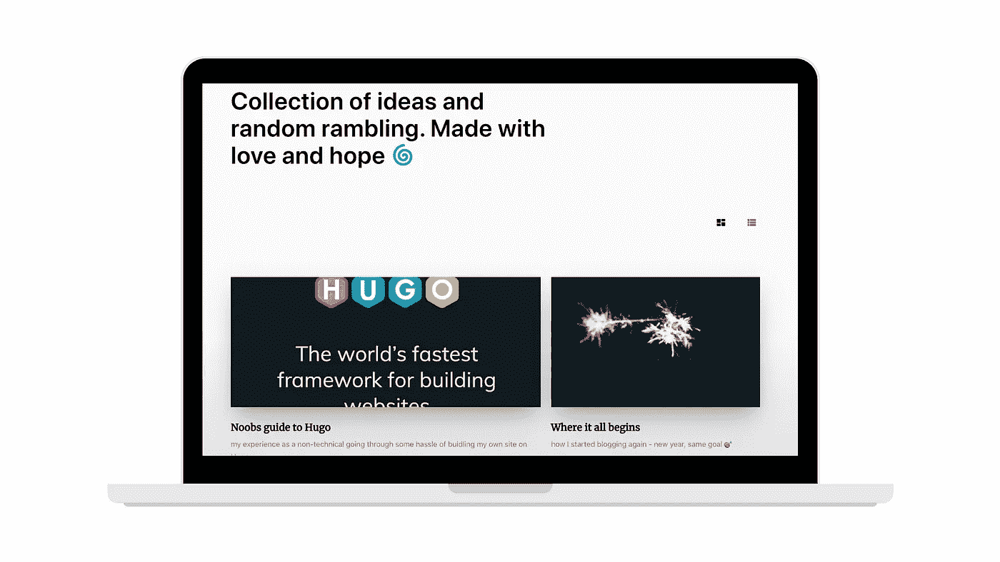

# 在 Hugo 上创建网站的 Noobs 指南

> 原文：<https://levelup.gitconnected.com/build-your-personal-moats-noobs-guide-to-starting-a-website-on-hugo-5ba40b64f2a7>

## 建造你的个人护城河



我的网站:[https://www.chuxinhuang.com/](https://www.chuxinhuang.com/)

# ✍️想开博客吗？

开始写博客是一件非常美妙的事情，而现在，互联网让事情变得非常容易。有各种工具可以帮助实现相同的目标，同时满足不同的需求。

如果你真的不想从头开始构建东西，只关心分配，[中型](https://medium.com/)是最好的地方。它拥有数百万的读者，一个参与的社区，编辑器简单而优雅。就我个人而言，我也喜欢[概念](https://www.notion.so/)的功能性和多用例。你可以很容易地公开分享任何东西，这基本上是一个博客/网站。唯一的缺点是 concept 还不支持自定义域。

然而，如果你喜欢更多的定制而不需要太多的编码，那么 [WordPress](https://wordpress.com/) 、 [Squarespace](https://www.squarespace.com/) 、 [Weebly](https://www.weebly.com/) 和 [Wix](https://www.wix.com/) 都是受欢迎的选项。我还发现了 [Format](https://www.format.com/) 作为创意者的平台；而 [Webflow](https://webflow.com/) ，一个没有任何代码的设计优先的动态网站建设者，正从 [*无代码运动*](https://makermag.com/2019/12/04/no-code-movement/) 的兴起中获得大量的牵引力。

毕竟，没有适合所有人的单一工具，大多数情况下这取决于个人偏好。选择对你来说容易使用的东西，以获得更广泛的受众。

# 🤔为什么是雨果？

在科技行业工作的一个好处是，你周围总是有寻找替代方案的聪明人——我受到一位同事的启发，开始探索替代方案来托管我的网站，而不需要付费。然后我找到了[Hugo](https://gohugo.io/)——一个用 go 写的通用网站框架。作为一个[静态站点生成器](https://gohugo.io/about/benefits/)，Hugo 部署速度极快。

我喜欢通过做来学习**的想法，由于 Hugo 支持 HTML 和 Markdown 这两种内容格式，它可以帮助我熟悉这两种格式，并理解网站是如何构建和部署的。接下来，我可以添加代码块，并为数据相关的帖子启用数学公式！**

好吧，我应该承认我选择了雨果而不是哲基尔，因为雨果有更多适合我口味的主题；因为学习曲线(JavaScript、React 和 GraphQL)太陡，所以我没有选择盖茨比😂。

无论如何，经过 6 个月的拖延，我对结果相当满意(自从去年 Christmas✌️).根据你选择的主题，可能需要不同层次的定制来使它发挥作用。我将在这篇文章中介绍主要的几个，希望这能让那些渴望尝试的人生活得更轻松！

# 👩🏻‍💻手放在键盘上

Hugo 有一个文档齐全的指南[在这里](https://gohugo.io/getting-started/quick-start/)进行设置，假设你已经熟悉了 [Git](https://git-scm.com/) 和命令行。这里的例子使用了 MacOS 和主题 [Hugo Novela](https://themes.gohugo.io/hugo-theme-novela/) 。我将省去任何样式，所以代码可以适用于其他地方。

# 1.在本地创建网站

这是建立自己网站的第一步，然后在网上直播:

*   使用[自制软件](https://brew.sh/)在你的机器上安装 Hugo

```
brew install hugo
```

*   转到要创建新站点的指定文件夹

```
-- for example, I would like to have mine under github folder
cd ~/github/-- use the command line below to create a new site
hugo new site your_site_name
```

*   从 [themes.gohugo.io](https://themes.gohugo.io/) 中选择一个主题，这里我用的是 [Hugo Novela](https://themes.gohugo.io/hugo-theme-novela/) 。或者，您也可以通过`https://github.com/forestryio/hugo-theme-novela/archive/master.zip`直接下载，然后移至`themes/`

```
cd your_site_name
git init
git submodule add https://github.com/forestryio/hugo-theme-novela.git themes/novela
```

*   然后将`'theme = "novela"'`添加到`config.toml`中，让雨果知道你正在使用这个主题。您也可以选择在`.json`或`.yaml`中进行配置。

# 2.网站结构和你的第一篇文章

现在你已经准备好了，是时候开始创建一个新帖子，并了解 Hugo 是如何构建网站的:

*   `content/`下的文件夹和文件将呈现为如下组织的网页

```
contents/
    post/
      post-01.md
      post-02.md
    _index.md
    about.md
```

*   图像存储在`static/images`中，可以使用 [Markdown](https://commonmark.org/help/) 添加到帖子中
*   主题通常被组织成默认布局，包含丰富默认内容的“部分”

```
layouts/
    _default/
      baseof.html
      list.html
      single.html
    partials/
      page/
      author/
      article/
      head/
      ...
```

*   要生成一个新帖子，你可以在`post/`中创建一个新的`.md`文件，或者使用`hugo new post/my-first-post.md`
*   新生成的帖子通常包含以下内容，您可以通过调整`archetypes/default.md`进行定制

```
 ---
  title: "My First Post"
  date: 2020-01-04T22:02:43+11:00
  hero: /images/hero-3.jpg
  excerpt:
  tags:
  draft: true
  ---
  This is my first post!
```

*   Hugo 的变化包括添加新帖子，CSS 样式等等。可通过以下内容在`http://localhost:1313/`本地即时查看

```
-- with draft enabled
hugo server -D-- without draft
hugo server
```

# 3.更多定制—标签和数学

在将网站公开之前，您可能希望使其更加个性化。是一个很好的起点，在这里你可以改变网址，网站名称，启用标签/类别，添加额外的网页等。这是我当前的配置，注意到我使用了`novella`主题:

config.toml 示例

我在这个主题中加入了两个额外的特性，这样我就可以**给帖子添加标签**并在相应的标签页面下整理它们，并且**在必要的地方使用 Markdown 中的数学公式**。如果你的主题已经支持下面这些功能，你可以跳到下一步托管和部署网站。

## 🏷标签

标签有助于读者找到同一主题下的帖子。Hugo 为用户定义的内容分组提供了名为**分类法**的内置支持。如果你从上面复制配置设置，你可以用`tags: ["tag_01", "tag_02"]`在你的文章中定义标签。这样，这篇文章就与两个标签相关联了。

下一步是呈现带有公共标签下的文章的页面，以及包含所有标签的页面。事实上，当你在一篇文章中创建标签时，Hugo 会创建类似`\tag\tag_01`的列表页面。然而，我们仍然需要通过[分类列表模板](https://gohugo.io/templates/taxonomy-templates/#taxonomy-list-templates)和[分部模板](https://gohugo.io/templates/partials/)将所有东西组合在一起。

*   在帖子中呈现标签

我在这里借用了[的代码，在`layouts/partials`下创建了一个名为`tags.html`的文件。代码获取文章中定义的标签，并将它们链接到相关的标签页面。](https://www.jakewiesler.com/blog/hugo-taxonomies/)

tags.html 的例子

然后你可以给`layouts/post/single.html`加上下面的部分。对于这个主题，我将其添加在文章内容和下一篇文章的部分内容之间。

```
<!-- layouts/post/single.html --> <!-- ... --> {{ partial "tags.html" .}} <!-- ... -->
```

*   在标签下创建文章列表页面

之后，你的标签应该会出现在文章中。下一步是重新格式化默认列表页面，以便它们可以显示与特定标签相关的文章。原`list.html`简单，渲染全网所有文章。下面添加了逻辑，这样如果一个页面与`\tag`相关，它将只在这个列表页面中呈现与那个标签相关的文章。

从 [hugo-notepadium](https://themes.gohugo.io/hugo-notepadium/) 修改的代码。

list.html 的例子

*   生成主标记页面

最后，我们还需要一个独立的标签页，聚集所有的标签，链接到个别的标签。这是通过创建一个新的 HTML 文件`layouts/_default/terms.html`来实现的。

从 [hugo-notepadium](https://themes.gohugo.io/hugo-notepadium/) 修改的代码。

术语示例. thml

在所有这些之后，标签特性应该对整个站点起作用🤞，同样的步骤可以应用于其他的分类法，比如类别和作者。

## 🧮数学语法

如果你的主题不支持数学符号，这里有一个简单的方法，通过一个名为 [KaTeX](https://katex.org/) 的第三方数学排版库来启用它。

*   在`layouts/partials`下创建一个分部`math.html`

*   在呈现帖子的模板中包含以下部分，在我的例子中，它是`layouts/post/single.html`

```
<!-- layouts/post/single.html --> <!-- ... -->{{ if or .Params.math .Site.Params.math }}
  {{ partial "math.html" . }}
{{ end }} <!-- ... -->
```

*   最后，为了全局启用 KaTeX，在配置中设置`math = true`;否则，为每个岗位设置`math: true`。

# 4.在网上直播

Hugo 几乎可以在任何地方被托管。我选择 [Netlify](https://www.netlify.com/) 是因为它易于使用。其他流行的托管解决方案将被添加到参考链接的最后。

你所需要做的就是将你的 GitHub 账户与 Netlify 连接，然后授权 Netlify 访问网站 repo 继续开发。您可能还需要配置另一个文件`netlify.toml`来指定您的 Hugo 版本。更多详情请见[此处](https://gohugo.io/hosting-and-deployment/hosting-on-netlify/)。

# 💭最后的想法

祝贺你跟随并创建了你自己的网站👏！

老实说，我从没想过我能做到所有这些，更别说写教程了！这个过程比简单地为一项服务付费要麻烦得多，但我确实发现最终它是令人满意和值得的。尽管周围有一些黑客，我对网站如何工作有了更多的了解，一个一个地修复漏洞，最重要的是，意识到没有什么是不可学习的(谷歌是你的好伙伴！).

这个网站本身并不完美，但我已经决定暂停开发，而是花更多的时间阅读和综合。这只是一个新十年的第一周，我已经等不及接下来的事情了！

## 有用的资源和参考

*   降价介绍:[https://commonmark.org/help/tutorial/index.html](https://commonmark.org/help/tutorial/index.html)
*   GitHub 学习实验室:[https://lab.github.com/](https://lab.github.com/)
*   给雨果添加标签:[https://www.jakewiesler.com/blog/hugo-taxonomies/](https://www.jakewiesler.com/blog/hugo-taxonomies/)
*   更多关于分类学的信息:[https://gohugo.io/content-management/taxonomies/](https://gohugo.io/content-management/taxonomies/)
*   KaTeX cheat sheet:[https://katex.org/docs/supported.html](https://katex.org/docs/supported.html)
*   关于托管和部署的更多信息:[https://gohugo.io/hosting-and-deployment/](https://gohugo.io/hosting-and-deployment/)
*   推特卡片:[https://gohugohq . com/partials/Twitter-cards-partials-for-Hugo/](https://gohugohq.com/partials/twitter-cards-partials-for-hugo/)

***更新鸣谢:*** *截止到 2020 年 3 月，我已经把我的主题从中篇切换到了这个由*[*Jake*](https://www.jakewiesler.com/)*创作的。没有他惊人的工作，这个网站是不可能的🙌。*

Jake 最近为 Hugo 社区开源了[主题](https://themes.gohugo.io/hugo-theme-codex/)！有兴趣就去看看吧！

> 大声喊[保罗调](https://medium.com/u/3f15d28c014e?source=post_page-----5ba40b64f2a7--------------------------------)帮忙校对！