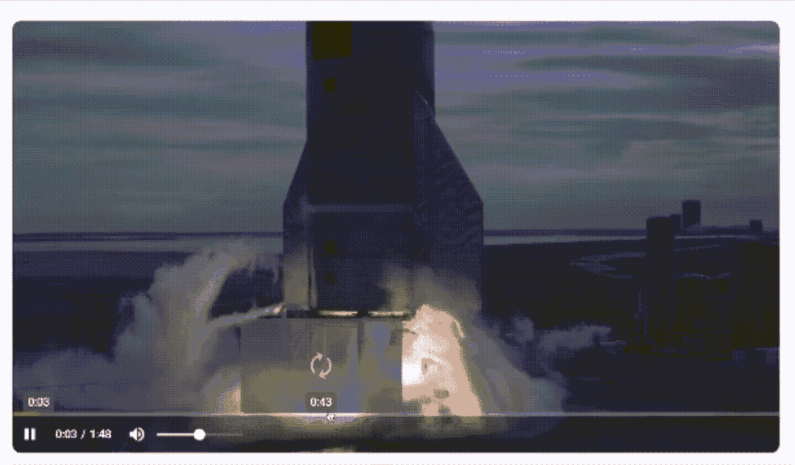
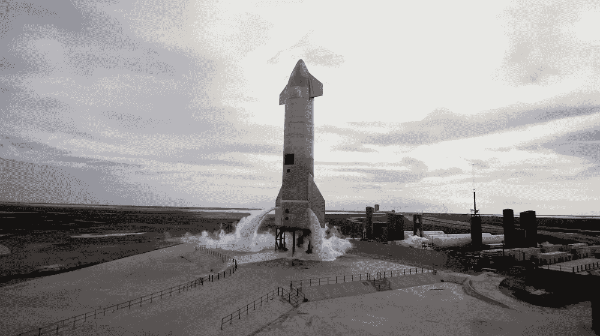
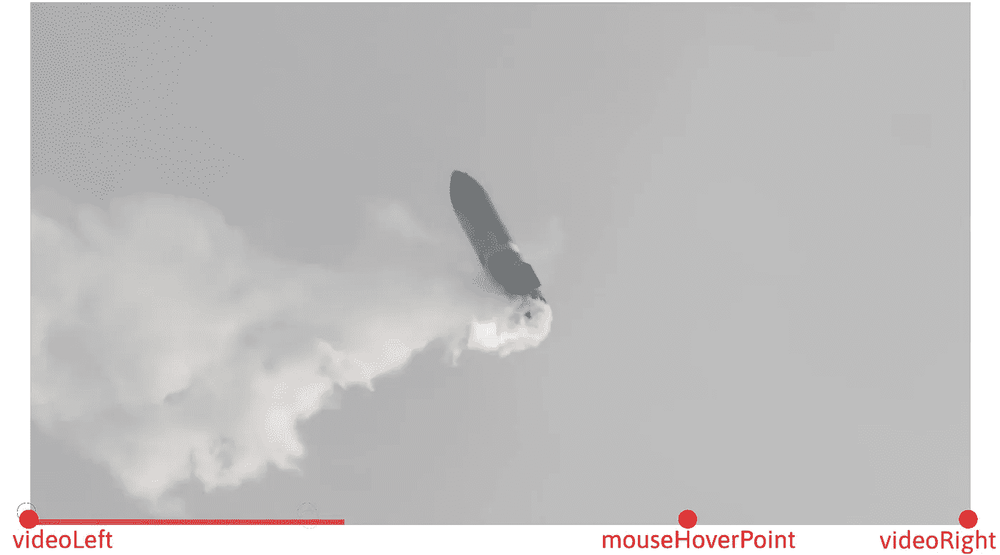
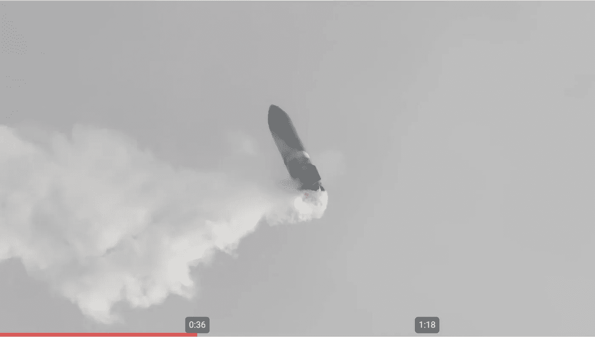
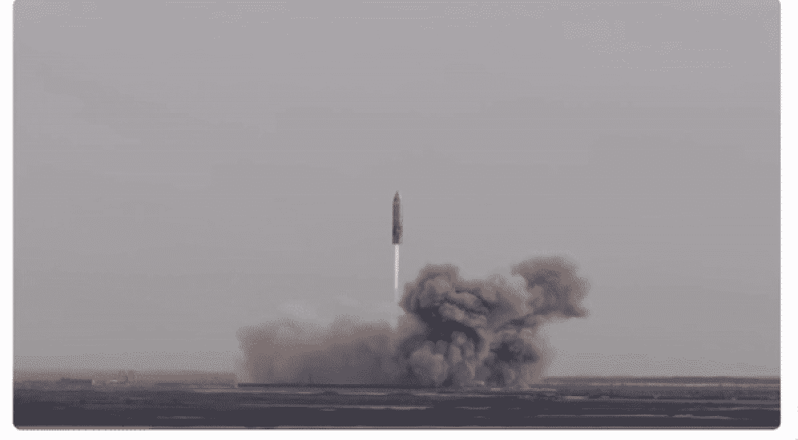

# 视频进度条悬停时的缩略图:创建视频组件

> 原文：<https://levelup.gitconnected.com/build-youtube-like-stylish-video-player-with-thumbnail-preview-on-progress-bar-hovered-53b9074acd75>



悬浮在进度条上的缩略图预览(SN11 启动事件)

当进度条悬停时显示信息丰富的缩略图预览图像有很多好处，例如帮助用户快速了解视频的大致内容，选择一个有趣的时刻开始，在视频到达该点之前预览关键帧。

正如我们所知，原生的`[<video>](https://developer.mozilla.org/en-US/docs/Web/HTML/Element/video)`元素没有这样的 API 供我们直接用来生成某一时刻的视频快照。在这种情况下，**我们需要重写视频控件来获得快照。**

所以让我们把这个任务分成几个部分:

(1)用自定义进度条重写视频控件

(2)在鼠标悬停时从进度条获取时间值

(3)在某个时间生成快照

在这篇文章中，我们将经历上面列出的三个步骤。源代码可以在我在 NPM-[https://www.npmjs.com/package/ngx-thumbnail-video](https://www.npmjs.com/package/ngx-thumbnail-video)上发布的`[ngx-thumbnail-video](https://www.npmjs.com/package/ngx-thumbnail-video)`包中找到。

# 1.用自定义进度条重写视频控件

首先，生成您的自定义视频播放器组件来保存本地视频元素，例如`ngx-thumbnail-video`，并在另一个组件中创建您的自定义视频控件，例如`ngx-video-controls`。您不必将控件分离到不同的组件中，但是为了可重用性和可读性，最好这样做。

确保隐藏了`<video>`元素的本地控件，这可以通过从`<video>`元素中移除`controls`属性来实现。下面是视频组件在这个阶段的自定义控件的外观。

初始阶段自定义视频播放器 HTML

之后，在你的视频控件中添加一个进度条，你可以通过添加一个`<div>`元素来完成，默认情况下这个元素占容器宽度的 100%。代码如下所示:

```
<div class="custom-controls">
    <div class="progress-bar">
        <div class="bar" [style.width]="barLength"></div>
    </div>
</div>
```

添加一些 CSS 以确保:

1.  进度条总是在视频播放器的底部
2.  进度条有清晰的颜色显示时间流逝

这是它在这个阶段的样子，底部的灰色线将是我们的进度条，它占据了视频的整个宽度，便于在稍后阶段计算悬停时间。



自定义视频播放器

# 2.鼠标悬停时从进度条获取时间值

## **2.1 随着时间推移增加进度条长度**

在创建自定义控件和一些样式后，我们需要随着时间的推移增加进度条的长度。如何了解视频时间流逝？原生[视频 API](https://developer.mozilla.org/en-US/docs/Web/API/HTMLMediaElement/timeupdate_event) 有答案:

> 当由`currentTime`属性指示的时间被更新时，触发`timeupdate`事件

因此，我们可以向`timeupdate`事件添加一个监听器，并获取视频的当前时间。在检索到视频的`currentTime`之后，我们可以通过计算当前时间和视频持续时间的比率来计算进度条的百分比长度(`%`)，这是视频元素的固有属性之一。

```
this.videoPlayer.nativeElement.ontimeupdate = (_: any) => {
    const video = this.target.nativeElement;
    this.barLength = (video.currentTime / video.duration) * 100 +   '%';
    this.currentTime = this._formatTime(video.currentTime);
};
```

## **2.1 计算鼠标在进度条上悬停的位置时间**

要计算鼠标在进度条上停留的时间，你需要知道鼠标指向视频容器左边缘的长度。



关键点位置

要计算鼠标悬停点的时间，您需要执行以下计算:

```
const mouseTime = (mouseX - videoLeft) / videoWidth * videoDuration;
```

为了获得视频容器的位置，比如左坐标和视频宽度，我们需要使用 Web API `getBoundingClientRect()`。

> `Element.getBoundingClientRect()`方法返回元素的大小及其相对于视口的位置。

```
const { left, offsetWidth } = this.videoPlayer.nativeElement.getBoundingClientRect();
```

为了获得鼠标位置，我们需要在进度条上添加一个`mousemove`监听器:

> 当指针设备(通常是鼠标)移动而光标的热点在元素内时，元素触发`mousemove`事件。

```
<div class="progress-bar" (mousemove)="onMouseMove($event)"></div>
```

在准备好所有这些参数之后，我们可以计算时间并把它们放在进度条上。



带时间的进度条

# 3.在特定时间生成缩略图快照

## 3.1 生成快照

现在我们让鼠标停留在进度条上。我们需要得到当时视频的快照。对于一个`<video>`元素，我们可以做的是将视频的`currentTime`设置为鼠标悬停的时间。

```
this.videoPlayer.nativeElement.currentTime = mouseHoverTime;
```

之后，我们需要拍摄视频的快照，你可以使用 canvas 在后端或前端渲染图像。下面是 MDN 的[实现，说明如何在前端使用`canvas`获取视频快照。](https://developer.mozilla.org/en-US/docs/Web/API/Canvas_API/Manipulating_video_using_canvas#the_javascript_code)

```
const processor = {};
processor.doLoad = function doLoad() {
    const video = document.getElementById('video');
    this.video = video; this.c1 = document.getElementById('c1');
    this.ctx1 = this.c1.getContext('2d');

    this.c2 = document.getElementById('c2');
    this.ctx2 = this.c2.getContext('2d');

    video.addEventListener('play', () => {
        this.width = video.videoWidth / 2;
        this.height = video.videoHeight / 2;
        this.timerCallback();
    }, false);
};
```

我们需要在上述实现的基础上再做几个步骤:

1.  将其包装到`loadeddata`监听器的处理函数中。
2.  设置好视频的`currentTime`并可以播放后，获取快照。

下面是我的 [ngx-thumbnail-video](https://www.npmjs.com/package/ngx-thumbnail-video) npm 包中关于如何用`canvas`获得`video`快照的实现。

## 3.2 将生成的快照传送到视频控件

获取快照图像的 URL 后，将其呈现在进度条控件上。

```
<div [class.active]="onHover" class="tooltip thumb" [style.left]="mouseLeft" [style.display-none]="!onHover">
    
</div>
```

为了使它有点花哨，你可以为它添加一些动画，如缩放，滑入和滑出等。此外，您还可以添加一些控制，如音量，静音，播放和暂停控制。下面是我的实现的样子:



最终缩略图快照视频效果

# 包扎

制作一个具有缩略图预览功能的视频播放器对你的用户来说是非常有益的。为什么不自己做一个，试着融入一些惊人的想法。

顺便说一句，你可以对这个[开源包](https://github.com/theideasaler/angular-thumb-video)做出贡献，向新特性标签提出一个问题。

**其他岗位:**

*   [优化角度性能的 9 个终极技巧](https://neowei.medium.com/9-ultimate-tips-to-improve-angular-performance-dbedb0ec4e2d)
*   [使用 Nx 原理图/生成器促进角度发展](https://javascript.plainenglish.io/boost-up-angular-development-with-nx-schematics-generators-50117dc56e38)
*   [创建一个可调整大小和可拖动的角度组件](https://medium.com/swlh/create-a-resizable-and-draggable-angular-component-in-the-easiest-way-bb67031866cb)
*   [预呈现 Angular 作为静态网站，并将其托管在 AWS S3 与您的自定义域](/prerender-angular-and-deploy-it-as-a-static-website-on-aws-s3-to-make-it-42-times-faster-115fadcf8614)
*   [在 AWS Lambda 上部署无服务器的服务器端渲染 Angular。](/deploy-your-serverless-server-side-rendering-ssr-angular-app-on-aws-lambda-a01a3aab6ef6)
*   [小心将异步函数作为参数传递](https://medium.com/@neowei/be-careful-of-passing-an-async-function-as-a-parameter-4f421f8e7e9d)