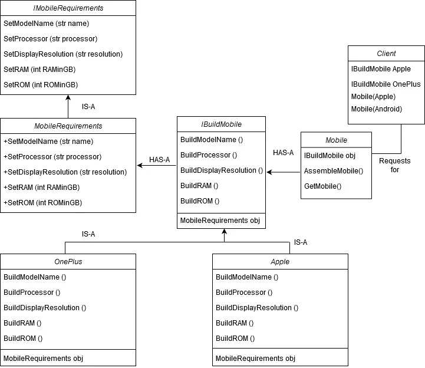
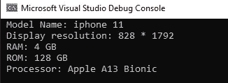
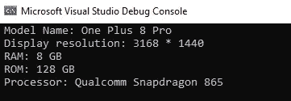

# 生成器设计模式

> 原文：<https://levelup.gitconnected.com/builder-design-pattern-e0cd6b439bdd>

构建器模式应该只用于创建复杂的对象，比如当对象的创建需要从它的集合中分离出来时，比如树。

我们的食谱需要以下原料:

1.  *添加一个构建器接口* 这个抽象基类定义了正确创建产品必须采取的所有步骤。对于我们的例子，接口 IBuildMobile，
2.  *创建一个具体的构建器类*
    这些类包含了创建一个特别复杂的产品的功能。对于我们的例子，苹果类&一加类，
3.  *实现导演* 导演类控制生成最终产品的算法。director 对象通过构造函数注入产品。然后，主管以正确的顺序调用混凝土构建器的方法来生成产品。完成该过程后，可以使用 builder 对象的 GetProduct 方法返回产品。对于我们的例子，在我们的例子中，返回 Mobile 的类 Mobile &方法是 GetMobile()。

构建器模式旨在将复杂对象的构建与其表示分离开来，以便相同的构建过程可以创建不同的表示。

现在你可能正在挠头，想知道那究竟是什么？

这就是我想要表达的…构建器模式从一个对象类中移除任何和所有的构造或初始化代码，并将其抽象到一个接口中。

它用于逐步构建一个复杂的对象，最后一步将返回最终产品的对象。

好吧！说够了！让我们看看 UML 在我们将要设计的例子中会是什么样子。

让我们有两个移动电话的实现:一加和苹果，并有一个客户端只担心调用这些类，而不是担心什么是在移动和它应该如何得到它。

现在，假设您必须制作 Mobile 类的对象。你需要有手机的规格，加上哪个手机是什么(一加或苹果)&等等等等。

为什么客户要担心这些呢？

> 让我们从接口 IMobileRequirements 开始。它定义了你的手机应该具备的所有要求。

> 现在是具体的实现:类 MobileRequirements，它设置了移动的所有基本要求。

> 现在我们的构建界面:IBuildMobile

> IBuildMobile 的具体表示。基本上我们的混凝土建筑类。

# **一加第一混凝土班**

# 第二混凝土类苹果

# 现在我们最后的导演:移动课堂

> 最后，像往常一样，但不是最不重要的，呼叫者:类程序。

*让我们看看客户想要苹果手机时的输出:*

*当客户端需要 Onepplus 手机时输出:*注意:只需取消上述代码的注释并运行应用程序。

# **完美&无瑕！**

# 摘要

在这篇文章中，我们了解到

1.  其中构建器模式适合更大的设计模式图片。
2.  如何创建一个对象类，并将其构造函数抽象到一个接口中。
3.  如何创建和配置混凝土生成器表达。
4.  总监级的角色，管理整个构建过程。

> 我希望您已经真正掌握了构建器模式，以及将来如何将它应用到您的个人项目中。
> 
> 如果你喜欢这篇文章，我希望你喜欢，请应用你的知识来活跃你的项目中的代码。

D **从这里下载代码:**[***https://github.com/RikamCZ/Builder-Design-Pattern***](https://github.com/RikamCZ/Builder-Design-Pattern)

# *联系我:*

> [**https://github.com/RikamCZ**](https://github.com/RikamCZ/Builder-Design-Pattern)
> 
> [**https://www.linkedin.com/in/rikampalkar/**](https://www.linkedin.com/in/rikampalkar/)
> 
> [https://www.c-sharpcorner.com/members/rikam-palkarT21](https://www.c-sharpcorner.com/members/rikam-palkar)
> 
> [**https://twitter.com/rikam_cz**](https://twitter.com/rikam_cz)