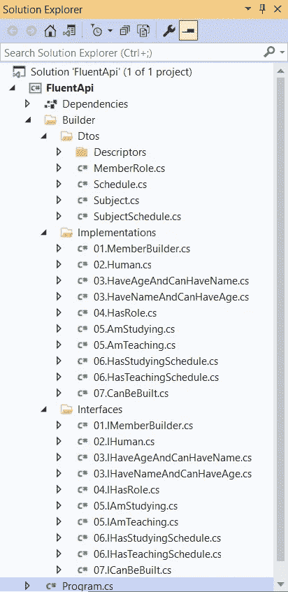
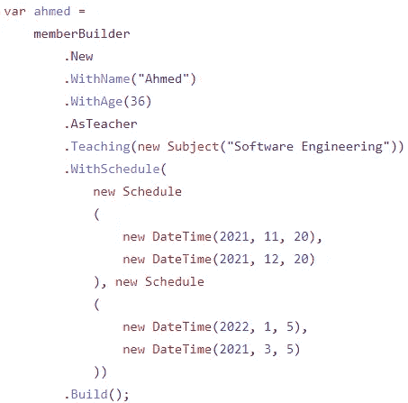
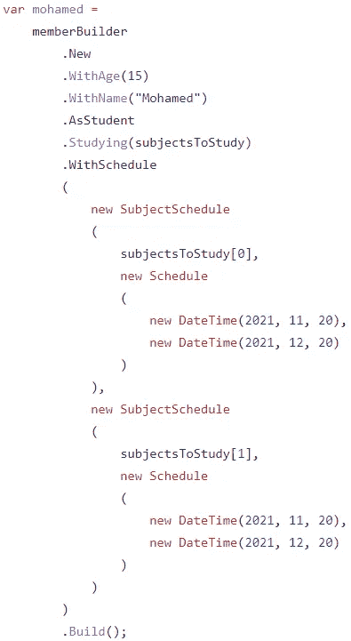
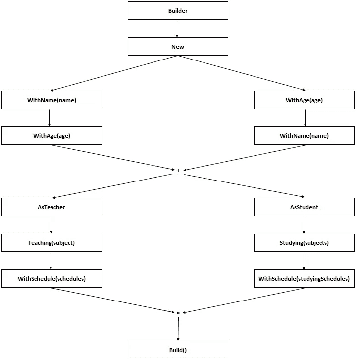
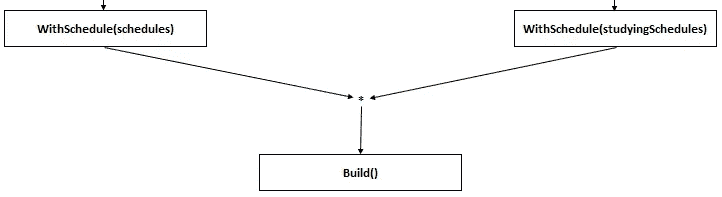

# 中的生成器设计模式。NET C#

> 原文：<https://levelup.gitconnected.com/builder-design-pattern-in-net-c-bbf11c891548>

## 设计模式

## 一步一步的指南，从零开始开发一个流畅的 API。NET C#使用生成器设计模式。

图片由[卡勒姆希尔](https://unsplash.com/@inkyhills?utm_source=unsplash&utm_medium=referral&utm_content=creditCopyText)在 [Unsplash](https://unsplash.com/?utm_source=unsplash&utm_medium=referral&utm_content=creditCopyText) 拍摄

我相信这不是你第一次听说 **Builder 设计模式**。然而，我向你保证，你会在这篇文章中发现一些不同的东西。

在本文中，我们将介绍使用 **Builder 设计模式**开发一个 **Fluent API** 的整个过程，从最初的思考到最近的测试。

因此，系好安全带，让我们开始我们的旅程。

 [## 订阅艾哈迈德的时事通讯？

### 订阅艾哈迈德的时事通讯📰直接获得最佳实践、教程、提示、技巧和许多其他很酷的东西…

medium.com](https://medium.com/subscribe/@eng_ahmed.tarek) 

# 什么是生成器设计模式？

这是一个**创造性的设计模式**，它允许将复杂的对象一个接一个地创建成简单的小步骤。

# 构建器设计模式的优点是什么？

生成器设计模式的一些众所周知的优点是:

1.  它有助于将创建复杂对象的过程分解成更易于控制的小块。
2.  它支持使用终端用户可以使用的**领域特定语言(DSL)** 。
3.  它有助于从我们正在构建的对象的一般定义转移到更具体的粒度定义。

# 构建器设计模式的缺点是什么？

大多数情况下，它给代码增加了额外的复杂性，您会在本文实现的结尾注意到这一点。

# 如何实现生成器设计模式？

是的，这是我知道你感兴趣的问题。然而，这一次我们不会直接跳到代码实现。我们将从设计的早期阶段开始经历整个过程。

因此，我们开始吧。

# 这个例子

首先，让我们想出一个使用 through 或 trip 的例子。我选择了一个简单的学校注册过程的例子。

简单来说，在整个解决方案的某个点上，你将需要定义一些老师和一些学生。让我们假设这些教师和学生对象非常复杂，我们需要开发一个流畅的 API 来创建它们。

在 [Unsplash](https://unsplash.com/?utm_source=unsplash&utm_medium=referral&utm_content=creditCopyText) 上由 [Mikael Seegen](https://unsplash.com/@mikael_seegen?utm_source=unsplash&utm_medium=referral&utm_content=creditCopyText) 拍照

# 放弃

1.  一些最佳实践可能会被忽略/放弃，以便将主要焦点转移到本文中针对的其他最佳实践上。
2.  本文中使用的示例仅用于演示目的。它不是应用生成器设计模式的最佳候选。
3.  我们可以将不同的实践与构建器设计模式集成在一起，比如使用泛型和其他东西，但是，为了使示例尽可能简单，所有这些都被放弃了。
4.  在实现构建器设计模式的方式上存在合理的差异，因此，您可能会发现一些不同于我们在本文中使用的其他实现。
5.  尽量只在实际需要时使用构建器设计模式，因为它会增加整个解决方案的复杂性。

# 窥视未来

如果您完全按照本文中的步骤操作，您应该会得到这样的解决方案结构:

图片由[艾哈迈德·塔里克](https://medium.com/@eng_ahmed.tarek)拍摄

你可以写一些像这样的代码:

图片由[艾哈迈德·塔里克](https://medium.com/@eng_ahmed.tarek)拍摄

还有这个:

图片来自[艾哈迈德·塔里克](https://medium.com/@eng_ahmed.tarek)

# 勾画流畅的 API

现在，我们将从我们的流畅 API 的草图开始。你可以在一张纸上，Excel 表格上，或者任何你喜欢的草图工具上这样做。

所以，我们的草图应该是这样的:

图片由[艾哈迈德·塔里克](https://medium.com/@eng_ahmed.tarek)拍摄

## 注意事项:

1.  **构建器**是主入口点。从那里我们将转移到新的。
2.  那么我们可以有两种选择；**带姓名**和**带年龄**。
3.  然而，下一步，如果你已经来自**并有名字**，我们只允许年龄的**。按照同样的概念，如果你已经从**来，年龄**，我们只允许名字**的**。**
4.  那么我们将会合并到一个公共点。
5.  从这个共同点出发，我们有两个选择；**作为教师**和**作为学生**。
6.  从**作为教师**开始，流程将是**教学(科目)** > > **带时间表(日程)**。
7.  从**学生开始，**流程将会是**学习(科目)** > > **有时间表(stydingSchedule)** 。
8.  最后，它们都合并到 **Build()** 命令中。

# 定义接口

现在，让我们开始编写代码。

## 步伐

打开 VS 或者你喜欢的 IDE。

创建新的类库或控制台应用程序。我将我的项目命名为 **FluentApi** 。

在我的项目中，我创建了以下文件夹:

1.  建设者
2.  生成器\Dtos
3.  生成器\ Dtos \描述符
4.  构建器\实现
5.  构建器\接口

现在你需要记住一件重要的事情，我们在实现的时候需要在**接口**和**dto**之间来回跳转，这是正常的。

现在让我们从我们的第一个界面开始，`IMemberBuilder`。这里有一个重要的窍门。我在**接口**文件夹下创建了一个文件，并将其命名为 **01。IMemberBuilder.cs**

这个 **01。**开头的名字有助于我轻松跟踪整个过程的顺序。否则，对于一个小的更改，您可能需要浏览所有的文件来找出应用您的更改的位置。

从**草图**中我们知道，我们的构建器应该公开一个`New`属性，这个属性应该引导我们去公开两个方法；`WithName(name)`和`WithAge(age)`。

所以，新的属性应该返回，比如说一个叫做`IHuman`的新接口。

移动到下一步，让我们定义`IHuman`接口。所以，创建一个 **02。IHuman.cs** 文件，定义接口如下:

从**草图**中我们知道`IHuman`接口应该有两个方法`WithName(name)`和`WithAge(age)`。但是，这两种方法应该有不同的返回类型。为什么？？？

因为我们希望一旦调用了`WithName(name)`，唯一可用的选项是调用`WithAge(age)`，而不是另一个`WithName(name)`。这同样适用于`WithAge(age)`。

**注意**:你可能也更喜欢只有一个方法，同时接受姓名和年龄，这也是对的，但我更喜欢抓住机会向你展示不同的选项。

移动到下一步，让我们定义`IHaveAgeAndCanHaveName`接口。所以，创造一个 **03。IHaveAgeAndCanHaveName.cs** 文件，定义接口如下:

从**草图**中我们知道，`IHaveAgeAndCanHaveName`接口应该有方法`WithName(name)`。这个方法应该返回公开`AsTeacher`和`AsStudent`属性的东西。

同样，按照同样的方式，让我们定义`IHaveNameAndCanHaveAge`接口。所以，打造一个 **03。ihavenamedcanhaveage . cs**文件(注意该文件编号为 **03** ，因为它还在整个流程的第三步)，定义接口如下:

从**草图**中我们知道`IHaveNameAndCanHaveAge`接口应该有方法`WithAge(age)`。而且这个方法应该返回一些公开`AsTeacher`和`AsStudent`属性的东西，和`IHaveAgeAndCanHaveName.WithName(name)`一样。

转到下一步，让我们定义`IHasRole`接口。所以，创造一个 **04。IHasRole.cs** 文件，定义接口如下:

从**草图**中我们知道`IHasRole`接口应该有两个属性`AsTeacher`和`AsStudent`。根据草图上的以下步骤，这些属性中的每一个都应该返回不同的内容。

转到下一步，让我们定义`IAmStudying`接口。所以，打造一个 **05。iam studining . cs**文件，定义接口如下:

从**草图**中我们知道`IAmStudying`接口应该有方法`Studying(subjects)`。该方法应该期待一个类型为`Subject`的数组输入。所以，我们需要定义类`Subject`。

还有，`Studying(subjects)`应该返回揭露`WithSchedule(subjectsSechedules)`的东西。

因此，我们在 **Dtos** 文件夹中创建一个 **Subject.cs** 文件，代码如下:

这里要注意什么:

1.  它只有一个`Name`属性。
2.  它是不可改变的。
3.  它继承了`IEquatable<Subject>`接口，我们生成了所有需要的成员。
4.  我们定义了构造函数`public Subject(Subject other)`来提供从另一个主题克隆主题的方法。构建器模式中的克隆功能非常重要，因为在每一步中，您都需要处理一个与上一步和下一步完全不同的对象(具有不同的引用)。
5.  我们还定义了对`IEnumerable<Subject>`的扩展方法`Clone`，以避免在不同的地方重复相同的代码。
6.  在扩展方法中，我们使用了在`Subject`类中定义的`public Subject(Subject other)`构造函数。

转到下一步，让我们定义`IAmTeaching`接口。所以，打造一个 **05。IAmTeaching.cs** 文件，定义接口如下:

从**草图**中我们知道`IAmTeaching`接口应该有方法`Teaching(subject)`。这个方法应该期待一个类型为`Subject`的输入。

另外，`Teaching(subject)`应该返回暴露`WithSchedule(sechedules)`的内容。

转到下一步，让我们定义`IHasStudyingSchedule`接口。所以，打造一个 **06。ihassstudyingschedule . cs**文件，定义接口如下:

从**草图**中我们知道`IHasStudyingSchedule`接口应该有方法`WithSchedule(subjectsSchedules)`。该方法应该期待一个类型为`SubjectSchedule`的数组输入。

此外，`WithSchedule(subjectsSchedules)`应该返回一些公开方法`Build()`的内容。

因此，我们在 **Dtos** 文件夹中创建 **Schedule.cs** 和 **SubjectSchedule.cs** 文件，代码如下:

这里我们遵循与`Subject`类中相同的规则。

移动到下一步，让我们定义`IHasTeachingSchedule`接口。所以，打造一个 **06。ihastagechingship . cs**文件，定义接口如下:

从**草图**中我们知道，`IHasTeachingSchedule`接口应该有方法`WithSchedule(schedules)`。这个方法应该期待一个`SubjectSchedule`的数组类型的输入。

另外，`WithSchedule(schedules)`应该返回一些公开方法`Build()`的东西。

移动到下一步，让我们定义`ICanBeBuilt`接口。所以，创建一个 **07。icanbebuild . cs**文件，定义接口如下:

从**草图**中我们知道，`ICanBeBuilt`接口应该有方法`Build()`，该方法返回最终组合的`MemberDescriptor`。

因此，我们在 **Dtos > Descriptors** 文件夹中创建一个 **SubjectSchedule.cs** 文件。

这个`MemberDescriptor`类要暴露一个成员的所有细节，不管他是**老师**还是**学生**。

**成员描述符**

这里要注意什么:

1.  `MemberDescriptor`类公开了一个成员的基本信息。关于**老师**或**学生**的更具体的信息将存在于**老师**和**学生**的另外两个类中。
2.  这个类不是不可变的，这是因为在创建过程的每一步，你都会给对象增加一个小细节。所以，你不会一下子就知道所有的细节。然而，您仍然可以选择使它成为不可变的，但是您需要为每一步提供多个符合您需要的构造函数。
3.  如前所述，我们仍然提供了用于克隆目的的`public MemberDescriptor(MemberDescriptor other = null)`构造函数。
4.  而且我们因为一个重要的原因增加了一个`public virtual MemberDescriptor Clone()`方法。在流程的某些步骤中，您可能会从一个更具体的案例合并到一个更一般的案例。在这种情况下，您的接口实现需要处理父类`MemberDescriptor`，而不是它的任何子类。并且，它需要克隆实体，而不知道它最初是一个**教师**或**学生**。

例如，在这个合并步骤中

图片由[艾哈迈德·塔里克](https://medium.com/@eng_ahmed.tarek)

当实现`ICanBeBuilt`接口时，它应该期待一个`MemberDescriptor`的实例，它不能是一个**老师**或**学生**的特定描述符，因为它是两条路径的公共步骤。另外，你需要在最后克隆传入的`MemberDescriptor`。

**教师描述符**

这里要注意什么:

1.  在克隆构造函数中，我们需要检查空属性，因为如前所述，细节是在不止一个步骤中一点一点添加的。
2.  我们也在使用`IEnumerable<Schedule>`扩展方法进行克隆。
3.  我们定义了一个对`Clone`方法的覆盖，现在我们正在使用我们特定类型的克隆构造函数。

**学生描述符**

遵循与`TeacherDescriptor`中相同的概念。

# 接口实现

现在，我们开始实现我们的接口。

让我们定义实现`IMemberBuilder` 接口的`MemberBuilder`类。所以，创建一个 **01。MemberBuilder.cs** 文件，并如下定义该类:

`New`属性，应该返回一个`IHuman`接口。所以，我们现在将实现`IHuman`接口，但是我们需要记住一些重要的事情。我们需要继续传递部分完成的`MemberDescriptor`,因为每一步都会添加一些细节，直到它最终完成。

在`MemberBuilder`类上，我们没有任何要添加的细节，但是，这是我们的起点，所以该类应该创建初始的`MemberDescriptor`来开始，然后将它传递给下一步。

继续定义实现`IHuman`接口的`Human` 类。所以，创建一个 **02。Human.cs** 文件，并如下定义该类:

我们定义了一个构造函数，它接受一个`MemberDescriptor`并将它保存到一个本地只读变量中。

我们也实现了这两个方法，但是这里需要注意的是，在向`MemberDescriptor`添加任何细节之前，我们首先创建了它的一个克隆。要创建一个克隆，我们可以使用克隆构造函数或者调用`MemberDescriptor`类上的`Clone`方法。

每个方法都会返回不同的接口，所以现在我们需要实现这些接口。

继续定义实现`IHaveAgeAndCanHaveName`接口的`HaveAgeAndCanHaveName` 类。所以，创建一个 **03。HaveAgeAndCanHaveName.cs** 文件，并如下定义该类:

遵循同样的模式，我们创建了构造函数，实现了方法，创建了克隆，添加了细节，将克隆中传递的新对象返回给构造函数。

继续定义实现`IHaveNameAndCanHaveAge`接口的`HaveNameAndCanHaveAge` 类。所以，打造一个 **03。HaveNameAndCanHaveAge.cs** 文件，并如下定义该类:

遵循同样的模式，我们创建了构造函数，实现了方法，创建了克隆，添加了细节，将克隆中传递的新对象返回给构造函数。

继续定义实现`IHasRole`接口的`HasRole`类。所以，打造一个 **04。HasRole.cs** 文件，并将该类定义如下:

遵循同样的模式，我们创建了构造函数，实现了方法，创建了克隆，添加了细节，将克隆中传递的新对象返回给构造函数。

继续定义实现`IAmStudying`接口的`AmStudying`类。所以，打造一个 **05。am studining . cs**文件，并将该类定义如下:

遵循同样的模式，我们创建了构造函数，实现了方法，创建了克隆，添加了细节，将克隆中传递的新对象返回给构造函数。

这里要注意的是，构造函数期望的是一个`StudentDescriptor`而不是一个`MemberDescriptor`，这是因为在构造`AmStudying`的时候就很清楚了。

另外，请注意，我们甚至使用之前创建的扩展方法克隆了传入的数组`Subject`。通过这种方式，我们可以确保最终用户对传入的数组`Subject`所做的任何更改都不会影响我们的构建器状态。

如果出于某种原因，这不是您想要做的，那么您可以通过按原样传入传入的数组来更改这段代码。

继续定义实现`IAmTeaching`接口的`AmTeaching`类。所以，打造一个 **05。AmTeaching.cs** 文件，并将类定义如下:

遵循同样的模式，我们创建了构造函数，实现了方法，创建了克隆，添加了细节，将克隆中传递的新对象返回给构造函数。

这里要注意的是，构造函数期望的是一个`TeacherDescriptor`而不是一个`MemberDescriptor`,这是因为在构造`AmTeaching`的时候就很清楚了。

此外，这里我们传递的不是最终用户传入的那个`Subject`，而是一个克隆。

继续定义实现`IHasStudyingSchedule`接口的`HasStudyingSchedule`类。所以，创建一个 **06。HasStudyingSchedule.cs** 文件，并将该类定义如下:

遵循同样的模式，我们创建了构造函数，实现了方法，创建了克隆，添加了细节，将克隆中传递的新对象返回给构造函数。

这里要注意的是，我们添加了一些断言来检查是否有一些已注册的主题没有被调度，或者有一些已调度的主题没有被注册。这只是一个例子，当然你也可以在任何需要的时候在每一步中添加所有的业务规则。

继续定义实现`IHasTeachingSchedule`接口的`HasTeachingSchedule`类。所以，创建一个 **06。HasTeachingSchedule.cs** 文件，并如下定义该类:

遵循同样的模式，我们创建了构造函数，实现了方法，创建了克隆，添加了细节，将克隆中传递的新对象返回给构造函数。

继续定义实现`ICanBeBuilt`接口的`CanBeBuilt`类。所以，创建一个 **07。canbe build . cs**文件，并如下定义该类:

遵循同样的模式，我们创建了构造函数，实现了方法，创建了克隆，添加了细节，将克隆中传递的新对象返回给构造函数。

这里要注意的是，构造函数期望一个`MemberDescriptor`，因为此时传入的`MemberDescriptor`可能是一个`TeacherDescriptor`或一个`StudentDescriptor`。

同样，在`Build`方法中，我们返回描述符的克隆，但是这次我们不能使用克隆构造函数，就好像你使用`MemberDescriptor`类的克隆构造函数一样，你最终会返回一个`MemberDescriptor`的实例，既不是`TeacherDescriptor`也不是`StudentDescriptor`，这是不对的。相反，我们使用在运行时返回正确实例的`Clone`方法。

# 测试时间

现在，通过一个简单的控制台应用程序，我们可以尝试运行以下代码:

你会注意到:

1.  我们流畅的 API 工作正常。
2.  对于这个例子，您可能会发现为这样简单的对象创建一个流畅的 API 有点大材小用，但是，我们使用这个简单的例子只是为了演示。

照片由[雷·轩尼诗](https://unsplash.com/@rayhennessy?utm_source=unsplash&utm_medium=referral&utm_content=creditCopyText)在 [Unsplash](https://unsplash.com/?utm_source=unsplash&utm_medium=referral&utm_content=creditCopyText) 上拍摄

# 最后的话

构建器设计模式有一些优点，但也增加了复杂性。因此，您只需要在实际需要时使用它。

就这样，希望你觉得读这个故事和我写它一样有趣。

# 希望这些内容对你有用。如果您想支持:

如果您还不是**中**会员，您可以使用 [**我的推荐链接**](https://medium.com/@eng_ahmed.tarek/membership) ，这样我就可以从**中**获得您的一部分费用，您无需支付任何额外费用。订阅 [**我的简讯**](https://medium.com/subscribe/@eng_ahmed.tarek) 将最佳实践、教程、提示、技巧和许多其他有趣的东西直接发送到您的收件箱。

# 其他资源

这些是你可能会发现有用的其他资源。

 [## 如何在中全面介绍基于 I/O 文件的应用程序。带有单元测试的. NET C#

### 学习如何将应用程序划分成更小的模块，这样你就可以 100%覆盖这些模块

levelup.gitconnected.com](/how-to-fully-cover-i-o-file-based-applications-in-net-c-with-unit-tests-ca75c07f3b2c)  [## 当字符串。中的 GetHashCode()。NET C#让你抓狂

### 知道什么时候依赖字符串。中的 GetHashCode()。NET C#，而当不是。

itnext.io](https://itnext.io/when-string-gethashcode-in-net-c-drives-you-crazy-c97ac7507d7b)