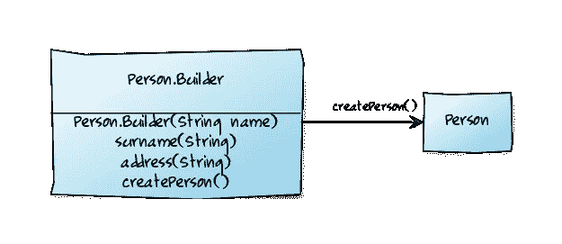

# 构建器模式

> 原文：<https://levelup.gitconnected.com/builder-pattern-7e18e6bb6402>



模型是 java 中使用最多的类。当你想创建一个具有不同配置的对象时，如何定义模态类来轻松地创建对象呢？有三种方法可以做到这一点:**伸缩构造器**、 **Java Bean 模式**和**构建器模式**，第一种方法是反模式。当模型类有可选字段时，第一种方法会创建更多的构造函数，所以我们使用 builder 模式来解决这个问题。下面，将逐一解释。

**1。伸缩构造函数:**传统上，程序员使用伸缩构造函数模式，在这种模式下，他们提供一个只带有必需参数的构造函数，另一个带有单个可选参数，或者一个带有两个可选参数，等等。这种方式是**安全的**，但是它创建了许多构造函数。假设您有 5 个字段，其中 3 个是可选的。所以你必须创建 4 个构造函数。**伸缩构造器模式可以工作，但是很难编写，所以不是最佳的**。

```
public class UserData {
    private String name;
    private int nationalId;
    private int age;
    private String address;
    private int phoneNumber; public UserData(String name, int nationalId) {
        this.name = name;
        this.nationalId = nationalId;
    } public UserData(String name, int nationalId, int age) {
        this.name = name;
        this.nationalId = nationalId;
        this.age = age;
    } public UserData(String name, int nationalId, int age, String address) {
        this.name = name;
        this.nationalId = nationalId;
        this.age = age;
        this.address = address;
    } public UserData(String name, int nationalId, int age, String address, int phoneNumber) {
        this.name = name;
        this.nationalId = nationalId;
        this.age = age;
        this.address = address;
        this.phoneNumber = phoneNumber;
    }
}
```

**2.Java Bean 模式:**在这个模式中，您调用一个无参数的构造函数(默认构造函数)来创建对象，然后调用 setter 方法来设置您想要的每个必需参数和可选参数:…

```
public class UserData {
    private String name;
    private int nationalId;
    private int age;
    private String address;
    private int phoneNumber; public void setName(String name) {
        this.name = name;
    } public void setNationalId(int nationalId) {
        this.nationalId = nationalId;
    } public void setAge(int age) {
        this.age = age;
    } public void setAddress(String address) {
        this.address = address;
    } public void setPhoneNumber(int phoneNumber) {
        this.phoneNumber = phoneNumber;
    }
}
```

用法:

```
UserData userData = new UserData();
userData.setName("Golnaz");
userData.setNationalId(00000);
userData.setAge(0);
userData.setAddress("....");
userData.setPhoneNumber(00000);
```

不幸的是，并不清楚哪些参数是必需的，哪些不是。这种方式具有可读性，但是对于每 5 个字段，我们必须编写 setter，并且我们必须调用每个字段的 setter，JavaBeans 模式排除了使类不可变的可能性。

**3。构建器模式:**构建器模式是最好的方式。它兼具安全性和可读性。实现这种模式的方法是在模态类中创建一个静态类，并将其称为构建器类。像以前一样，我们将必需参数定义为 final，将可选参数定义为 optional，然后创建带有两个必需参数的构造函数，对于 optional，我们为每个参数创建一个方法，并将其输出视为 Builder。父类有一个带有生成器输入的构造函数。

```
public class UserData {
    private final String name;
    private final int nationalId;
    private final int age;
    private final String address;
    private final int phoneNumber; public static class Builder{
        //required
        private final String name;
        private final int nationalId;
        //optional
        private int age;
        private String address;
        private int phoneNumber; public Builder(String name, int nationalId) {
            this.name = name;
            this.nationalId = nationalId;
        }
        public Builder age(int ageVal){
            age = ageVal;
            return this;
        }
        public Builder address(String addressVal){
            address = addressVal;
            return this;
        }
        public Builder phoneNumber(int phoneNumberVal){
            phoneNumber = phoneNumberVal;
            return this;
        }
        public UserData build(){
            return new UserData(this);
        } } private UserData(Builder builder) {
        name = builder.name;
        nationalId = builder.nationalId;
        age = builder.age;
        address = builder.address;
        phoneNumber = builder.phoneNumber;
    }
}
```

这是如何使用它:

```
UserData userData = new UserData.Builder("Golnaz",00000000).age(10).build();
```

# 结论:

所以用几个配置实现模态类的最好方法是使用一个构建器模式来给你的代码提供安全性**和可读性**。

谢谢你的时间。我希望这篇文章对你有用。