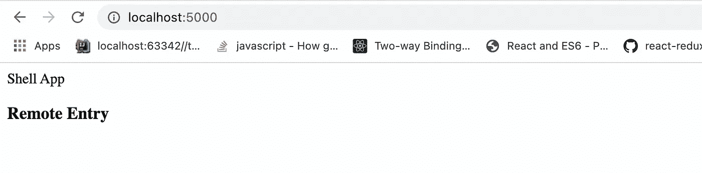
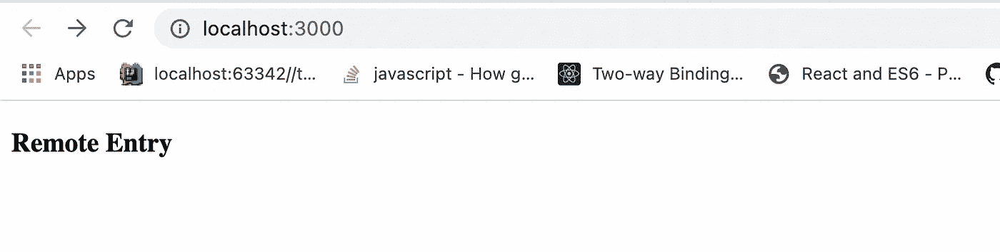
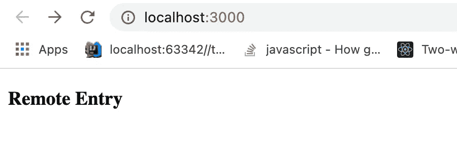
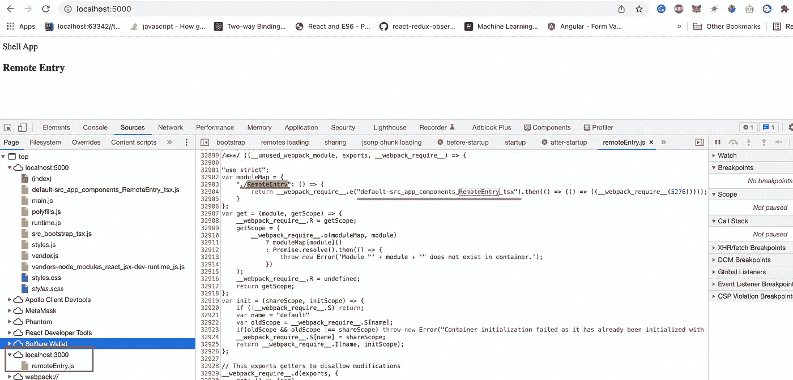

# 🔥用 NX 在 5 分钟内构建⚛️反应微前端 Monorepo

> 原文：<https://levelup.gitconnected.com/building-%EF%B8%8F-react-micro-frontends-monorepo-with-nx-10bf564f03fe>

在本教程中，您将构建 React 微前端，而没有拥挤


# **内容**

*   [**之前介绍**](#fc92)
*   [**简介**](#f950)
*   [**概念验证**](#e43b)
*   [**设置单一回购项目**](#b147)
*   [**配置外壳应用**](#f65d)
*   [**配置远程应用**](#de09)
*   [**连接微前端**](#0a3b)
*   [**Github 链接**](#13f8)
*   [**结论**](#470d)
*   [**了解更多**](#fdd8)

# 介绍前

嘿世界🌎在我们开始之前，我想对每一个和我分享❤️之爱的人说谢谢，我们已经有 833 个关注者了(02/22/2022)，而且我们还在快速成长。所有的帖子都是免费的，旨在提高人们对网络开发的好奇心。能量来自你的**拍手**👏，**评论**💬或者 [**订阅**](https://easy-web.medium.com/subscribe) 。

我是乌克兰的🇺🇦，每个人都知道现在发生了什么，如果不是这样，普京派出了整个军队来摧毁我的国家和我的人民。如果你想支持乌克兰，想赶走 21 世纪的希特勒。在你的社交媒体上发表意见。你也可以在下面找到捐赠链接。

1.通过 NBU(乌克兰国家银行)的捐赠——https://lnkd.in/g32YRZPp
2。Nova Ukraine，一个专注于人道主义援助的非营利组织—[https://novaukraine.org/](https://novaukraine.org/)
3。支持乌克兰的军事努力—[https://lnkd.in/gAp6WqKk](https://lnkd.in/gAp6WqKk)

# 介绍

Nx，由于它的库，解决了微前端面临的所有主要问题:比如在微前端之间共享组件和状态。此外，Nx 支持开箱即用的角度微前端原理图，让您使用命令行生成角度微前端应用程序。您可以在此处找到教程:

[](https://itnext.io/building-angular-micro-frontend-with-ngrx-state-sharing-and-nx-cli-7e9af10ebd03) [## 🔥利用 NgRx 状态共享和 NX cli 构建角度微前端

### 如何在几乎不编码的情况下构建健壮的微前端架构；)

itnext.io](https://itnext.io/building-angular-micro-frontend-with-ngrx-state-sharing-and-nx-cli-7e9af10ebd03) [](https://itnext.io/building-beautiful-tiktok-clone-with-angular-and-micro-frontend-part-1-bdd189425695) [## 🔥建造一个漂亮的抖音克隆体，有棱角和微前端

### 第 1 部分:不再有丑陋的教程，只有美丽的，真实世界的例子，通过构建抖音学习微前端

itnext.io](https://itnext.io/building-beautiful-tiktok-clone-with-angular-and-micro-frontend-part-1-bdd189425695) 

**ALERT** :这个定制的实现有点问题，所以如果你需要更健壮的东西，看看这个版本:

[](/building-react-micro-frontends-monorepo-with-state-management-using-nx-in-2-min-b8b04f9afee0) [## 🔥使用 NX 在 2 分钟内构建⚛反应微前端 Monorepo 和状态管理😅

### 甚至你的祖母也可以用 NX 构建 react 微前端

levelup.gitconnected.com](/building-react-micro-frontends-monorepo-with-state-management-using-nx-in-2-min-b8b04f9afee0) 

# 概念证明

我们希望保留 NX 的所有特性，同时使用 React 框架。堆栈类似于上面的项目:

*   [**⚛️ React**](https://reactjs.org/) —有史以来排名前 1 的前端框架；
*   [**NX**](https://nx.dev/)—monorepo generator，让你像 Google 一样扩展应用；
*   [**web pack Module Federation**](https://webpack.js.org/concepts/module-federation/)—让您将实时构建合并到单个应用程序中；

微前端应用程序将由一个**外壳**应用程序和一个**远程**应用程序组成。 **Shell** 是一个容器应用，会注入远程微前端:



**远程**应用——单独托管并公开组件，可从**外壳**应用访问。



让我们保持简单，直接进入实现🏃

# 建立 Monorepo 项目

建立 monorepo 从未如此简单。

1.  使用名为`mf-react`的空设置创建 monorepo 工作空间:

```
**npx create-nx-workspace --preset=empty** **mf-react
cd mf-react**
```

2.安装所有 react 依赖项:

```
**npm install -D @nrwl/react**
```

3.正在生成 **shell** app:

```
**nx g @nrwl/react:app shell**
```

4.最后，生成**远程** app:

```
**nx g @nrwl/react:app remote**
```

# 配置外壳应用程序

1.  首先，让我们打开`mf-react/apps/shell/src`，在这里做一些改动:

*   将`main.tsx`更名为`bootstrap.tsx`；
*   用创造`index.ts`

```
import('./bootstrap');
```

它将建立一个异步边界，将代码分割成一个更大的块，以避免额外的往返并提高性能。您可以在此阅读更多详细信息:

[](https://webpack.js.org/concepts/module-federation/#uncaught-error-shared-module-is-not-available-for-eager-consumption) [## 模块联盟|网络包

### 多个独立的构建应该形成一个应用程序。这些独立的版本之间不应该有依赖关系…

webpack.js.org](https://webpack.js.org/concepts/module-federation/#uncaught-error-shared-module-is-not-available-for-eager-consumption) 

2.接下来，我们需要调整`mf-react/apps/shell/project.json`:

*   `“main”: “apps/shell/src/index.ts”`
*   `“webpackConfig”: “apps/shell/webpack.config.js”` —使用自定义 webpack 配置；
*   `“hmr”: false` —避免异步远程应用导入的重载循环；

完整的`project.json`看起来是这样的:

3.最后，让我们在`mf-react/apps/shell`创造`webpack.config.js`

重要的细节是增加了`proxy`:

```
proxy: {
    'http://localhost:3000': 'http://localhost:3000',
},
```

*黑客警报*:原因是在异步模块加载过程中，webpack 会尝试从 [http://localhost:3000](http://localhost:3000) (远程 app 地址)加载远程条目。而当它没有准备好的时候，就会开始重定向到[http://localhost:5000](http://localhost:5000)(shell app 地址)并抛出错误，那个主机下不存在那个 chunk。我们需要强制编译器严格从远程主机 [http://localhost:3000 解析远程脚本。](http://localhost:3000.)它是 hacky，所以在生产中不要考虑这样的实现。在生产中，我们将使用域名来代替 [http://localhost:3000](http://localhost:3000.) ，它将没有任何问题。

# 配置远程应用程序

**remote** app 配置与 **shell** 非常相似，唯一的区别是在模块联合插件中公开组件。

1.  在`mf-react/apps/remote/src`中，将`main.tsx`重命名为`bootstrap.tsx`。创建`index.ts`并导入模块。

```
import('./bootstrap');
```

2.在`mf-react/apps/remote/project.json`中，我们需要改变两件事:`“webpackConfig”: “apps/remote/webpack.config.js”`和入口点`“main”: “apps/remote/src/index.ts”`

3.现在，让我们在`mf-react/apps/remote/`中创建`webpack.config.js`并添加配置:

`‘./RemoteEntry’: ‘./src/app/components/RemoteEntry’,`在这里，我们指定将要公开的组件的路径，让我们创建它。

4.在`mf-react/apps/remote/src/app/components/RemoteEntry.tsx`中创建外露组件:

```
function RemoteEntry() {
    return (
        <div>
            <h3>Remote Entry</h3>
        </div>
);
}export default RemoteEntry;
```

5.最后，在`mf-react/apps/remote/src/app/app.tsx`中加入`RemoteEntry`

```
import RemoteEntry from './components/RemoteEntry';export function App() {
    return <RemoteEntry></RemoteEntry>;
}export default App;
```

# 连接微前端

1.  首先，我们启动 3000 端口下的**远程** app:

```
nx serve --project=remote --port=3000
```



2.然后，我们需要为我们的远程模块创建一个类型，因为我们的编译器不知道它的存在。创建`mf-react/apps/shell/declarations.d.ts`并添加类型:

```
declare module 'remote/RemoteEntry';
```

3.接下来是最后一步，将远程模块添加到 **shell** 应用程序中。在`mf-react/apps/shell/src/app/app.tsx`中:

```
import React, { Suspense } from 'react';const RemoteEntry = React.lazy(() => import('remote/RemoteEntry'));export function App() {
    return (
        <>
            Shell App
            <Suspense fallback={<div>Loading...</div>}>
                <RemoteEntry></RemoteEntry>
            </Suspense>
        </>
    );
}export default App;
```

在这里，我们可以看到我们的远程模块已成功导入🎉



# Github 链接

您可以在这里找到完整的项目设置:

[](https://github.com/Vitashev/mf-react) [## GitHub - Vitashev/mf-react:用 Nx 反应微前端 Monorepo

### 此时您不能执行该操作。您已使用另一个标签页或窗口登录。您已在另一个选项卡中注销，或者…

github.com](https://github.com/Vitashev/mf-react) 

# 结论

最终，您将拥有一个功能完整的微前端 monorepo。更重要的是，你可以使用 NX 的所有特性，包括在微前端之间共享库:UI 组件和状态。你可以在 **这里找到整个特性规范 [**。如果你想学习如何在 react 微前端之间共享状态，让我们收集 1000👏我会迭代它。和往常一样，如果你学到了新东西，请在 medium 和**](https://nx.dev/getting-started/intro)[**Twitter**](https://twitter.com/easy_web_org)**上关注我😊****

[](https://easy-web.medium.com/subscribe) [## 每当维塔利·舍甫琴科发表文章时，就收到一封电子邮件。

### 每当维塔利·舍甫琴科发表文章时，就收到一封电子邮件。通过注册，您将创建一个中型帐户，如果您还没有…

easy-web.medium.com](https://easy-web.medium.com/subscribe) [](https://easy-web.medium.com/membership) [## 通过我的推荐链接加入 Medium 维塔利·舍甫琴科

### 作为一个媒体会员，你的会员费的一部分会给你阅读的作家，你可以完全接触到每一个故事…

easy-web.medium.com](https://easy-web.medium.com/membership) 

# 了解更多信息

[](https://itnext.io/how-micro-frontend-changes-the-future-of-angular-bb4deb2cfdad) [## 🔥微前端如何改变 Angular 的未来？

### 让我们看看为什么 Angular 最适合微前端

itnext.io](https://itnext.io/how-micro-frontend-changes-the-future-of-angular-bb4deb2cfdad) [](https://itnext.io/building-angular-micro-frontend-with-ngrx-state-sharing-and-nx-cli-7e9af10ebd03) [## 🔥利用 NgRx 状态共享和 NX cli 构建角度微前端

### 如何在几乎不编码的情况下构建健壮的微前端架构；)

itnext.io](https://itnext.io/building-angular-micro-frontend-with-ngrx-state-sharing-and-nx-cli-7e9af10ebd03) [](https://itnext.io/building-beautiful-tiktok-clone-with-angular-and-micro-frontend-part-1-bdd189425695) [## 🔥建造一个漂亮的抖音克隆体，有棱角和微前端

### 第 1 部分:不再有丑陋的教程，只有美丽的，真实世界的例子，通过构建抖音学习微前端

itnext.io](https://itnext.io/building-beautiful-tiktok-clone-with-angular-and-micro-frontend-part-1-bdd189425695)