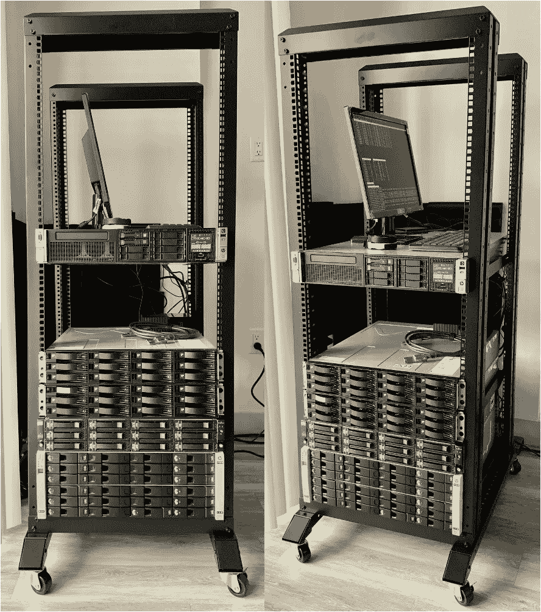
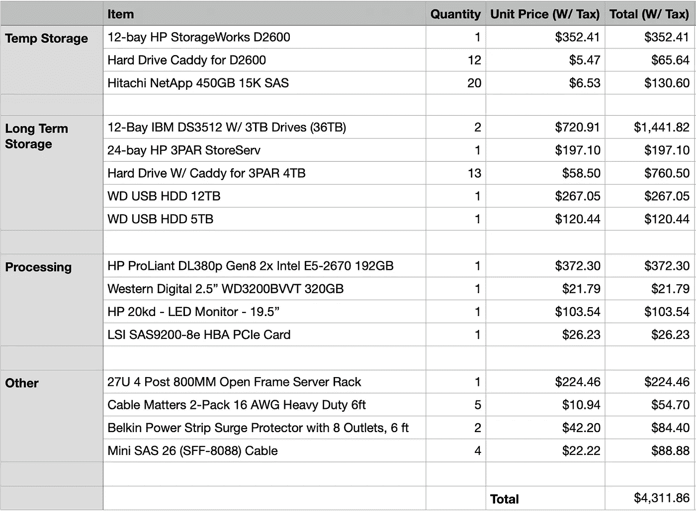
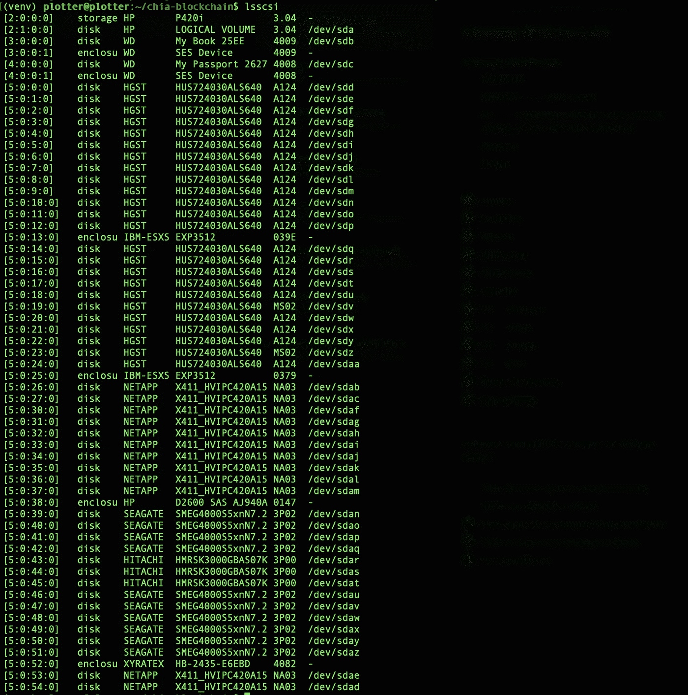
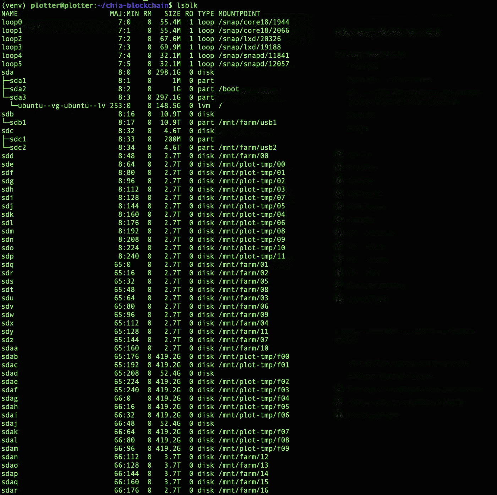
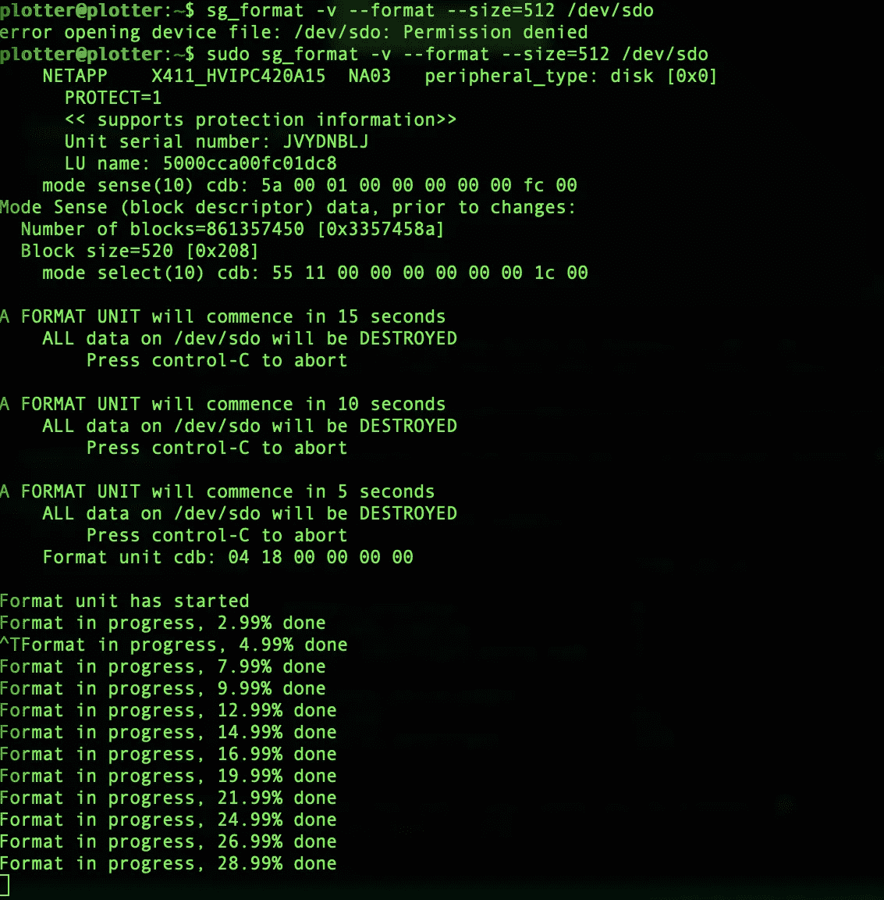
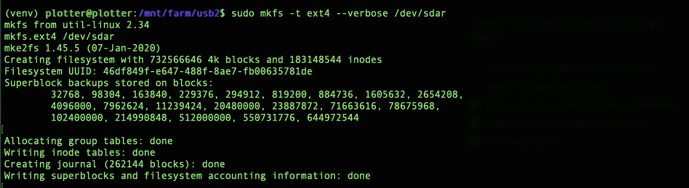
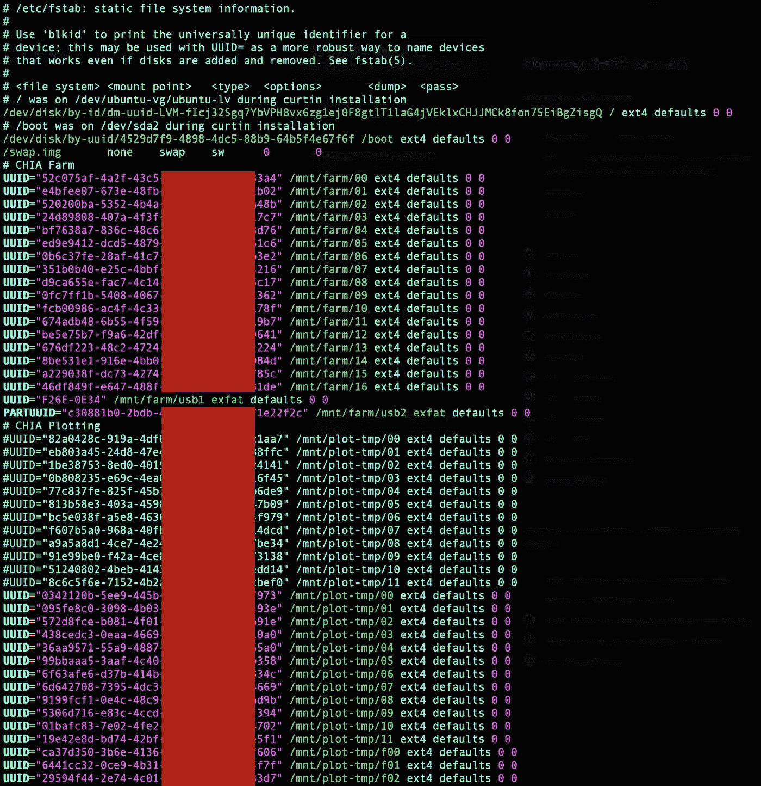
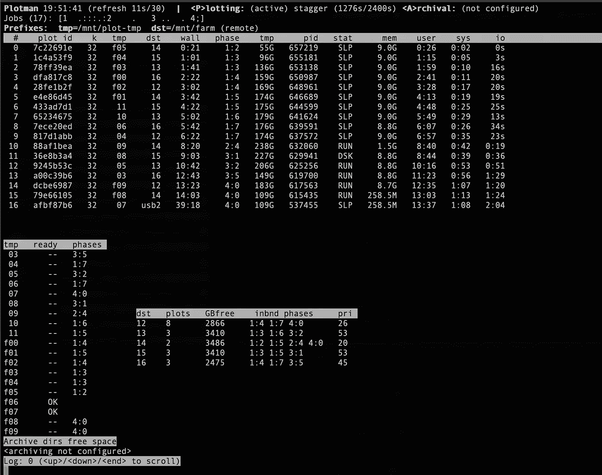

# 建造一个 200TB 的 Chia 农业钻机

> 原文：<https://levelup.gitconnected.com/building-a-200tb-chia-farming-rig-c9478ed7b92f>

对 Chia 加密货币农业(采矿)系统从组件选择到软件配置的完整回顾。



# 介绍

[Chia](https://github.com/Chia-Network/chia-blockchain) 是一种新的加密货币，旨在以比同行更低的每次交易能耗实现去中心化共识。这是通过[空间算法](https://docs.google.com/document/d/1tmRIb7lgi4QfKkNaxuKOBHRmwbVlGL4f7EsBDr_5xZE/edit)而不是[工作证明](https://en.wikipedia.org/wiki/Proof_of_work)来实现的。

虽然工作证明依赖于连续计算数学问题(通常是 SHA256 之类的散列)以试图找到匹配所需模式的结果，但 Chia 却依赖于检查唯一的预生成文件(称为 plots)中是否存在某些属性。

这一过程分为两步，称为[耕作](https://www.chiaexplorer.com/what-is-farming)，包括:

1.  [绘制](https://www.chiaexplorer.com/plotting)创建大型独特文件(通常为 101.6GB)。
2.  和[收获](https://www.chiaexplorer.com/what-is-farming)，其中检查先前创建的文件，以寻找赢得该块奖励的机会(目前为 2 个 Chia)。

一个节点拥有的图形越多(使用的存储空间越大)，赢得该块奖励的机会就越大。每天有 4608 次获胜的机会，赢得该区块奖励的概率主要基于一个人拥有的地块数量与总网络大小的比例。这里提供了一个收益计算器[。](https://chiacalculator.com/)

因此，**为了最大化回报，我们希望拥有尽可能大的存储量**和足够的计算资源来用图填充所述存储。

# 选择设备

与大多数设计问题一样，对于可用于种植 Chia 的设备组合，有无限多种有效的解决方案。为了帮助缩小选择范围，我首先决定了一些约束条件和优先级:

1.  尽管增加了复杂性(在合理范围内)，但每 TB 的成本应该最小化。
2.  由于我可用于这个项目的时间有限，系统应该主要由现成的部件组成(没有定制的 PCB，定制的机箱等)。

## 绘图-处理

根据硬件设置，创建一个单独的图可能需要 4 到 20 个小时。因此，选择正确的绘图硬件可能是在几天或几个月内填满整个农场的区别。

重要的是，不仅要考虑每个绘图的速度，还要考虑可以创建的并发绘图的数量。例如，在 12 小时内创建 10 个并发图的设置将产生 20 个图(约 2TB/天)，而每 4 小时绘制 1 个并发图的设置每天仅产生 6 个图(0.6 TB/天)。

为了降低成本，我决定搜索退役的服务器。这些服务器有一些有趣的属性，可以使它们成为强大的绘图仪，包括:

1.  大量的核心可以允许几个平行的图。阶段 1(大约一半的绘制时间)是多线程的(通常配置为 2 到 4 个线程)，但其余阶段是单线程的。
2.  可用 RAM 通常超过绘图所需的容量(约 4GB/并发绘图)。
3.  设计用于长时间高负荷运行。

在考虑了几十个选项和可能的配置后，我最终选择了一台 HP ProLiant DL380p Gen8，它配有 2 个英特尔 E5–2670 和 192 GB DDR 3 RAM。启用超线程技术后，该服务器可以支持在第一阶段同时绘制多达 16 幅图，成本不到 400 美元。

## 绘图—临时存储

由于绘图创建期间的高写入负载(对于 k=32 的绘图，大约为 1.6TB)，临时存储介质的选择会对绘图时间和成本产生重大影响。有几点需要考虑:

1.  存储速度越快，绘图速度就越快。[这个线程](https://chiaforum.com/t/plotting-to-ram-disk-instead-of-ssd/992)讨论了使用 RAMDISK 的 4 小时绘图时间(将一个文件夹挂载到 RAM)。
2.  鉴于写入量很大，考虑介质的耐久性很重要。一个消费级 1TB NVMe 固态硬盘通常有大约 600 TBW(写入太字节)的耐用性，这意味着它可能会出现故障，这意味着它可以进行大约 375 次绘图。

我最终选择购买一台 12 机架 HP StorageWorks D2600，配有 15K 450GB SAS 驱动器。通过这种设置，我可以同时绘制到每个驱动器，而不会有驱动器级别的 IO 争用风险。JBOD +驱动器比 NVMe 驱动器的同等设置便宜得多(甚至不考虑到达 TBW 后的更换成本)。

## 农场—长期储存

与绘图存储不同，采集存储不需要高吞吐量或 IOPs。因此，最大限度地降低成本是重中之重。

有几种可能的设置，其中一些将在[这里](https://github.com/Chia-Network/chia-blockchain/wiki/Reference-Farming-Hardware)讨论。然而，在易贝搜索二手选项后，一些事情变得清晰了:

1.  较大的 3.5 英寸硬盘往往成本最低。这是有意义的，因为现在大多数设备已经转向更小的 2.5 英寸或 1.8 英寸尺寸。
2.  SAS 硬盘驱动器(不是 SSD)似乎每 TB 成本最低，有些批次低至 10 美元/TB(截至 2021 年 5 月)。这些 SAS 驱动器与 SATA(消费)板不兼容，通常在从公司的数据中心退役后在易贝出售。

当我确定使用 3.5 英寸 SAS 硬盘时，我需要找到一种方法将它们连接到我的收割机/绘图仪上。坚持不构建机箱/背板的限制，我开始寻找可以容纳这些驱动器的二手机箱，同时保持最低的每机架成本。

我在易贝遇到了几个选项，最终购买了几个不同的型号，包括一个 24 机架的 HP 3PAR 和两个 12 机架的 IBM DS3512。

## 完整列表

组件的最终列表如下所示。它包括上面讨论的主要组件，但也包括将系统组装在一起所需的辅助部件。



值得一提的是 HBA 卡。正是 PCIe 卡暴露了来自 JBODs 的电缆将连接到的 SAS 外部连接器。购买时，请确保您购买的是启动器目标(it)模式卡，以便驱动器直接显示在操作系统上，而不是 IR 模式卡上。作为一个很好的选择，你可能想要一张有更新操作系统(版本 20)的闪存卡。

# 设置—硬件

设置大多是直观的。电缆连接到适合它们的孔中。然而，连接 JBODs 和绘图/采集机器的 SAS 电缆是菊花链连接的。

在我的例子中，我有两条离开服务器的电缆(HBA 的每个端口一条)。其中一根电缆连接到临时存储阵列(HP D2600)的输入端，该阵列的输出端连接到 HP 3PAR 阵列。另一根电缆连接到第一个 IBM 阵列，其输出连接到第二个 IBM 阵列。JBODs 通常有一个输入(主)端口和一个输出端口(通常标有向外的箭头)。

# 设置—软件

我在服务器上安装了 [Ubuntu 20.04 LTS](https://ubuntu.com/#download) ，因为这是一个广泛使用的 Linux 发行版，这意味着如果出现任何问题，可以更容易地找到故障排除论坛。以下步骤概述了剩余的配置。

## 步骤 1:确保所有驱动器都可用

第一步是检查操作系统正在检测哪些驱动器。这可以通过运行`lsscsi`命令来完成。其输出如下所示。



请注意，上述命令不提供有关文件系统或驱动器大小的信息。为此，运行`lsblk`命令。



**重要提示:**请注意，并非所有驱动器都会出现在两个命令下！出现在`lsscsi`下而不是`lsblk`下的驱动器可能存在一些不兼容性，导致操作系统无法将其用于挂载等。这方面的一个例子是`/dev/sdaw`。

在我的例子中，这个问题是由我安装的 Linux 内核不支持的扇区大小 520 引起的(关于这个主题的讨论可以在这里找到[这里找到](https://forum.level1techs.com/t/how-to-reformat-520-byte-drives-to-512-bytes-usually/133021)和[这里找到](https://mikeyurick.com/reformat-emc-hard-drives-to-use-in-other-systems-520-to-512-block-size-conversion-solved/))。您可以通过查看`dmesg`命令日志中类似`[sdaw] Unsupported sector size 520`的错误信息来确定这是否是您的情况。

为了解决这个问题，我用命令`sg_format -v --format --size=512 /dev/sdX`使用 512 的块大小重新格式化了驱动器。运行该命令可能需要很长时间(几个小时)，输出如下所示。



完成后，驱动应出现在`lsblk`输出中。

## 步骤 2:在驱动器上创建文件系统

为了用 [ext4](https://en.wikipedia.org/wiki/Ext4) 文件系统格式化驱动器，我运行了以下命令:`sudo mkfs -t ext4 — verbose /dev/sda`。



## 步骤 3:安装驱动器

既然我们可以访问驱动器，并且它们已经用所需的文件系统格式化，我们就可以[挂载](https://askubuntu.com/a/20681)这些驱动器了。

1.  创建我们将要安装驱动器的文件夹。例如:`/mnt/farm/00`至`/mnt/farm/23`用于存储最终绘图的驱动器，而`/mnt/plot-tmp/00`至`/mnt/plot-tmp/11`用于临时绘图位置。
2.  运行`sudo blkid`来获得你的驱动器(或分区)的唯一 id。它将输出几行，如`/dev/sdae: UUID=”29494f44–2f75–4c01-a766–18755eb583d7" TYPE=”ext4"`。
3.  用`sudo vim /etc/fstab`编辑 fstab 文件，并将每个驱动器与其对应的`/mnt/...`文件夹相关联。小心不要编辑文件的第一行，因为这些是安装操作系统根目录所需的。我的最终文件如下所示。
4.  运行`sudo mount -a`来挂载 fstab 文件中指定的所有驱动器。它将只装载尚未装载的驱动器，因此可以安全地运行多次。
5.  通过运行 sudo `chmod -R 777 /mnt/farm/00`，确保用户能够访问硬盘及其文件。



## 第四步:运行 Chia 区块链软件

1.  按照这里指定的官方说明[安装奇亚区块链(我没有安装 GUI)。](https://github.com/Chia-Network/chia-blockchain/wiki/INSTALL#ubuntudebian)
2.  运行`chia start farmer`来启动钱包、收割机等的守护进程。

## 步骤 5:设置 Plotman(可选)

[Plotman](https://github.com/ericaltendorf/plotman) 是一个绘图管理器，将接管新绘图任务的创建。这是一个方便的工具(不是必需的)。

1.  按照此处的说明[安装绘图仪。](https://github.com/ericaltendorf/plotman#installation)
2.  根据您的绘图仪规格编辑`plotman.yaml`。我的最终文件如下所示。

```
user_interface:
  use_stty_size: True
directories:
  log: /home/plotter/plotman-logs
  tmp:
    - /mnt/plot-tmp/f00
    - /mnt/plot-tmp/f01
    - /mnt/plot-tmp/f02
    - /mnt/plot-tmp/f03
    - /mnt/plot-tmp/f04
    - /mnt/plot-tmp/f05
    - /mnt/plot-tmp/f06
    - /mnt/plot-tmp/f07
    - /mnt/plot-tmp/f08
    - /mnt/plot-tmp/f09
    - /mnt/plot-tmp/f10
    - /mnt/plot-tmp/f11
  dst:
    #- /mnt/farm/00 FULL
    #- /mnt/farm/01 FULL
    #- /mnt/farm/02 FULL
    #- /mnt/farm/03 FULL
    #- /mnt/farm/04 FULL
    #- /mnt/farm/05 FULL
    #- /mnt/farm/06 FULL
    #- /mnt/farm/07 FULL
    #- /mnt/farm/08 FULL
    #- /mnt/farm/09 FULL
    #- /mnt/farm/10 FULL
    #- /mnt/farm/11 FULL
    - /mnt/farm/12
    - /mnt/farm/13
    - /mnt/farm/14
    - /mnt/farm/15
    - /mnt/farm/16
    - /mnt/farm/17
    - /mnt/farm/18
    - /mnt/farm/19
    - /mnt/farm/20
    - /mnt/farm/21
    - /mnt/farm/22
    - /mnt/farm/23
scheduling:
  tmpdir_stagger_phase_major: 2
  tmpdir_stagger_phase_minor: 1
  tmpdir_stagger_phase_limit: 1
  tmpdir_max_jobs: 1
  global_max_jobs: 20
  global_stagger_m: 40
  polling_time_s: 30
plotting:
  k: 32
  e: False # Use -e plotting option
  n_threads: 2 # Threads per job
  n_buckets: 128 # Number of buckets to split data into
  job_buffer: 8096 # Per job memory
```

值得一提的几点:

1.  当驱动器已满时，Plotman 不会停止调度农场驱动器(截至撰写本文时)。因此，您需要删除它们(或者如上注释掉它们)。
2.  Plotman 将自动添加农场驱动器到 chia 收割机。
3.  我使用等于 1 的`tmpdir_max_jobs`,因为我正在绘制硬盘，与固态硬盘相比，硬盘没有良好的寻道性能。

## 步骤 6:运行绘图仪

此时，开始绘图所需要的就是运行`plotman interactive`。



注意:标绘到`/dev/farm/usb2`的长时间运行作业是一次调试运行，并不意味着运行完成。

# 最后的话

希望这能有助于给你一个概念是什么需要农场嘉！

到目前为止，我的农场已经满了 1/3，我计划在它满了的时候和我开始重新绘制池子的时候发布更新。

特别感谢凯蒂·甘多米对开发的帮助。

开心种田！

*如果你觉得这篇文章很有帮助，请点击*👏按钮或*捐赠一些 Chia (XCH)到我的地址:*

xch 159 qvpvafcx 4 jxllk 9 xe 9 NPH 42 xw 50j 56 mpt 03 DSA 05 svll 7 kmd LQ 04 UCM 8

*如果你有任何问题或者只是想聊聊创业、创业、承包或工程，就发邮件给我吧保罗@*[](https://avantsoft.com.br/)**。**