# 用 JavaScript 构建 B 树

> 原文：<https://levelup.gitconnected.com/building-a-b-tree-in-javascript-4482dee083cb>


## 我如何使用 JavaScript(和 Vue)创建一个动画 BTree。JS)

# 为什么要这么做？

只是为了好玩！我和一个朋友开始开发一个名为 *Structies* 的非专业 web 应用程序，目的是让人们接近最流行的数据结构，能够可视化他们的主要操作，并以友好的方式与他们交互。创建这个站点所选择的框架是: **VueJS** ，所以所有的类都是用 **JavaScript** 编写的。这样，想法就是从零开始构建所有这些数据结构。

本文将详细解释我如何构建 BTree 类，从一般属性开始，然后描述 BTree 的主要操作，接着是图形动画和它们的复杂性分析，最后简要解释如何借助结构开发动画。

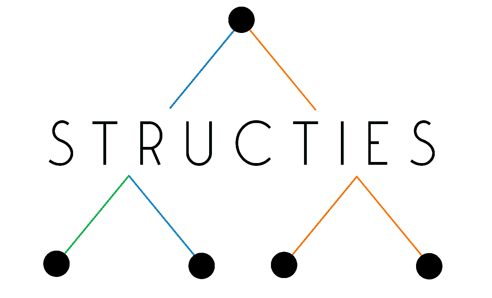

项目结构标志

# 什么是 B 树？

定义 B 树的一种方式是说，它们类似于**二分搜索法树**，但是每个节点有**个以上的键和两个以上的子节点**，具有作为主要属性的搜索树和自平衡的特征。现在，B 树是最流行的数据结构，在访问数据和处理数据的时间上有很大的优势。因此，通过这种方式，今天它们主要用于硬盘驱动器，使用分层索引来最大限度地减少磁盘读取次数，并提高访问信息的时间。

从技术上来说，与堆之类的其他结构相比，它们相当复杂，但是在这里，它的所有操作都将在可视化动画的支持下详细解释，以便充分理解那些机制。

下面，你会发现一个 t=2 阶的 B 树的图片，它包含了 10 到 140 的所有倍数。

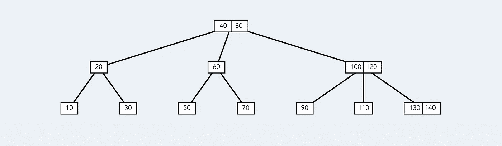

阶为 2 的 b 树，插入了 10 到 140 的所有键的倍数。由于**结构**而创建的 BTree

## 但是，为什么是 BTrees 和 JavaScript 呢？

JavaScript 不仅在大多数前端应用程序中使用，一些流行的后端框架如 NodeJS 或数据库如 [PouchDB](https://pouchdb.com/) 被大型科技公司选择来创建强大的服务器。所以我希望这个实现能帮助你学习 BTrees 是如何工作的，或者是一些专业的实现。

# 主要特征

*   节点可以有多个子节点和键(甚至上千个！).
*   从上到下遍历树需要 O(log N)。
*   所有像 search()、insert()和 remove()这样的操作都需要 O(log N)。
*   为顺序遍历保持键的排序顺序。

通过保留部分满的块，这种结构与它们存储的数据量相比可以快速插入和删除，因此它在磁盘中工作得非常好。

# 性能

*   每个**树**都有一个根(**树节点**)。
*   每个**b reenode**都有以下属性:
    - **leaf** (布尔):*是否为叶子。
    -* **值** (number[]) *:按顺序存储的所有值列表，所以:* `BTree.values[i] <= BTree.values[i+1]` *-***子树** (BTreeNode[]): *子树子树列表。*
*   节点中的每一对直接值定义了它们之间包含的子树中所有值的界限。

```
*// (Pseudo code)*
if (key in BTreeNode.children[i+1]) {
  BTreeNode.values[i] < key < BTreeNode.values[i+1]
}
```

*   在顺序为`t`的 BTree 中，每个 BTreeNode 都有`[t-1, 2t-1]`键和`[t, 2t]`子节点。
*   所有的**叶**都一样深(在同一水平线上)。

# 现在让我们编码！

## b 树节点类

在下面的片段中，给出了 BTreeNode 的基本定义，用 **4 个基本操作**插入和删除子节点的值或引用。所有这些函数都使用 JavaScript 方法`array.splice()`保持引用或值的数组尽可能小。

*   *BTreeNode.addValue(数字)*
*   *BTreeNode.removeValue(位置)*
*   *BTreeNode.addChildren(节点，位置)*
*   *BTreeNode.removeChildren(位置)*

基本 BTreeNode 类

## BTree 类

以下类声明涵盖了执行方法**搜索**、**插入、**和**删除所需的所有函数。**

基本 BTree 类定义

# 在 BTree 中搜索值

由于 BTrees 具有**搜索树**的属性，这个操作非常类似于在二分搜索法树(BST)中的搜索。为了从根开始搜索 k 值，目标是从上到下遍历树，在每次迭代中寻找正确的子节点。

在 BST 中，如果目标`k`值大于实际节点值，则算法向右，如果小于实际节点值，则向左。保持相同的逻辑，BTree 通过与实际节点中存储的值进行比较，继续到应该存储它的子树目标`k`。

```
/**
* Search a value in the Tree and return the node. O(log N)
* [@param](http://twitter.com/param) {number} value
* [@param](http://twitter.com/param) {BTreeNode} node
* [@returns](http://twitter.com/returns) {BTreeNode}
*/
**searchValue**(node, value) {
  if (node.values.includes(value)) {
    return **node**;
  }
  if (node.leaf) {
    // Value was not found
    return null;
  }
  let child = 0;
  while (child <= node.n &&
    node.values[child] < parseInt(value, 10)) {
    child++;
  }
  return this.**searchValue**(node.children[child]);
}
```

# 在 BTree 中插入值

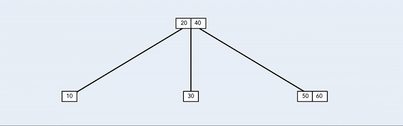

简单的例子:插入 70 号。由于**结构**而创建的动画

在最简单的插入案例中，如上图所示，从树根到树叶，通过其子节点**来浏览树。**对于每个被访问的节点，作为搜索方法，插入的值`k`必须找到正确的子节点才能继续，与实际节点中的值进行比较。遍历树，直到到达一片叶子。如果那片叶子有足够的空间，小于`2t — 1`值，`k`被插入到叶子中。

```
// Try to add value {number} in node {BTreeNode}
if (node.leaf) {
  node.**addValue**(value);
  return;
}
let temp = node.n;
while (temp >= 1 && value < node.values[temp - 1]) {
  temp = temp - 1;
}
// Continue searching in -> node.children[temp]
```

但事情并不总是那么简单。当访问一个**完整节点** ( `2t — 1`值)时，事情变得有点复杂。在这种情况下，必须做一个额外的操作:**split**方法。

一个 **split** 基本上是给父节点一个值，然后将其余的值和链接的子节点拆分到同一级别的两个不同的新节点中。该算法中使用的机制包括给父节点位置`t — 1`的值，换句话说，就是**的中值。**类似地，创建的新兄弟接收从`0`到`t — 1`的值和从`0`到`t — 1`的子代。

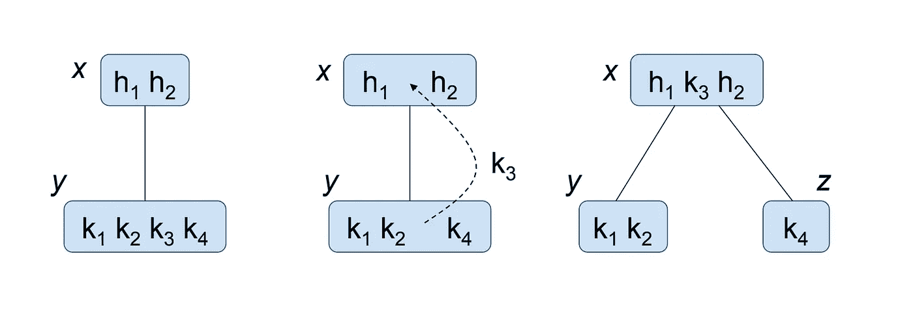

在下图中，执行数字`k = 130`的**插入**，包含值`[60, 80, 100]`的节点已满，因此在被访问之前，它将被分割成两个更小的节点。位置`t — 1` 80 中的值被传送到父节点，其余的值被分成 2 个新节点。请注意，子节点将被平均共享到新节点中。

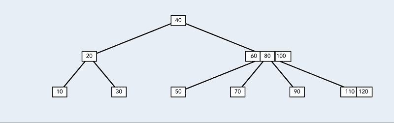

插入编号 130，在访问节点中进行拆分。由于**结构**而创建的动画

下面是包含插入和分割方法的 BTree 定义。

使用这种方法，树的高度**增加的唯一情况是在插入期间，根被访问并发现是满的。因此，在这种情况下，将执行分割操作，并创建一个新节点，将其分配给根引用。在下图中，值`k = 80`被插入到树根已满的树中。**

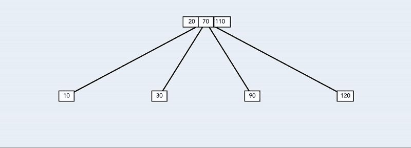

在一棵有全根的树上插入 k=80。由于**结构**而创建的动画

现在，最困难的部分…

# 删除 BTree 中的值

类似于插入，删除操作有简单的情况和一些复杂的情况。移除值`*k*`的主要思想是递归地遍历树**的高度，试图将目标值 *k* 移动到底部**，但是在访问下一个节点之前，总是确保下一个节点具有多于`t — 1`的值，否则，在向下移动之前进行一些操作。

下面，在遍历树的高度的过程中，删除操作将包含在 3 个不同的子案例中，每个子案例都提供了示例和图像。为这个方法提供的例子将遍布于一个顺序为`t = 2`的 B 树。

*   **情况 A** :目标位于未最小填充的叶子中。

**最简单的**情况是当目标值`*k*`是在中找到的**，而**不是最小填充的**，换句话说，叶子有多于`t — 1`的值。**

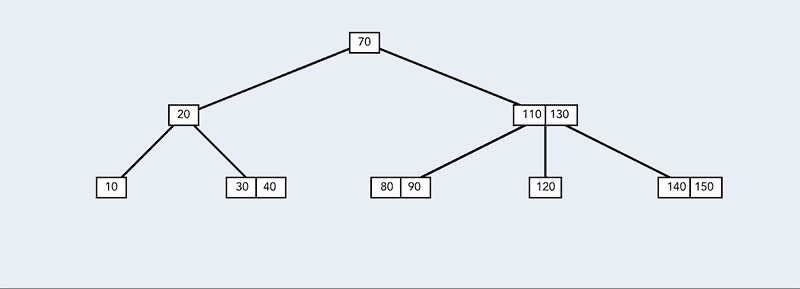

从一片叶子上删除数字 k=80。由于**结构**而创建的动画

如图所示，值`*k = 80*`出现在具有多于`t — 1`值的叶子中，所以在这种情况下，值`*k*`只是从节点中删除。

```
/**
* Delete a value from a node
* @param {BTreeNode} node
* @param {number} value
*/
deleteFromNode(node, value) {
  // Check if value is in the actual node
  const index = node.values.indexOf(value);
  if (index >= 0) {
    // Value present in the node
    if (**node.leaf** && **node.n > this.order - 1**) {
      // If the node is a leaf and has more than order-1 values,
      // just delete it
      node.**removeValue**(node.values.indexOf(value));
      return;
    }
  }
  ...
}
```

*   **情况 B:** 值`*k*`在实际节点中。

首先，关于之前如何简要提及以及如何在**案例 C** 中解释，在访问下一个孩子之前继续向下树的规则是强制性的，孩子必须至少有`t`个值要被访问，否则做一些操作来满足这个条件。

据此，当到达这种情况时意味着实际节点包含目标值`k`，具有多于`t — 1`的值，并且它不是叶子，因为它将在**情况 A** 中处理。

为了继续通过其一个直接子代(目标值`k`的左子代或右子代)沿树向下移动该值，有两种可能的情况:

1.  `k` 的左右直接子代都只有`t — 1`值:

如果没有具有足够值的直接子节点来继续递归，则值`*k*`必须与两个直接子节点进行**合并**。这样做的方法是定义一个目标(右或左)子节点，其中值`*k*`和其他子节点的所有值将被插入。注意，它会给目标节点留下`(t — 1) + (t — 1) + 1 -> 2t — 1`节点，这是最大授权。

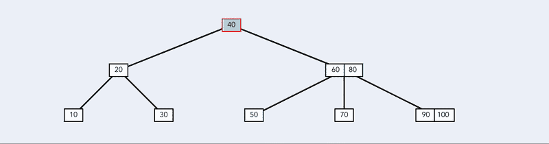

移除节点 k=60。由于**结构**而创建的动画

同样，当合并的节点不是叶子时，源节点的子节点也被转移到目标节点。在这种情况下，合并两个直接兄弟，结果将是一个带有`t + t -> 2t`子节点的节点，这也是最大授权。

```
...
deleteFromNode(node, value) {
  // Check if value is in the actual node
  const index = node.values.indexOf(value);
  if (index >= 0) {
    ...
    // Check if one children has enough values to transfer
    if (node.children[index].n > this.order - 1 ||
        node.children[index + 1].n > this.order - 1) {
      // One of the immediate children has enough values to transfer
      ...
    }
    // No child with enough values to continue. Do a merge
    this.**mergeNodes**(node.children[index + 1], node.children[index]);
    return this.deleteFromNode(node.children[index], value);
  }
  ...
}/**
* Merge 2 nodes into one with the parent median value. O(1)
* @param {BTreeNode} origin
* @param {BTreeNode} target
*/
**mergeNodes**(origin, target) {
  const indexo = origin.parent.children.indexOf(origin);
  const indext = target.parent.children.indexOf(target);
  target.addValue(target.parent
        .removeValue(Math.min(indexo,indext)));
  for (let i = origin.n - 1; i >= 0; i--) {
     target.addValue(origin.removeValue(i));
  }
  // Remove reference to origin node
  target.parent.deleteChild(indexo);
  // Transfer all the children from origin node to target
  if (!origin.leaf) {
    while (origin.children.length) {
      indexo > indext ?
      target.addChild(
         origin.deleteChild(0), target.children.length) :
      target.addChild(
         origin.deleteChild(origin.children.length-1), 0);
    }
  }
}
```

2.左或右直接子到值`*k*`，有超过`t — 1`个值:
在这种情况下，**在相邻子树中找到目标值的前置/后续** `*k’*`。然后**将节点中的** `*k*`替换为`*k'*` 并继续从各自的子节点中递归删除`*k’*` 。

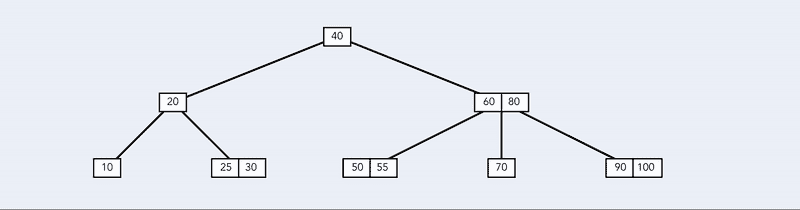

移除节点 k=40。由于**结构**而创建的动画

在前面的图像中，试图删除当前节点中的目标值`k = 40`，在本例中是树的根*的*，找到了后继节点`k' = 50`并替换了目标值，然后递归继续到具有新目标值`k = 50`的右子节点。

```
...
deleteFromNode(node, value) {
  // Check if value is in the actual node
  const index = node.values.indexOf(value);
  if (index >= 0) {
    ...
    // Check if one children has enough values to transfer
    if (**node.children[index].n > this.order - 1 ||
        node.children[index + 1].n > this.order - 1**) {
      // One of the immediate children has enough values to transfer
      if (node.children[index].n > this.order - 1) {
        // Left child
        // Replace the target value for the higher of left node.
        // Then delete that value from the child
        const **predecessor** =
          this.**getMinMaxFromSubTree**(node.children[index], 1);
        node.values[index] = predecessor;
        return this.deleteFromNode(node.children[index],
            predecessor);
      }
      // Right child
      const **successor** = 
            this.**getMinMaxFromSubTree**(node.children[index+1], 0);
      node.values[index] = successor;
      return this.deleteFromNode(node.children[index+1], successor);
    }
    // No child with enough values to continue. Do a merge
    this.mergeNodes(node.children[index + 1], node.children[index]);
    return this.deleteFromNode(node.children[index], value);
  }
  ...
}/**
 * Get the lower or higher value in a sub-tree
 * @param {BTreeNode} node
 * @param { 0 | 1 } max 1 for find max, 0 for min
 * @returns {number}
*/
**getMinMaxFromSubTree**(node, max) {
  while (!node.leaf) {
    node = node.children[max ? node.n : 0];
  }
  return node.values[max ? node.n - 1 : 0];
}
```

*   **案例 C:** (也是最后一个！)值`k`不在实际节点中。

当被访问的节点不包括目标值`k`时，它必须检查这些值以确定要访问的下一个子节点。如果相应的子节点有超过`t — 1`的值，则继续该节点上的操作。

```
...
deleteFromNode(node, value) {
  // Check if value is in the actual node
  const index = node.values.indexOf(value);
  if (index >= 0) {
    ...
  }
  // Value is not present in the node
  if (node.leaf) {
    // Value is not in the tree
    return;
  }
  // Value is not present in the node, search in the children
  let **nextNode** = 0;
  while (nextNode < node.n && node.values[nextNode] < value) {
    nextNode++;
  }
  if (node.children[nextNode].n > this.order - 1) {
    // Child node has enough values to continue
    return this.**deleteFromNode**(node.children[**nextNode**], value);
  }
  ...
}
```

如果应该拥有`k`的相应子节点没有足够的值来继续，它必须找到一个直接兄弟**来为其传递**一个值。如果**的直接兄弟**中的一个有超过`t — 1`的值，方法是将中间值`k’`从父节点(分隔两个节点的值)转移到目标节点，同时，将源节点中最接近父节点的值`k’’`转移到目标节点。下图清楚地说明了这种方法。

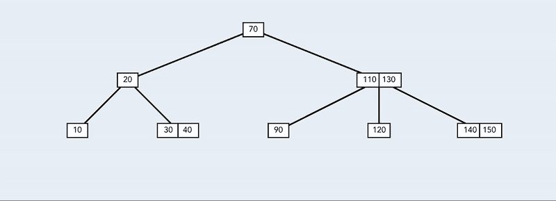

移除节点 k=120。由于**结构**而创建的动画

例如，在上面的图片中，试图删除`k = 120`，包含值`[110, 130]`的节点被访问。因为要访问的下一个节点，即中间包含`[120]`的节点，只有`t — 1`个值，所以树搜索一个具有额外值的直接兄弟，该值可以被传输到目标节点，在本例中，就是右边的节点。因此，为了移除`k = 120`，该方法将值`k’’ = 140`从兄弟节点传输到父节点，并将值`k’ = 130`从父节点传输到目标节点，然后继续向下移动到目标节点。

当转移方法**中涉及的节点有子节点**时，离源节点最近的子节点被转移到目标节点。

```
deleteFromNode(node, value) {
  ...
  // Child node has not enough values to continue
  if ((nextNode > 0 &&
       node.children[nextNode - 1].n > this.order - 1) 
   || (nextNode < node.n &&
       node.children[nextNode + 1].n > this.order - 1)) {
    // One of the immediate children has enough values to transfer
    if (nextNode > 0
      && node.children[nextNode - 1].n > this.order - 1) {
      this.**transferValue**(node.children[nextNode - 1],
                         node.children[nextNode]);
    } else {
      this.**transferValue**(node.children[nextNode + 1],
                       node.children[nextNode]);
    }
    return this.deleteFromNode(node.children[nextNode], value);
  }
  ...
}/**
* Transfer one value from the origin to the target through the parent
* @param {BTreeNode} origin
* @param {BTreeNode} target
*/
**transferValue**(origin, target) {
  const indexo = origin.parent.children.indexOf(origin);
  const indext = origin.parent.children.indexOf(target);
  if (indexo < indext) {
    target.**addValue**(target.parent.removeValue(indexo));
    origin.parent.**addValue**(origin.removeValue(origin.n-1));
    if (!origin.leaf) {
      target.**addChild**(
        origin.deleteChild(origin.children.length-1), 0);
    }
  } else {
    target.**addValue**(target.parent.removeValue(indext));
    origin.parent.**addValue**(origin.removeValue(0));
    if (!origin.leaf) {
      target.**addChild**(
        origin.deleteChild(0), target.children.length);
    }
  }
}
```

另一方面，如果要访问的下一个节点刚好有`t — 1`个值，并且没有具有足够值的直接兄弟要传输，类似于**案例 B** ，该节点将不得不**与直接兄弟之一合并**以继续。

下图中，为了去掉`k = 20`，在根之后，下一个要访问的节点是左边的第一个孩子。由于该节点仅具有`t — 1`值，并且没有具有额外值的直接兄弟要传输，所以实际节点将中间值(在这种情况下为`k' = 40`值)下降到目标节点，并传输来自所选直接兄弟的所有节点。然后递归继续向下到目标节点。

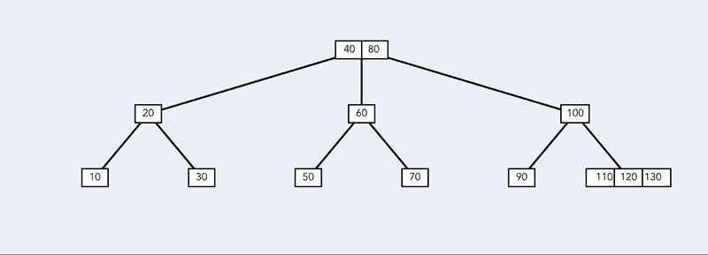

删除节点 k=20 进行合并。由于**结构**而创建的动画

```
deleteFromNode(node, value) {
  ...
  // No immediate brother with enough values.
  // Merge node with immediate one brother
  this.mergeNodes( nextNode > 0 ?
      node.children[nextNode - 1] : node.children[nextNode + 1],
      node.children[nextNode]);
  return this.deleteFromNode(node.children[nextNode], value);
}
```

## 那么，如何通过删除一个节点来降低树的高度呢？

在进行移除操作但根只有一个值并且两个子节点都只有`t — 1`个值的情况下，将不可能满足关于向下移动到下一个节点的值的最小数量的规则。所以唯一的选择是在两个子节点之间进行合并，得到根的唯一值，以确保有一个节点有足够的值继续。但是，这将使根引用成为一个空节点。

技术是，在每个删除操作之前，在做任何事情之前检查这个特殊的情况是否存在。如果是这种情况，就像之前解释的那样，树将在高度上收缩，合并两个具有唯一值的子节点，然后**将引用**从旧的根节点更改为具有合并值的节点。下图显示了如何删除目标`k = 10`，在继续向下查找目标之前，该树将根与两个子树合并。

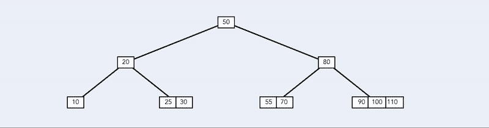

移除节点 k=10。一棵树降低了它的高度。由于**结构**而创建的动画

下面的代码包含带有 remove 操作的 BTree 类。

带删除操作的树。

# 分析操作的复杂性

BTree 中的所有操作只取决于树的高度。下表显示了主要 BTree 方法的复杂性。

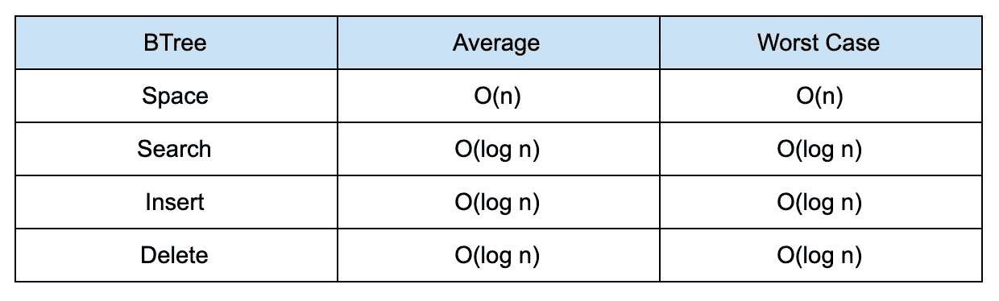

*   **空格**:对于带有`n`值的 BTree，空格与插入的值的数量成正比。使用这个[助手](https://gist.github.com/pgpbpadilla/10344038)在每次插入后计算 b 树实例的大小，做了一个小实验来计算树的内存大小，并将其与值的数量进行比较，结果是恒定的:在每个值的平均值`12 bytes`左右，这意味着使用的空间与值的数量`n`成线性比例。

```
let count = 0;
const sizes = [];
for (let i = 10; i < 1000; i += 10) {
  count += 1;
  this.bTree.insert(i);
  const size = this.**sizeof**(this.bTree);
  sizes.push(size);
  console.log(size / count); // Around 12
}
console.log(sizes); // [20, 28, 36, 52, 60, 72, 80, 92, 108 ... ]
```

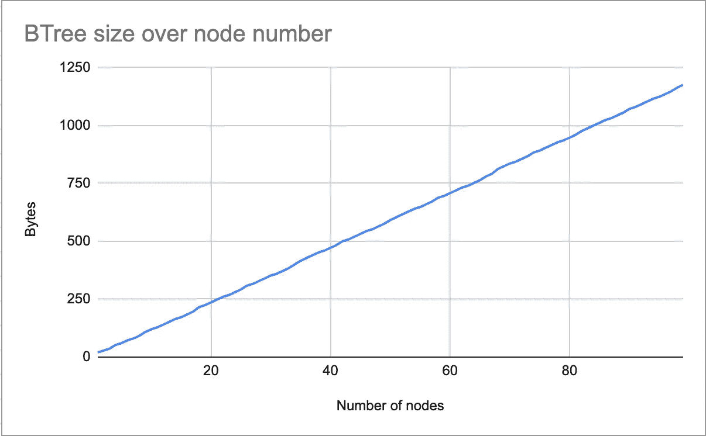

Btree 实例在多个节点上的内存分配。

*   **Search** :在最坏的情况下，当值不存在于树中或者存储在一个叶子中时，搜索方法将对每个访问的节点进行恒定的`c`操作，并且它将访问与树的**高度** `log3(N)`一样多的节点。所以这个方法的复杂度是:`O(log3(N)*c) -> O(log N)`
*   **插入**:在任何情况下，该操作都必须沿着树向下，直到到达一片叶子，因此，与搜索方法一样，复杂度也是`O(log N)` 。请注意， *insert()* 调用的所有子方法，如 *split()* 或 *insertNonFull()* 都具有恒定的时间复杂度`O(1)`，因为它们只进行值的重新赋值，不进行迭代，也不调用其他复杂度更高的函数。

在下图中，蓝色线条显示了 400 次连续插入所用时间的结果(以毫秒为单位),在其旁边，红色线条表示累积的平均值。还添加了函数`log3(N)/8`来显示两条曲线形状的相似性。有趣的是观察到一些周期性的峰值，这是当插入像`split()`那样做额外操作时的情况。

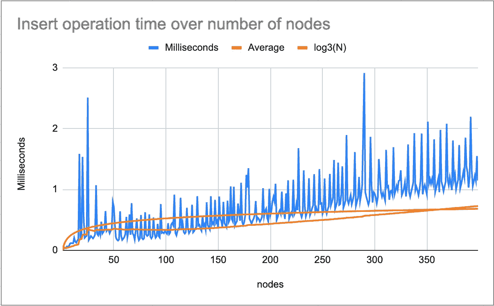

```
const times = [];
for (let i = 1; i < 400; i += 1) {
  const init = performance.now();
  **this.bTree.insert(i)**;
  const end = performance.now();
  times.push(end - init);
}
console.log(times); // [0.074999989010393, 0.0099999886006116, ... ]
```

*   **删除**:作为搜索和插入方法的删除操作在任何可能的情况下都必须到达一个叶子。在最坏的情况下，当目标值在一个非叶节点中时，这个方法将调用子方法`getMinMaxFromSubTree()`，这将把新的目标值留在一个叶节点中。所以这将遍历树两次，但它仍然停留在对数复杂度`O(log N)`。其他运算`transferValue()`和`mergeNodes()`具有线性复杂度`O(1)`，因此不影响时间复杂度。

下图显示了具有`i`值的 BTree 中`i in 400`连续删除的时间性能。结果显示在累积平均值和对数曲线旁边，以显示最后两条曲线之间的形状相似性。

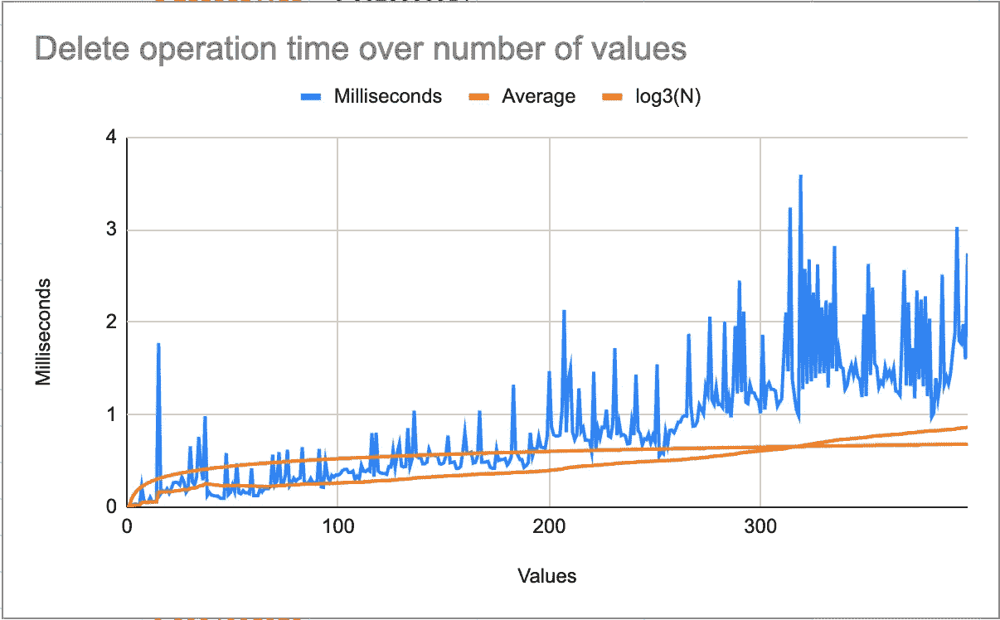

```
const times = [];
this.bTree.insert(0);
this.bTree.insert(1);
for (let i = 1; i < 400; i += 1) {
  const init = performance.now();
  this.bTree.delete(i);
  const end = performance.now();
  times.push(end - init);
  this.bTree.insert(i);
  this.bTree.insert(i + 1);
}
console.log(times); // [0.0149999978020787, 0.0200000067707151, ...]
```

# 用 Vue 制作操作动画。射流研究…

## D3 + Vue.js

在使用层级和树类的 [D3 库](https://vuejsexamples.com/tag/d3/)的帮助下( [Github](https://github.com/d3/d3-hierarchy) )，Structies 能够可视化一个通用树，以特定的结构向 D3 提供数据。因此，为了表示和可视化 BTree 的特定状态，创建了一个新的功能`BTree.toJSON(node)`,以便创建 D3 可以理解的兼容对象，允许创建当前 BTree 的图形表示。下面有一个 [codepen](https://codepen.io/sebastianfdez/pen/VwvMzzj) 展示了一个包含子元素和值的简单对象是如何被 D3 解释成 BTree 的。

## 制作动画

为了使事情尽可能简单，这个动画的主要思想是显示插入和删除方法的每一步和每一个比较。注意，在最后一个代码片段中，有一个属性`highlighted`将一个节点变成红色，如果两个连接的节点高亮显示，它们之间的链接也变成红色。由于这种突出显示的基本概念，有可能在操作的每个步骤中强调一些节点和链接。

结构使用`Sequences`和`Frames`的概念来表示一个多步骤操作的动画，这样，一个名为 **Visualizer** 的组件负责使用 D3 显示树。这个组件接收一个`Sequences`列表来显示，所以每个操作，像`BTree.insert(k)`或者`BTree.delete(k)`都会返回一个`Sequence`对象，里面有多个`Frames`；其中每个`Frame`包含一个对象`Tree`，与 D3 兼容，带有一些高亮显示的值。

每次操作后，创建一个新的空`Sequence`并添加到**可视化器**订阅的列表中，并且立即将`Frames`一个接一个地添加到这个新的`Sequence`中。默认情况下，可视化工具显示的是最后一个序列的最后一帧，因此这种异步添加帧的技术会产生动画的感觉。

```
**addSequenceAsync**(frames) {
  this.isAnimating = true;
  const newSequence = new Sequence();
  newSequence.addFrame(frames[0]);
  this.sequencesList.push(newSequence);
  this.currentSequenceNumber = this.sequencesList.length - 1;
  this.currentFrame = 0;
  **//** Asynchronouslyadd all frames to the last Sequence
  for (let i = 1; i < frames.length; i += 1) { **setTimeout**(() => {
      newSequence.**addFrame**(frames[i]);
      if (i === frames.length - 1) {
        this.isAnimating = false;
      }
      this.currentFrame += 1;
    }, i * 500);
  }
},
```

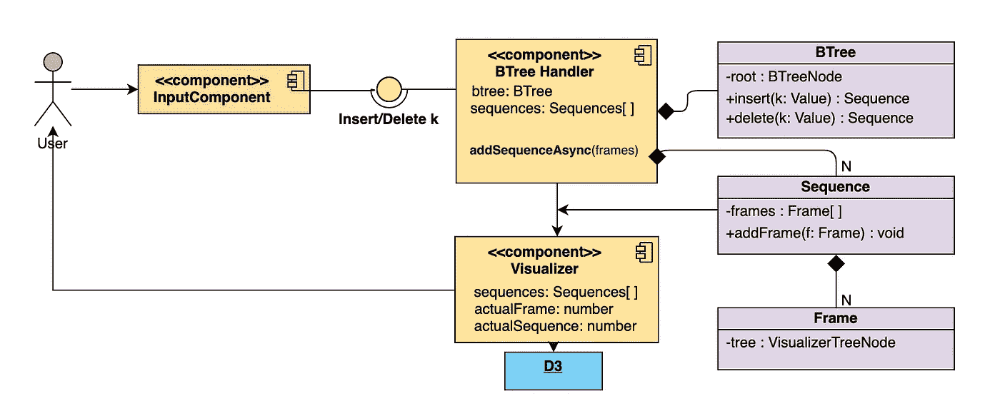

可视化图表

## 给你。

我希望这篇文章能帮助你理解 BTrees 是如何工作的，以及它们是如何在访问大量信息时保持对数复杂度的。

感谢阅读！

[](https://github.com/sebastianfdez) [## sebastianfdez -概述

### 在 GitHub 上注册你自己的个人资料，这是托管代码、管理项目和构建软件的最佳地方…

github.com](https://github.com/sebastianfdez) 

# 参考

*   JavaScript BTree 代码:[要点链接](https://gist.github.com/sebastianfdez/5113cee7a55dc644be6a09081afd119a)
*   D3 库:【https://github.com/d3/d3-hierarchy 
*   *算法简介* (2001)托马斯 H..放大图片作者:Thomas H Cormen，Charles E Leiserson，Ronald L Rivest，Clifford Stein
*   结构:[https://structies.firebaseapp.com/#/](https://structies.firebaseapp.com/#/)
*   作者 Github:[https://github.com/sebastianfdez](https://github.com/sebastianfdez)
*   二叉树:D3 + Vue.js: [拉维夏尔马](https://bl.ocks.org/ravi4j)的块。