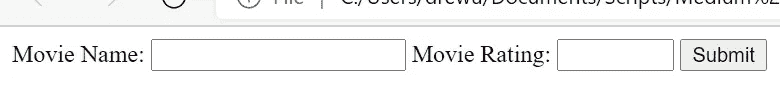
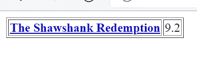
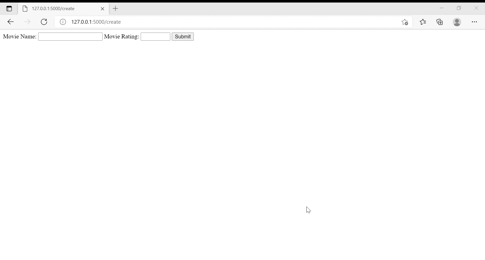

# 用 Flask 和 SQLAlchemy 构建一个基本网站

> 原文：<https://levelup.gitconnected.com/building-a-basic-website-with-flask-and-sqlalchemy-2f66ea6c02dc>

## 创建最小后端的快速教程


格伦·卡斯滕斯-彼得斯在 [Unsplash](https://unsplash.com?utm_source=medium&utm_medium=referral) 上拍摄的照片

[Flask](https://flask.palletsprojects.com/en/2.0.x/) 是一个轻量级的、非常灵活的框架，用于用 Python 创建网站后端。除了抽象复杂的 web 概念，如路由、呈现 HTML 文档和处理静态文件，还可以很容易地与 Python 的许多库集成。

为了展示它的威力，本教程将开发一个简单的网站来维护电影及其 [IMDb 评分](https://www.imdb.com/chart/top/)。这个网站将是一个 CRUD，代表创建、读取、更新和删除，这是数据库的基本操作。这是一个很好的介绍，因为几乎每个网站，从最基本的形式来看，都是一个 CRUD。甚至像脸书和 YouTube 这样的巨头也在记录和修改数据库中的记录。

由于将执行数据库操作，因此将使用 [SQLAlchemy](https://www.sqlalchemy.org/) 。这个库被命名为 toolkit 和[Object Relational Mapper(ORM)](https://en.wikipedia.org/wiki/Object%E2%80%93relational_mapping)，它将允许 Python 代码直接修改数据库，而不是编写原始 SQL。虽然本教程将使用 [SQLite](https://www.sqlite.org/index.html) 进行演示，但大部分代码只需稍加修改就可以适用于更具可伸缩性的数据库，如 MySQL 或 PostgreSQL。

# 设置数据库

在使用后端的任何其他部分被创建之前，需要初始化一个数据库。为了保持有序，创建一个名为“Project”的目录，并在其中创建一个名为“MovieDB”的子目录，如下所示:

```
Project
├──MovieDB
```

在 MovieDB 目录中，创建一个名为“SetupDB.py”的 Python 文件。这将是我们用来建立数据库的文件。

```
# Imports
from sqlalchemy import Column, Integer, String, Float
from sqlalchemy.ext.declarative import declarative_base
from sqlalchemy.orm import sessionmaker
from sqlalchemy import create_engine
```

该文件的前几行将导入 SQLAlchemy 库的强制组件。

```
# Pass a declarative base and create a object to correspond with a table in the database
Base = declarative_base()

class Movie(Base):

    __tablename__ = 'movie' movie_id = Column(Integer, primary_key=True)
    title = Column(String(250), nullable=False)
    rating = Column(Float)
```

在将 base 声明为声明性 Base 之后，将创建一个新的类，其属性将与 movies 数据库中的列相关联。movie_id 属性是一个整数值，它将作为该表的主键。标题是一个简单的字符串，最多 250 个字符。最后，评级是一个简单的浮动值。

```
# Connect to and create the movie table
engine = create_engine("sqlite:///movies_database.db")
Base.metadata.create_all(engine)
```

下一段代码连接到“movies_database.db”的任何 SQLite 实例。如果没有任何实例，它将创建一个新的数据库文件。最后一行实际上创建了一个对应于电影类的表。

```
# Start a session with the database
Session = sessionmaker(bind=engine)
session = Session()# create a new movie and enter it into the database
new_movie = Movie(title = "The Shawshank Redemption", rating = 9.2)
session.add(new_movie)
session.commit()
session.close()
```

接下来的几行只是创建一个与数据库交互的新会话。为了验证它的有效性，从 movie 类创建了一个名为 new_movie 的对象，使用 *The Shawshank Redemption* 来测试它的模板。

然后调用会话将 new_movie 对象添加到数据库中，并调用 commit 保存它。

在进入下一节之前，创建一个名为“__init__”的新 Python 文件。py”并将其留空。这有助于使刚刚编写的代码成为一个以后可能会被调用的模块。如果使用 SQLite，最终的文件结构应该如下所示:

```
Project
├──MovieDB
    ├──__init__.py
    ├──SetupDB.py
    ├──movies_database.db
```

# 创建记录

回到主项目目录，创建一个名为“templates”的新子目录，并在其中创建一个名为“create.html”的新 HTML 文件

```
Project
├──MovieDB
    ├──__init__.py
    ├──SetupDB.py
    ├──movies_database.db
├──templates
    ├──create.html
```

这个 HTML 文件将作为输入新电影和分级的主要表单。由于本教程主要关注后端，HTML 本身将会非常简单。

```
<!doctype html>
<html>
<body>
  <form action = "/createmovie" method = "POST">
    <label for="name">Movie Name:</label>
    <input type = "text" name = "name">
    <label for="rating">Movie Rating:</label>
    <input type = "number" min = "0" max = "10" step = "0.1" name = "rating"> 
    <input type = "submit" value = "Submit">
  </form>
</body>
</html>
```

所有输入标签都封装在一个 form 元素中，该元素的 action 设置为“/createmovie”。这将是表单调用来创建记录的最终 URL。输入元素相当简单。文本输入捕获标题，数字输入用于评级。后者通过设置 0-10 之间的范围和 0.1 的步长来进一步修改，以确保正确设置评级。

最终结果将如下所示:



回到主项目目录，创建一个名为“MovieApp.py”的新 Python 文件。这将是网站实际服务的主要文件。

```
from sqlalchemy.orm import sessionmaker
from sqlalchemy import create_engine# Import from your custom module
from MovieDB.SetupDB import Movie
```

首先，从 SQLAlchemy 进行相同的导入。此外，从 MovieDB 进行导入，movie db 是在上一节中创建的定制模块。从这个模块中，导入类 Movie。

```
# Connect to the database
engine = create_engine("sqlite:///MovieDB//movies_database.db")
```

在继续之前，必须创建到数据库的连接。请注意，路径 no 包含了 MovieDB 文件夹。

```
# Basic Flask imports
from flask import Flask, request, redirect, url_for, render_template
# Initialize Flask
app = Flask(__name__)
```

接下来的几行导入 Flask 库的基本部分并初始化应用程序。

```
# routing for creating new records (the 'C' in CRUD)
[@app](http://twitter.com/app).route("/create")
def create():
    return render_template("create.html")
```

这些行只是路由一个 URL 来服务 create.html。当正确运行时，这将创建一个新的网页，但它实际上并没有在数据库中创建任何新的记录。

```
[@app](http://twitter.com/app).route("/createmovie", methods = ["POST", "GET"])
def createMovie():

    if request.method == "POST":
        # Get the data from the form and placed into a variable. 
        input_data = request.form

        # A new session will have to be created in every function
        Session = sessionmaker(bind=engine)
        session = Session()

        # create a new movie and enter it into the database
        new_movie = Movie(title = input_data["name"], rating = input_data["rating"])
        session.add(new_movie)
        session.commit()
        session.close()return redirect(url_for("read"))

    else:
        return redirect(url_for("create"))
```

回想一下，在编写 HTML 时，表单上的动作被设置为“/createmovie”。这个代码块表示按下提交按钮时的后端操作。请注意，在 route 方法中，methods 参数必须包含 POST。

请求对象将保存表单中的所有信息。因此，可以调用 request.method 来确保它实际上是一个 POST 方法。此外，可以从 request.form 调用表单的实际属性，即电影标题及其分级，并将其存储在变量 input_data 中。

在 SQLAlchemy 中创建了一个新会话，并使用 input_data 中的输入从 movie 类中创建了一个新对象 new_movie。会话添加新电影并提交更改。

虽然在演示中直接在数据库中传递输入是好的，但实际上，应该执行某种形式的验证。应该采取额外的步骤来确保输入是正确的数据类型或者在正确的范围内。在最坏的情况下，它可以防止垃圾数据，在最好的情况下，它可以阻止恶意攻击。

结尾的重定向将把用户带到阅读页面，该页面将在下一节中创建。

# 读取数据

添加记录没有多大作用，除非这些记录可以被查看。因此，必须在 templates 子目录下创建一个新的 HTML 文件来显示电影。文件结构现在应该如下所示:

```
Project
├──MovieDB
    ├──__init__.py
    ├──SetupDB.py
    ├──movies_database.db
├──templates
    ├──create.html
    ├──read.html
├──MovieApp.py
```

read.html 不会使用纯 HTML，而是利用 jinja 模板引擎以编程方式将电影及其评级输入到网页中。

```
<!doctype html>
<html>
<body>
  <table border = 1>
    
      <tr>
        <th>
        <a href = "/movie/{{ movie.movie_id }}"> {{ movie.title }}> 
        </a>
        </th>
        <td> {{ movie.rating }} </td>
      </tr>
    
  </table>
</body>
</html>
```

虽然上面的大部分代码显示为普通的 HTML，但是花括号介绍了 jinja 模板语言。在这种情况下，名为 query 的对象将被传递到 HTML 中。对于查询中的每一项，表中的一行将添加标题和评级。

此外，将在电影的标题上创建一个链接，指向电影的编辑页面，该页面将在下一部分中生成。

然而，回到 MovieApp 文件，这个页面需要得到适当的服务。

```
# Routing for simply reading the database (the 'R' in CRUD)
[@app](http://twitter.com/app).route("/read")
def read():

    # Start this page's session
    Session = sessionmaker(bind=engine)
    session = Session()

    # Query all results from the database
    query = session.query(Movie).all()

    # render the template and pass the query into the html
    return render_template("read.html", query = query)
```

与上一节相比，这里使用了更简单的路由方案。启动一个新的会话，并对电影表进行查询。

在这种情况下，查询将从表中检索所有电影。这很好，因为这个数据库很小，但是在表可能包含数百万条记录的环境中，这是一个非常糟糕的主意。应该应用某种过滤器来代替。

调用同一个 render_template 函数，该函数返回 read.html，但请注意 query 的附加参数。查询变量被传递给参数，参数会在 HTML 呈现之前将其自身注入到 HTML 中。最终结果应该如下所示:



# 编辑和删除记录

创建 CRUD 的最后一步是更新和删除记录。像以前一样，在模板子目录中创建一个名为 edit.html 的新 HTML 文件。

```
Project
├──MovieDB
    ├──__init__.py
    ├──SetupDB.py
    ├──movies_database.db
├──templates
    ├──create.html
    ├──read.html
    ├──edit.html
├──MovieApp.py
```

与之前创建的 HTML 非常相似，edit.html 将包含一个表单，用于将通信和 Jinja 格式传递回服务器。

```
<html>
<body>
  <form action = "/editmovie/{{ query.movie_id }}" method = "POST">
    <label for="name">Movie Name:</label>
    <input type = "text" name = "name" value = "{{ query.title }}">
    <label for="rating">Movie Rating:</label>
    <input type = "number" min = "0" max = "10" step = "0.1" name = "rating" value = "{{ query.rating }}"> 
    <input type = "submit" value = "Update">
  </form>
  <form action = "/deletemovie/{{ query.movie_id }}" method = "POST">
    <input type = "submit" value = "Delete">
  </form>
</body>
</html>
```

稍微复杂一点，这个 edit.html 实际上有两个窗体部分。第一个看起来非常类似于 create.html，但一些关键的区别突出。首先，这个动作不是硬编码的，而是使用 Jinja 模板调用带有特定电影 ID 的 URL。这将在烧瓶部分进行。接下来，输入标签有默认值，也是用 Jinja 模板创建的。

在任一种情况下，查询对象都将被调用，其属性 title 和 rating 将填充空白。

第二种形式调用删除电影的 URL 操作。这个表单中的一个输入就创建了一个删除按钮。

回到 MovieApp.py，需要创建到三个新 URL 的路由。

```
# Routing for editing a movie, including deletion (the 'U' and 'D' in CRUD)
[@app](http://twitter.com/app).route("/movie/<movie_id>")
def edit(movie_id):

    # Start this page's session
    DBSession = sessionmaker(bind=engine)
    session = DBSession()

    # Query the movie based on the id
    query = session.query(Movie).filter(Movie.movie_id == movie_id).one()    

    session.close()

    # Render the html with the query passed through it
    return render_template("edit.html", query = query)
```

注意，在路由中，尖括号(“<>”)表示附加到 URL 的变量。在这种情况下，一旦它运行，www。{base}。com/movie/1 会将电影 ID 1 传递给该函数，并返回相应电影的详细信息。

和以前一样，创建了一个新的会话，查询调用了具有指定 ID 的电影的单个结果。这个信息然后被传递给 HTML。

虽然这呈现了页面，但还没有做出任何更改。

```
# Routing to actually update the movie
[@app](http://twitter.com/app).route("/editmovie/<movie_id>", methods = ["POST", "GET"])
def editMovie(movie_id):

    if request.method == "POST":
        # Get the data from the form and placed into a variable. 
        input_data = request.form

        # A new session will have to be created in every function
        DBSession = sessionmaker(bind=engine)
        session = DBSession()

        # Search for the movie to change based on the movie id
        query = session.query(Movie).filter(Movie.movie_id == movie_id).one()  

        # Write the changes to the database
        query.title = input_data["name"]
        query.rating = input_data["rating"]
        session.commit()
        session.close()return redirect(url_for("read"))

    else:
        return redirect(url_for("read"))
```

编辑电影的路线没有引入任何新的东西。利用相同的尖括号，传递相同的电影 ID，创建会话，并运行查询。惟一新颖的部分是使用从表单请求中提取的 input_data 变量对查询进行了更改。在此步骤之后，会话被提交并关闭。

与创建新记录一样，还应该执行额外的输入验证。

```
# Routing for deleting a movie
[@app](http://twitter.com/app).route("/deletemovie/<movie_id>", methods = ["POST", "GET"])
def deleteMovie(movie_id):
    if request.method == "POST":

        # A new session will have to be created in every function
        DBSession = sessionmaker(bind=engine)
        session = DBSession()

        # Search for the movie to change based on the movie id
        query = session.query(Movie).filter(Movie.movie_id == movie_id).one()

        # Delete the row
        session.delete(query)
        session.commit()
        session.close()

        return redirect(url_for("read"))

    else:
        return redirect(url_for("read"))
```

删除电影的路径几乎相同。唯一的区别是 delete 方法是在 session 对象上调用的。

剩下的唯一代码是实际运行应用程序:

```
if __name__ == '__main__':
    app.run()
```

# 把所有的放在一起

如果一切顺利，所有的部分都在一起，一个功能齐全的网站将允许用户创建一个带评级的新电影，在主表上阅读，编辑，甚至删除它。

总的来说，它应该是这样的:



网站演示。作者制作的 Gif。

在上面的演示中，一部评级为 9.1 的新电影*教父*被添加到数据库中。电影将被添加到下一页的表格中。之后，按下桌上的链接，分数更新为 9.2。结果再次显示在桌面上。最后，同一个页面的同一个链接可以跟随到删除按钮，当按下该按钮时，从数据库中删除电影。

这是一个基本的垃圾。它缺少很多关键特性，比如验证用户输入或前端样式，但是这两个概念都超出了本教程的范围。相反，它是实际网站创建的基本蓝图。

# 结论

Flask 和 SQL Alchemy 的结合可以创建健壮的 CRUD 应用程序。Flask 将许多困难的 web 概念抽象成单行代码，SQL Alchemy 允许使用数据库，而不用担心连接或手动编写查询。总的来说，它们允许有更多的时间实际创建后端，而不是担心小细节。

虽然为了简洁起见，本教程排除了输入验证等重要特性，但实际的结构就像一个网站的骨架一样，只需要非常少的几行代码。