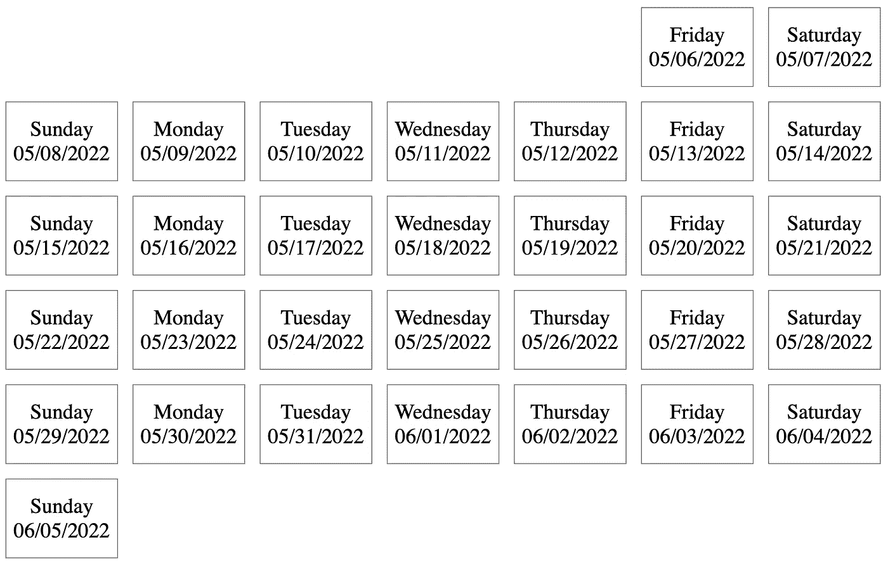

# 用 Eleventy 和 CSS 网格构建日历

> 原文：<https://levelup.gitconnected.com/building-a-calendar-with-eleventy-and-css-grid-febef21eb246>

这不是什么秘密，我是静态网站的超级粉丝，并且使用 [Eleventy](https://www.11ty.dev/) (11ty)来构建它们。它让网站建设(不仅仅是基础网站)变得超级简单。

我和 11ty 一起建立的第一批网站之一是 [Birks Cinema](https://birkscinema.co.uk/) 网站(我是该网站的受托人)——这是一个小型独立电影院、社区中心和咖啡馆，位于我居住的小村庄。11ty 完全符合要求。该网站从各种来源获取数据——一个 API 的电影，另一个 API 的事件，第三个 API 的菜单，第四个 API 的流媒体视频。多亏了一个漂亮的 Github 动作，网站在一天中的预定时间更新(重建)以反映电影和事件的变化。

对于 11ty，所有这些都相对简单。因为 11ty 是一个静态站点生成器，所以整个站点都托管在 [Netlify](https://www.netlify.com/) 上，这使得它非常具有成本效益(适用于免费计划)和极高的性能(在 [PageSpeed Insights](https://pagespeed.web.dev/report?url=https%3A%2F%2Fbirkscinema.co.uk%2F&form_factor=mobile) 上得分 99+)。

由于许多内容(电影和社区活动)基于日期和时间，我们需要一个动态日历来显示每天的电影和活动。下面是我如何使用 11ty 和 CSS Grid 构建一个动态日历。

# 数据

要创建日期列表，我们首先需要创建一个日期数据源。我们将使用 [11ty 的全局数据](https://www.11ty.dev/docs/data-global/)来完成这项工作，并创建一个数据文件来导出一个日期数组。它输出什么日期完全由你决定。我选择导出未来 6 个月的一组日期，但是您可以随意导出任何日期范围。

在您的`dir.data`目录下创建一个名为`dates.js`的文件(默认为`_data`)。在这个文件中，我们将使用`date-fns`库来创建一个日期数组(在本例中是接下来的 6 个月)。

```
const eachDay = require(‘date-fns/eachDayOfInterval’);
const addMonths = require(‘date-fns/addMonths’);module.exports = () => {
  const dateRange = eachDay({start: new Date(), end: addMonths(new Date(), 6) }); return dateRange;
}
```

有了这些全局数据，我们现在可以在任何模板中使用`dates`变量输出一个日期列表。例如:

```

  {{ dateItem }}

```

将输出未来 6 个月每天的日期数组。

# 一个简单的帮助过滤器

接下来，我们将创建一个简单的助手过滤器来格式化日期。这将允许我们将`dates`数组中的日期格式化成我们想要的任何格式。我们将再次使用非常有用的`date-fns`库来完成这个任务。

```
const format = require(‘date-fns/format’);const formatDate = (date, formatStr) => {
  return format(date, formatStr);
}eleventyConfig.addFilter(‘formatDate’, formatDate);
```

这个`formatDate`过滤器允许我们传递一个日期(来自我们的`dates`全局数据)并以我们喜欢的任何方式格式化它。例如:

```
{{ dateString | formatDate(‘MM/dd/yyyy’)) }}    // 05/06/2022
```

# 日历

现在我们有了日期，我们可以创建日历了。在其中一个模板中添加日历的基本模板代码。

```
// HTML <ul class="calendar">

  <li style="grid-column-start: {{ dateItem | formatDate(‘c’) }}">
    {{ dateItem | formatDate(‘MM/dd/yyyy’) }}
  </li>

</ul>// CSS.calendar {
  display: grid;
  grid-template-columns: repeat(7, 1fr);
}
```

内嵌样式可能引起了你的注意。这样做的目的是将第一天放在日历上正确的列中。例如，如果`dates`数组中的第一天是星期三，我们希望日历上的第一天放在第 4 列(因为星期三是一周的第 4 天，使用的是 Sun-Sat 日历)。`c`格式返回一周的第 n 天(1 表示星期日，2 表示星期一，3 表示星期二，等等)，这将把第一天放在日历的正确列中。

这就是我们用 Eleventy 和 CSS Grid 制作的工作日历。



# 完整演示

查看一个[工作演示](https://bretts-eleventy-playground.netlify.app/calendar/)，源代码可以在我的[十一游乐场回购](https://github.com/brettdewoody/eleventy-playground)中找到。


照片由[普里西拉·杜·普里兹](https://unsplash.com/@priscilladupreez?utm_source=unsplash&utm_medium=referral&utm_content=creditCopyText)在 [Unsplash](https://unsplash.com/s/photos/calendar-digital?utm_source=unsplash&utm_medium=referral&utm_content=creditCopyText) 上拍摄