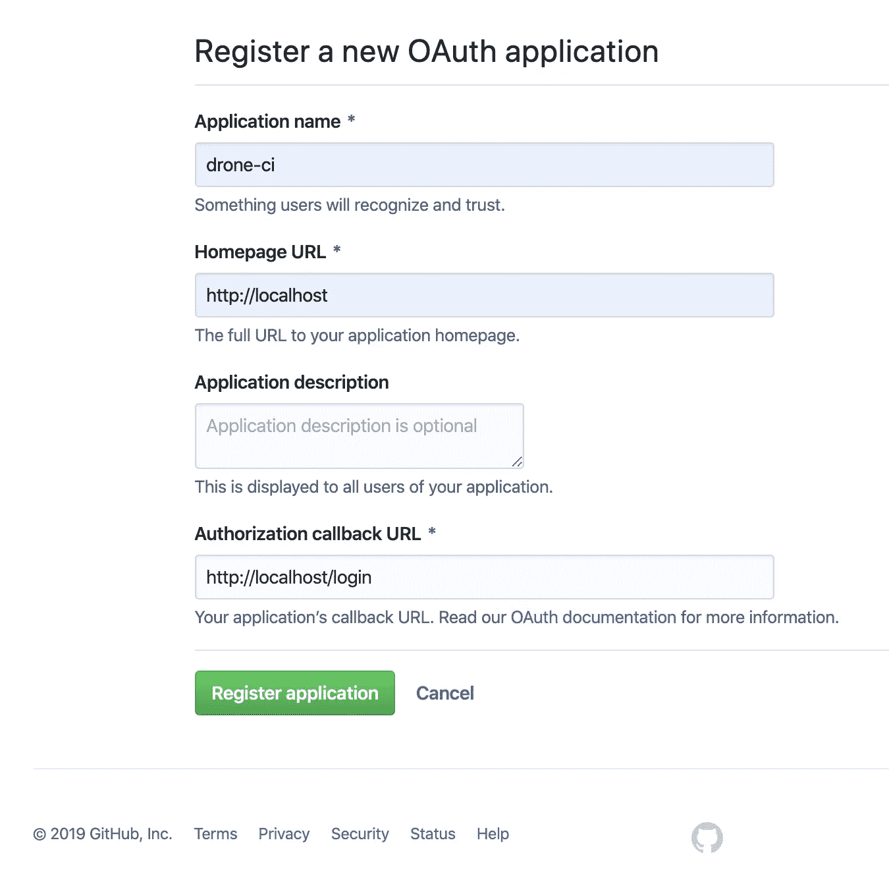
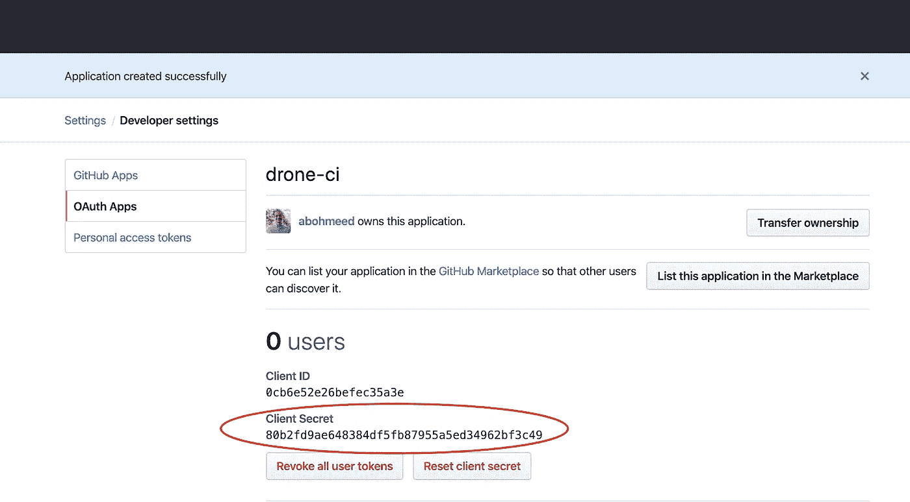
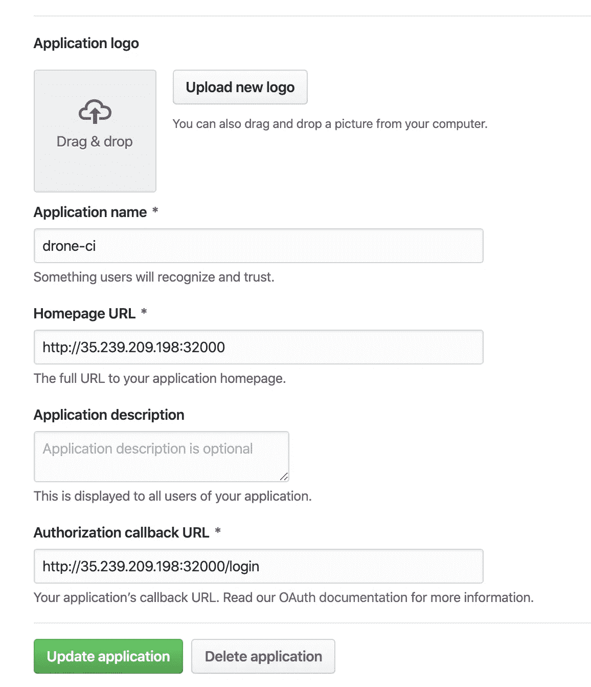
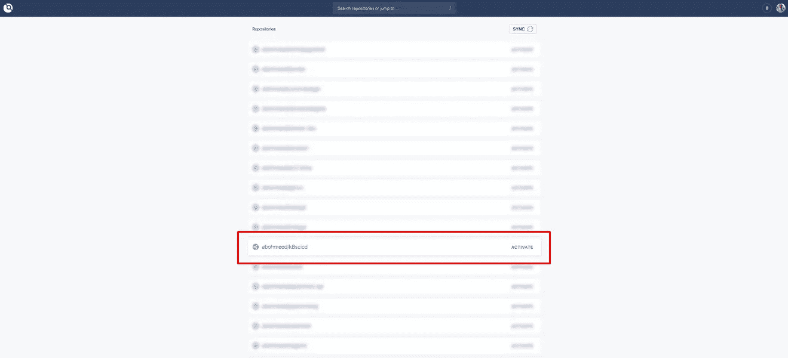
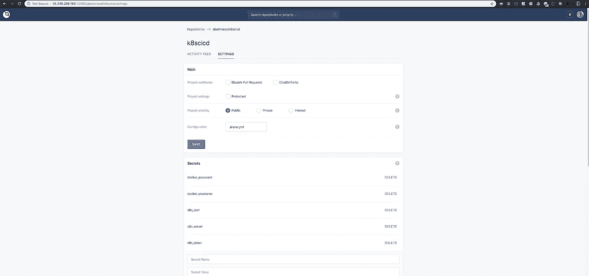
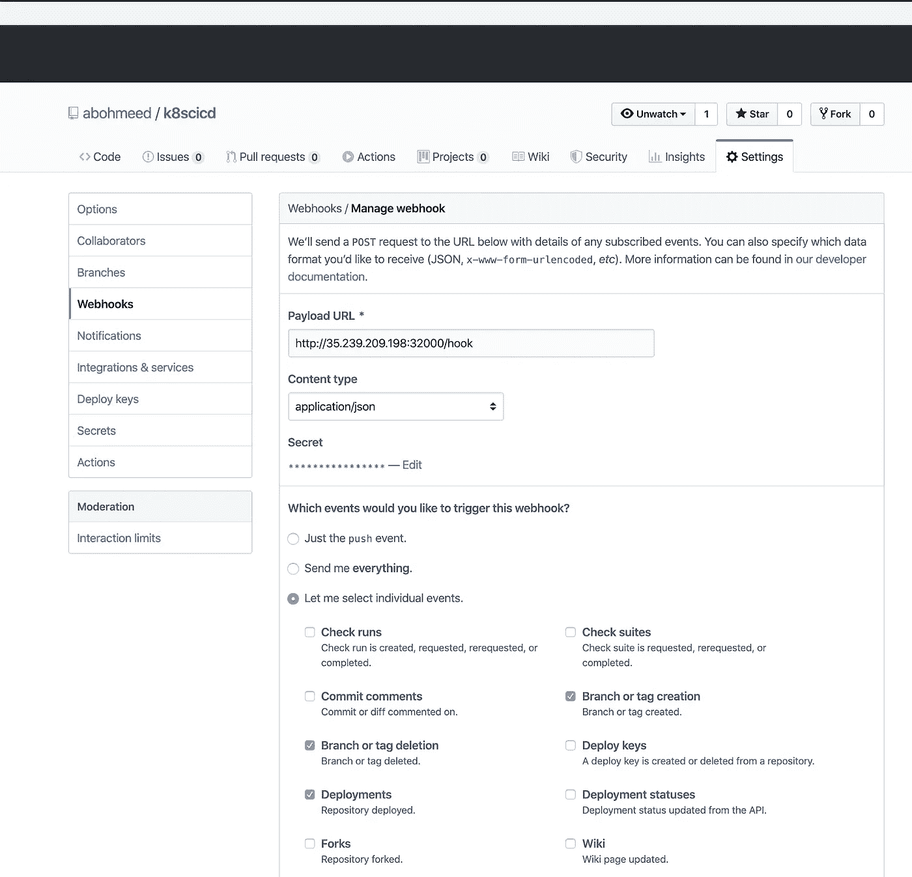
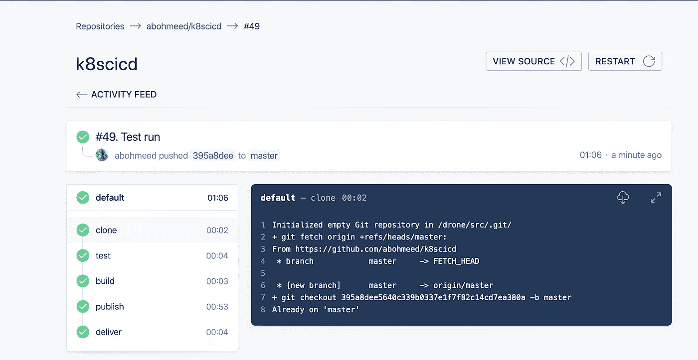

# 使用无人机 CI 和 Kubernetes 构建 CD 管道

> 原文：<https://levelup.gitconnected.com/building-a-cd-pipeline-with-drone-ci-and-kubernetes-4b8c44e89fe2>

*本文原载于*[https://www . magalix . com/blog/building-a-CD-pipeline-with-drone-ci-and-kubernetes](https://www.magalix.com/blog/building-a-cd-pipeline-with-drone-ci-and-kubernetes)

在上一篇文章中，我们讨论了什么是 [CI/CD](https://www.magalix.com/blog/create-a-ci/cd-pipeline-with-kubernetes-and-jenkins) ，它试图解决的问题类型，以及它在 DevOps 范例中的位置。我们还建立了一个小型实验室，在那里我们使用 Jenkins、Ansible 和 Kubernetes 建立了一个连续交付(CD)管道。在本文中，我们将构建一个类似的 CD 管道，但是这次我们使用的是 [Drone CI](https://drone.io/) 。

# 什么是无人机 CI？

Drone CI 用 Go 编写，于 2014 年首次发布，是一个使用容器优先方法的构建工具。Drone 最突出的特点就是用容器装*一切*。Drone 中最复杂的管道中的每个阶段都是通过 Docker 容器执行的。这为使用多种工具和/或环境来满足您的构建和[部署](https://www.magalix.com/blog/kubernetes-deployments-101)需求提供了极大的灵活性。与 Jenkins 不同，Drone CI 必须与 Git 存储库集成才能正常工作。它有许多插件，可以作为 Docker 容器部署。它们可以像 UNIX 工具(ls、cat、tee 等)一样使用。)都用上了。

无人侦察机利用 YAML 的文件获取指令。指令文件与应用程序代码的其余部分一起在存储库中进行检查。当 Jenkins 中的声明性管道被配置为使用作为存储库一部分的 Jenkinsfile 时，这种行为与它们非常相似。然而，Jenkins 使用 Groovy 作为 DSL 语言。

# 我们的示例应用程序:用 Go 编写的 Hello-World API

在这个实验中，我们简化了构建、测试和交付一个用 Go 编写的简单 API 的过程。当根 URL 收到 GET 请求时，API 应该显示“hello world”。让我们从应用程序代码(main.go)开始:

```
package mainimport (
   "log"
   "net/http"
)type Server struct{}func (s *Server) ServeHTTP(w http.ResponseWriter, r *http.Request) {
   w.WriteHeader(http.StatusOK)
   w.Header().Set("Content-Type", "application/json")
   w.Write([]byte(`{"message": "hello world"}`))
}func main() {
   s := &Server{}
   http.Handle("/", s)
   log.Fatal(http.ListenAndServe(":8080", nil))
}
```

我们还需要对代码进行一些测试。Go 使这变得非常容易，我们只需要添加一个包含我们的测试函数的文件，并将其命名为 main_test.go:

```
package mainimport (
   "io/ioutil"
   "net/http"
   "net/http/httptest"
   "testing"
)func TestServeHTTP(t *testing.T) {
   handler := &Server{}
   server := httptest.NewServer(handler)
   defer server.Close()resp, err := http.Get(server.URL)
   if err != nil {
       t.Fatal(err)
   }
   if resp.StatusCode != 200 {
       t.Fatalf("Received non-200 response: %d\n", resp.StatusCode)
   }
   expected := `{"message": "hello world"}`
   actual, err := ioutil.ReadAll(resp.Body)
   if err != nil {
       t.Fatal(err)
   }
   if expected != string(actual) {
       t.Errorf("Expected the message '%s' but got '%s'\n", expected,actual)
   }
}
```

为了建立一个图像，我们需要一个 docker 文件。它可能看起来像这样:

```
FROM golang:alpine AS build-env
RUN mkdir /go/src/app && apk update && apk add git
ADD main.go /go/src/app/
WORKDIR /go/src/app
RUN CGO_ENABLED=0 GOOS=linux go build -a -installsuffix cgo -ldflags '-extldflags "-static"' -o app .FROM scratch
WORKDIR /app
COPY --from=build-env /go/src/app/app .
ENTRYPOINT [ "./app" ]
```

# 在 Kubernetes 上安装和配置 Drone CI

# 安装舵

安装无人机 CI 最简单快捷的方法就是使用[舵图](https://helm.sh/)。如果你不知道 Helm 是什么，它只是 Kubernetes 的一个包管理器。每当你有一个应用程序需要不同的 Kubernetes 资源，比如[部署](https://www.magalix.com/blog/kubernetes-deployments-101)、[服务](https://www.magalix.com/blog/kubernetes-services-101-the-pods-interfaces)、[配置映射](https://www.magalix.com/blog/the-configmap-pattern)、[秘密](https://www.magalix.com/blog/kubernetes-secrets-101)等。您可以将它打包到一个舵图中，通过一个命令部署(或删除)所有内容。Helm 本身由两个组件组成:客户端工具(helm ),它是一个运行在笔记本电脑上的二进制文件；服务器端工具(tiller ),它运行在服务器上。

假设您已经拥有对正在运行的 [Kubernetes](https://www.magalix.com/blog/kubernetes-101-concepts-and-why-it-matters) 集群的管理权限，您可以通过以下简单步骤安装 Helm:

```
# cd /tmp
# curl [https://raw.githubusercontent.com/kubernetes/helm/master/scripts/get](https://raw.githubusercontent.com/kubernetes/helm/master/scripts/get) > install-helm.sh
# chmod u+x install-helm.sh
# ./install-helm.sh# kubectl -n kube-system create serviceaccount tiller
# kubectl create clusterrolebinding tiller --clusterrole cluster-admin --serviceaccount=kube-system:tiller
# helm init --service-account tiller
```

客户端只是保存在您自己的笔记本电脑上的二进制文件。为了部署 Tiller，我们需要为它创建一个服务帐户。我们称之为蒂勒。然后，我们创建一个 ClusterRoleBinding 来将服务帐户添加到 cluster-admin，这是 Kubernetes 附带的一个内置角色。顾名思义，该角色授予其用户对集群的管理权限。

# 部署无人机 CI

在部署 Drone 之前，我们必须在存储库上创建一个 OAuth 应用程序。在本实验中，我们使用 GitHub，但同样的概念也适用于其他主要的存储库服务，如 BitBucket、GitLab 等。

对于 GitHub，转到[https://github.com/settings/developers](https://github.com/settings/developers)并创建一个新的应用程序:



现在，您可能会注意到，我们没有为主页或回调 URL 指定有效的 URL。我们这样做是因为我们还没有正确的 URL。一旦我们在 Kubernetes 上创建了服务，我们就可以返回并相应地更改 URL。现在，我们只需要令牌:



我们需要 Kubernetes 访问这个客户秘密，以便无人机 CI 可以在必要时使用它。让我们创建一个秘密来保存我们的令牌:

```
kubectl create secret generic drone-server-secrets --namespace=default --from-literal=clientSecret="80b2fd9ae648384df5fb87955a5ed34962bf3c49"
```

Helm 使用一个名为 values.yaml 的文件，您可以在其中进行不同的定义和覆盖。一旦我们有了舵和舵杆，使用它的舵图部署无人机就相对容易了:

```
helm install --name drone-release stable/drone
```

您可能会注意到输出中的一条错误消息，该消息发送了一条警告，指出安装未完成，因为我们没有指定版本控制系统。类似于以下内容:

```
NOTES:
##############################################################################
####        ERROR: You did not set a valid version control provider       ####
##############################################################################
```

这意味着我们仍然需要提供重要的信息，以便我们的部署能够正常工作。让我们接下来这样做:

```
helm upgrade drone --reuse-values --set 'service.type=NodePort' --set 'service.nodePort=32000' --set 'sourceControl.provider=github' --set 'sourceControl.github.clientID=0cb6e52e26befec35a3e' --set 'sourceControl.secret=drone-server-secrets' stable/drone
```

Helm 通过以下两种方式之一接受部署中使用的自定义变量:

*   使用 values.yaml 文件。
*   通过使用 set 选项直接在命令行中设置这些值。

这两种方法通常结合使用，values.yaml 文件包含默认值，而 set 选项会覆盖它。

在我们的示例中，我们正在为我们的 Helm 部署设置一些重要的值:

*   service.type 设置为 NodePort。我们可以根据自己的喜好将其设置为 LoadBalancer 或 ClusterIP。
*   service.nodePort:因为我们使用的是 nodePort 服务类型，所以我们设置了 NodePort，这样我们就可以在防火墙上启用它。
*   提供商是 github。
*   最后两个选项设置了客户端 ID 和客户端密码，以便 Drone 能够与 GitHub 通信。

如果您需要设置不同的值或探索其他选项，您可以参考舵图文档页面:[https://github.com/helm/charts/tree/master/stable/drone](https://github.com/helm/charts/tree/master/stable/drone)

现在，我们需要获取我们的无人机服务器的 IP 地址来更新部署，并且还要更新我们的 GitHub 应用程序设置:

```
$ kubectl get nodes -o wide
NAME                                                STATUS   ROLES    AGE     VERSION          INTERNAL-IP   EXTERNAL-IP      OS-IMAGE                             KERNEL-VERSION   CONTAINER-RUNTIME
gke-standard-cluster-1-default-pool-e317cef6-79bh   Ready       4h32m   v1.15.4-gke.18   10.128.0.60   35.239.209.198   Container-Optimized OS from Google   4.19.76+         docker://19.3.1
```

获得 URL 后，我们可以按如下方式更新部署:

```
helm upgrade drone-release --reuse-values --set 'server.host=[http://35.239.209.198:32000'](http://35.239.209.198:32000') stable/drone
```

接下来，更新 GitHub 应用程序:



现在导航到 http://35.239.209.198:32000。您可能需要在 GitHub 中授权该应用程序。接下来，您应该会看到一个包含您帐户中所有存储库的页面:



您需要通过单击名称旁边的激活链接来激活存储库。

# 建设管道

Drone 使用一个名为. drone.yml 的 YAML 文件，该文件与其余的代码文件一起签入存储库。您可以通过 Drone UI 中的存储库设置随意更改该文件的名称和路径。的。无人机文件包含一个管道，该管道可能有一个或多个部署步骤。要到达某个步骤，必须成功执行前一个步骤。让我们看看我们的。无人机文件可能看起来:

```
kind: pipeline
name: default
steps:
- name: test
 image: golang:1.10-alpine
 commands:
   - "go test"
```

该文件以管道的定义和名称(缺省值)开始。然后我们编写第一步:测试。我们使用包含 go 二进制的 golang 图像。一旦调用了映像，工作区目录就会自动装载到容器中。接下来，我们运行 go test，它将运行 main_test.go 文件中的任何测试函数。如果任何一个测试失败，管道就会失败，输出会解释哪个测试用例失败了。

```
- name: build
 image: golang:1.10-alpine
 commands:
   - "go build -o ./myapp"
```

下一步是建立形象。虽然我们不打算使用所创建的二进制文件，但是这一步非常重要，因为它验证了代码是否可以顺利构建。

```
- name: publish
 image: plugins/docker
 settings:
   repo: magalixcorp/k8scicd
   tags: [ "${DRONE_COMMIT_SHA:0:7}","latest" ]
   username:
     from_secret: docker_username
   password:
     from_secret: docker_password
```

在发布步骤中，代码实际上被保存在 Docker 映像中，并被推送到注册表中，以便以后可以在任何环境中使用。让我们来看看这个步骤中有趣的部分:

*   我们用的是无人机的 Docker 插件。这个插件允许我们使用提供的 Docker 文件从代码中构建 Docker 映像。
*   该插件需要图像名称(repo)、标记以及注册中心的凭证。在我们的例子中，我们使用 Docker Hub。
*   注意，出于安全原因，我们不应该在文件中直接添加用户名和密码。相反，我们使用 from_secret 指令，使我们能够从 Drone 的秘密中检索值。
*   我们需要将 Docker 用户名和密码添加到 Drone 中。这可以通过存储库的设置页面来完成，如屏幕截图所示:



现在是管道的最后一部分，负责将图像实际部署到 Kubernetes:

```
- name: deliver
 image: sinlead/drone-kubectl
 settings:
   kubernetes_server:
     from_secret: k8s_server
   kubernetes_cert:
     from_secret: k8s_cert
   kubernetes_token:
     from_secret: k8s_token
 commands:
   - kubectl apply -f deployment.yml
```

在这一步中，我们使用包含 kubectl 的图像。请注意，这张图片是为无人机设计的。您可以通过查看项目的资源库来检查作者所做的调整:[https://github.com/sinlead/drone-kubectl](https://github.com/sinlead/drone-kubectl)

请注意，该步骤包括调用一个名为 deployment.yml 的文件。它看起来如下:

```
apiVersion: v1
kind: Service
metadata:
 name: hello-svc
spec:
 selector:
   role: app
 ports:
   - protocol: TCP
     port: 80
     targetPort: 8080
     nodePort: 32001
 type: NodePort
---
apiVersion: apps/v1
kind: Deployment
metadata:
 name: hello-deployment
 labels:
   role: app
spec:
 replicas: 2
 selector:
   matchLabels:
     role: app
 template:
   metadata:
     labels:
       role: app
   spec:
     containers:
     - name: app
       image: "magalixcorp/k8scicd"
       resources:
         requests:
           cpu: 10m
```

您可能还注意到，我们正在将 Drone 的秘密变量注入到这个管道步骤中，以便我们可以向 Kubernetes 认证和授权 Drone:

kubernetes_cert 是 kubernetes 使用的 CA 证书。它可以通过以下命令获得:

```
$ kubectl get secret drone-token-sn77f -o jsonpath='{.data.ca\.crt}' && echo
```

下一个秘密是 kubernetes_token，这是我们正在使用的服务帐户的令牌。可以通过以下方式获得:

```
$ kubectl get secret drone-token-sn77f -o jsonpath='{.data.token}' | base64 --decode && echo
```

drone-token-sn77f 是为服务帐户创建的密码的名称。它也可以通过以下命令获得:

```
$ kubectl get secrets
```

当然，drone 是具有创建和管理相关资源所需访问权限的服务帐户的名称。创建和授权服务帐户超出了本文的范围，但是您可以在我们的文章 [Kubernetes Authorization](https://www.magalix.com/blog/kubernetes-authorization) 中找到详细的演练。

# 调用管道

在测试管道调用之前，我们需要确保在 GitHub 上正确配置了 webhooks，以便它能够将事件发送到正确的端点。转到存储库的设置页面，然后转到 webhooks，页面应该如下所示:



现在，让我们对回购进行更改，提交代码并将其推送到 GitHub。几秒钟后，将触发管道构建。以下屏幕截图显示管道正在运行:



和完整的。为了完整起见，此处列出了无人机文件:

```
kind: pipeline
name: default
steps:
- name: test
 image: golang:1.10-alpine
 commands:
   - "go test"
- name: build
 image: golang:1.10-alpine
 commands:
   - "go build -o ./myapp"
- name: publish
 image: plugins/docker
 settings:
   repo: magalixcorp/k8scicd
   tags: [ "${DRONE_COMMIT_SHA:0:7}","latest" ]
   username:
     from_secret: docker_username
   password:
     from_secret: docker_password
- name: deliver
 image: sinlead/drone-kubectl
 settings:
   kubernetes_server:
     from_secret: k8s_server
   kubernetes_cert:
     from_secret: k8s_cert
   kubernetes_token:
     from_secret: k8s_token
 commands:
   - kubectl apply -f deployment.yml
```

我们需要看的最后一件事是无人机的一个有趣的特性。在 Kubernetes 上运行时，无人机通过 [Kubernetes 作业](https://kubernetes.io/docs/concepts/workloads/controllers/jobs-run-to-completion/)运行管道。让我们来看看:

```
$ kubectl get jobs
NAME                             COMPLETIONS   DURATION   AGE
drone-job-1-eksquogvevfu79trt    1/1           27s        35h
drone-job-10-xhuvskgleefv9zljj   1/1           59s        31h
drone-job-11-qp3mutcw3mkl7gfsn   1/1           57s        31h
drone-job-12-bmyuq8acki1uf7ldz   1/1           71s        31h
drone-job-13-jdkyeuxaemksq8jjw   1/1           73s        31h
```

# TL；速度三角形定位法(dead reckoning)

*   Drone CI 是最新的 CI/CD 工具之一——它是开源的，用 Go 编写，于 2014 年发布。
*   无人机将码头集装箱视为一等公民。与 Jenkins 等其他构建工具不同，Drone 在所有构建步骤中都使用了容器。
*   无人机也有一些插件，可以直接在管道中*投放*。
*   为了接收指令，无人机使用了一个特殊的 YAML 文件。drone(如果需要，可以在设置中将名称更改为其他名称)。该文件是存储库的一部分，这使得对代码进行“原子”更改变得更加容易。
*   Drone 通过集成开箱即用的代码库来工作。支持所有主要的在线 Git 服务，如 GitHub、Bitbucket 和 GitLab 等。
*   在这个实验中，我们演示了一个简单的 CD 管道，其中我们使用了一个用 Go 编写的简单 API。使用 Drone，我们能够自动构建、测试、对接和交付我们的应用到目标环境。
*   当 Drone 在 Kubernetes 上作为 Pod 运行时，它会利用系统提供的功能。例如，管道是通过 [Kubernetes jobs](https://kubernetes.io/docs/concepts/workloads/controllers/jobs-run-to-completion/) 运行的。

*原载于 2020 年 2 月 11 日 https://www.magalix.com**[*。*](https://www.magalix.com/blog/building-a-cd-pipeline-with-drone-ci-and-kubernetes)*