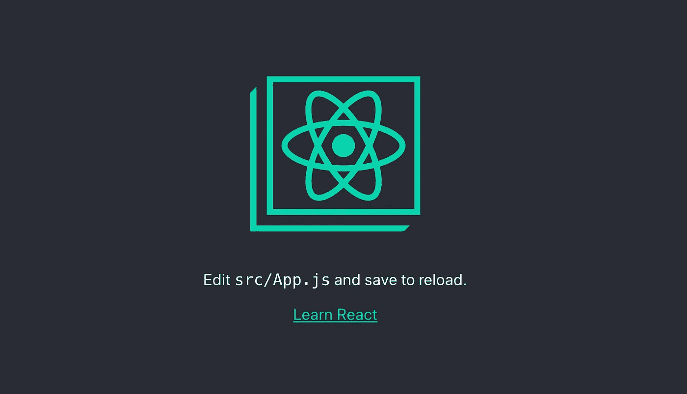
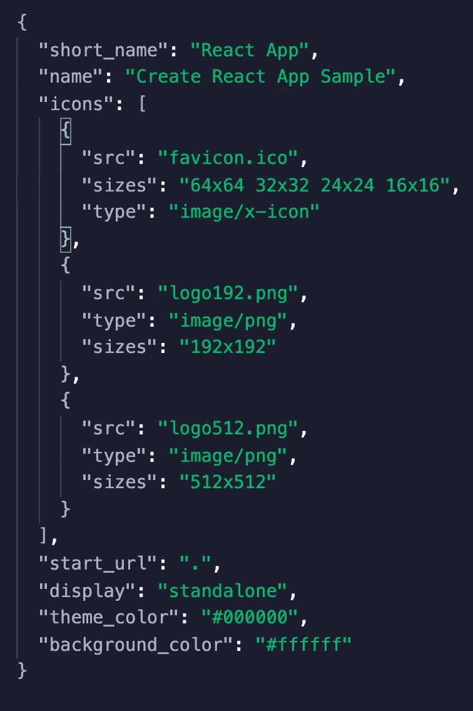
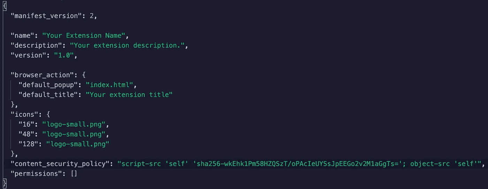
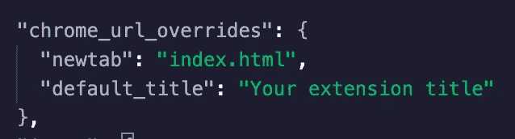
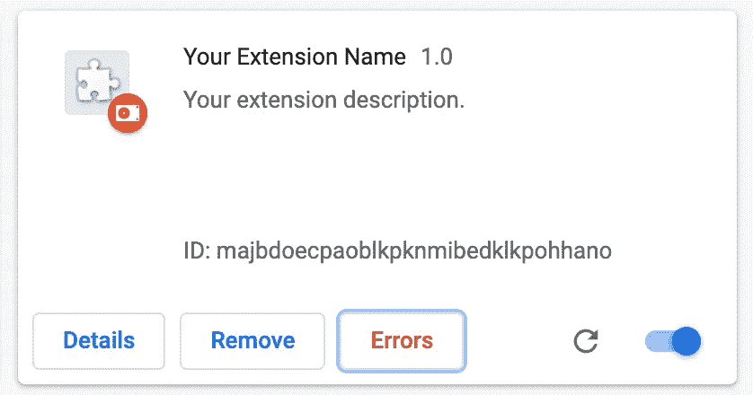
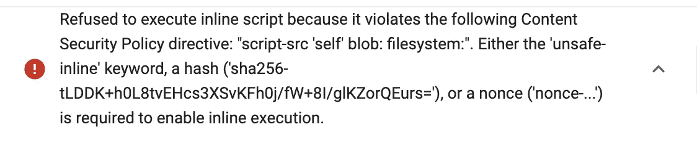
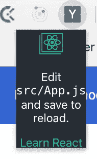
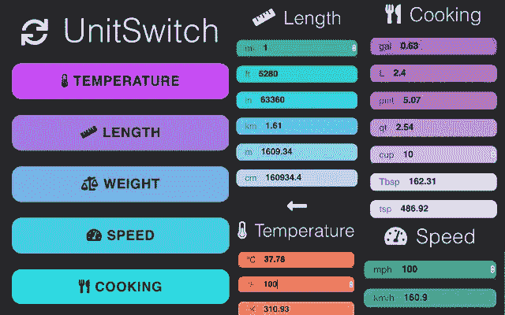

# 10 分钟内在 React 中构建一个 Chrome 扩展

> 原文：<https://levelup.gitconnected.com/building-a-chrome-extension-in-react-in-10-minutes-737023fa4918>

创建 Google Chrome 浏览器扩展是一个有趣而独特的项目，可以添加到您的开发人员组合中。它允许你尝试一种新的媒介，并能给你的项目历史增加一些多样性。

幸运的是，构建一个 Chrome 扩展也比你想象的要简单。事实上，提出一个有趣的想法可能是这个过程中最困难的部分。所以开始思考吧！

我希望你已经想好了主意——让我们开始吧！

*   在您的终端中，运行命令**create-react-app your-extension-name**

*   打开你的项目文件夹和 **npm 开始**

*   打开使用 create-react-app 快捷方式创建的 manifest.json 文件。现在它应该看起来像这样:

*   我们需要更改 manifest.json 文件，使其看起来更像这样:

*   在撰写本文时，manifest_version 必须是版本 2。选择您希望用于扩展的名称和描述，以及版本。
*   browser_action 定义了您的内容(来自 index.html)将显示在哪里。如果您遵循上面的示例，它将在浏览器菜单栏中的一个小弹出窗口中打开。如果您希望您的扩展创建一个新的选项卡，请添加以下内容:

*   您应该提供三个不同大小的图标供您的扩展使用。确保最小的徽标仍然足够清晰，即使以很小的尺寸显示在浏览器中也能被识别。
*   在浏览器中导航到 chrome://extensions/

这么官方。

*   在您的终端上从这个项目的目录中运行 **yarn build** 或 **npm run build** 来创建我们需要使用的构建文件夹。这也是您将用来查看您在处理项目时对您的扩展所做的任何更改的命令。
*   回到你的浏览器 chrome://extensions/页面，点击“加载解压”选择刚刚创建的整个构建文件夹并打开它。如果您还没有创建和保存您的徽标，您将会收到一条错误消息。现在，您可以从 manifest.json 文件中删除徽标规范。您应该会在列表中看到您的新扩展。

*   点击“错误”按钮。您将看到以下错误:

*   复制以“sha256…”开头的长字符串，并替换 manifest.json 文件中“content_security_policy”后面的类似字符串。再次运行**纱线构建**，错误应该会消失。您可能需要移除并重新加载构建文件夹。那么你应该有这样的东西:

*   现在只需编辑 index.html 无论你喜欢！

就是这样！不，真的。现在你应该可以在浏览器扩展中看到你的 index.html 文件了。让它在 Google Chrome 商店上发布是另一个故事，我将在以后的文章中讨论，但是现在你可以构建你的扩展了！请随时向我发送您所建立的-我很想看看你的项目！

我和另一个开发人员 Shawn Wheeler 一起开发的第一个 Chrome 扩展是一个单位转换器，不用离开当前标签就可以访问。在 Chrome 网上商店查看一下，了解一下你能做些什么！

阿曼达·特劳特勒