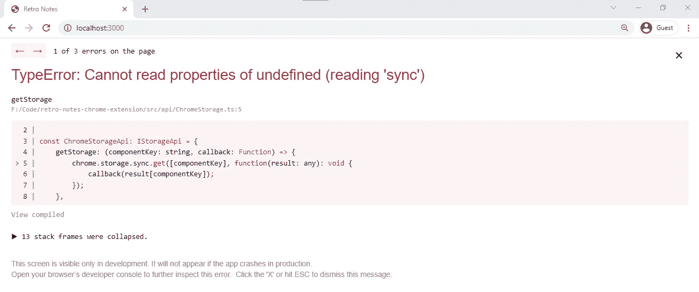
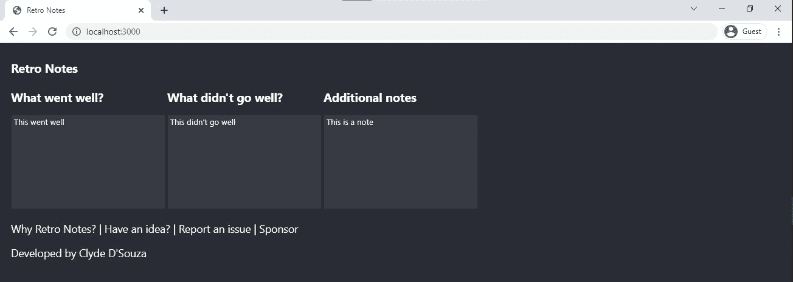

# 构建一个也像网站一样运行的 Chrome 扩展

> 原文：<https://levelup.gitconnected.com/building-a-chrome-extension-that-also-runs-like-a-website-e9502b4f260f>

## 工厂模式解耦的一个实例

背景图片上的 Chrome 浏览器设计来自 [Unsplash](https://unsplash.com/photos/qLW70Aoo8BE) 。使用 [Figma](http://figma.com) 制作的封面图像。

# 问题

我最近使用 React 开发了一个名为 [Retro Notes](https://bit.ly/retro-notes-ext) 的 Chrome 扩展。使用 Chrome 的存储同步 API[将你在文本框中填写的内容与你的 Chrome 档案同步。实现非常简单——我直接使用 API 来获取和设置存储值。](https://developer.chrome.com/docs/extensions/reference/storage/)

当扩展在 Chrome 扩展上下文中运行时，它会像预期的那样工作。通过这种方式，应用程序可以访问 Chrome 的存储 API。然而，当我将这个 React 应用程序作为独立网站运行时，它失败了，因为它无法再访问 Chrome 的存储 API。

这限制了我的开发体验，因为每次我对应用程序进行任何更改，即使只是装饰性的，我都必须在本地重新打开应用程序作为 Chrome 扩展，而不是在本地启动网站。

那么，我们如何解决这个问题呢？

# 解决办法

这里的问题是我们在两个组件之间有紧密的耦合——自定义的 React 组件和 Chrome 的存储 API 对象。在没有 Chrome 扩展上下文的情况下运行时，`chrome.storage.sync`变得无效，由于这种紧密耦合，我们也不容易替换它。紧密耦合通常会使测试变得困难，而且由于直接的依赖关系，对依赖关系的更改也会影响依赖组件。因此，这被认为是不好的做法。

相反，当我们解耦或松散耦合依赖时，系统不会严重依赖彼此。在本例中，React 组件不需要知道正在使用哪种类型的存储，也不需要知道我们如何将值设置到存储中的实现细节——但它需要知道，所以让我们更改一下。

## 步骤 1:分离存储实现细节

让我们首先将 Chrome 存储 API 代码提取到它自己的文件中。我们将把`chrome.storage.sync.set()`方法包装成一个通用的`setStorage()`方法，并且只传递相关的参数。我正在使用 TypeScript，所以我可以创建一个接口来强类型化这些方法，并在这里使用该接口。请注意，我将接口命名为`IStorageApi`而不是`IChromeStorageApi`——这是有原因的，我们将在本文后面讨论。完整的代码片段可以在下面找到。

现在，我们可以将上面创建的 Chrome 存储 API 文件导入到我们的自定义组件中，然后调用`setStorage()`方法。

这样更好——我们不再将存储功能紧密耦合到定制组件中，但是我们仍然紧密耦合存储方法。比方说，我决定交换存储方法，不使用 Chrome 的存储 API，而是使用我自己的后端服务器的 API 端点。这意味着我只需要重构这个文件，例如，更新从`ChromeStorageApi`到`CustomStorageApi`的引用。

此外，如果我在 Chrome 的扩展上下文之外将应用程序作为独立的网站运行，它仍然无法工作，因为我们直接使用了 Chrome 存储 API。所以，我们还没有真正改善开发体验。

## 步骤 2:分离存储方法

为了解决这个问题，让我们创建另一个名为`DevelopmentStorage.ts`的文件，它继承了相同的`IStorageApi`接口，但是在方法的实现中，我们将数据存储在一个本地对象中，而不是使用 Chrome 的存储 API。因为我们应该能够实现存储接口的不同实现，所以将接口命名为类似于`IStorageApi`的通用名称更有意义。完整的代码片段如下。

接下来，我们将创建一个*工厂*。根据条件，它要么返回实际的 Chrome 存储 API 模块，要么返回模拟的开发存储 API 模块。在我们的例子中，当我们将站点作为扩展运行时，`process.env.NODE_ENV`被设置为`production`，当我们将站点作为独立站点运行时，该值被设置为`development`。

最后，让我们更新定制组件并使用工厂生成的模块，而不是直接引用特定的模块。

React 组件不需要知道如何将项目提取并存储到 Chrome 的存储中的实现细节。它可以简单地与负责提供这种存储功能的 API 进行交互。这样，如果我们想要将值存储到我们的自定义存储中，我们就不需要对自定义组件进行任何更改。

现在，如果我把这个应用程序作为一个独立的网站来运行，它可以很好地加载，并且是可用的。不用说，我也可以毫无问题地将这个应用作为 Chrome 扩展来运行。

# 参考

如果你想看复古笔记的完整代码，可以在 GitHub 上找到[。如果你想尝试一下复古笔记 Chrome 扩展，可以从](https://github.com/ClydeDz/retro-notes-chrome-extension) [Chrome 网上商店](https://bit.ly/retro-notes-ext)下载。

就是这样。感谢阅读！