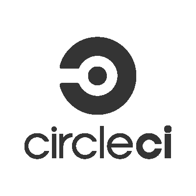
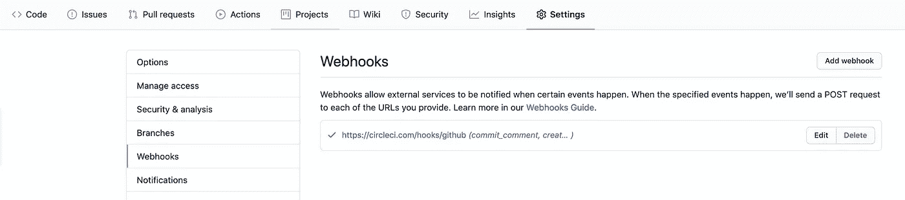
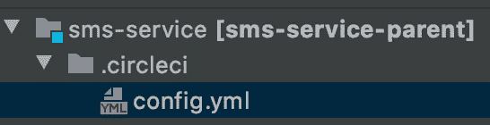
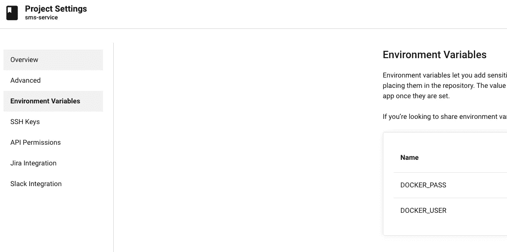
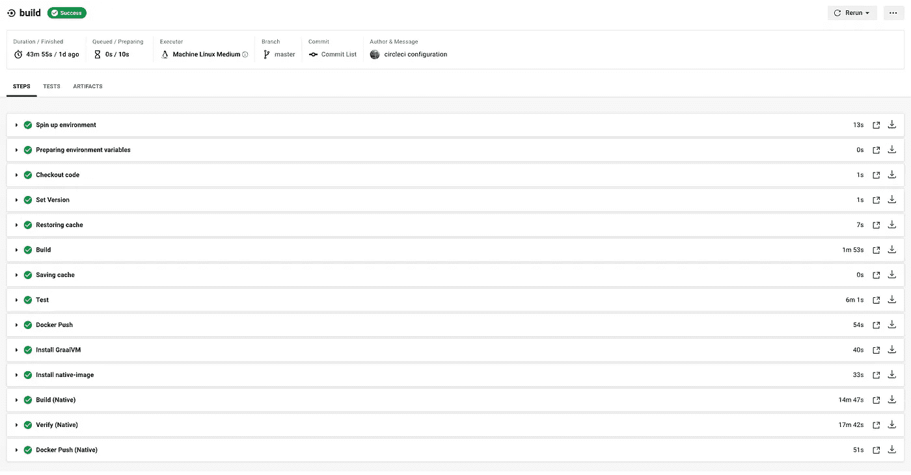
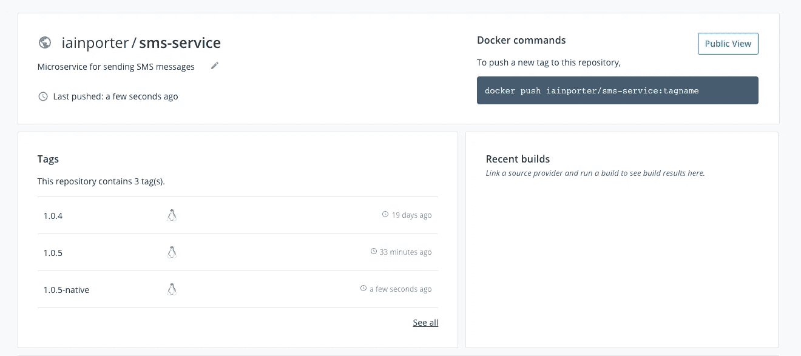

# 使用 CircleCI 为 Quarkus 的微服务构建 CI 管道

> 原文：<https://levelup.gitconnected.com/building-a-ci-pipeline-for-a-microservice-in-quarkus-with-circleci-11e9b679423f>


照片由[贝琳达·费因斯](https://unsplash.com/@bel2000a?utm_source=medium&utm_medium=referral)在 [Unsplash](https://unsplash.com?utm_source=medium&utm_medium=referral) 拍摄

这是 Quarkus 和 Kotlin 从头开始构建微服务系列的一部分。我们建立了一个微服务。我们有全面的单元和组件测试。我们可以在本地构建它，并生成 docker 映像，既可以在 JVM 中运行，也可以在 GrallVM 中本地运行。现在我们需要一个自动化构建过程的管道。

管道将

*   查看 github 的最新版本
*   构建多模块 maven 项目
*   将工件安装到本地 maven 存储库中
*   构建 docker 图像
*   使用本地 docker 映像运行组件测试
*   将 docker 映像推送到 docker 注册表(如果是主分支)
*   构建并推送应用程序的本机映像版本(如果是主分支)

有许多优秀的 CI 工具可用，其中许多都有免费层。对于本文，我们将使用 [CircleCI](https://circleci.com/)



一旦你用你的 github 帐号注册了 CircleCI，你可以从你的项目列表中选择一个想要配置 CI 的项目。设置该项目将在 github 中注册一个 webhook，以便每当新的提交被推送时，对 CircleCI 进行回调。



## 配置构建文件

CircleCI 将在项目的根目录中查找构建配置文件。该文件必须放在名为**的目录中。circleci** 并命名为 **config.yml**



构建文件由一些设置和一系列步骤组成。我将遍历构建文件并解释每一部分。完整文件可从[这里](https://github.com/iainporter/sms-service/blob/circleci/.circleci/config.yml)获得。

## 建立

```
version: 2
jobs:
  build:machine:
      image: ubuntu-2004:202008-01resource_class: medium
    working_directory: ~/repo
    environment:
      MAVEN_OPTS: -Xmx6400mGRAALVM_HOME: /home/circleci/repo/.graalvm
```

您需要选择一个[执行器](https://circleci.com/docs/2.0/executor-types/)类型。这定义了运行作业的底层技术或环境。可用的类型有:

*   Docker 图像(`docker`)内
*   在 Linux 虚拟机映像(`machine`)内
*   在 macOS 虚拟机映像中(`macos`
*   在 windows 虚拟机映像中(`windows`

在这个例子中，我们选择了 ***机器*** ，它将在一个专用的临时虚拟机中运行构建。我们选择了一个映像，它将为我们提供 openjdk 11 作为默认设置，以及 docker 和 maven。这是一个早期的预览图像和完整的组件在这里列出。

***resource_class*** 默认使用 medium。这定义了虚拟 CPU 和 RAM 的数量。如果你需要更多的资源，你可以选择一个不同的课程，但这将涉及一些费用。

我们定义了几个稍后会用到的环境变量

## 构建步骤

```
steps:
- checkout- run:
      name: Set Version
      command: |
            echo 'export VERSION=$(mvn help:evaluate -Dexpression=project.version -q -DforceStdout)' >> $BASH_ENV

- restore_cache:
      keys:
        - v1-dependencies-{{ checksum "pom.xml" }}- v1-dependencies-
```

第一步是检查源代码。接下来，我们从 pom 文件中提取版本，因为我们稍后将需要它来标记 docker 图像。我们可以利用 CircleCI 中的[缓存](https://circleci.com/docs/2.0/caching/)特性来提高构建工作的效率。未来的作业将使用***restore _ cache***标签来确保不会再次下载所有的 maven 依赖项。

## 构建项目

```
- run:
    name: Build
    command: mvn clean install -DskipTests
- save_cache:
    paths:
      - ~/.m2
    key: v1-dependencies-{{ checksum "pom.xml" }}
- run:
    name: Test
    command: mvn test
```

通常，构建配置会首先使用 maven 命令加载 maven 依赖项。

```
*mvn dependency:go-offline*
```

因为我们有一个多模块 maven 构建，并且主模块(sms-service)依赖于其他模块中构建的 jar，所以在保存缓存之前，我们必须首先构建整个项目。

为服务构建 maven 的最后一步是生成 docker 映像。

## 推到码头中心

```
- run:
    name: Docker Push
    command: |
        if [ "${CIRCLE_BRANCH}" == "master" ]; then
            echo "$DOCKER_PASS" | docker login --username $DOCKER_USER --password-stdin
            docker push iainporter/sms-service:${VERSION}
        fi
```

如果正在构建的分支是 master(我们已经合并了 feature 分支)，那么我们希望将映像推送到 docker hub。首先，我们需要将 docker hub 凭证作为两个环境变量添加到项目的 CircleCI 设置中。



我们用之前提取的版本标记图像。

## 构建本机映像

我们已经构建并推出了在 JVM 中运行的映像。我们还需要建立和推动一个本地映像。

我们必须首先安装 GraalVM(第 7 行)，然后安装原生映像工具(第 13 行)。请注意，通过使用属性，生成步骤可能需要额外的内存

```
-Dquarkus.native.native-image-xmx=8g
```

## 构建结果

当推送新的提交时，运行构建，输出将类似于以下内容:



太好了，绿色建筑！现在检查图像是否被推送到 docker hub



我们现在有一个 CI 渠道，可以将我们服务的新形象推送到 docker hub。服务的代码，包括如何运行它，在这里[可以找到](https://github.com/iainporter/sms-service)。

该系列的其他部分包括:

*   [第一部分:构建框架并添加持久性](/building-a-microservice-from-the-ground-up-with-quarkus-kotlin-and-debezium-83ae5c8a8bbc)
*   [第二部分:使用 Kafka Connect 和 Debezium 实施 CDC](/implementing-the-transactional-outbox-pattern-with-debezium-in-quarkus-f2680306951)
*   [第三部分:连接到第三方 API 并用 Wiremock 测试](/building-a-resilient-microservice-with-quarkus-and-wiremock-de59b2a4fac7)
*   [第四部分:用 OpenIdConnect 保护 Quarkus 中的微服务](/securing-a-microservice-in-quarkus-with-openid-connect-505204d1c9a9)
*   [第五部分:使用 GraalVM 本机运行](https://medium.com/@changeant/running-a-microservice-in-quarkus-on-graalvm-52d6b42a5840)
*   [第六部分:用 Jib 封装你的微服务](https://medium.com/@changeant/containerizing-your-microservice-in-quarkus-with-jib-fae0f62bd57e)