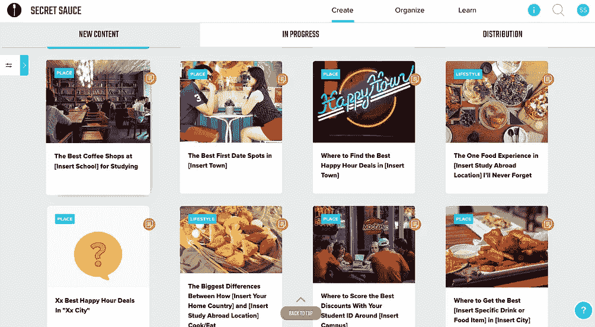

# 在 React 中构建一个组件化的可重用的“滚动到顶部”特性

> 原文：<https://levelup.gitconnected.com/building-a-componentized-and-reusable-scroll-to-top-feature-in-react-7fa5ac8d4c2d>


好的，所以我手头的任务是创建一个滚动到顶部的功能，让用户体验如下:

*   一旦过滤器滚动到看不见的地方，就会出现一个灰色的“返回顶部”按钮。
*   悬停在按钮上时，它应该会摆动并变黑。
*   点击按钮后，页面应该回到顶部，按钮会消失。

上下你会看到这个功能的可视化实现。



无按钮时滚动到顶部(左)，有按钮时向下滚动到“滚动到顶部”(右)

创建这个组件的一个主要考虑是，我需要它在站点的多个页面上可重用，所以我的目标是创建一些可以在其他 react 组件中导入和使用的内容，以便添加到一个包含需要滚动的内容的 div。

在考虑这种逻辑时，最好有一个元素来呈现一个可滚动的 div，该 div 呈现组件的子组件，并有一个可滚动 div 的兄弟元素，即“滚动到顶部”按钮。组件本身知道滚动 div 的滚动高度，按钮可以控制它。

结构的伪代码示例:

```
<ScrollToTopContainer> 
  <ScrollToTopButton />
  <ScrollableDiv>
    {this.props.children}
  </ScrollableDiv>
</ScrollToTopContainer>
```

现在我们有了基本结构的概念，让我们看看一些技术部分是如何工作的。

我发现如果我引用了可滚动的 div，就可以访问元素的 scrollTop 属性。为了引用 div，我需要添加一个 ref。为此，我创建了一个引用函数:

```
reference = id => ref => { this[id] = ref  }
```

这将在滚动包装上使用，如:

```
<ScrollingWrapperContainer ref={this.reference('scrollingWrapper')}>
```

这将允许我通过调用组件类中的`this.scrollingWrapper.scrollTop`来检查或设置滚动 div 的 scrollTop 值。

给定该功能，我现在可以有一个事件监听器，它可以检查滚动高度的变化，如果它超过 100(与我们的用例相关的距离——通过过滤器),那么它将更新组件的状态，这将是决定按钮显示的布尔值。我是这样实现的:

```
state = { hasScrolled: false } componentDidMount() {  
  this.scrollingWrapper.addEventListener('scroll', this.onScroll)
}onScroll = () => {
  if (this.scrollingWrapper.scrollTop > 100 &&     
                             !this.state.hasScrolled) {      
    this.setState({ hasScrolled: true })    
  } else if (this.scrollingWrapper.scrollTop < 100 && 
                             this.state.hasScrolled) {      
    this.setState({ hasScrolled: false })    
  }  
}
```

所以现在，一旦我滚动通过了值 100，那么我的按钮应该会出现。现在我需要处理那个按钮的点击，以实际上滚动回顶部！技术上来说，我想把 scrollTop 设回零。为此，我将 onClick 事件处理程序设置为下面的函数:

```
scrollToTop = () => this.scrollingWrapper.scrollTop = 0
```

现在重要的部分，现在很容易做到…我们的组件的实现！

1.  将其导入到要使用它的组件文件中。

```
import ScrollingWrapper from './scrollingWrapper.jsx
```

2.在组件的 render 函数中包装要滚动的内容。

```
render() {
  return(
    <ScrollingWrapper>
      <MyContentThatNeedsToScroll>
    </ScrollingWrapper>
  )
}
```

就是这样！

下面你可以找到整个组件放在一起。我还使用 styled-components 直接在我的 jsx 文件中编写一些 css，这进一步使这个组件在整个项目中独立于其他组件和样式。

希望这对你今天的编码之旅有所帮助！

[](https://levelup.gitconnected.com)[](https://gitconnected.com/learn/react) [## 学习 React -最佳 React 教程(2019) | gitconnected

### 排名前 49 的 React 教程-免费学习 React。课程由开发人员提交并投票，使您能够…

gitconnected.com](https://gitconnected.com/learn/react)