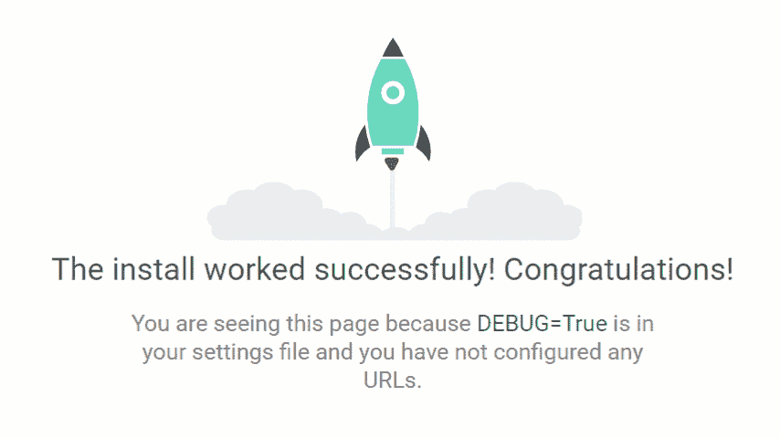
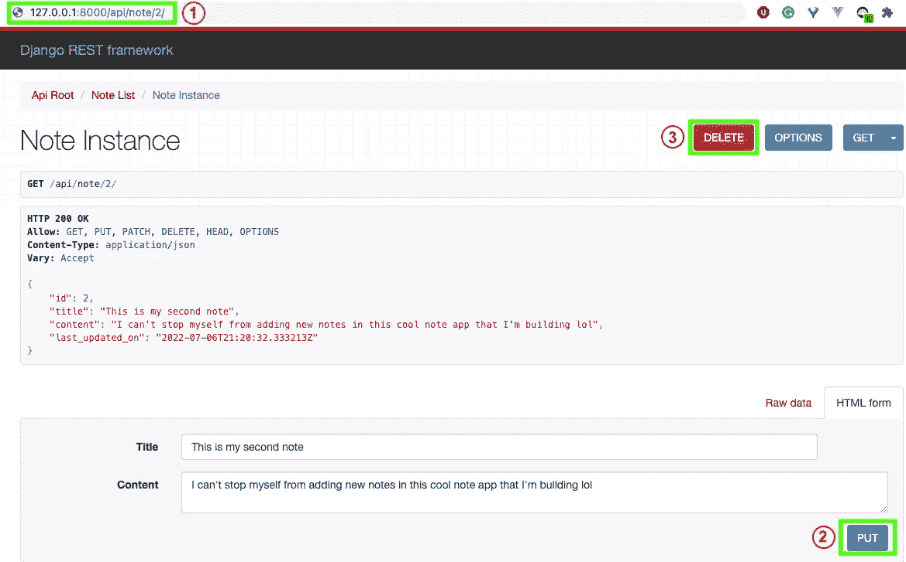
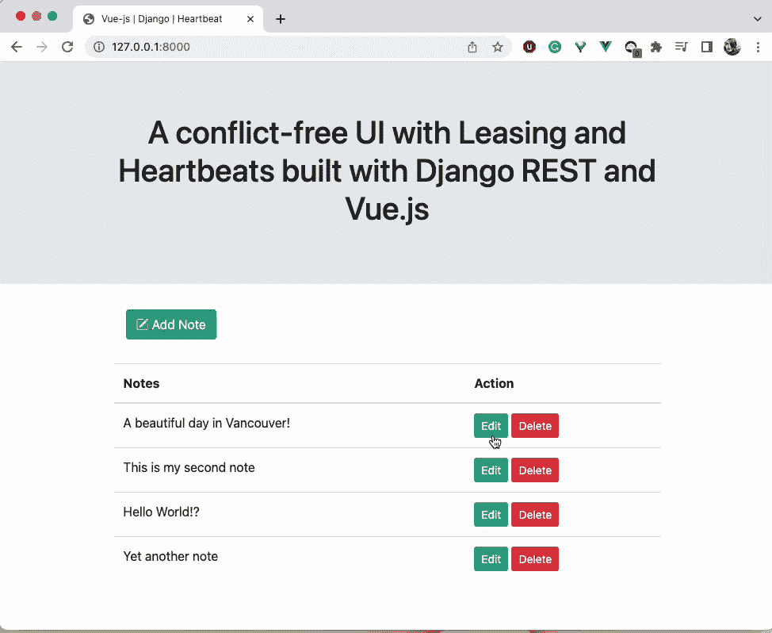
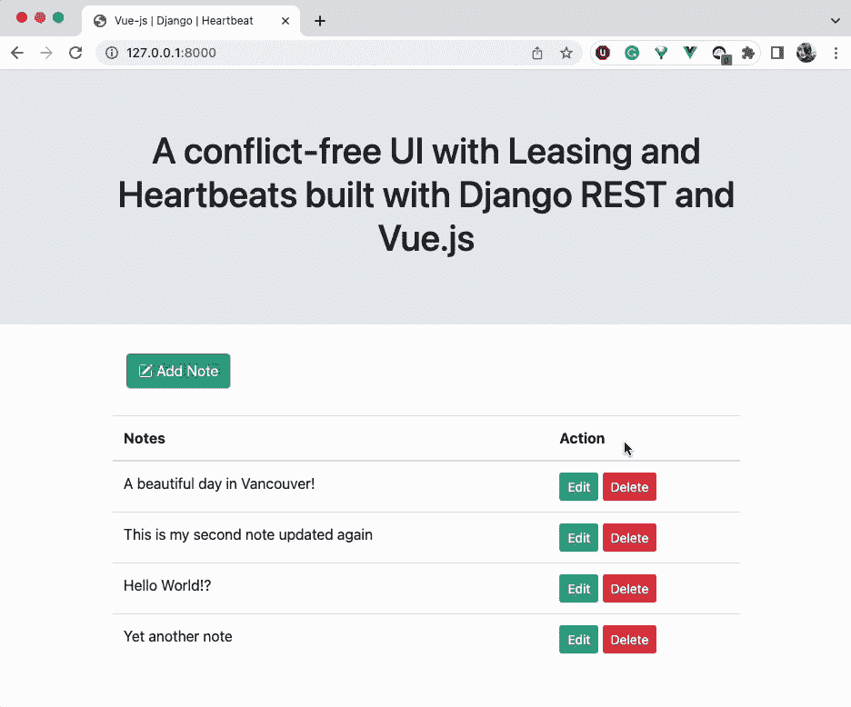

# 使用 Django REST 和 Vue.js 构建带有租赁和心跳的无冲突 UI

> 原文：<https://levelup.gitconnected.com/building-a-conflict-free-ui-with-leasing-and-heartbeat-using-django-rest-and-vue-js-e7027c37e688>

关于如何实现无冲突 UI 的概念证明(POC)


DALL-E 生成的图像

# 背景

设想一个系统，其中有许多用户需要编辑队列中的几个表单。还可以想象这些表单有多个冗长的部分。可能会出现多个用户开始编辑同一个表单并填写大量字段的情况。当他们点击 save 时，其中一个人会得到一个错误消息，说有一个“过时的异常”,因为表单已经被其他人编辑过了。或者更糟的是，用户的一个更改丢失了，用户甚至没有得到一个异常。所以用户的所有工作都白费了。这是不理想的，因为事倍功半，所以我们想找到解决这个问题的方法。

这种冗长表格的一个真实例子是政府机构可能有的申请批准表格。这些文档通常会分配给多个需要审查外部应用程序并向应用程序添加更多元数据的应用程序评估员。

# 解决办法

这个问题的一个很好的解决方案是使用“带心跳的租赁”算法，这种算法通常用在分布式系统中，用于维护对任何给定实体的锁定。使用这种算法的分布式系统的一个例子是 Google 文件系统(GFS) [paper](https://static.googleusercontent.com/media/research.google.com/en//archive/gfs-sosp2003.pdf) 。

其思想是，更新文档的用户也将保持该文档的锁，并将定期向服务器发送心跳消息以延长该锁。这样，只要用户的页面保持打开，用户就可以保持锁定状态，并可以继续更新文档。如果在配置的超时期限内没有心跳发送到服务器，服务器不会延长租期，因此锁将自动过期。那么下一个用户可以获得锁。

> 如果用户“Alice”正在编辑文档“A ”,那么数据库将有一个条目，文档“A”被锁定直到某个时间段。
> 如果用户“鲍勃”在锁定未过期的情况下打开页面，“鲍勃”甚至不被允许开始编辑表单，他将看到一条消息，表明表单已被锁定。如果“Alice”关闭了她的网页，那么一段时间后锁定被释放，因此“Bob”可以在以后需要时开始处理该文档。

这解决了浪费用户精力的问题，因为我们先发制人地用一个明确的信息告诉用户这个页面正被其他人编辑。我们的 clear 消息还可以包含正在编辑页面的其他用户的姓名，以及页面被锁定为扩展的时间。

下面，我们将深入探讨如何实现这一概念验证的技术细节。我们使用一个示例项目，用户可以在其中添加/编辑/创建注释。

概念验证的代码可以在 GitHub 的资源库中找到，可以在[这个链接](https://github.com/fatse/django-vuejs-heartbeat)中找到。

**使用的技术:**

> [Python 3.10](https://www.python.org/downloads/)
> [Django 4.0](https://docs.djangoproject.com/en/4.0/intro/install/) [vue . js 2 . 7 . 0](https://v2.vuejs.org/v2/guide/installation.html)
> Django REST 框架 (DRF)

*注意:本文假设你已经了解了 Django 和 DRF 的基础知识。*

我们将按照以下步骤创建 Notes web 应用程序:

1.  [建立 Django 项目](#594e)
2.  [创建数据库模型](#a1eb)
3.  [创建 CRUD API](#3867)
4.  [创建心跳 API](#8359)

> 对于只对使用 heartbeat 实现租赁感兴趣的读者，请阅读第 [4 节。创建心跳 API](#8359) 。

# 1.建立 Django 项目

在这一步，我们将构建一个基本的 Django 应用程序。当开始一个 Django 项目时，会涉及到一些样板代码，所以我将使用下面的 [shell 脚本](https://github.com/fatse/django-vuejs-heartbeat/blob/main/django_boilerplate.sh)包含建立一个 Django 项目的所有样板步骤。

*请注意，您可以按照相同的顺序在终端上运行这些命令。*

此时，我们的基本 Django 项目应该已经启动并运行，当您在浏览器中打开`[http://127.0.0.1:8000/](http://127.0.0.1:8000/)`并看到火箭时，一切都很好:



成功创建新应用程序后，我们必须将其添加到 **settings.py** 文件中的 **INSTALLED_APPS** 中。

*注:*我们还得在 INSTALLED_APPS 中添加***‘rest _ framework’**。因此，此时 INSTALLED_APPS 列表将如下所示:*

```
*INSTALLED_APPS = [
    'django.contrib.admin',
    'django.contrib.auth',
    'django.contrib.contenttypes',
    'django.contrib.sessions',
    'django.contrib.messages',
    'django.contrib.staticfiles',    

 **'rest_framework',
    'notes_app',**
]*
```

*项目树应该是这样的:*

```
*django-vuejs-heartbeat
├── notes_app
│   ├── __init__.py
│   ├── admin.py
│   ├── apps.py
│   ├── migrations
│   │   └── __init__.py
│   ├── models.py
│   ├── tests.py
│   └── views.py
├── manage.py
├── notes_heartbeat_project
│   ├── __init__.py
│   ├── asgi.py
│   ├── settings.py
│   ├── urls.py
│   └── wsgi.py
└── env*
```

# *2.创建数据库模型*

*我们需要创建一个名为 Note 的模型*

```
*from django.db import models

class Note(models.Model):
    title = models.CharField(max_length=255, blank=True, null=True)
    content = models.TextField(blank=True, null=True)
    last_updated_on = models.DateTimeField(auto_now=True)

    def __str__(self):
        return self.title*
```

*创建一个名为 serializers.py 的新 python 文件，并添加序列化模型*

```
*from rest_framework import serializers

from notes_heartbeat.notes_app.models import Note

class NoteSerializer(serializers.ModelSerializer):
    class Meta:
        model = Note
        fields = ('id', 'title', 'content', 'last_updated_on',)*
```

*运行迁移以在数据库中创建新的注释模型*

```
*python manage.py makemigrations
python manage.py migrate*
```

*如果您在运行以上命令后看到类似这样的内容，您就知道迁移成功运行了:*

```
*~django-vuejs-heartbeat/notes_heartbeat_project ❯ **python manage.py makemigrations**                                                                                                      
Migrations for 'notes_app':
  notes_app/migrations/0001_initial.py
    - **Create model Note**~/django-vuejs-heartbeat/notes_heartbeat_project ❯ **python manage.py migrate**                                                                                                             
Operations to perform:
  Apply all migrations: admin, auth, contenttypes, notes_app, sessions
Running migrations:
  **Applying notes_app.0001_initial... OK***
```

# *3.创建 CRUD APIs*

*现在让我们创建 API 来创建新的注释、编辑注释、删除注释或查看注释。*

```
*from rest_framework.viewsets import ModelViewSet

from .models import Note
from .serializers import NoteSerializer

class NoteViewSet(ModelViewSet):
    queryset = Note.objects.all()
    serializer_class = NoteSerializer*
```

*如您所见，我们只编写了几行代码，并且创建了基本的创建、检索、更新和删除 API。姜戈太棒了！！！为了访问这些 API，我们必须将路由器添加到 URL 中。我们可以如下图所示。*

> **在* ***下新建一个文件****routers . py****并添加下面的代码。****

```
*from rest_framework import routers

from notes_app.views import NoteViewSet

router = routers.DefaultRouter()
router.register(r'note', NoteViewSet, basename='note')*
```

> **在****notes _ app****文件夹下新建一个****URLs . py****文件，并将新建的路由器添加到其中。**

```
*from django.urls import path, include

from notes_heartbeat_project.routers import router

urlpatterns = [
    path('api/', include(router.urls)),
]*
```

> **将****notes _ app****的网址追加到****notes _ heart beat _ project****文件夹下的****URLs . py****中。**
> 
> **里面的代码****notes _ heart beat _ project/URLs . py****现在看起来是这样的:**

```
*from django.contrib import admin
from django.urls import path, include

urlpatterns = [
    path('admin/', admin.site.urls),
    path('', include('notes_app.urls'))
]*
```

*至此，我们已经准备好使用可浏览的 DRF API 测试我们的 API。这些是我们的 API:*

*   *GET:[http://127 . 0 . 0 . 1:8000/API/note/](http://127.0.0.1:8090/api/note/)*
*   *POST:[http://127 . 0 . 0 . 1:8000/API/note/](http://127.0.0.1:8090/api/note/)*
*   *放:[http://127 . 0 . 0 . 1:8000/API/note/](http://127.0.0.1:8090/api/note/){ note _ id }/*
*   *删除:[http://127 . 0 . 0 . 1:8000/API/note/](http://127.0.0.1:8090/api/note/){ note _ id }/*

*您可以使用新创建的 API 链接添加、更新或删除新的注释。例如，如果您想要更新或删除一个现有的注释，您可以使用 Django REST 可浏览 API 来完成，如下图所示:*

**

*用于上传/删除方法的 DRF 可浏览 API*

*从上面的截图来看:*

***1 →** 显示了允许我们访问 id=2 的注释的上传/删除方法 API 的 URL:[http://127 . 0 . 0 . 1:8000/API/note/2/](http://127.0.0.1:8000/api/note/2/)
**2→**使用上传按钮，我们可以更新 id=2 的注释
**3 →** 使用删除按钮，我们可以删除注释*

# *3.1 前端代码*

*让我们为到目前为止已经构建好的后端添加 UI 并使用它。
Notes 应用的前端部分我会用 Vue.js。现在我们已经有了可以工作的 API，我们将添加 Django 模板，以便于我们添加新的注释或者编辑/删除它们。*

*下面是 **notes_app/views.py** 中“笔记更新”视图的代码:*

```
*class NoteUpdateView(UpdateView):
    template_name = 'notes_app/note_edit.html'
    model = Note
    fields = ['title', 'content']*
```

*并将网址添加到 **notes_app/urls.py** ，网址现在如下所示:*

```
*urlpatterns = [
    path('', TemplateView.as_view(template_name='notes_app/notes.html')),
    path('api/', include(router.urls)),
    path('note/<int:pk>/update/', NoteUpdateView.as_view(), name='note_update'),
]*
```

*我们现在将添加 Vue.js 部分，在这里我们将创建使用 UI 执行 CRUD 操作所需的函数。我们获取所有注释并用所有注释填充登录页面的代码如下所示:*

***3.1.1** **用 Django 配置 vue . js***

*用我们的项目配置 Vue.js 最简单的方法是将 Vue.js 的 CDN 添加到 notes _ app/templates/notes _ app/index . html 中。*

```
*<script src="https://cdn.jsdelivr.net/npm/vue@2.7.0/dist/vue.js"></script>*
```

**index.html 的完整代码可以在* [*这里*](https://github.com/fatse/django-vuejs-heartbeat/blob/main/notes_heartbeat_project/notes_app/templates/notes_app/index.html) *找到。**

***3.1.2 添加 Vue 实例以使用 Django***

***3.1.3 为更新注释 API 添加 Vue.js 功能***

```
*BASE_URL = 'http://127.0.0.1:8090/'
BACKEND_PATH = 'api/note/'
new Vue({
    el: '#note_edit',
    delimiters: ['[[', ']]'],
    data: {
        **current_note**: *note_obj*,
        message: false,
    },
    methods: {
        **updateNote**: function () {
            this.loading = true;
            **this.$http.put(`${BASE_URL + BACKEND_PATH + this.current_note.id}/`, this.current_note)
                .then((response) => {
                    this.current_note = response.data;
                    this.message = true;
                })
                .catch((err) => {
                    this.message = false;
                    *console*.log(err);
                })**
        },
        closeWindow: function () {
            *window*.close()
        }
    },
});*
```

***3.1.4 添加 Django 模板以在登录页面显示注释列表。***

***3.1.5 添加模板更新单数备注。***

*在 notes_app/templates/notes_app 文件夹下添加这个 **note_edit.html** 模板。*

```
*


    <div id="note_edit">
 ****
    </div>



    
    <script>
        let ***note_obj*** = {
            id: '**{{ object.id }}**',
            title: '**{{ object.title|escapejs }}**',
            content: '**{{ object.content|escapejs }}**'
        };
    </script>
    **<script src=""></script>**
*
```

*在 partials 文件夹中添加*编辑 partial* :
，即 notes _ app/templates/notes _ app/**partials**添加**edit.html**partial，代码为:*

```
*<div v-if="message">
    <div class="container">
        <div class="alert alert-success alert-dismissable" role="alert">
            <button type="button" class="close" data-dismiss="alert" aria-label="Close">
                <span aria-hidden="true">&times;</span>
            </button>
            Note updated successfully.
        </div>
    </div>
</div>


<form **v-on:submit.prevent="updateNote()"**>
    <div class="modal-body">
        <div class="form-group">
            <label for="note_title">Title</label>
            <input
                    type="text"
                    class="form-control"
                    id="note_title"
                    placeholder="Enter Note Title"
                    **v-model="current_note.title"**
                    required="required">
        </div>
        <div class="form-group">
            <label for="note_content">Content</label>
            <textarea
                    class="form-control"
                    id="note_content"
                    placeholder="Enter Note Content"
                    **v-model="current_note.content"**
                    required="required"
                    rows="3"></textarea>
        </div>
    </div>
    <div class="modal-footer">
        <button type="button" class="btn btn-secondary m-progress" @click="closeWindow()">
            Close
        </button>
        <button type="submit" class="btn btn-primary">Save changes</button>
    </div>
</form>*
```

*现在我们已经添加了使用 UI 添加/编辑/删除注释所需的所有功能，我们的应用程序如下面的屏幕截图所示。*

**

*编辑注释—冲突的用户界面*

*上述场景中发生了什么？*

> *1.登录页面显示笔记列表*
> 
> *2.用户 1 打开 note_id=1 并编辑它*
> 
> *3.User2 也打开 note_id=1 并编辑它*
> 
> *4.用户 1 不知道用户 2 的动作，因此认为他们有 note_id=1 的更新版本*
> 
> *5.用户 2 也不知道用户 1 正在更新 note_id=1*
> 
> *6.用户 1 和用户 2 提交表单并保存更改*
> 
> *7.数据库保存 note_1=1 的最后更新版本*
> 
> *8.用户 1 的更改已丢失或用户 2 的更改已丢失，这取决于哪个数据库保存操作先成功。*

> *“心跳租赁”来拯救。*

# *4.创建心跳 API*

*在本节中，我们将创建心跳 API 并修复上述问题。*

***4.1 将“last_updated_on”字段添加到笔记模型***

*现在我们在 **notes_app/models.py** 中的模型看起来如下:*

***4.2 向序列化添加字段***

*我们还必须更新注释模型的序列化，并向其中添加新的字段。**notes _ app/serializer . py**中更新后的序列化器类如下:*

```
*from rest_framework import serializers

from .models import Note

class NoteSerializer(serializers.ModelSerializer):
    class Meta:
        model = Note
        fields = ('id', 'title', 'content', 'last_updated_on', '**locked_at**', '**is_locked**',)*
```

***4.3 向视图添加心跳 API***

*这是我们在 **notes_app/view.py** 中的心跳 API:*

```
*class LockNoteAPI(APIView):
    def post(self, request, **kwargs):
        note = get_object_or_404(Note, id=self.kwargs['pk'])
        note.lock()
        return HttpResponse(status=status.HTTP_200_OK)*
```

*我们还想在 UI 中添加一些消息，让用户知道有人正在编辑这个便笺，他们必须等到便笺被解锁。更新后的 **notes_app/view.py** 现在看起来是这样的:*

*心跳 API*

***4.4 向 URL 添加心跳 API***

*现在让我们也更新一下 **notes_app/urls.py** 以反映新的变化。*

```
*from django.urls import path, include
from django.views.generic import TemplateView

from notes_heartbeat_project.routers import router

from .views import NoteUpdateView, LockNoteAPI

urlpatterns = [
    path('', TemplateView.as_view(template_name='notes_app/notes.html')),
    path('api/', include(router.urls)),
 **path('api/note/lock-note/<int:pk>/', LockNoteAPI.as_view()),**    path('note/<int:pk>/update/', NoteUpdateView.as_view(), name='note_update'),

]*
```

***4.5 添加前端更改以将此功能落实到位***

*我们将在**notes _ app/js/note _ edit . js**中添加负责延长锁 60 秒的方法 **"lockNoteHeartbeat"** 。我们将使用 JavaScript 的 **setInterval()** 方法在 **mounted()** 钩子中定期调用这个方法。*

***4.6 添加视图模板***

*我们需要添加一个 view.html 部分，不允许用户编辑别人正在编辑的笔记。*

*这是我们的**notes _ app/templates/notes _ app/partials/view . py***

```
*<div id="note_view">
    <div class="modal-body">
        <div class="form-group">
            <label for="note_title">Title</label>
            <input
                    type="text"
                    class="form-control"
                    id="note_title"
 **value="{{ object.title }}"**                    required="required"
                    **readonly**>
        </div>
        <div class="form-group">
            <label for="note_content">Content</label>
            <textarea
                    class="form-control"
                    id="note_content"
                    required="required"
                    rows="3"
                    **readonly>{{ object.content }}**</textarea>
        </div>
    </div>
    <div class="modal-footer">
        <button type="button" class="btn btn-secondary m-progress" onclick="window.close()">
            Close
        </button>
    </div>
</div>*
```

*最终版本的 **note_edit.html** 现在看起来如下:*

***4.7 运行迁移***

*现在剩下的就是再次运行迁移，以反映对注释模型所做的更改，并将新字段**‘locked _ at’**添加到数据库的注释表中。*

```
*~/django-vuejs-heartbeat/notes_heartbeat_project ❯ **python manage.py makemigrations**                                                                                         
Migrations for 'notes_app':
  notes_app/migrations/0002_note_locked_at.py
    **- Add field locked_at to note**
~/Desktop/django-vuejs-heartbeat/notes_heartbeat_project ❯ **python manage.py migrate**                                                                                                             
Operations to perform:
  Apply all migrations: admin, auth, contenttypes, notes_app, sessions
Running migrations:
 **Applying notes_app.0002_note_locked_at... OK***
```

*现在，我们的示例如下所示:*

**

*无冲突用户界面*

*从上面的例子中我们可以看到，我们已经解决了多个用户编辑笔记的突出问题。*

> *1.登录页面显示笔记列表*
> 
> *2.用户 1 打开 note_id=1 并成功编辑它，因为 note_id=1 未被锁定*
> 
> *3.用户 1 将锁延长 60 秒*
> 
> *4.用户 2 也打开 note_id=1*
> 
> *5.用户 2 被重定向到注释的只读版本*
> 
> *6.用户 2 看到消息说“此便笺正被其他人更新。请稍后再试！”*
> 
> *7.数据库保存用户 1 的 note_1=1 的更新版本*
> 
> *8.用户 1 的更改已保存*

# *结论*

*在本教程中，我们展示了如何使用 heartbeat with lease 机制来确保多个用户的无冲突编辑体验。我希望你觉得这个教程有用，我很乐意在评论中听到你的反馈！*

# ****参考文献及资源:****

 *[## Home - Django REST 框架

### Django REST 框架是一个用于构建 Web APIs 的强大而灵活的工具包。您可能想使用 REST 的一些原因…

www.django-rest-framework.org](https://www.django-rest-framework.org/)* *[](https://vuejs.org/) [## Vue.js -渐进式 JavaScript 框架| Vue.js

### 一个可接近的，高性能的和通用的框架，用于构建 web 用户界面。建立在标准 HTML 之上…

vuejs.org](https://vuejs.org/) 

[https://static . Google user content . com/media/research . Google . com/en//archive/GFS-sosp 2003 . pdf](https://static.googleusercontent.com/media/research.google.com/en//archive/gfs-sosp2003.pdf)* 

# *分级编码*

```
*Thanks for being a part of our community! More content in the [Level Up Coding publication](https://levelup.gitconnected.com/).
Follow: [Twitter](https://twitter.com/gitconnected), [LinkedIn](https://www.linkedin.com/company/gitconnected), [Newsletter](https://newsletter.levelup.dev/)Level Up is transforming tech recruiting👉[**Join our talent collective**](https://jobs.levelup.dev/talent/welcome?referral=true)*
```