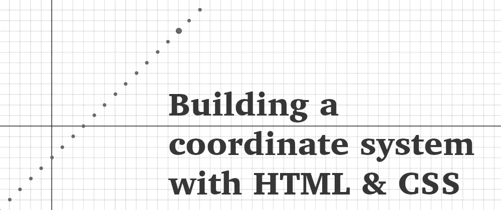
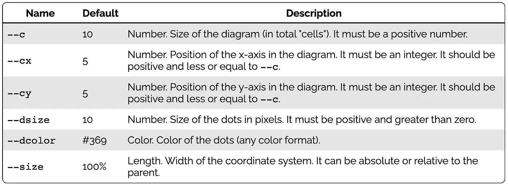
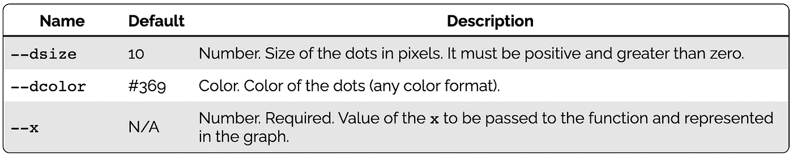

# 用 HTML 和 CSS 构建坐标系统

> 原文：<https://levelup.gitconnected.com/building-a-coordinate-system-with-html-and-css-c20283d50bd0>

## 35 行 CSS 和每个点的 HTML 元素足以构建一个简单的(但可定制的)笛卡尔系统。



我开发了一个动态的[笛卡尔坐标系](https://en.wikipedia.org/wiki/Cartesian_coordinate_system)。可能有点基础，但是我觉得很有意思，因为你可以插上很多不同的功能，正确显示积分。同时具有一些有趣的特性:

*   **可定制**:选择颜色、大小、范围、系统中心等。
*   **响应式**:默认为父宽度的 100%，但可以有相对/绝对尺寸。
*   **易于使用**:将函数直接翻译成 CSS。
*   **轻量级** : 35 行 CSS，每个要显示的点一行 HTML。没有 JavaScript。

是的，你没看错:它不使用 JavaScript 来做函数计算。而是都在 CSS 中用`[calc()](https://developer.mozilla.org/en-US/docs/Web/CSS/calc())` [方法](https://developer.mozilla.org/en-US/docs/Web/CSS/calc())。

# 介绍

九月的一个周末——是的，从那时起我就写了这篇文章，但从未发表过——我很早就醒了，趁着屋子里其他人都还在睡觉，我决定玩玩 HTML 和 CSS。在 Twitter 上，我发现了 Lea Verou 的这条推文:

她使用`calc()`生成一个线性函数的值范围。这是一个有趣的方法，使用了`calc()`和自定义属性(我也见过 [Ana Tudor](https://twitter.com/anatudor) 和 [Temani Afif](https://twitter.com/ChallengesCss) 等人这样做)。我也想尝试这样的东西。也许可以用二次函数来举例。然后一件事导致另一件事，演示开始增长。

首先，我只用 HTML 和 CSS 构建了一个带有二次函数的笛卡尔系统的基本图形。所有的值都是硬编码的，所以太具体了。然后，我试图让它越来越通用，以匹配尽可能多的函数:线性、二次、三次等。，而且成功了。它很好地适应了新的操作。这也不是一个复杂的演示。

# 代码

笛卡尔系统的全部代码适合不到 40 行 CSS 代码！这还考虑到了 [CSS 自定义属性](https://developer.mozilla.org/en-US/docs/Web/CSS/--*)的使用，这使得整个事情有点冗长(但更具可定制性，所以这是一个交换的情况。)

下面是 CSS 代码:

```
.css-ccs {
  --c: 10;
  --cx: 5;
  --cy: 5;
  --dsize: 10;
  --dcolor: #369;
  --size: 100%;
  position: relative;
  width: var(--size);
  height: 0;
  padding-top: var(--size);
  box-sizing: border-box;
  aspect-ratio: 1/1;
  background-image:
    linear-gradient(#0000 calc(var(--cy) * 100% / var(--c) - 1px), #0008 0 calc(var(--cy) * 100% / var(--c) + 1px), transparent 0),
    linear-gradient(to right, #0000 calc(var(--cx) * 100% / var(--c) - 1px), #0008 0 calc(var(--cx) * 100% / var(--c) + 1px), transparent 0),
    repeating-linear-gradient(#0002 0 0.5px, #0000 0 calc(100% / var(--c) - 0.5px), #0002 0 calc(100% / var(--c))),
    repeating-linear-gradient(to right, #0002 0 0.5px, #0000 0 calc(100% / var(--c) - 0.5px), #0002 0 calc(100% / var(--c)));
}

.css-ccs.no-overflow {
  overflow: hidden;
}

.css-css .dot {
  --translationUnit: 100% / var(--c);
  --translationX: var(--translationUnit) * var(--cx);
  --translationY: var(--translationUnit) * var(--cy);
  /* Vertical is "flipped" in CSS: higher values go down! Do negative! */
  --y: calc(var(--translationY) - var(--translationUnit) * var(--function));
  width: calc(var(--dsize) * 1px);
  height: calc(var(--dsize) * 1px);
  background: var(--dcolor);
  border-radius: 50%;
  position: absolute;
  transform: translate(-50%, -50%);
  left: calc(var(--translationX) + var(--x) * var(--translationUnit));
  top: var(--y);
}
```

该`.css-ccs`代码将生成轴和指导方针，而`.dot`将为以后的功能做准备。

至于 HTML，我们将需要一个具有类`css-ccs` (CSS 笛卡尔坐标系)的元素，它将包含类`dot`的其他元素，这些元素将设置`style`中的`x`值。大概是这样的:

```
<div class="css-ccs">
  <div class="dot" style="--x: -3;"></div>
  <div class="dot" style="--x: 0;"></div>
  <div class="dot" style="--x: 1;"></div>
  <div class="dot" style="--x: 2;"></div>
  <!-- ... -->
</div>
```

理想情况下，我会喜欢这样的东西:

```
<figure>
  <figcaption>Graph Title</figcaption>
  <output data-x="-3"></output>
  <output data-x="0"></output>
  <output data-x="1"></output>
  <output data-x="2"></output>
</figure>
```

虽然我最终会改变标签，但并不是所有的改变都是可能的。`data-x`是指示`x`值的最佳方式:一段数据的数据属性，而不是“样式变量”不幸的是，CSS 目前不支持读取数据属性并将值传递给自定义属性。所以现在自定义属性就可以了。

最后，我们需要*插入*这个函数到图表中。它适用于`.dot`类，并且(有点)简单:我们将在带有`calc()`的点中定义一个`--function`自定义属性。就是这样。

有什么问题吗？CSS 没有幂([或许多其他类型的运算)](https://drafts.csswg.org/css-values/#calc-func)，所以要做类似 x 的事情，我们需要将 x 乘以 x (x*x)。我们在`--x`自定义属性中有 x，所以我们需要这样做:

```
.my-chart .dot {
  /**
   * x^2 = x * x = var(--x) * var(--x)
   */
  --function: calc(var(--x) * var(--x));
}
```

有点冗长，但仍然简单，不太难读。

# 变量

我们可以自定义图表，将一些 CSS 变量传递给图表本身(容器)并单独传递给每个点。

这些是容器的变量:



由于 CSS 级联，我们可以为每个点单独重新定义其中的一些值。此外，我们必须传递点的 x 值:



# 示例和演示

这里有一些用 CSS 使用这种方法绘制图表的例子:

## 线性函数:x-3

```
#axis_x-3 .dot {
  /**
   * f(x) = x - 3
   *        x = var(--x)
   */
  --function: calc(var(--x) - 3);
}
```

## 二次函数:x - 5

```
#axis_x2-5 .dot {
  /**
   * f(x) = x^2 - 5
   *        x^2 = var(--x) * var(--x)
   */
  --function: calc(var(--x) * var(--x) - 5);
}
```

## 三次函数:0.4x - 5.25x — 4

```
#axis_04x3_525x_4 .dot {
  /**
   * f(x) = 0.4x^3 - 5.25x - 4
   *        0.4x^3 = var(--x) * var(--x) * var(--x)
   *         5.25x = 5.25 * var(--x)
   */
  --function: calc(0.4 * var(--x) * var(--x) * var(--x) - 5.25 * var(--x) - 4);
}
```

## 平方倒数函数:1 / x

```
#axis_1_x2 .dot {
  /**
   * f(x) = 1 / x^2
   *        x^2 = var(--x) * var(--x)
   */
  --function: calc(1 / (var(--x) * var(--x)));
}
```

# 易接近

这些图表可能看起来不错，但是它们提出了一些可访问性的挑战。整个图表都是空的，我们应该*至少*加一个`[aria-label](https://developer.mozilla.org/en-US/docs/Web/Accessibility/ARIA/ARIA_Techniques/Using_the_aria-label_attribute)` [带内容描述](https://developer.mozilla.org/en-US/docs/Web/Accessibility/ARIA/ARIA_Techniques/Using_the_aria-label_attribute)。还有，角色也不错。添加一个“img”或“figure”的`role`将有助于向辅助技术正确地宣告该图。

```
<div class="css-ccs" 
     role="img" 
     aria-label="Cartesian coordinate system representing the function ... with points at ...">
  <!-- ... -->
</div>
```

更好的是，我们可以使用`[<figure>](https://developer.mozilla.org/en-US/docs/Web/HTML/Element/figure)` [/](https://developer.mozilla.org/en-US/docs/Web/HTML/Element/figure) `[<figcaption>](https://developer.mozilla.org/en-US/docs/Web/HTML/Element/figure)` [标签](https://developer.mozilla.org/en-US/docs/Web/HTML/Element/figure)。但是，我们需要做一些 CSS 体操，因为背景将占用 100%的容器，可能会发生一些重叠。

至于数据点，现在，它们是`<div>`，但是更多的语义标签将更好地描述这些元素是什么。(例如`[<output>](https://developer.mozilla.org/en-US/docs/Web/HTML/Element/output)`、`[<data>](https://developer.mozilla.org/en-US/docs/Web/HTML/Element/data)`或`[<samp>](https://developer.mozilla.org/en-US/docs/Web/HTML/Element/samp)`。)

除此之外，这些点没有任何信息，如果有一些关于悬停/聚焦的数据就好了。如果/当我们这样做时，我们将需要考虑两种状态的可访问性，因此对于辅助技术用户来说有很好的替代方案。

# 下一步是什么？

虽然 CSS 运行良好，是一个很好的实验，但它缺少许多关键特性。其中一些可以用 HTML 和 CSS 添加或模拟，但另一些需要 JavaScript。尽管如此，我们的小坐标系统是轻量级和简单的。

CSS 的局限性也限制了图形。CSS 数学函数列表越来越多(`min`、`max`、`clamp`等)。)，我们可以模拟一些常见的操作([，正如 Ana Tudor 在她的文章](https://css-tricks.com/using-absolute-value-sign-rounding-and-modulo-in-css-today/)中所示，但仍然有许多数学计算不能只用 CSS 来完成，这将限制我们。

可能不需要构建成一个库，但是它对绘制小例子很有帮助，并且不需要很大的外部库(我将使用 40 行 CSS 和 100KB 的 JS 包)。此外，开发和计算也很有趣。

*原载于 2021 年 12 月 1 日*[*https://alvaromontoro.com*](https://alvaromontoro.com/blog/67993/building-a-coordinate-system-with-html-and-css)*。*