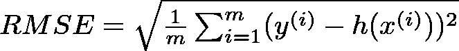

# 用 Python 从零开始构建决策树|从零开始机器学习(第三部分)

> 原文：<https://levelup.gitconnected.com/building-a-decision-tree-from-scratch-in-python-machine-learning-from-scratch-part-ii-6e2e56265b19>

## 利用决策树建立更好的房价预测模型

> TL；DR 使用 Python 从头开始构建决策树回归模型。将您的模型与 Scikit-learn 模型的性能进行比较。决策树用于预测房屋销售价格，并将结果发送给 Kaggle。

## 从零开始的机器学习系列:

1.  [采用逻辑回归的智能折扣](https://towardsdatascience.com/smart-discounts-with-logistic-regression-machine-learning-from-scratch-part-i-3c242f4ded0)
2.  [用线性回归预测房价](https://medium.com/@curiousily/predicting-house-prices-with-linear-regression-machine-learning-from-scratch-part-ii-47a0238aeac1)
3.  **用 Python 从头开始构建决策树**
4.  [利用 K 均值聚类进行调色板提取](https://medium.com/@curiousily/color-palette-extraction-with-k-means-clustering-machine-learning-from-scratch-part-iv-55e807407e53)
5.  [基于朴素贝叶斯的电影评论情感分析](https://medium.com/@curiousily/movie-review-sentiment-analysis-with-naive-bayes-machine-learning-from-scratch-part-v-7bb869391bab)
6.  [使用随机梯度下降的音乐艺术家推荐系统](https://medium.com/@curiousily/music-artist-recommender-system-using-stochastic-gradient-descent-machine-learning-from-scratch-5f2f1aae972c)
7.  [利用神经网络进行时尚产品图像分类](https://medium.com/@curiousily/fashion-product-image-classification-using-neural-networks-machine-learning-from-scratch-part-e9fda9e47661)
8.  [使用强化学习在后启示录世界中构建一个出租车驾驶代理](https://medium.com/@curiousily/build-a-taxi-driving-agent-in-a-post-apocalyptic-world-using-reinforcement-learning-machine-175b1edd8f69)

对不起，你可能会失眠。在内心深处，你知道你的线性回归模型不会削减它。住房市场的主导地位还在进一步发展。

我们能改进它吗？我们能有一个能做出更好预测的模型吗？

***完整源代码笔记本*** (谷歌合作实验室):

 [## 维尼林·瓦尔科夫正在创建机器学习教程

### 大家好，我叫维尼林，我很高兴邀请你们踏上神奇的机器世界之旅…

www.patreon.com](https://www.patreon.com/curiousily) 

# 数据

我们将再次使用 Kaggle 数据:“[房价:高级回归技术](https://www.kaggle.com/c/house-prices-advanced-regression-techniques)”。它包含 *1460* 个训练数据点和 80 个可能帮助我们预测房屋售价的特征。

# 决策树

决策树模型构建这样的结构:

来源:[https://www.xoriant.com](https://www.xoriant.com/)

用于构建树的算法将数据集分解成越来越小的子集，同时相关的决策树被递增地开发。最终结果是一个有决策节点和叶节点的树。决策节点有两个或多个分支。叶节点代表一个分类或决策(用于回归)。对应于最佳预测器(最重要的特征)的树中最顶端的决策节点被称为根节点。

决策树可以处理分类数据和数值数据。它们用于分类和回归问题。他们也可以很好地处理丢失的数据！

# 数据预处理

我们将使用与线性回归模型相同的数据。然而，我们不会做任何扩展，只是因为我们懒(或者不需要):

# 价值函数

我们将使用一个新的成本函数——均方根误差(RMSE)。它是数据点离回归线有多远的标准差。换句话说，它告诉你数据在最佳拟合线周围的集中程度。

RMSE 由公式给出:

我们在前面的部分已经实现了 MSE，所以我们要在这里导入一个实现，以可读性的名义(或者神圣的懒惰？):

# 使用预先构建的决策树模型

让我们使用 [scikit-learn](https://scikit-learn.org/stable/) 库中的决策树回归器来快速了解该模型:

我们使用带有 1 个评估器的`RandomForestRegressor`,这基本上意味着我们使用决策树模型。这是我们模型的树形结构:

您应该收到完全相同的模型(如果您正在运行代码),因为我们正在设置随机状态。模型使用了多少功能？

现在这个模型已经可以使用了，让我们来评估它的 *R* 分数:

`0.6336246655552089`

*R* 统计量为我们提供了关于模型拟合优度的信息。`1`的分数表示完全适合。让我们来看看 RMSE:

`48069.23940764968`

# 构建自己的决策树

让我们开始实现我们的`Node`助手类:

树是递归数据结构，我们将充分利用这一点。我们的`Node`类代表了模型中的一个决策点。在寻找解决方案时，模型中的每个部分都有两种可能的结果——向左或向右。该决策点也将我们的数据分为两组。

属性`idxs`存储该节点正在处理的数据子集的索引。

决策(预测)是基于`Node`持有的`value`。为了做出预测，我们只需取这个`Node`因变量数据的平均值。

方法`find_varsplit`发现我们应该在哪里分割数据。让我们来看看:

首先，我们试图找到一个更好的特征来分割。如果没有找到这样的特征(我们在叶节点)，我们什么也不做。然后，我们使用由`find_better_split`找到的分割值，为左右节点创建数据，并使用数据的子集创建每个节点。

下面是`split_col`和`is_leaf`的实现:

是时候实现我们算法的主力`find_better_split`方法了:

我们试图在每个数据点上进行分割，让最佳分割胜出。

我们将创建我们的分割，使其具有尽可能低的标准差。我们找到了使标准偏差的加权平均值最小化的分割，这相当于使 RMSE 最小化。

如果我们找到一个更好的分割，我们存储以下信息:变量的索引、分割分数和分割值。

分数是一个度量，它告诉我们分割的效果如何(注意，叶节点没有分数，所以它将是无穷大)。方法`find_score`计算数据的加权平均值。如果得分低于前一次，我们有一个更好的分裂。注意，分数最初被设置为无穷大- >只有叶子节点和非常浅的树(以及灭霸)的分数为无穷大。

最后，让我们看看我们如何使用所有这些来进行预测:

我们再一次利用了生命的递归性。从树根开始，`predict_row`检查我们是否需要根据找到的分割值向左或向右移动节点。一旦我们到达一个叶节点，递归就结束了。此时，答案/预测存储在`val`属性中。

下面是我们的`Node`类的完整源代码:

# 估价

让我们看看您的决策树回归器在训练数据上的表现:

以下是分数:

`0.8504381072711565`

我们的 *scikit-learn* 模型给了我们`0.6336246655552089`的分数

RMSE 的分数是:

`30712.460628635836`

这个 *scikit-learn* 回归器给了我们`48069.23940764968`

看起来你的模特做得很好，是吧？我们对测试数据做个预测，发给 Kaggle。

# 将你的预测发送给 Kaggle

让我们根据 [Kaggle](https://www.kaggle.com/c/house-prices-advanced-regression-techniques#evaluation) 上的要求进行预测并格式化数据:

请随意向 Kaggle 提交您的`csv`文件。还有，怎么才能提高？

# 结论

犒劳一下自己，您刚刚实现了一个决策树回归器！

有可能在你的模型上实现随机森林回归器吗？这对你的卡格尔分数有什么影响？

在下一部分中，您将使用 k 均值进行一些无监督学习！

# 感谢

本部分呈现的源代码很大程度上受到了 [fast.ai](https://www.fast.ai/) — [程序员机器学习入门](http://course18.fast.ai/ml)精品课程的启发

## 从零开始的机器学习系列:

1.  [逻辑回归智能折扣](https://towardsdatascience.com/smart-discounts-with-logistic-regression-machine-learning-from-scratch-part-i-3c242f4ded0)
2.  [用线性回归预测房价](https://medium.com/@curiousily/predicting-house-prices-with-linear-regression-machine-learning-from-scratch-part-ii-47a0238aeac1)
3.  **用 Python 从头开始构建决策树**
4.  [用 K 均值聚类提取调色板](https://medium.com/@curiousily/color-palette-extraction-with-k-means-clustering-machine-learning-from-scratch-part-iv-55e807407e53)
5.  [用朴素贝叶斯进行电影评论情感分析](https://medium.com/@curiousily/movie-review-sentiment-analysis-with-naive-bayes-machine-learning-from-scratch-part-v-7bb869391bab)
6.  [使用随机梯度下降的音乐艺术家推荐系统](https://medium.com/@curiousily/music-artist-recommender-system-using-stochastic-gradient-descent-machine-learning-from-scratch-5f2f1aae972c)
7.  [利用神经网络进行时尚产品图像分类](https://medium.com/@curiousily/fashion-product-image-classification-using-neural-networks-machine-learning-from-scratch-part-e9fda9e47661)
8.  [使用强化学习在后启示录世界中构建一个出租车驾驶代理](https://medium.com/@curiousily/build-a-taxi-driving-agent-in-a-post-apocalyptic-world-using-reinforcement-learning-machine-175b1edd8f69)

喜欢你读的吗？你想了解更多关于机器学习的知识吗？

 [## 从零开始实践机器学习

### “我不能创造的东西，我不理解”——理查德·费曼这本书将引导你走向更深的…

leanpub.com](https://leanpub.com/hmls)